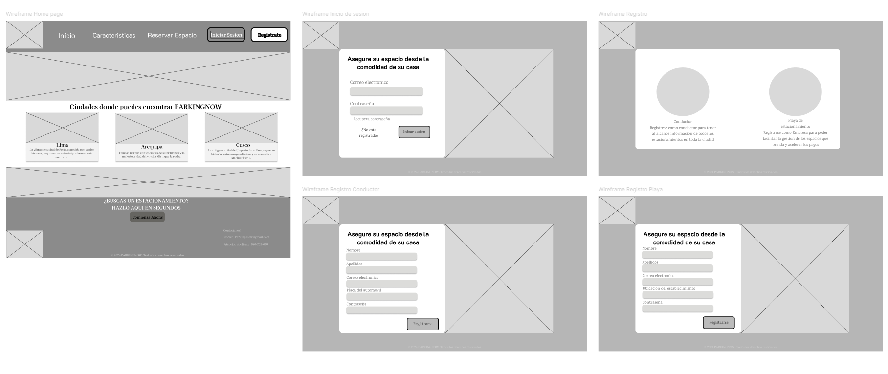
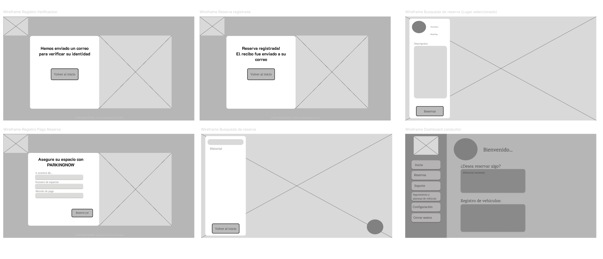
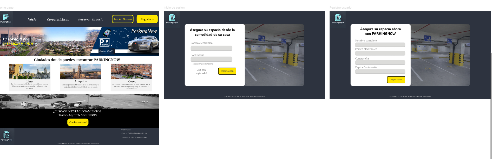

# **COURSE PROJECT**

  

<strong>Universidad Peruana de Ciencias Aplicadas</strong>

<strong>Ingeniería de Software</strong> 
Desarrollo de Aplicaciones Open Source - SW54  
Ciclo: 5to  
<strong>Profesor:</strong> Alberto Wilmer Sanchez Seña

<h2 align="center">INFORME</h2>

<h3 align="center">Startup:</h3>

<strong>Producto:</strong>

<h3 align="center">Team Members:</h3>

| **Member**                           | **Code**     |
|--------------------------------------|--------------|
| Diego Alonso Cacho Seminario      | U202223990   |
| Rodrigo Liberato Saldaña       | U202215623   |
| Samuel Elias Molina Asencios     | U20191A456   |
| Omar Harold Rivera Ticllacuri      | U202214214   |
| Diego Ulises Soto Quispe     | U202214477   |

<strong>Agosto 2024</strong>

# Registro de Versiones del Informe

| Versión | Fecha       | Autor(es)                                                                                                  | Descripción de la modificación                                                                                                                                                       |
|---------|-------------|------------------------------------------------------------------------------------------------------------|---------------------------------------------------------------------------------------------------------------------------------------------------------------------------------------|
| TB1     | 12/09/2024  | Diego Alonso Cacho Seminario  Rodrigo Liberato Saldaña  Samuel Elias Molina Asencios  Omar Harold Rivera Ticllacuri  Diego Ulises Soto Quispe | Se agregó el contenido del capítulo 1 (apartados 1.1, 1.2 y 1.3); el contenido del capítulo 2 (apartados 2.1, 2.2, 2.3, 2.4); el contenido del capítulo 3 (apartados 3.1, 3.2, 3.3 y 3.4); el contenido del capítulo 4 (apartados 4.1, 4.2, 4.3, 4.4, 4.5, 4.6, 4.7 y 4.8); y el contenido del capítulo 5 (apartados 5.1 y 5.2). |
| TP1     |             | Diego Alonso Cacho Seminario  Rodrigo Liberato Saldaña  Samuel Elias Molina Asencios  Omar Harold Rivera Ticllacuri  Diego Ulises Soto Quispe |                                                                                                                                                                                       |
| TB2     |             | Diego Alonso Cacho Seminario  Rodrigo Liberato Saldaña  Samuel Elias Molina Asencios  Omar Harold Rivera Ticllacuri  Diego Ulises Soto Quispe |                                                                                                                                                                                       |
| TF1     |             | Diego Alonso Cacho Seminario  Rodrigo Liberato Saldaña  Samuel Elias Molina Asencios  Omar Harold Rivera Ticllacuri  Diego Ulises Soto Quispe |                                                                                                                                                                                       |

# Project Report Collaboration Insights

TB1: Las tareas asignadas para la entrega TB1 se han completado y están documentadas en el siguiente repositorio de GitHub perteneciente a la organización del equipo: [Repositorio GitHub](#).

Durante la preparación del informe, se llevaron a cabo las siguientes actividades:

- Se escribieron y diagramaron los contenidos asignados a cada miembro en formato Markdown, seguido de commits para asegurar el progreso en el repositorio.
- Se crearon los artefactos necesarios utilizando las herramientas recomendadas y se obtuvieron enlaces de imagen a través de la carpeta `imagenes` en la rama `desarrollo` del repositorio del informe.
- Se organizaron reuniones para coordinar el progreso de los elementos del informe y para comunicar los avances del Sprint 1, que se enfoca en la Landing Page.

# Student Outcome
| Criterio específico                                                                                 | Acciones realizadas | Conclusiones |
|------------------------------------------------------------------------------------------------------|---------------------|--------------|
| **Comunica oralmente con efectividad a diferentes rangos de audiencia.**                                          |              |
| **Comunica por escrito con efectividad a diferentes rangos de audiencia.**                           |                     |      
# Contenido
- [Registro de Versiones del Informe](#registro-de-versiones-del-informe)
- [Project Report Collaboration Insights](#project-report-collaboration-insights)
- [Student Outcome](#student-outcome)

## Capítulo I: Introducción
- [1.1. Startup Profile](#11-startup-profile)
  - [1.1.1. Descripción de la Startup](#111-descripción-de-la-startup)
  - [1.1.2. Perfiles de integrantes del equipo](#112-perfiles-de-integrantes-del-equipo)
- [1.2. Solution Profile](#12-solution-profile)
  - [1.2.1 Antecedentes y problemática](#121-antecedentes-y-problemática)
  - [1.2.2 Lean UX Process](#122-lean-ux-process)
    - [1.2.2.1. Lean UX Problem Statements](#1221-lean-ux-problem-statements)
    - [1.2.2.2. Lean UX Assumptions](#1222-lean-ux-assumptions)
    - [1.2.2.3. Lean UX Hypothesis Statements](#1223-lean-ux-hypothesis-statements)
    - [1.2.2.4. Lean UX Canvas](#1224-lean-ux-canvas)
- [1.3. Segmentos objetivo](#13-segmentos-objetivo)

## Capítulo II: Requirements Elicitation & Analysis
- [2.1. Competidores](#21-competidores)
  - [2.1.1. Análisis competitivo](#211-análisis-competitivo)
  - [2.1.2. Estrategias y tácticas frente a competidores](#212-estrategias-y-tácticas-frente-a-competidores)
- [2.2. Entrevistas](#22-entrevistas)
  - [2.2.1. Diseño de entrevistas](#221-diseño-de-entrevistas)
  - [2.2.2. Registro de entrevistas](#222-registro-de-entrevistas)
  - [2.2.3. Análisis de entrevistas](#223-análisis-de-entrevistas)
- [2.3. Needfinding](#23-needfinding)
  - [2.3.1. User Personas](#231-user-personas)
  - [2.3.2. User Task Matrix](#232-user-task-matrix)
  - [2.3.3. User Journey Mapping](#233-user-journey-mapping)
  - [2.3.4. Empathy Mapping](#234-empathy-mapping)
  - [2.3.5. As-is Scenario Mapping](#235-as-is-scenario-mapping)
- [2.4. Ubiquitous Language](#24-ubiquitous-language)

## Capítulo III: Requirements Specification
- [3.1. To-Be Scenario Mapping](#31-to-be-scenario-mapping)
- [3.2. User Stories](#32-user-stories)
- [3.3. Impact Mapping](#33-impact-mapping)
- [3.4. Product Backlog](#34-product-backlog)

## Capítulo IV: Product Design
- [4.1. Style Guidelines](#41-style-guidelines)
  - [4.1.1. General Style Guidelines](#411-general-style-guidelines)
  - [4.1.2. Web Style Guidelines](#412-web-style-guidelines)
- [4.2. Information Architecture](#42-information-architecture)
  - [4.2.1. Organization Systems](#421-organization-systems)
  - [4.2.2. Labeling Systems](#422-labeling-systems)
  - [4.2.3. SEO Tags and Meta Tags](#423-seo-tags-and-meta-tags)
  - [4.2.4. Searching Systems](#424-searching-systems)
  - [4.2.5. Navigation Systems](#425-navigation-systems)
- [4.3. Landing Page UI Design](#43-landing-page-ui-design)
  - [4.3.1. Landing Page Wireframe](#431-landing-page-wireframe)
  - [4.3.2. Landing Page Mock-up](#432-landing-page-mock-up)
- [4.4. Web Applications UX/UI Design](#44-web-applications-uxui-design)
  - [4.4.1. Web Applications Wireframes](#441-web-applications-wireframes)
  - [4.4.2. Web Applications Wireflow Diagrams](#442-web-applications-wireflow-diagrams)
  - [4.4.2. Web Applications Mock-ups](#442-web-applications-mock-ups)
  - [4.4.3. Web Applications User Flow Diagrams](#443-web-applications-user-flow-diagrams)
- [4.5. Web Applications Prototyping](#45-web-applications-prototyping)
- [4.6. Domain-Driven Software Architecture](#46-domain-driven-software-architecture)
  - [4.6.1. Software Architecture Context Diagram](#461-software-architecture-context-diagram)
  - [4.6.2. Software Architecture Container Diagrams](#462-software-architecture-container-diagrams)
  - [4.6.3. Software Architecture Components Diagrams](#463-software-architecture-components-diagrams)
- [4.7. Software Object-Oriented Design](#47-software-object-oriented-design)
  - [4.7.1. Class Diagrams](#471-class-diagrams)
  - [4.7.2. Class Dictionary](#472-class-dictionary)
- [4.8. Database Design](#48-database-design)
  - [4.8.1. Database Diagram](#481-database-diagram)

## Capítulo V: Product Implementation, Validation & Deployment
- [5.1. Software Configuration Management](#51-software-configuration-management)
  - [5.1.1. Software Development Environment Configuration](#511-software-development-environment-configuration)
  - [5.1.2. Source Code Management](#512-source-code-management)
  - [5.1.3. Source Code Style Guide & Conventions](#513-source-code-style-guide--conventions)
  - [5.1.4. Software Deployment Configuration](#514-software-deployment-configuration)
- [5.2. Landing Page, Services & Applications Implementation](#52-landing-page-services--applications-implementation)
  - [5.2.1. Sprint 1](#521-sprint-1)
    - [5.2.1.1. Sprint Planning 1](#5211-sprint-planning-1)
    - [5.2.1.2. Sprint Backlog 1](#5212-sprint-backlog-1)
    - [5.2.1.3. Development Evidence for Sprint Review](#5213-development-evidence-for-sprint-review)
    - [5.2.1.4. Testing Suite Evidence for Sprint Review](#5214-testing-suite-evidence-for-sprint-review)
    - [5.2.1.5. Execution Evidence for Sprint Review](#5215-execution-evidence-for-sprint-review)
    - [5.2.1.6. Services Documentation Evidence for Sprint Review](#5216-services-documentation-evidence-for-sprint-review)
    - [5.2.1.7. Software Deployment Evidence for Sprint Review](#5217-software-deployment-evidence-for-sprint-review)
    - [5.2.1.8. Team Collaboration Insights during Sprint](#5218-team-collaboration-insights-during-sprint)

- [Avance de Conclusiones, Bibliografía y Anexos](#avance-de-conclusiones-bibliografía-y-anexos)

## Capítulo I: Introducción

### 1.1. StartUp Profile

En esta sección describiremos la descripción de nuestra Startup.

### 1.1.1. Descripción de la Startup

**PARKINGNOW** es una startup tecnológica enfocada en ofrecer una solución integral para el estacionamiento en tiempo real. Nuestra plataforma digital permite a los usuarios reservar y pagar por espacios de estacionamiento utilizando la localización geográfica y un **sensor infrarrojo** para una gestión más eficiente y automatizada. Basado en un modelo de negocio independiente y sostenible, **PARKINGNOW** se adapta tanto a usuarios frecuentes como a usuarios ocasionales mediante un sistema de transacciones. La innovación de **PARKINGNOW** radica en la integración de datos en tiempo real, incluidos los datos proporcionados por un sensor infrarrojo, para garantizar la disponibilidad de espacios y optimizar las rutas hacia los estacionamientos más cercanos. Este sensor infrarrojo detecta la presencia de vehículos en los espacios de estacionamiento al percibir cuando un objeto interrumpe su señal de luz. Cuando un vehículo ocupa o deja un espacio, el sensor infrarrojo envía una señal a la plataforma para actualizar la disponibilidad en tiempo real, mejorando así la eficiencia y la experiencia del usuario.

**Misión**: Ser el puente entre conductores y propietarios de estacionamientos, optimizando la experiencia de estacionamiento en tiempo real. **PARKINGNOW** facilita el acceso a espacios de estacionamiento utilizando un sensor infrarrojo para una gestión automatizada y eficiente, contribuyendo a la rentabilidad de quienes los poseen y cubriendo así las necesidades de ambos segmentos de mercado.

**Visión**: Convertirnos en la plataforma líder en la gestión de estacionamientos urbanos en los próximos 5 años, mejorando la movilidad en las ciudades mediante soluciones tecnológicas innovadoras y sostenibles, como el uso de un sensor infrarrojo, que beneficien tanto a conductores como a propietarios de estacionamientos.

#### 1.1.2. Perfiles de integrantes del equipo

 **Integrantes**                                              | **Descripción**                                                                                                                                                                                                                                                | **Conocimientos**                               |
|--------------------------------------------------------------|----------------------------------------------------------------------------------------------------------------------------------------------------------------------------------------------------------------------------------------------------------------|-------------------------------------------------|
|    Diego Ulises Soto Quispe | Soy estudiante de 5to ciclo en la carrera de Ingeniería de Software. Soy responsable en las labores que se asignan y puntual con los trabajos por entregar, fuera del mundo de programación, me gusta jugar basquet, salir a pasear, jugar videojuegos y manejar en bicicleta. | HTML, Base de datos en SQL Server, C++, Python, NoSQL, JSON |
|    Diego Alonso Cacho Seminario | Mi nombre es Diego Cacho y tengo 19 años, actualmente me encuentro 5to ciclo de mi carrera como Ingeniero de Software en la UPC. Me considero una persona tranquila y diligente, intento realizar mis tareas y trabajos lo antes posible para evitar contratiempos en un futuro, especialmente si son actividades que consumen mucho tiempo. Como miembro de equipo buscaré ayudar a mis compañeros cuando lo necesiten, realizando además mis entregas lo más temprano posible. | C++, C#, Python, Unity 2D/3D | 
|    Omar Harold Rivera Ticllacuri | Soy estudiante de Ingeniería de Software, tengo 19 años y actualmente me encuentro en el quinto ciclo de mi carrera. Soy una persona con la cual tengo la disciplina y responsable para desarrollar proyectos de software y software de entretenimiento. Cuento con experiencia sobre el desarrollo de software de entretenimiento. Por ende, apoyaré al grupo en todo lo posible para poder desarrollar adecuadamente el trabajo y la propuesta que se nos asignó. | C++, C#, Python, Unity 2D/3D, Html y Css|
|    Samuel Elias Molina Asencios | Soy estudiante de 7mo ciclo en la carrera de Ingeniería de Software. Actualmente formo parte de un equipo de desarrollo ejecutando el rol de Analista desarrollador de software, me gusta mucho el arte y el deporte, en mis tiempos libres toco Piano o voy a nadar no hay nada mejor que la natación. | SQL, NoSQL, C++, Java, JavaScript, Firebird, Vue, Quasar, Node js, Jreport, PHP, Sniffer, HTML, CSS.|
|    Rodrigo Liberato Saldaña | Soy estudiante de 6to ciclo de la carrera de Ingenieria de software, soy una persona que valora el esfuerzo e intenta apoyar en todo lo posible. La responsabilidad y honestidad son unas de mis cualidades y que seran de ayuda para que el trabajo salga lo mejor posible | C++, SQL, Java, PHP, HTML, CSS.|

### 1.2. Solution Profile

**PARKINGNOW** es una solución innovadora diseñada para transformar la experiencia de estacionamiento en las ciudades. Ofrece una plataforma digital que permite a los usuarios encontrar, reservar y pagar por espacios de estacionamiento en tiempo real, utilizando la localización geográfica y un **sensor infrarrojo**. Nuestra tecnología emplea este sensor para detectar automáticamente la presencia de vehículos en los espacios de estacionamiento al percibir cuando un objeto interrumpe su señal de luz. Esto permite actualizar en tiempo real la disponibilidad de los espacios y dirigir a los conductores hacia los estacionamientos más cercanos, optimizando sus rutas y reduciendo el tiempo de búsqueda. Esta funcionalidad mejora significativamente la experiencia de los conductores al proporcionar información precisa y en tiempo real sobre la disponibilidad de espacios. En resumen, **PARKINGNOW** ofrece una solución integral para los desafíos del estacionamiento urbano, beneficiando tanto a los conductores como a los propietarios de estacionamientos.

### 1.2.1. Antecedentes y problemática

En las ciudades con alto movimiento vehicular, es común ver vehículos estacionados de manera indebida, invadiendo veredas o interrumpiendo el flujo vehicular. Esta situación es un problema recurrente para los conductores que enfrentan la dificultad de encontrar estacionamiento, un desafío que se intensifica en áreas urbanas congestionadas. La demanda de espacios de estacionamiento es alta, y la información disponible sobre su disponibilidad suele ser limitada o desactualizada. Además, la ausencia de herramientas para reservar un espacio con anticipación agrava la frustración y aumenta el tiempo que los conductores deben invertir para encontrar un lugar donde estacionarse.

Para entender mejor las necesidades de nuestros usuarios y alinear nuestro enfoque con los principios de Lean UX, hemos realizado un análisis de antecedentes y la problemática utilizando la técnica de "5W’s & 2H’s", una herramienta esencial en Lean UX para identificar oportunidades de diseño centrado en el usuario. A continuación, se presenta la información recopilada:

#### What

**¿Cuál es el problema?**  
El principal problema que **PARKINGNOW** busca resolver es la falta de estacionamientos disponibles y adecuados, lo que lleva a los conductores a estacionarse en zonas no permitidas, generando congestión y exponiéndose a riesgos como multas o robos. Además, la falta de tecnologías avanzadas para la gestión de espacios, como los sensores infrarrojos, limita la capacidad de los estacionamientos para manejar la disponibilidad en tiempo real.

#### When

**¿Cuándo sucede el problema?**  
El problema ocurre principalmente durante las horas pico, cuando la demanda de espacios de estacionamiento es mayor y los conductores no encuentran un lugar disponible que cumpla con sus expectativas.

**¿Cuándo utiliza el cliente el producto?**  
Los clientes utilizan **PARKINGNOW** para verificar la disponibilidad de estacionamientos en tiempo real, realizar reservas, comparar tarifas y asegurarse de que el estacionamiento seleccionado cumpla con sus expectativas, gracias a la información en tiempo real proporcionada por los sensores infrarrojos.

#### Where

**¿Dónde surge el problema?**  
El problema surge en áreas urbanas congestionadas donde los estacionamientos son escasos y la información sobre su disponibilidad es limitada o inaccesible. La falta de sistemas automatizados como sensores infrarrojos contribuye a la escasez de información precisa en tiempo real.

#### Who

**¿Quiénes están involucrados?**  
Los principales involucrados en el problema son los conductores que necesitan un estacionamiento disponible, seguro y asequible, y los propietarios de estacionamientos que buscan optimizar la ocupación de sus espacios y atraer más clientes mediante tecnología avanzada como los sensores infrarrojos.

**¿A quiénes le sucede el problema?**  
El problema afecta a todos los conductores que buscan estacionamiento, independientemente de su edad, género, ubicación o tipo de vehículo.

**¿Quién utilizará el producto?**  
El producto será utilizado por personas que viajan a diario, turistas, estudiantes, y cualquier conductor que necesite estacionar su vehículo en un lugar seguro y conveniente que se ajuste a sus preferencias y presupuesto.

#### Why

**¿Por qué sucede el problema?**  
El problema surge debido a la falta de sistemas tecnológicos avanzados en los estacionamientos tradicionales, como los sensores infrarrojos, que impiden la comunicación en tiempo real sobre la disponibilidad de espacios. Esto crea una desconexión entre la oferta y la demanda.

**¿Qué llevó al usuario a esta situación?**  
La falta de información actualizada y la ausencia de herramientas eficientes para gestionar la disponibilidad de estacionamiento, como los sensores infrarrojos, conducen a situaciones en las que los conductores no encuentran espacios que satisfagan sus necesidades.

#### How

**¿En qué condiciones los clientes usan nuestro producto?**  
Los clientes pueden usar **PARKINGNOW** en diversas situaciones, como al planificar un viaje a una nueva ciudad, al buscar estacionamientos que se ajusten a sus preferencias, o durante eventos importantes donde encontrar estacionamiento puede ser más difícil. Los sensores infrarrojos proporcionan información en tiempo real, mejorando la experiencia del usuario.

**¿Cómo nos conocerán los usuarios?**  
Los usuarios nos conocerán a través de campañas publicitarias en redes sociales que destacarán los beneficios y ventajas de **PARKINGNOW**, incluyendo la tecnología avanzada como los sensores infrarrojos para una gestión de estacionamiento más eficiente.

#### How much

**¿En qué cantidad sucede el problema?**  
El problema de la falta de seguridad y disponibilidad de estacionamientos es significativo. Los constantes robos de vehículos y las multas por estacionamiento indebido son problemas comunes que afectan a muchos conductores. La falta de tecnología de detección como sensores infrarrojos agrava estos problemas.

### 1.2.2. Lean UX Process

En esta sección se realizará el proceso de Lean UX, que abarca la visión del modelo de negocio que será soportado por nuestro producto de software. Gracias a este enfoque metodológico, podemos dirigir nuestra atención hacia el diseño de nuestra solución y los problemas identificados mediante el pensamiento de diseño.

#### 1.2.2.1. Lean UX Problem Statements

A continuación, empleamos la plantilla de Business Opportunity Statements (Gothelf, 2022) para orientar a nuestro equipo de trabajo en la creación de un servicio sin restricciones que puedan limitar la creatividad y la agilidad. Este enfoque nos impulsa a pensar en nuestro trabajo en términos que respondan a las necesidades de los clientes y nos prepara para un lanzamiento exitoso de nuestra idea.

**Plantilla de Business Opportunity Statement:**

El estado actual de [domain] se ha centrado principalmente en [segments, pain points, etc.]

Lo que los productos/servicios existentes no logran abordar es [this gap].

Nuestro producto/servicio abordará esta brecha mediante [vision / strategy].

Nuestro enfoque inicial será [this segment].

Sabremos que tenemos éxito cuando veamos [these behaviors in our target audience].

**PARKINGNOW Lean UX Problem Statements:**

- El estado actual de los servicios de estacionamiento en áreas urbanas se ha centrado principalmente en la disponibilidad limitada de espacios y en la falta de opciones para reservar con anticipación, lo que lleva a la frustración de los conductores y al uso indebido de espacios de estacionamiento.

- Lo que los productos/servicios existentes no logran abordar es la falta de información en tiempo real sobre la disponibilidad de espacios y la optimización de rutas hacia los estacionamientos más cercanos.

- Nuestro producto/servicio abordará esta brecha mediante el desarrollo e implementación de una plataforma digital que utiliza la localización geográfica y datos en tiempo real proporcionados por un sensor infrarrojo para informar a los conductores sobre la disponibilidad de espacios y optimizar sus rutas de manera eficiente.

- Nuestro enfoque inicial será captar el mercado de conductores urbanos en ciudades con alta congestión vehicular, donde la necesidad de soluciones de estacionamiento eficientes es mayor.

- Sabremos que tenemos éxito cuando veamos un aumento significativo en las reservas de estacionamientos a través de nuestra plataforma y una reducción en el tiempo promedio que los conductores dedican a buscar un espacio de estacionamiento.

#### 1.2.2.2. Lean UX Assumptions

**Users:**

- Conductores urbanos que buscan estacionamiento en tiempo real en áreas urbanas congestionadas.
- Propietarios de estacionamientos que desean optimizar la ocupación de sus espacios y mejorar la comunicación con los clientes mediante el uso de sensores infrarrojos.
- Empresas y servicios de transporte que requieren soluciones rápidas y eficientes para estacionar sus flotas.

**User Outcomes:**

**Segmento de Conductores:**

- Acceder a una plataforma en línea que facilite la búsqueda y reserva de estacionamientos disponibles en tiempo real gracias al uso de sensores infrarrojos.
- Utilizar la aplicación para optimizar las rutas hacia los estacionamientos más cercanos y ahorrar tiempo.
- Verificar la disponibilidad de espacios y tarifas de estacionamiento antes de llegar a su destino.

**Segmento de Propietarios de Estacionamientos:**

- Promocionar sus espacios de estacionamiento a una audiencia más amplia de conductores.
- Gestionar todas las reservas y comunicaciones con los clientes desde una sola plataforma utilizando tecnología avanzada de sensores.
- Mejorar la tasa de ocupación de sus espacios mediante herramientas de análisis y optimización proporcionadas por la plataforma.

**Suposiciones de Negocios:**

- Creemos que existe una demanda creciente de soluciones eficientes para encontrar y reservar espacios de estacionamiento en áreas urbanas congestionadas.
- Aunque reconocemos la competencia en el sector de estacionamiento, estamos seguros de que podemos destacarnos ofreciendo una plataforma en línea que utilice datos en tiempo real proporcionados por sensores infrarrojos para mejorar la experiencia tanto para los conductores como para los propietarios de estacionamientos.
- Creemos que los usuarios valorarán la conveniencia, la transparencia y la eficiencia de una plataforma que les permita encontrar y reservar estacionamientos en tiempo real.

**Suposiciones de Usuarios:**

- **¿Quién utiliza nuestra plataforma?** Nuestra plataforma es utilizada por conductores urbanos que necesitan estacionar sus vehículos de manera segura y conveniente, así como por propietarios de estacionamientos que desean maximizar la ocupación de sus espacios.
- **¿Cómo se integra nuestro producto en la rutina diaria?** Nuestro producto se integra en la rutina diaria de los conductores al proporcionar una solución rápida y fácil de usar para encontrar y reservar estacionamientos, reduciendo así el tiempo dedicado a buscar espacios gracias al uso de sensores infrarrojos.
- **¿Cuáles son los desafíos que aborda nuestro producto?** **PARKINGNOW** aborda los desafíos de la falta de información en tiempo real sobre la disponibilidad de estacionamientos y la optimización de rutas hacia los espacios más cercanos.
- **¿Qué imagen deseamos proyectar con nuestro producto?** Deseamos proyectar una imagen de eficiencia, confiabilidad e innovación. Queremos que **PARKINGNOW** sea visto como la solución líder en la industria de estacionamiento urbano.
- **¿Cuál es el propósito fundamental de nuestra aplicación?** El propósito fundamental de **PARKINGNOW** es facilitar el proceso de búsqueda, reserva y gestión de espacios de estacionamiento para conductores urbanos y propietarios de estacionamientos.
- **¿Qué funcionalidades destacan en nuestra aplicación?** Las funcionalidades destacadas incluyen la búsqueda avanzada de estacionamientos basada en localización y disponibilidad en tiempo real, la reserva en línea de espacios, la optimización de rutas y herramientas de análisis para propietarios de estacionamientos.

#### 1.2.2.3. Lean UX Hypothesis Statements

Para la elaboración de los Hypothesis Statements se utilizó el formato Lean UX: [We believe that], [This will achieve] y [We will have demonstrated this when].

**Hipótesis 1:**

- Creemos que si simplificamos el proceso de búsqueda y reserva de espacios de estacionamiento en nuestra plataforma utilizando sensores infrarrojos, esto logrará aumentar significativamente la cantidad de usuarios recurrentes, proyectando un aumento del 30% en la tasa de clientes que regresan dentro de los primeros seis meses de implementación.

- **Sabremos que estamos en lo cierto cuando observemos** un aumento del 30% en la cantidad de reservas realizadas por usuarios recurrentes durante el mismo período.

**Hipótesis 2:**

- Creemos que si implementamos un sistema de notificación en tiempo real sobre la disponibilidad de espacios de estacionamiento mediante sensores infrarrojos, esto logrará reducir el tiempo promedio de búsqueda de estacionamiento en un 20%.

- **Sabremos que estamos en lo cierto cuando observemos** una reducción del 20% en el tiempo promedio que los usuarios pasan buscando estacionamiento después de la implementación.

**Hipótesis 3:**

- Creemos que si ofrecemos descuentos exclusivos para usuarios frecuentes, esto logrará aumentar la conversión de usuarios ocasionales a usuarios frecuentes, proyectando un aumento del 25% en la cantidad de usuarios frecuentes dentro de los primeros seis meses de implementación.

- **Sabremos que estamos en lo cierto cuando observemos** un aumento del 25% en la cantidad de usuarios que utilizan nuestra plataforma más de una vez al mes.

**Hipótesis 4:**

- Creemos que si mejoramos la función de optimización de rutas en nuestra plataforma, permitiendo a los usuarios llegar más rápidamente a los estacionamientos gracias a la información proporcionada por sensores infrarrojos, esto logrará aumentar la satisfacción del usuario y reducir la frustración durante la búsqueda de estacionamiento.

- **Sabremos que estamos en lo cierto cuando observemos** un aumento en las calificaciones de satisfacción del usuario y una reducción en las quejas relacionadas con la búsqueda de estacionamiento.

**Hipótesis 5:**

- Creemos que si implementamos un programa de fidelización que recompense a los usuarios por el uso continuo de nuestra plataforma, esto logrará aumentar la retención de clientes y el crecimiento orgánico de nuestra base de usuarios, proyectando un aumento del 30% en la retención de clientes dentro de los primeros seis meses de implementación del programa.

- **Sabremos que estamos en lo cierto cuando observemos** un aumento del 30% en la retención de clientes y un incremento en el número de usuarios que refieren a otros conductores a la plataforma.
  
##### 1.2.2.4. Lean UX Canvas

  

Fuente: Elaboración propia.

### 1.3. Segmentos objetivo

1. Conductores Urbanos Frecuentes:
   - Descripción: Este segmento incluye a personas que necesitan estacionamiento regular en zonas urbanas.
   - Sexo: Masculino y femenino
   - Edades: Adultos jóvenes (18-34 años), adultos de mediana edad (35-54 años) y adultos mayores (55+)
   - Nivel socioeconómico: Clases B, C y D (media-alta, media y baja)
   - Satisfacción de Necesidades: La plataforma permite a estos usuarios ahorrar tiempo y reducir el estrés al ofrecer reservas anticipadas o en tiempo real, optimizando sus desplazamientos diarios. Asimismo, gracias al sensor, el usuario tendra la seguridad del estado de su carro dentro del estacionamiento.

2. Dueños de playas de estacionamientos:
    - Descripcion: El siguiente segmento incluye a las personas dueñas de playas de estacionamintos, o lugares para aparcar carros en zonas urbanas.
    - Sexo: Masculino y Femenino
    - Edades: Adultos jóvenes (18-34 años), Adultos de mediana edad (35 - 54) y adultos mayores (55+)
    - Nivel socioeconómico: Clases B y C (Media-alta y media)
    - Necesidades por satisfacer: Apoyar con el manejo de datos que sucede al momento de que los conductores urbanos frecuentes deseen un lugar para estacionar, ademas de brindar facilidad y seguridad al momento de pagar y ordenar los lugares de estacionamiento. Además, promueve la formalidad y acelera los procesos tediosos que estos negocios suelen tener.
  
## Capítulo II: Requirements Elicitation & Analysis

### 2.1. Competidores

**Parkimeter:**

Parkimeter es una plataforma en línea que ofrece servicios relacionados con el estacionamiento y la gestión de plazas de aparcamiento. La plataforma permite a los usuarios buscar, comparar y reservar plazas de estacionamiento en diferentes ubicaciones. Además de la reserva de plazas de estacionamiento, Parkimeter también proporciona información sobre tarifas de estacionamiento, disponibilidad en tiempo real y otras características útiles para ayudar a los conductores a encontrar y gestionar el estacionamiento de manera más conveniente.

**ElParking**

ElParking permite a los usuarios encontrar, reservar y pagar por estacionamiento a través de su plataforma. La aplicación brinda información en tiempo real acerca de sitios de estacionamiento cercanos quitando un peso de los hombros del consumidor, los conductores. Además, tiene la increíble funcionalidad de seguimiento de multas, pagos en parquímetros, etc.

**Aparcados**

Aparcados permite a los conductores encontrar estacionamientos dependiendo de lo que buscan, optimizando así el proceso de estacionamiento en áreas urbanas La app posee también posee una página web, pero la versión en móviles es la más usada hasta el momento, con una interfaz llamativa para todos los usuarios.

#### 2.1.1. Análisis competitivo
| ***Analisis/Competidores*** | ParkingNow | Parkimeter | ElParking | Aparcados |
|---------------------------|---------------------|--------------|--------------|-------------- |
| **Overview**       |    Es una plataforma en línea que brinda la posibilidad de reservar espacios de estacionamiento en múltiples ciudades ademas que brinda la conexion entre los consumidores y dueños de estacionamientos|Es una plataforma en línea que ofrece servicios de reserva de plazas de aparcamiento en diversas ciudades de Europa y América Latina| Es una plataforma en línea que ofrece servicios de reserva de plazas de aparcamiento en diversos lugares de Costa Rica y América Latina | Es una plataforma en línea que ofrece servicios de reserva de plazas de aparcamiento en diversas ciudades de España principalmente, pero expandiéndose alrededor del mundo |
| **Ventaja competitiva**|Cancelación gratuita hasta con 24 horas de antelación de la reserva, inclusion de un sensor para el automovil y ser el puente entre los consumidores y dueños de playas de estacionamientos en zonas urbanas| Ofrece descuentos de hasta el 70% y no cobra gastos de gestión | Permite más que solo pagar estacionamientos, sino gestionar multas y pagar parquímetros| La app incluye geolocalización y ofrece notificaciones a tiempo real|
| **Mercado objetivo** |Personas que buscaban soluciones de estacionamiento en áreas urbanas congestionadas y personas dueñas de estacionamientos de playas. |Personas que buscaban soluciones de estacionamiento en áreas urbanas congestionadas|Personas que buscaban soluciones de estacionamiento en áreas urbanas congestionadas |Personas que buscaban soluciones de estacionamiento en áreas urbanas congestionadas |
| **Estrategias de Marketing**|Utiliza publicidad en línea a través de plataformas y redes sociales.|Utiliza publicidad en línea a través de plataformas y redes sociales |Utiliza publicidad en línea, redes sociales y reciben promociones de influencers| Utiliza publicidad en línea a través de plataformas y redes sociales  |
| **Productos y Servicios**|Ofrece una serie de servicios relacionados con la reserva de plazas de aparcamiento en áreas urbanas y otros destinos. |Realizar servicios de parking en todo el territorio español y otras grandes ciudades del mundo | Ofrece una serie de servicios relacionados con la reserva de plazas de aparcamiento en ciudades concurridas, seguimiento de multas y pagos sencillos. | Ofrece una serie de servicios relacionados con la reserva de plazas de aparcamiento en áreas urbanas y otros destinos |
| **Precios y Costos**|La plataforma es gratuita, pero se debe pagar las tarifas de estacionamiento correspondientes |La plataforma es gratuita, pero se debe pagar las tarifas de estacionamiento correspondientes | La plataforma es gratuita pero se debe pagar las tarifas de estacionamiento, además de la existencia de tarifas especiales o descuentos | La plataforma es gratuita, pero se debe pagar las tarifas de estacionamiento correspondientes. |
| **Canales de Distribucion**|Sitio web, aplicación móvil, redes sociales, marketing en línea | Sitio web, aplicación móvil, redes sociales, marketing en línea | Sitio web, aplicación móvil, redes sociales, marketing en línea|Sitio web, aplicación móvil, redes sociales, marketing en línea|
| **Fortalezas**|Implementa sensores de estacionamiento en los estacionamientos asociados | Parkimeter opera en múltiples ciudades de Europa y América Latina |ElParking implementa seguimiento de multas y pagos a parte de los estacionamientos | Aparcados opera en múltiples ciudades de Europa y Asia|
| **Debilidades**|La industria de reserva de estacionamientos en línea es muy competitiva. | Varias empresas que proporcionan servicios similares | La industria de reserva de estacionamientos en línea es muy competitiva. | Varias empresas que proporcionan servicios similares. |
| **Oportunidades**|A medida que las ciudades sigan creciendo, la demanda de servicios de reserva podría aumentar |La congestión del tráfico se vuelve más común, eso provocaría una alta demanda en la reserva de estacionamientos | En su país de origen, España, las personas en zonas urbanas van a tener que aprender más acerca de la app para poder vivir en comodidad. | Tiene grandes posibilidades de expandir su mercado aun enfocándose en la reserva de estacionamientos en América Latina |
| **Amenazas**| Cambios en las políticas de movilidad urbana.|Nuevas startups compitiendo por la misma base de usuarios.|Nuevas startups compitiendo por la misma base de usuarios. | Nuevas startups compitiendo por la misma base de usuarios. |

#### 2.1.2. Estrategias y tácticas frente a competidores

**Plataforma digital:**

Dado que se opera en línea, es fundamental tener una plataforma tecnológica consistente y fácil de usar. La inversión en tecnología puede incluir la mejora de la experiencia del usuario en su sitio web y aplicación móvil gracias a nuestros datos en tiempo real que brindamos a todos los usuarios.

**Expansión geográfica:**

Evaluar la posibilidad de expandirse a nuevos mercados geográficos o agregar más ubicaciones de estacionamiento puede ser una estrategia de expansión. Esto puede requerir investigaciones de mercado y planificación cuidadosa.

**Cumplimiento normativo:**

Nos centraremos en hacer cumplir las normas que vienen con la gestión de estacionamientos en cada ciudad y país, todo esto para lograr la convivencia armoniosa con todos los residentes de las localidades, siendo que apoyamos a los turistas que no están familiarizados con reglas extranjeras. 

### 2.2. Entrevistas

#### 2.2.1. Diseño de entrevistas
### Con el objetivo de obtener un mejor entendimiento de nuestros usuarios, queremos conocer sus puntos de vista para guiar nuestro enfoque y así implementar nuestro producto en base a sus problemas.

**Segmento objetivo \#1: Conductores Urbanos Frecuentes**

**Preguntas principales:**

* ¿Con qué frecuencia necesitas estacionamiento en la ciudad?  
* ¿Cuánto tiempo dedicas normalmente a buscar estacionamiento?  
* ¿Utilizas actualmente alguna aplicación o servicio para encontrar estacionamiento?  
* ¿Qué tan importante es para ti conocer la disponibilidad de estacionamiento en tiempo real?  
* ¿Estarías dispuesto/a a pagar una tarifa adicional por garantizar un espacio de estacionamiento reservado?  
* ¿Qué consideras más importante al elegir un estacionamiento: costo, proximidad, o seguridad?  
* ¿Te gustaría recibir recomendaciones de rutas hacia el estacionamiento más cercano basado en el tráfico en tiempo real?

**Preguntas complementarias:**

* ¿Has tenido experiencias frustrantes buscando estacionamiento en la ciudad?  
* ¿Qué mejoras te gustaría ver en los servicios de estacionamiento que utilizas actualmente?

**Segmento objetivo \#2: Dueños de playas de estacionamientos**

**Preguntas principales:**

* ¿Consideras sencillo el proceso de gestionamiento de espacios en tu estacionamiento?  
* ¿Qué tan importante es para ti contar con información en tiempo real sobre los espacios disponibles?  
* ¿Utilizas algún sistema digital para administrar los pagos y reservas de los espacios de estacionamiento?  
* ¿Qué beneficios ves en la posibilidad de automatizar el proceso de reserva y pago de los espacios de estacionamiento?  
* ¿Qué tan relevante es para ti ofrecer opciones de pago seguras y rápidas a tus clientes?  
* ¿De qué manera crees que la integración de una app que gestione datos y pagos podría mejorar la eficiencia de tu negocio?

**Preguntas complementarias:**

* ¿Cuáles son los principales desafíos que enfrentas al administrar tu estacionamiento?  
* ¿Qué funcionalidades adicionales te gustaría que una app ofreciera para facilitar la gestión de tu negocio?  
* ¿Te gustaría recibir reportes o análisis sobre la ocupación y rotación de vehículos en tu estacionamiento?

#### 2.2.2. Registro de entrevistas
**Segmento objetivo \#1: Conductores Urbanos Frecuentes**

Entrevistado N°1: Bárbara Eliana Seminario León

* Sexo: Femenino  
* Edad: 46  
* Ubicación en la que vive: Surco, Lima, Perú.

Acerca de la entrevista:

* Link: [https://youtu.be/qiEsk6I19uM](https://youtu.be/qiEsk6I19uM)   
* Instante en el que inicia: 0:15  
* Duración: 2:45

Resumen:

Para Bárbara, la necesidad de estacionamiento no es frecuente, pero el tiempo que dedica a buscar un lugar varía según la zona. Actualmente, no utiliza aplicaciones para encontrar estacionamiento, pero valora conocer la disponibilidad antes de llegar y recibir recomendaciones sobre rutas para ahorrar tiempo. Está dispuesta a pagar tarifas adicionales para reservar un espacio, y considera el costo, la proximidad y la seguridad como factores clave al elegir dónde estacionar. En ocasiones, ha tenido que estacionar en lugares inconvenientes debido a la falta de opciones y tiempo limitado. Además, le interesaría que alguien pudiera estacionar su auto por ella.

Entrevistado N°2: Juan Pablo Guija Solis

* Sexo: Masculino  
* Edad: 19  
* Ubicación en la que vive: San Borja

Acerca de la entrevista: 

* Link: [https://youtu.be/HoAftCu6EPA](https://youtu.be/HoAftCu6EPA)   
* Instante en el que inicia: 0:11  
* Duración: 2:48

Resumen:

Para Juan Pablo, que utiliza su vehículo a diario, encontrar estacionamiento es una necesidad frecuente. El tiempo que dedica a buscar un lugar depende de la zona, y actualmente no usa ninguna app para este propósito. Valora mucho conocer la disponibilidad de estacionamiento antes de llegar, ya que esto le permite ahorrar tiempo. Está dispuesto a pagar tarifas adicionales para reservar un espacio, siempre y cuando estas no sean excesivamente altas. Considera importantes el costo y la proximidad al elegir un lugar para estacionar. Ha tenido experiencias frustrantes, como perder un espacio o encontrarse con estacionamientos demasiado pequeños. Le gustaría recibir avisos en tiempo real cuando se libere un espacio cercano y notificaciones sobre posibles movimientos sospechosos en el área donde estaciona.

Entrevistado N°3:

* Sexo:  
* Edad:  
* Ubicación en la que vive:

Acerca de la entrevista:

* Link:  
* Instante en el que inicia:  
* Duración:

Resumen:

**Segmento objetivo \#2: Dueños de playas de estacionamientos**

Entrevistado N°1: Karen Aquino 

* Sexo: Femenino
* Edad:  26
* Ubicación en la que vive: La Molina

Acerca de la entrevista: 

* Link:[https://youtu.be/OEVdYvxx6_w](https://youtu.be/OEVdYvxx6_w)
* Instante en el que inicia:  00:24
* Duración: 04:34 minutos

Resumen: La entrevistada fue una mujer que trabaja en una playa de estacionamientos y que se encuentra ligada al sector de servicio al cliente. En la entrevista se hicieron las 6 preguntas principales y una complementaria. Los datos que pudimos obtener fueron que la playa de estacionamientos donde trabaja usan tickets fisicos para mantener realizar los registros, sin embargo estos se suelen perder o no llegan a ser tan especificos. Ademas qu esta abierta a la existencia de una aplicaicon web que pueda facilitar el proceso de reserva, ya que sera mas atractivo para los consumidores y podran tener unas mejores reseñas. Por ultimo, nos dio algunas opciones que nos ayudara a mejorar la idea inicial de aplicacion web, que seria agregar el poder ver la gestion de turnos del personal, registro automatico de entrada y salida de los automoviles y la opcion de tarifas flexibles dependiendo del tiempo que los consumidores se mantengan usando el servicio.

Entrevistado N°2:

* Sexo:  
* Edad:  
* Ubicación en la que vive:

Acerca de la entrevista:

* Link:  
* Instante en el que inicia:  
* Duración:

Resumen:

#### 2.2.3. Análisis de entrevistas
De acuerdo con la información recopilada de las entrevistas, realizamos el siguiente análisis de entrevistas:

Segmento objetivo \#1:

**Hallazgos:**

* La necesidad de estacionamiento varía: algunos lo requieren con frecuencia, mientras que otros solo ocasionalmente.  
* El tiempo dedicado a buscar estacionamiento depende de la zona.  
* No se utilizan aplicaciones para encontrar estacionamiento.  
* Es muy importante conocer la disponibilidad de estacionamiento antes de llegar.  
* Se está dispuesto a pagar tarifas adicionales para reservar un espacio, siempre y cuando estas no sean demasiado altas.  
* Factores como el costo, la proximidad y la seguridad son clave al elegir un lugar para estacionar.  
* Existen frustraciones comunes relacionadas con la búsqueda de estacionamiento, como perder un espacio o encontrar lugares inadecuados.  
* Se desea recibir recomendaciones de rutas para ahorrar tiempo y la opción de que alguien estacione el auto por uno.  
* Se valoran los avisos en tiempo real sobre la liberación de espacios cercanos y las notificaciones sobre movimientos sospechosos en el área de estacionamiento.

Segmento objetivo \#2: 

**Hallazgos:**

* La necesidad de estacionamiento es constante: la mayoría tiene dificultades al encontrar estacionamiento.  
* No se utilizan aplicaciones para encontrar estacionamiento.  
* Se desea una funcionalidad de verificar en tiempo real los espacios disponibles.  
* Se está dispuesto a pagar tarifas adelantadas para reservar un espacio, siempre y cuando estas no sean demasiado altas.  
* Factores como la proximidad y el costo son cruciales.  
* Influye regularmente la disponibilidad de estacionamiento al realizar un viaje.  
* Existen frustraciones comunes relacionadas con la búsqueda de estacionamiento, especialmente cuando es un lugar nuevo.

**Conclusiones de ambos segmentos:**

Los resultados del **segmento 1** indican que, aunque las necesidades de estacionamiento varían en frecuencia, hay un consenso en la importancia de conocer la disponibilidad de espacios antes de llegar. La disposición a pagar tarifas adicionales es alta, siempre que estas sean razonables. Los factores de costo, proximidad y seguridad son cruciales al elegir un lugar para estacionar. Existen frustraciones comunes con la búsqueda de estacionamiento, y se valora la tecnología para mejorar la experiencia, como recibir avisos en tiempo real y recomendaciones de rutas. La opción de asistencia para estacionar también es deseada. De igual manera, los resultados del **segmento 2** presentan similitudes a las del segmento anterior, mostrando como la mayoría de respuestas indican que tienen dificultades al encontrar estacionamiento en lugares que no conocen, les parece una idea interesante un servicio que les muestre en tiempo real la disponibilidad de estacionamiento, demostrando como la mayoria esta dispuesto a pagar las tarifas por anticipado para garantizar un espacio.

**Análisis por medio de herramientas estadísticas:**

Segmento objetivo 1: [https://forms.gle/Lo3Z69GnkyYDcaAYA](https://forms.gle/Lo3Z69GnkyYDcaAYA) 

Segmento objetivo 2: link

### 2.3. Needfinding

#### 2.3.1. User Personas

#### 2.3.2. User Task Matrix

#### 2.3.3. User Journey Mapping

#### 2.3.4. Empathy Mapping

#### 2.3.5. As-is Scenario Mapping

### 2.4. Ubiquitous Language
**Espacio de Estacionamiento:** Un lugar específico dentro de un estacionamiento donde un vehículo puede ser aparcado.

**Reserva:** La acción de reservar un espacio de estacionamiento específico por un periodo de tiempo determinado, garantizando su disponibilidad.

**Disponibilidad en Tiempo Real:** Información actualizada instantáneamente sobre los espacios de estacionamiento libres y ocupados.

**Geolocalización:** El uso de tecnologías de ubicación para determinar la posición geográfica del usuario y mostrar opciones de estacionamiento cercanas.

**Mapa Interactivo:** Un mapa digital dentro de la aplicación que muestra la ubicación de estacionamientos disponibles en tiempo real.

**Tarifas por Hora:** El costo asociado con la reserva de un espacio de estacionamiento, calculado por horas de uso.

**Pago en Línea:** El proceso de completar el pago para una reserva a través de métodos de pago digitales, como tarjetas de crédito, débito o billeteras electrónicas.

**Historial de Reservas:** Un registro de todas las reservas pasadas realizadas por el usuario, que incluye detalles como fecha, hora, ubicación y costo.

**Notificaciones en Tiempo Real:** Alertas enviadas al usuario para informarles sobre cambios en la disponibilidad, confirmaciones de reserva, o vencimientos de tiempo de estacionamiento.

**Usuario:** Persona que utiliza la aplicación para buscar, reservar y pagar por espacios de estacionamiento.

**Propietario de Estacionamiento:** Persona o entidad que posee y administra un estacionamiento y que ofrece espacios para la reserva a través de la aplicación.

**Administrador del Sistema:** Persona responsable de la gestión y mantenimiento de la aplicación, incluyendo la supervisión de la disponibilidad de los espacios y la gestión de usuarios y datos.

**Check-in:** El proceso de confirmar la llegada al espacio de estacionamiento reservado, activando el tiempo de uso.

**Check-out:** El proceso de marcar la salida del espacio de estacionamiento, finalizando el tiempo de uso y actualizando la disponibilidad.

**Zona de Estacionamiento:** Una área geográfica específica que contiene múltiples espacios de estacionamiento, gestionada dentro de la aplicación.

**Tiempo de Gracia:** Un periodo corto de tiempo permitido antes o después de la reserva, en el cual el usuario puede llegar sin incurrir en cargos adicionales.

**Multa por Exceso de Tiempo:** Un cargo adicional aplicado si un usuario excede el tiempo de estacionamiento reservado.

**Sistema de Validación:** Mecanismo para verificar que un vehículo tenga una reserva válida para un espacio de estacionamiento específico.

**Interfaz de Usuario (UI):** La parte visual de la aplicación con la que los usuarios interactúan para realizar reservas, hacer pagos y recibir notificaciones.

**Backend:** Infraestructura que aloja y gestiona los datos de la aplicación, incluyendo la disponibilidad de espacios y la información de los usuarios.

## Capítulo III: Requirements Specification

### 3.1. To-Be Scenario Mapping
**To Be Scenario Mapping para Conductores Urbanos Frecuentes**

  

**To Be Scenario Mapping para Dueños de Playas de Estacionamientos**

  

### 3.2. User Stories

## EPICS

Las epics de **PARKINGNOW** describen las funcionalidades clave necesarias en la landing page para optimizar la experiencia del usuario, desde la navegación intuitiva y opciones de registro hasta la seguridad en pagos y gestión de reservas. Estas epics garantizan que los usuarios puedan interactuar fácilmente con la plataforma para encontrar y reservar estacionamientos en tiempo real.

| **Epic Story ID** | **Título**                                       | **Descripción**                                                                                                                                                            |
|-------------------|--------------------------------------------------|----------------------------------------------------------------------------------------------------------------------------------------------------------------------------|
| **EP01**          | Navegación y Acceso Rápido                       | Como usuario de PARKINGNOW, deseo poder navegar fácilmente por la landing page y acceder rápidamente a las funciones principales (registro, login, búsqueda de estacionamientos) para una experiencia de usuario fluida. |
| **EP02**          | Opciones de Registro Diversas                    | Como usuario, deseo tener múltiples opciones para registrarme (correo electrónico, Google, Facebook) para facilitar el proceso de registro y comenzar a usar la plataforma rápidamente. |
| **EP03**          | Recuperación de Credenciales                      | Como usuario, deseo poder recuperar mi contraseña de forma segura desde la landing page para restaurar el acceso a mi cuenta en caso de que la olvide.                                                          |
| **EP04**          | Búsqueda y Disponibilidad en Tiempo Real          | Como usuario, deseo poder buscar estacionamientos y ver la disponibilidad en tiempo real en la landing page para elegir el mejor lugar para estacionar antes de dirigirme allí.                                        |
| **EP05**          | Soporte y Ayuda al Usuario                        | Como usuario, deseo tener acceso a soporte técnico en vivo y una sección de preguntas frecuentes en la landing page para resolver rápidamente cualquier problema o duda que pueda tener.                           |
| **EP06**          | Seguridad y Privacidad de Usuario                 | Como usuario, deseo que mis datos personales y de pago sean gestionados con altos estándares de seguridad y privacidad para sentirme seguro utilizando la plataforma.                                              |
| **EP07**          | Pago Seguro y Confirmación                        | Como usuario, deseo poder realizar pagos seguros en línea para mis reservas de estacionamiento y recibir confirmaciones electrónicas para llevar un registro de mis transacciones.                                    |
| **EP08**          | Gestión de Reservas                               | Como usuario, deseo poder modificar o cancelar mis reservas directamente desde la landing page para mayor flexibilidad en mi planificación.                                                                      |
| **EP09**          | Promociones y Recompensas                         | Como usuario frecuente, deseo acceder a programas de fidelización y ver promociones personalizadas en la landing page para maximizar mis beneficios al usar la plataforma.                                         |
| **EP10**          | Asistencia Personalizada en la Selección de Estacionamiento | Como usuario, deseo utilizar un asistente virtual en la landing page que me guíe en la selección del mejor estacionamiento disponible según mis preferencias para optimizar mi elección.                |
| **EP11**          | Integración de Servicios Externos                 | Como usuario, deseo que la landing page esté integrada con servicios externos (como Google Maps) para facilitar la búsqueda de ubicaciones y planificación de rutas.                                               |
| **EP12**          | Notificaciones y Alertas                          | Como usuario, deseo recibir notificaciones y alertas sobre eventos especiales, cierres de calles y mis reservas futuras para planificar mejor mis movimientos y evitar inconvenientes.                              |
| **EP13**          | Interacción Social y Compartibilidad              | Como usuario, deseo conectar mi cuenta de PARKINGNOW con mis redes sociales para compartir mi experiencia y aprovechar ofertas referidas.                                                                         |
| **EP14**          | Opiniones y Feedback                              | Como usuario, deseo poder ver y dejar opiniones y calificaciones sobre los estacionamientos en la landing page para ayudar a otros usuarios y mejorar la calidad del servicio.                                    |
| **EP15**          | Acceso a Información Detallada                    | Como usuario, deseo acceder a información detallada sobre cada estacionamiento, incluidas las medidas de seguridad, servicios adicionales y calificaciones, para tomar decisiones informadas.                       |

---

### **Historias de Usuario - Landing Page**

Las historias de usuario para la **landing page** de PARKINGNOW están diseñadas para asegurar que los usuarios puedan interactuar con la plataforma de manera intuitiva, desde el registro y login hasta la búsqueda y reserva de estacionamientos en tiempo real, garantizando una experiencia de usuario eficiente y satisfactoria.

| **Epic / Story ID** | **Título**                                      | **Descripción**                                                                                                                                                           | **Criterios de Aceptación**                                                                                             | **Relacionado con (Epic ID)** |
|---------------------|-------------------------------------------------|---------------------------------------------------------------------------------------------------------------------------------------------------------------------------|-------------------------------------------------------------------------------------------------------------------------|--------------------------------|
| **US01**            | Menú intuitivo y claro                           | **Como** usuario, **deseo** ver un menú intuitivo en la landing page **para** encontrar rápidamente las opciones de registro, login y búsqueda.                            | **Escenario 01: Menú claro y accesible** - **Dado** que el usuario está en la landing page, - **Cuando** visualiza el menú de navegación, - **Entonces** el usuario debe encontrar fácilmente las opciones de "Registro", "Login" y "Buscar estacionamiento" sin dificultad. **Escenario 02: Respuesta a interacción del menú** - **Dado** que el usuario está navegando por la landing page, - **Cuando** hace clic en una opción del menú, - **Entonces** la página debe responder rápidamente mostrando la sección seleccionada sin retrasos. | **EP01**                       |
| **US02**            | Visibilidad del botón de registro                | **Como** usuario nuevo, **deseo** que el botón de "Registrarse" sea claramente visible en la landing page **para** registrarme sin problemas.                              | **Escenario 01: Botón de registro en la parte superior** - **Dado** que el usuario accede a la landing page, - **Cuando** busca el botón de "Registrarse", - **Entonces** debe ser claramente visible en la parte superior de la página. **Escenario 02: Botón de registro al hacer scroll** - **Dado** que el usuario desplaza hacia abajo en la landing page, - **Cuando** alcanza la mitad de la página, - **Entonces** el botón de "Registrarse" debe seguir siendo visible o estar anclado en la barra de navegación superior. | **EP01**                       |
| **US03**            | Acceso fácil a búsqueda de estacionamientos      | **Como** usuario, **deseo** tener un acceso directo a la búsqueda de estacionamientos en la landing page **para** iniciar mi búsqueda sin complicaciones.                  | **Escenario 01: Búsqueda en el encabezado** - **Dado** que el usuario está en la landing page, - **Cuando** busca la barra de búsqueda, - **Entonces** debe estar en el encabezado de la página y ser fácilmente accesible. **Escenario 02: Acceso a búsqueda desde enlaces rápidos** - **Dado** que el usuario está navegando, - **Cuando** selecciona "Buscar estacionamientos" desde un enlace rápido, - **Entonces** debe ser dirigido directamente a la página de búsqueda con el campo de búsqueda activo. | **EP01**                       |
| **US04**            | Información de soporte visible                   | **Como** usuario, **deseo** ver un enlace de soporte en la landing page **para** acceder rápidamente a la ayuda y resolver mis dudas.                                       | **Escenario 01: Enlace de soporte destacado** - **Dado** que el usuario está en la landing page, - **Cuando** busca ayuda, - **Entonces** debe encontrar un enlace de "Soporte" en la barra superior. **Escenario 02: Soporte contextual en la página** - **Dado** que el usuario navega por diferentes secciones de la página, - **Cuando** necesita asistencia, - **Entonces** debe ver una opción de "Ayuda" contextual, como un botón flotante o un enlace en cada sección. | **EP01**                       |
| **US05**            | Indicador de login                               | **Como** usuario recurrente, **deseo** ver un indicador de login en la landing page **para** saber que estoy conectado a mi cuenta de forma segura.                         | **Escenario 01: Indicador de login visible** - **Dado** que el usuario está en la landing page, - **Cuando** ha iniciado sesión, - **Entonces** debe ver su nombre de usuario o un icono de perfil en la esquina superior derecha. **Escenario 02: Opciones adicionales al hacer clic en el perfil** - **Dado** que el usuario ha iniciado sesión, - **Cuando** hace clic en el icono del perfil, - **Entonces** debe ver opciones adicionales como "Mi cuenta", "Mis reservas" y "Cerrar sesión". | **EP01**                       |
| **US06**            | Registro con Google                              | **Como** usuario, **deseo** registrarme utilizando mi cuenta de Google **para** completar el registro de manera más rápida.                                                | **Escenario 01: Registro con Google exitoso** - **Dado** que el usuario selecciona "Registrarse con Google", - **Cuando** autentica su cuenta de Google, - **Entonces** se crea automáticamente una cuenta en PARKINGNOW. **Escenario 02: Registro con Google cancelado** - **Dado** que el usuario selecciona "Registrarse con Google", - **Cuando** decide cancelar el proceso de autenticación, - **Entonces** debe ser redirigido a la página de registro con un mensaje de cancelación. | **EP02**                       |
| **US07**            | Registro con Facebook                            | **Como** usuario, **deseo** registrarme utilizando mi cuenta de Facebook **para** evitar tener que crear una nueva cuenta desde cero.                                        | **Escenario 01: Registro con Facebook exitoso** - **Dado** que el usuario selecciona "Registrarse con Facebook", - **Cuando** autentica su cuenta de Facebook, - **Entonces** se crea automáticamente una cuenta en PARKINGNOW. **Escenario 02: Registro con Facebook interrumpido** - **Dado** que el usuario selecciona "Registrarse con Facebook", - **Cuando** cierra la ventana de autenticación antes de completar el proceso, - **Entonces** debe recibir un mensaje indicando que el registro no se ha completado. | **EP02**                       |
| **US08**            | Validación de correo electrónico                 | **Como** usuario nuevo, **deseo** recibir un correo electrónico de validación **para** confirmar mi registro y activar mi cuenta en la plataforma.                          | **Escenario 01: Validación de correo exitosa** - **Dado** que el usuario ha completado el registro, - **Cuando** se envía un correo de validación, - **Entonces** el usuario debe hacer clic en el enlace para activar su cuenta. **Escenario 02: Reenvío de correo de validación** - **Dado** que el usuario no ha recibido el correo de validación, - **Cuando** selecciona la opción de reenviar correo, - **Entonces** se debe enviar un nuevo correo de validación. | **EP02**                       |
| **US09**            | Recuperación de contraseña                       | **Como** usuario registrado, **deseo** tener una opción para recuperar mi contraseña en la landing page **para** restaurar el acceso en caso de olvido.                        | **Escenario 01: Recuperación exitosa de contraseña** - **Dado** que el usuario ha olvidado su contraseña, - **Cuando** selecciona "Recuperar Contraseña", - **Entonces** se envía un correo de recuperación al email registrado. **Escenario 02: Problema en el envío de correo de recuperación** - **Dado** que el usuario selecciona "Recuperar Contraseña", - **Cuando** no recibe el correo de recuperación, - **Entonces** debe haber una opción para reenviar el correo o contactar soporte técnico. | **EP03**                       |
| **US10**            | Restablecimiento de contraseña desde el correo   | **Como** usuario, **deseo** restablecer mi contraseña desde el enlace proporcionado en el correo **para** acceder a mi cuenta de nuevo rápidamente.                           | **Escenario 01: Restablecimiento exitoso** - **Dado** que el usuario recibe un correo de recuperación, - **Cuando** hace clic en el enlace de restablecimiento, - **Entonces** se muestra una página para ingresar una nueva contraseña. **Escenario 02: Restablecimiento fallido por contraseñas no coincidentes** - **Dado** que el usuario ingresa una nueva contraseña, - **Cuando** las contraseñas ingresadas no coinciden, - **Entonces** debe recibir un mensaje de error y una opción para intentarlo de nuevo. | **EP03**                       |
| **US11**            | Visualización de disponibilidad en tiempo real   | **Como** usuario, **deseo** ver en la landing page la disponibilidad en tiempo real de los estacionamientos **para** saber cuáles están disponibles antes de dirigirme.      | **Escenario 01: Disponibilidad en tiempo real visible** - **Dado** que el usuario está en la landing page, - **Cuando** visualiza la sección de disponibilidad, - **Entonces** debe ver información actualizada en tiempo real sobre los espacios disponibles. **Escenario 02: Error en actualización de disponibilidad** - **Dado** que el usuario está en la landing page, - **Cuando** hay un error en la conexión a la base de datos, - **Entonces** se debe mostrar un mensaje de error y la opción para intentar nuevamente. | **EP04**                       |
| **US12**            | Notificación de cambios en disponibilidad        | **Como** usuario, **deseo** recibir notificaciones en la landing page si hay cambios en la disponibilidad de estacionamientos **para** ajustar mi búsqueda y reserva.        | **Escenario 01: Notificación emergente en cambios de disponibilidad** - **Dado** que el usuario está en la landing page, - **Cuando** hay un cambio en la disponibilidad, - **Entonces** debe ver una notificación emergente con la nueva información. **Escenario 02: Notificación en la sección de reservas** - **Dado** que el usuario está en la sección de reservas, - **Cuando** se actualiza la disponibilidad, - **Entonces** debe ver un aviso en la sección de reservas con opciones de cambios. | **EP04**                       |
| **US13**            | Soporte técnico en vivo                          | **Como** usuario, **deseo** tener acceso a un chat de soporte técnico en la landing page **para** resolver problemas rápidamente.                                              | **Escenario 01: Chat de soporte técnico disponible** - **Dado** que el usuario está en la landing page, - **Cuando** necesita ayuda inmediata, - **Entonces** debe ver una opción de "Chat en vivo" en la esquina inferior derecha. **Escenario 02: Chat no disponible fuera del horario de soporte** - **Dado** que el usuario intenta usar el chat fuera del horario de soporte, - **Cuando** selecciona "Chat en vivo", - **Entonces** debe ver un mensaje indicando los horarios de disponibilidad del soporte. | **EP05**                       |
| **US14**            | FAQs accesibles desde la landing page            | **Como** usuario, **deseo** tener acceso a una sección de preguntas frecuentes en la landing page **para** resolver dudas comunes rápidamente.                                | **Escenario 01: Sección de FAQs visible** - **Dado** que el usuario está en la landing page, - **Cuando** busca información adicional, - **Entonces** debe ver un enlace a la sección de FAQs en el pie de página. **Escenario 02: Acceso rápido a FAQs desde secciones clave** - **Dado** que el usuario está en cualquier sección de la landing page, - **Cuando** hace clic en un enlace de "Más información" o "Ayuda", - **Entonces** debe ser redirigido a la sección de FAQs relevante. | **EP05**                       |
| **US15**            | Integración de mapa interactivo                  | **Como** usuario, **deseo** visualizar un mapa interactivo en la landing page **para** ubicar fácilmente los estacionamientos disponibles cerca de mi ubicación.            | **Escenario 01: Mapa cargado correctamente** - **Dado** que el usuario está en la landing page, - **Cuando** accede a la sección de mapa, - **Entonces** el mapa debe cargar rápidamente con los puntos de estacionamiento disponibles.  **Escenario 02: Filtro por proximidad en el mapa** - **Dado** que el usuario está visualizando el mapa, - **Cuando** selecciona "Filtrar por proximidad", - **Entonces** solo se muestran los estacionamientos más cercanos a su ubicación actual. | **EP04**                       |
| **US16**            | Información sobre seguridad del estacionamiento  | **Como** usuario, **deseo** ver información sobre las medidas de seguridad en cada estacionamiento en la landing page **para** asegurarme de que mi vehículo estará seguro. | **Escenario 01: Visualización de medidas de seguridad** - **Dado** que el usuario está revisando opciones de estacionamiento, - **Cuando** selecciona un estacionamiento específico, - **Entonces** debe ver detalles de seguridad como cámaras de vigilancia, guardias de seguridad y cercado perimetral. **Escenario 02: Comparación de seguridad entre estacionamientos** - **Dado** que el usuario está comparando estacionamientos, - **Cuando** selecciona la opción de "Comparar seguridad", - **Entonces** debe ver una tabla comparativa de medidas de seguridad de varios estacionamientos seleccionados. | **EP04**                       |
| **US17**            | Pago seguro en línea                             | **Como** usuario, **deseo** poder realizar un pago seguro en línea para mi reserva de estacionamiento **para** garantizar mi espacio sin riesgos.                           | **Escenario 01: Procesamiento seguro del pago** - **Dado** que el usuario ha seleccionado un espacio de estacionamiento, - **Cuando** procede al pago, - **Entonces** debe ser redirigido a una página segura para procesar el pago. **Escenario 02: Confirmación de pago recibido** - **Dado** que el usuario completa el pago, - **Cuando** el pago es exitoso, - **Entonces** debe recibir una confirmación de que el pago ha sido recibido y la reserva está confirmada. | **EP11**                       |
| **US18**            | Confirmación de reserva por correo electrónico   | **Como** usuario, **deseo** recibir una confirmación de mi reserva por correo electrónico **para** tener un registro de mi reserva de estacionamiento.                      | **Escenario 01: Envío de correo de confirmación** - **Dado** que el usuario ha completado una reserva, - **Cuando** el sistema confirma la reserva, - **Entonces** se debe enviar un correo electrónico de confirmación con los detalles de la reserva. **Escenario 02: Problema al recibir confirmación** - **Dado** que el usuario no ha recibido el correo de confirmación, - **Cuando** solicita reenviar la confirmación, - **Entonces** se debe reenviar un nuevo correo con la información correcta. | **EP09**                       |
| **US19**            | Opción para modificar o cancelar reserva         | **Como** usuario, **deseo** tener la opción de modificar o cancelar mi reserva directamente desde la landing page **para** ajustar mi reserva según sea necesario.         | **Escenario 01: Modificación de reserva** - **Dado** que el usuario ha realizado una reserva, - **Cuando** selecciona "Modificar reserva", - **Entonces** debe poder cambiar la fecha, hora, o estacionamiento reservado. **Escenario 02: Cancelación de reserva** - **Dado** que el usuario decide cancelar su reserva, - **Cuando** hace clic en "Cancelar reserva", - **Entonces** debe recibir una confirmación de la cancelación y el reembolso, si aplica. | **EP09**                       |
| **US20**            | Feedback de usuario                              | **Como** usuario, **deseo** tener la opción de dejar feedback sobre mi experiencia de uso en la landing page **para** ayudar a mejorar la plataforma.                       | **Escenario 01: Formulario de feedback accesible** - **Dado** que el usuario ha terminado una reserva, - **Cuando** desea dejar feedback, - **Entonces** debe ver un formulario de feedback en la landing page. **Escenario 02: Agradecimiento por el feedback** - **Dado** que el usuario ha enviado su feedback, - **Cuando** se procesa el envío, - **Entonces** debe recibir un mensaje de agradecimiento y posible contacto para más detalles. | **EP14**                       |
| **US21**            | Generación de recibos digitales                  | **Como** usuario, **deseo** recibir un recibo digital después de cada transacción en la landing page **para** llevar un registro claro de mis pagos y reservas.             | **Escenario 01: Envío automático de recibo digital** - **Dado** que el usuario ha completado un pago, - **Cuando** la transacción se confirma, - **Entonces** se debe enviar automáticamente un recibo digital al correo electrónico del usuario. **Escenario 02: Descarga de recibo desde la cuenta** - **Dado** que el usuario está en su perfil, - **Cuando** selecciona "Mis transacciones", - **Entonces** debe tener la opción de descargar el recibo digital en formato PDF. | **EP11**                       |
| **US22**            | Creación de listas de favoritos                  | **Como** usuario, **deseo** poder crear y gestionar una lista de estacionamientos favoritos en la landing page **para** reservar rápidamente en mis lugares preferidos.    | **Escenario 01: Añadir estacionamiento a favoritos** - **Dado** que el usuario está explorando opciones de estacionamiento, - **Cuando** selecciona un estacionamiento, - **Entonces** debe ver una opción para "Añadir a favoritos". **Escenario 02: Visualización de la lista de favoritos** - **Dado** que el usuario ha añadido estacionamientos a su lista, - **Cuando** accede a "Mis favoritos", - **Entonces** debe ver todos los estacionamientos guardados con opción de reservar directamente. | **EP13**                       |
| **US23**            | Visualización de opiniones y calificaciones      | **Como** usuario, **deseo** ver opiniones y calificaciones de otros usuarios sobre los estacionamientos **para** tomar decisiones informadas al reservar.                  | **Escenario 01: Opiniones visibles en la página de detalles del estacionamiento** - **Dado** que el usuario está explorando opciones de estacionamiento, - **Cuando** selecciona un estacionamiento, - **Entonces** debe ver una sección con opiniones y calificaciones de otros usuarios. **Escenario 02: Filtro de opiniones por más recientes o más útiles** - **Dado** que el usuario está revisando opiniones, - **Cuando** selecciona una opción de filtro, - **Entonces** las opiniones deben ordenarse según el criterio elegido. | **EP14**                       |
| **US24**            | Integración con redes sociales                   | **Como** usuario, **deseo** conectar mi cuenta de PARKINGNOW con mis redes sociales **para** compartir mi experiencia y atraer a más usuarios a la plataforma.             | **Escenario 01: Conexión con redes sociales exitosa** - **Dado** que el usuario desea conectar su cuenta, - **Cuando** selecciona "Conectar con Facebook/Twitter", - **Entonces** debe ver una confirmación de conexión exitosa. **Escenario 02: Compartir experiencias desde la landing page** - **Dado** que el usuario ha conectado su cuenta de redes sociales, - **Cuando** selecciona "Compartir mi experiencia", - **Entonces** se debe abrir una ventana de publicación con un mensaje predefinido que puede ser editado. | **EP13**                       |
| **US25**            | Seguridad de datos y privacidad                  | **Como** usuario, **deseo** que mis datos personales y de pago sean tratados con el mayor nivel de seguridad y privacidad en la landing page **para** proteger mi información. | **Escenario 01: Certificación de seguridad visible** - **Dado** que el usuario está en la landing page, - **Cuando** busca garantías de seguridad, - **Entonces** debe ver iconos de certificaciones de seguridad (SSL, PCI-DSS) visibles en la página de pago. **Escenario 02: Confirmación de políticas de privacidad** - **Dado** que el usuario se registra o hace una reserva, - **Cuando** acepta las políticas de privacidad, - **Entonces** debe recibir una confirmación del cumplimiento de estas políticas. | **EP15**                       |
| **US26**            | Acceso a estadísticas de uso                     | **Como** usuario frecuente, **deseo** ver estadísticas sobre mis reservas y uso de la plataforma en la landing page **para** analizar mis hábitos de estacionamiento.       | **Escenario 01: Visualización de estadísticas en mi perfil** - **Dado** que el usuario inicia sesión en su cuenta, - **Cuando** accede a "Mi perfil", - **Entonces** debe ver un resumen de sus reservas y uso de la plataforma. **Escenario 02: Descarga de reportes de uso** - **Dado** que el usuario desea un análisis detallado, - **Cuando** selecciona "Descargar reporte", - **Entonces** debe recibir un archivo PDF con un resumen de su actividad y estadísticas. | **EP15**                       |
| **US27**            | Aviso de política de cookies                     | **Como** usuario, **deseo** ser informado sobre el uso de cookies en la landing page **para** estar al tanto de cómo se manejan mis datos de navegación.                    | **Escenario 01: Aviso de cookies al ingresar a la página** - **Dado** que el usuario ingresa por primera vez a la landing page, - **Cuando** se carga la página, - **Entonces** debe ver un aviso emergente sobre la política de cookies. **Escenario 02: Aceptación o rechazo de cookies** - **Dado** que el usuario ve el aviso de cookies, - **Cuando** selecciona "Aceptar" o "Rechazar", - **Entonces** la preferencia debe ser guardada y el usuario debe ser redirigido según su elección. | **EP15**                       |
| **US28**            | Notificaciones de eventos especiales             | **Como** usuario, **deseo** recibir notificaciones en la landing page sobre eventos especiales o cierres de calles cercanas **para** planificar mejor mi estacionamiento.  | **Escenario 01: Notificación emergente de evento especial** - **Dado** que hay un evento especial cerca de la ubicación del usuario, - **Cuando** el usuario accede a la landing page, - **Entonces** debe ver una notificación emergente con detalles del evento. **Escenario 02: Alerta de cierre de calles** - **Dado** que una calle cercana está cerrada, - **Cuando** el usuario visualiza la sección de mapa, - **Entonces** debe ver un aviso sobre el cierre y sugerencias de rutas alternativas. | **EP12**                       |
| **US29**            | Asistente de estacionamiento virtual             | **Como** usuario, **deseo** utilizar un asistente virtual en la landing page que me guíe paso a paso para seleccionar el mejor estacionamiento disponible **para** asegurarme de tomar la mejor decisión. | **Escenario 01: Interacción con el asistente virtual** - **Dado** que el usuario está en la landing page, - **Cuando** hace clic en "Ayuda para seleccionar estacionamiento", - **Entonces** debe activarse un asistente virtual que haga preguntas sobre las preferencias del usuario (como proximidad, precio, servicios). **Escenario 02: Sugerencias personalizadas del asistente** - **Dado** que el usuario ha respondido a las preguntas del asistente, - **Cuando** el asistente virtual procesa las respuestas, - **Entonces** debe mostrar una lista de estacionamientos sugeridos que coincidan con las preferencias del usuario, destacando la mejor opción. | **EP10**                       |
| **US30**            | Recordatorio de reservas futuras                 | **Como** usuario, **deseo** recibir recordatorios en la landing page sobre mis reservas futuras **para** estar preparado y evitar olvidos.                                  | **Escenario 01: Recordatorio visual en la landing page** - **Dado** que el usuario ha iniciado sesión, - **Cuando** tiene reservas futuras, - **Entonces** debe ver un recordatorio destacado en la página principal. **Escenario 02: Recordatorio mediante notificaciones** - **Dado** que el usuario tiene una reserva en las próximas 24 horas, - **Cuando** accede a la landing page, - **Entonces** debe recibir una notificación emergente con detalles de la reserva. | **EP12**                       |

## 3.3. Impact Mapping

  <strong>Conductor Urbano Frecuente</strong>

  

  <strong>Dueño de Playa de Estacionamiento</strong>

  

### 3.4. Product Backlog

Utilizamos la escala de Fibonacci para la estimación de los Story Points.

| Orden | User Story Id | Título                             | Descripción                                                                                                                                                  | Story Points (1/2/3/5/8) |
|-------|---------------|------------------------------------|--------------------------------------------------------------------------------------------------------------------------------------------------------------|---------------------------|
| 1     | US01          | Búsqueda de Estacionamiento         | Como Conductor Urbano Frecuente, quiero buscar espacios de estacionamiento disponibles cerca de mi ubicación para estacionar rápidamente y sin problemas.    | 8                         |
| 2     | US12          | Confirmación de Entrada y Salida    | Como Dueño de Playa de Estacionamiento, quiero recibir confirmación al ingresar y salir de un estacionamiento para asegurarme de que la gestión de espacios se ha realizado correctamente. | 8                         |
| 3     | US03          | Pago Seguro por Reservas            | Como Conductor Urbano Frecuente, quiero realizar pagos seguros por cada reserva a través de la aplicación para evitar el uso de efectivo y asegurar la protección de mis datos. | 5                         |
| 4     | US15          | Gestión de Evaluaciones y Calificaciones | Como Dueño de Playa de Estacionamiento, quiero poder gestionar las evaluaciones y calificaciones recibidas para mejorar la calidad del servicio y atraer más clientes. | 5                         |
| 5     | US05          | Notificaciones de Disponibilidad    | Como Conductor Urbano Frecuente, quiero recibir notificaciones en tiempo real sobre la disponibilidad de estacionamientos cercanos para elegir la mejor opción rápidamente. | 3                         |
| 6     | US16          | Modo de Seguridad Nocturna          | Como Dueño de Playa de Estacionamiento, quiero activar un modo de seguridad nocturna para recibir alertas adicionales y monitoreo durante la noche.           | 3                         |
| 7     | US07          | Histórico de Estacionamiento        | Como Conductor Urbano Frecuente, quiero acceder a un historial de mis estacionamientos pasados para revisar mis patrones de uso y gastos.                     | 2                         |
| 8     | US13          | Acceso para Usuarios con Discapacidad | Como Conductor Urbano Frecuente, quiero asegurarme de que los espacios accesibles estén claramente marcados y disponibles para reservar en la aplicación.     | 1                         |

## Capítulo IV: Product Design

### 4.1. Style Guidelines

#### 4.1.1. General Style Guidelines

#### 4.1.2. Web Style Guidelines

### 4.2. Information Architecture

#### 4.2.1. Organization Systems

#### 4.2.2. Labeling Systems

#### 4.2.3. SEO Tags and Meta Tags

#### 4.2.4. Searching Systems

#### 4.2.5. Navigation Systems

### 4.3. Landing Page UI Design

#### 4.3.1. Landing Page Wireframe

#### 4.3.2. Landing Page Mock-up

### 4.4. Web Applications UX/UI Design

#### 4.4.1. Web Applications Wireframes

Link: [Figma](https://www.figma.com/design/qb02D1snVoDtoLfT0qdkRV/Parking-now?node-id=0-1&t=dsT3kQGDkndD6UwX-1)

#### 4.4.2. Web Applications Wireflow Diagrams

#### 4.4.3. Web Applications Mock-ups

Link: [Figma](https://www.figma.com/design/qb02D1snVoDtoLfT0qdkRV/Parking-now?node-id=0-1&t=dsT3kQGDkndD6UwX-1)

#### 4.4.4. Web Applications User Flow Diagrams

### 4.5. Web Applications Prototyping

### 4.6. Domain-Driven Software Architecture

#### 4.6.1. Software Architecture Context Diagram

#### 4.6.2. Software Architecture Container Diagrams

#### 4.6.3. Software Architecture Components Diagrams

### 4.7. Software Object-Oriented Design

#### 4.7.1. Class Diagrams

#### 4.7.2. Class Dictionary

### 4.8. Database Design

#### 4.8.1. Database Diagram

## Capítulo V: Product Implementation, Validation & Deployment

### 5.1. Software Configuration Management

#### 5.1.1. Software Development Environment Configuration

#### 5.1.2. Source Code Management

#### 5.1.3. Source Code Style Guide & Conventions

#### 5.1.4. Software Deployment Configuration

### 5.2. Landing Page, Services & Applications Implementation

#### 5.2.X. Sprint n

##### 5.2.X.1. Sprint Planning n

##### 5.2.X.2. Sprint Backlog n

##### 5.2.X.3. Development Evidence for Sprint Review

##### 5.2.X.4. Testing Suite Evidence for Sprint Review

##### 5.2.X.5. Execution Evidence for Sprint Review

##### 5.2.X.6. Services Documentation Evidence for Sprint Review

##### 5.2.X.7. Software Deployment Evidence for Sprint Review

##### 5.2.X.8. Team Collaboration Insights during Sprint

### 5.3. Validation Interviews

#### 5.3.1. Diseño de Entrevistas

#### 5.3.2. Registro de Entrevistas

#### 5.3.3. Evaluaciones según heurísticas

### 5.4. Video About-the-Product

## Conclusiones 

### Conclusiones y recomendaciones

### Video About-the-Team

## Bibliografía

## Anexos

| Sección         | Enlace                                                                                           |
|-----------------|--------------------------------------------------------------------------------------------------|
| Diseño en Canva | https://www.canva.com/design/DAGOyaW6z7E/ub8lVBXsKH3Em5YVQb223g/edit?utm_content=DAGOyaW6z7E&utm_campaign=designshare&utm_medium=link2&utm_source=sharebutton |
| Miro Board 1    | https://miro.com/app/board/uXjVKmNkzqc=/?share_link_id=307784420338                               |
| Miro Board 2    | https://miro.com/app/board/uXjVKmOWBhk=/?share_link_id=425124811159                               |

