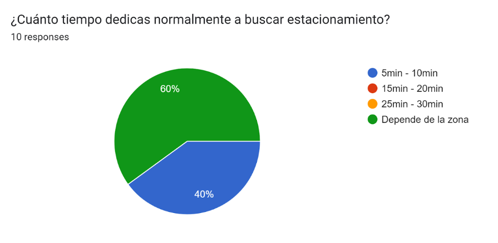
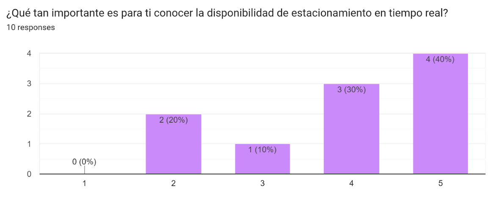
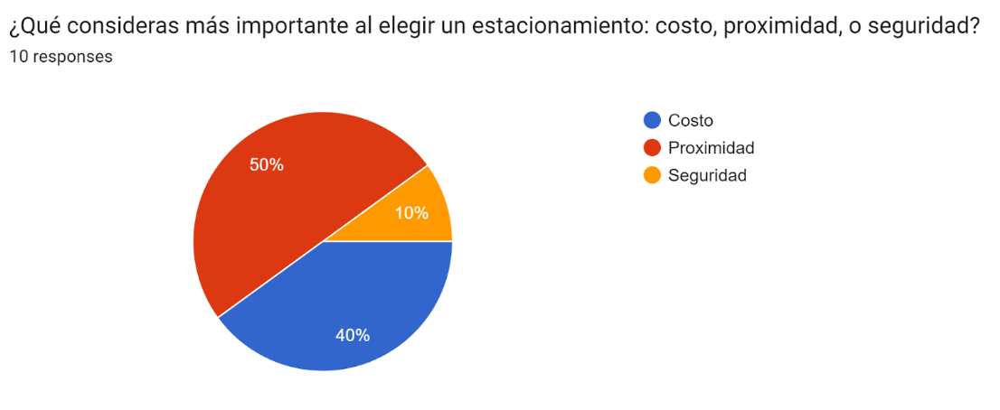

# **COURSE PROJECT**

  

<strong>Universidad Peruana de Ciencias Aplicadas</strong>

<strong>Ingeniería de Software</strong> 
Desarrollo de Aplicaciones Open Source - SW54  
Ciclo: 5to  
<strong>Profesor:</strong> Alberto Wilmer Sanchez Seña

<h2 align="center">INFORME</h2>

<h3 align="center">Startup:</h3>

<strong>Producto:</strong>

<h3 align="center">Team Members:</h3>

| **Member**                           | **Code**     |
|--------------------------------------|--------------|
| Diego Alonso Cacho Seminario      | U202223990   |
| Rodrigo Liberato Saldaña       | U202215623   |
| Samuel Elias Molina Asencios     | U20191A456   |
| Omar Harold Rivera Ticllacuri      | U202214214   |
| Diego Ulises Soto Quispe     | U202214477   |

<strong>Agosto 2024</strong>

# Registro de Versiones del Informe

| Versión | Fecha       | Autor(es)                                                                                                  | Descripción de la modificación                                                                                                                                                       |
|---------|-------------|------------------------------------------------------------------------------------------------------------|---------------------------------------------------------------------------------------------------------------------------------------------------------------------------------------|
| TB1     | 12/09/2024  | Diego Alonso Cacho Seminario  Rodrigo Liberato Saldaña  Samuel Elias Molina Asencios  Omar Harold Rivera Ticllacuri  Diego Ulises Soto Quispe | Se agregó el contenido del capítulo 1 (apartados 1.1, 1.2 y 1.3); el contenido del capítulo 2 (apartados 2.1, 2.2, 2.3, 2.4); el contenido del capítulo 3 (apartados 3.1, 3.2, 3.3 y 3.4); el contenido del capítulo 4 (apartados 4.1, 4.2, 4.3, 4.4, 4.5, 4.6, 4.7 y 4.8); y el contenido del capítulo 5 (apartados 5.1 y 5.2). |
| TP1     |             | Diego Alonso Cacho Seminario  Rodrigo Liberato Saldaña  Samuel Elias Molina Asencios  Omar Harold Rivera Ticllacuri  Diego Ulises Soto Quispe |                                                                                                                                                                                       |
| TB2     |             | Diego Alonso Cacho Seminario  Rodrigo Liberato Saldaña  Samuel Elias Molina Asencios  Omar Harold Rivera Ticllacuri  Diego Ulises Soto Quispe |                                                                                                                                                                                       |
| TF1     |             | Diego Alonso Cacho Seminario  Rodrigo Liberato Saldaña  Samuel Elias Molina Asencios  Omar Harold Rivera Ticllacuri  Diego Ulises Soto Quispe |                                                                                                                                                                                       |

# Project Report Collaboration Insights

TB1: Las tareas asignadas para la entrega TB1 se han completado y están documentadas en el siguiente repositorio de GitHub perteneciente a la organización del equipo: [Repositorio GitHub](#).

Durante la preparación del informe, se llevaron a cabo las siguientes actividades:

- Se escribieron y diagramaron los contenidos asignados a cada miembro en formato Markdown, seguido de commits para asegurar el progreso en el repositorio.
- Se crearon los artefactos necesarios utilizando las herramientas recomendadas y se obtuvieron enlaces de imagen a través de la carpeta `imagenes` en la rama `desarrollo` del repositorio del informe.
- Se organizaron reuniones para coordinar el progreso de los elementos del informe y para comunicar los avances del Sprint 1, que se enfoca en la Landing Page.

# Student Outcome
| Criterio específico                                                                                 | Acciones realizadas | Conclusiones |
|------------------------------------------------------------------------------------------------------|---------------------|--------------|
| **Comunica oralmente con efectividad a diferentes rangos de audiencia.**                                          |              |
| **Comunica por escrito con efectividad a diferentes rangos de audiencia.**                           |                     |              |
|                                                             
# Contenido
- [Registro de Versiones del Informe](#registro-de-versiones-del-informe)
- [Project Report Collaboration Insights](#project-report-collaboration-insights)
- [Student Outcome](#student-outcome)

## Capítulo I: Introducción
- [1.1. Startup Profile](#11-startup-profile)
  - [1.1.1. Descripción de la Startup](#111-descripción-de-la-startup)
  - [1.1.2. Perfiles de integrantes del equipo](#112-perfiles-de-integrantes-del-equipo)
- [1.2. Solution Profile](#12-solution-profile)
  - [1.2.1 Antecedentes y problemática](#121-antecedentes-y-problemática)
  - [1.2.2 Lean UX Process](#122-lean-ux-process)
    - [1.2.2.1. Lean UX Problem Statements](#1221-lean-ux-problem-statements)
    - [1.2.2.2. Lean UX Assumptions](#1222-lean-ux-assumptions)
    - [1.2.2.3. Lean UX Hypothesis Statements](#1223-lean-ux-hypothesis-statements)
    - [1.2.2.4. Lean UX Canvas](#1224-lean-ux-canvas)
- [1.3. Segmentos objetivo](#13-segmentos-objetivo)

## Capítulo II: Requirements Elicitation & Analysis
- [2.1. Competidores](#21-competidores)
  - [2.1.1. Análisis competitivo](#211-análisis-competitivo)
  - [2.1.2. Estrategias y tácticas frente a competidores](#212-estrategias-y-tácticas-frente-a-competidores)
- [2.2. Entrevistas](#22-entrevistas)
  - [2.2.1. Diseño de entrevistas](#221-diseño-de-entrevistas)
  - [2.2.2. Registro de entrevistas](#222-registro-de-entrevistas)
  - [2.2.3. Análisis de entrevistas](#223-análisis-de-entrevistas)
- [2.3. Needfinding](#23-needfinding)
  - [2.3.1. User Personas](#231-user-personas)
  - [2.3.2. User Task Matrix](#232-user-task-matrix)
  - [2.3.3. User Journey Mapping](#233-user-journey-mapping)
  - [2.3.4. Empathy Mapping](#234-empathy-mapping)
  - [2.3.5. As-is Scenario Mapping](#235-as-is-scenario-mapping)
- [2.4. Ubiquitous Language](#24-ubiquitous-language)

## Capítulo III: Requirements Specification
- [3.1. To-Be Scenario Mapping](#31-to-be-scenario-mapping)
- [3.2. User Stories](#32-user-stories)
- [3.3. Impact Mapping](#33-impact-mapping)
- [3.4. Product Backlog](#34-product-backlog)

## Capítulo IV: Product Design
- [4.1. Style Guidelines](#41-style-guidelines)
  - [4.1.1. General Style Guidelines](#411-general-style-guidelines)
  - [4.1.2. Web Style Guidelines](#412-web-style-guidelines)
- [4.2. Information Architecture](#42-information-architecture)
  - [4.2.1. Organization Systems](#421-organization-systems)
  - [4.2.2. Labeling Systems](#422-labeling-systems)
  - [4.2.3. SEO Tags and Meta Tags](#423-seo-tags-and-meta-tags)
  - [4.2.4. Searching Systems](#424-searching-systems)
  - [4.2.5. Navigation Systems](#425-navigation-systems)
- [4.3. Landing Page UI Design](#43-landing-page-ui-design)
  - [4.3.1. Landing Page Wireframe](#431-landing-page-wireframe)
  - [4.3.2. Landing Page Mock-up](#432-landing-page-mock-up)
- [4.4. Web Applications UX/UI Design](#44-web-applications-uxui-design)
  - [4.4.1. Web Applications Wireframes](#441-web-applications-wireframes)
  - [4.4.2. Web Applications Wireflow Diagrams](#442-web-applications-wireflow-diagrams)
  - [4.4.2. Web Applications Mock-ups](#442-web-applications-mock-ups)
  - [4.4.3. Web Applications User Flow Diagrams](#443-web-applications-user-flow-diagrams)
- [4.5. Web Applications Prototyping](#45-web-applications-prototyping)
- [4.6. Domain-Driven Software Architecture](#46-domain-driven-software-architecture)
  - [4.6.1. Software Architecture Context Diagram](#461-software-architecture-context-diagram)
  - [4.6.2. Software Architecture Container Diagrams](#462-software-architecture-container-diagrams)
  - [4.6.3. Software Architecture Components Diagrams](#463-software-architecture-components-diagrams)
- [4.7. Software Object-Oriented Design](#47-software-object-oriented-design)
  - [4.7.1. Class Diagrams](#471-class-diagrams)
  - [4.7.2. Class Dictionary](#472-class-dictionary)
- [4.8. Database Design](#48-database-design)
  - [4.8.1. Database Diagram](#481-database-diagram)

## Capítulo V: Product Implementation, Validation & Deployment
- [5.1. Software Configuration Management](#51-software-configuration-management)
  - [5.1.1. Software Development Environment Configuration](#511-software-development-environment-configuration)
  - [5.1.2. Source Code Management](#512-source-code-management)
  - [5.1.3. Source Code Style Guide & Conventions](#513-source-code-style-guide--conventions)
  - [5.1.4. Software Deployment Configuration](#514-software-deployment-configuration)
- [5.2. Landing Page, Services & Applications Implementation](#52-landing-page-services--applications-implementation)
  - [5.2.1. Sprint 1](#521-sprint-1)
    - [5.2.1.1. Sprint Planning 1](#5211-sprint-planning-1)
    - [5.2.1.2. Sprint Backlog 1](#5212-sprint-backlog-1)
    - [5.2.1.3. Development Evidence for Sprint Review](#5213-development-evidence-for-sprint-review)
    - [5.2.1.4. Testing Suite Evidence for Sprint Review](#5214-testing-suite-evidence-for-sprint-review)
    - [5.2.1.5. Execution Evidence for Sprint Review](#5215-execution-evidence-for-sprint-review)
    - [5.2.1.6. Services Documentation Evidence for Sprint Review](#5216-services-documentation-evidence-for-sprint-review)
    - [5.2.1.7. Software Deployment Evidence for Sprint Review](#5217-software-deployment-evidence-for-sprint-review)
    - [5.2.1.8. Team Collaboration Insights during Sprint](#5218-team-collaboration-insights-during-sprint)

- [Avance de Conclusiones, Bibliografía y Anexos](#avance-de-conclusiones-bibliografía-y-anexos)

## Capítulo I: Introducción

### 1.1. Startup Profile

#### 1.1.1. Descripción de la Startup

#### 1.1.2. Perfiles de integrantes del equipo

 **Integrantes**                                              | **Descripción**                                                                                                                                                                                                                                                | **Conocimientos**                               |
|--------------------------------------------------------------|----------------------------------------------------------------------------------------------------------------------------------------------------------------------------------------------------------------------------------------------------------------|-------------------------------------------------|
|    Diego Ulises Soto Quispe | Soy estudiante de 5to ciclo en la carrera de Ingeniería de Software. Soy responsable en las labores que se asignan y puntual con los trabajos por entregar, fuera del mundo de programación, me gusta jugar basquet, salir a pasear, jugar videojuegos y manejar en bicicleta. | HTML, Base de datos en SQL Server, C++, Python, NoSQL, JSON |
|    Diego Alonso Cacho Seminario | Mi nombre es Diego Cacho y tengo 19 años, actualmente me encuentro 5to ciclo de mi carrera como Ingeniero de Software en la UPC. Me considero una persona tranquila y diligente, intento realizar mis tareas y trabajos lo antes posible para evitar contratiempos en un futuro, especialmente si son actividades que consumen mucho tiempo. Como miembro de equipo buscaré ayudar a mis compañeros cuando lo necesiten, realizando además mis entregas lo más temprano posible. | C++, C#, Python, Unity 2D/3D | 
|    Omar Harold Rivera Ticllacuri | Soy estudiante de Ingeniería de Software, tengo 19 años y actualmente me encuentro en el quinto ciclo de mi carrera. Soy una persona con la cual tengo la disciplina y responsable para desarrollar proyectos de software y software de entretenimiento. Cuento con experiencia sobre el desarrollo de software de entretenimiento. Por ende, apoyaré al grupo en todo lo posible para poder desarrollar adecuadamente el trabajo y la propuesta que se nos asignó. 
 C++, C#, Python, Unity 2D/3D, Html y Css|
                                                              |                                                                                                                                                                                                                                                                |                                                 |
|                                                              |                                                                                                                                                                                                                                                                |                                                 |
  |                                                                                                                                                                                                                                                                |                                                 |

### 1.2. Solution Profile

#### 1.2.1. Antecedentes y problemática

#### 1.2.2. Lean UX Process

##### 1.2.2.1. Lean UX Problem Statements

##### 1.2.2.2. Lean UX Assumptions

##### 1.2.2.3. Lean UX Hypothesis Statements

##### 1.2.2.4. Lean UX Canvas

### 1.3. Segmentos objetivo

1. Conductores Urbanos Frecuentes:
   - Descripción: Este segmento incluye a personas que necesitan estacionamiento regular en zonas urbanas.
   - Sexo: Masculino y femenino
   - Edades: Adultos jóvenes (18-34 años), adultos de mediana edad (35-54 años) y adultos mayores (55+)
   - Nivel socioeconómico: Clases B, C y D (media-alta, media y baja)
   - Satisfacción de Necesidades: La plataforma permite a estos usuarios ahorrar tiempo y reducir el estrés al ofrecer reservas anticipadas o en tiempo real, optimizando sus desplazamientos diarios. Asimismo, gracias al sensor, el usuario tendra la seguridad del estado de su carro dentro del estacionamiento.

2. Dueños de playas de estacionamientos:
    - Descripcion: El siguiente segmento incluye a las personas dueñas de playas de estacionamintos, o lugares para aparcar carros en zonas urbanas.
    - Sexo: Masculino y Femenino
    - Edades: Adultos jóvenes (18-34 años), Adultos de mediana edad (35 - 54) y adultos mayores (55+)
    - Nivel socioeconómico: Clases B y C (Media-alta y media)
    - Necesidades por satisfacer: Apoyar con el manejo de datos que sucede al momento de que los conductores urbanos frecuentes deseen un lugar para estacionar, ademas de brindar facilidad y seguridad al momento de pagar y ordenar los lugares de estacionamiento. Además, promueve la formalidad y acelera los procesos tediosos que estos negocios suelen tener.
  
## Capítulo II: Requirements Elicitation & Analysis

### 2.1. Competidores

**Parkimeter:**

Parkimeter es una plataforma en línea que ofrece servicios relacionados con el estacionamiento y la gestión de plazas de aparcamiento. La plataforma permite a los usuarios buscar, comparar y reservar plazas de estacionamiento en diferentes ubicaciones. Además de la reserva de plazas de estacionamiento, Parkimeter también proporciona información sobre tarifas de estacionamiento, disponibilidad en tiempo real y otras características útiles para ayudar a los conductores a encontrar y gestionar el estacionamiento de manera más conveniente.

**ElParking**

ElParking permite a los usuarios encontrar, reservar y pagar por estacionamiento a través de su plataforma. La aplicación brinda información en tiempo real acerca de sitios de estacionamiento cercanos quitando un peso de los hombros del consumidor, los conductores. Además, tiene la increíble funcionalidad de seguimiento de multas, pagos en parquímetros, etc.

**Aparcados**

Aparcados permite a los conductores encontrar estacionamientos dependiendo de lo que buscan, optimizando así el proceso de estacionamiento en áreas urbanas La app posee también posee una página web, pero la versión en móviles es la más usada hasta el momento, con una interfaz llamativa para todos los usuarios.

#### 2.1.1. Análisis competitivo
| ***Analisis/Competidores*** | ParkingNow | Parkimeter | ElParking | Aparcados |
|---------------------------|---------------------|--------------|--------------|-------------- |
| **Overview**       |    Es una plataforma en línea que brinda la posibilidad de reservar espacios de estacionamiento en múltiples ciudades ademas que brinda la conexion entre los consumidores y dueños de estacionamientos|Es una plataforma en línea que ofrece servicios de reserva de plazas de aparcamiento en diversas ciudades de Europa y América Latina| Es una plataforma en línea que ofrece servicios de reserva de plazas de aparcamiento en diversos lugares de Costa Rica y América Latina | Es una plataforma en línea que ofrece servicios de reserva de plazas de aparcamiento en diversas ciudades de España principalmente, pero expandiéndose alrededor del mundo |
| **Ventaja competitiva**|Cancelación gratuita hasta con 24 horas de antelación de la reserva, inclusion de un sensor para el automovil y ser el puente entre los consumidores y dueños de playas de estacionamientos en zonas urbanas| Ofrece descuentos de hasta el 70% y no cobra gastos de gestión | Permite más que solo pagar estacionamientos, sino gestionar multas y pagar parquímetros| La app incluye geolocalización y ofrece notificaciones a tiempo real|
| **Mercado objetivo** |Personas que buscaban soluciones de estacionamiento en áreas urbanas congestionadas y personas dueñas de estacionamientos de playas. |Personas que buscaban soluciones de estacionamiento en áreas urbanas congestionadas|Personas que buscaban soluciones de estacionamiento en áreas urbanas congestionadas |Personas que buscaban soluciones de estacionamiento en áreas urbanas congestionadas |
| **Estrategias de Marketing**|Utiliza publicidad en línea a través de plataformas y redes sociales.|Utiliza publicidad en línea a través de plataformas y redes sociales |Utiliza publicidad en línea, redes sociales y reciben promociones de influencers| Utiliza publicidad en línea a través de plataformas y redes sociales  |
| **Productos y Servicios**|Ofrece una serie de servicios relacionados con la reserva de plazas de aparcamiento en áreas urbanas y otros destinos. |Realizar servicios de parking en todo el territorio español y otras grandes ciudades del mundo | Ofrece una serie de servicios relacionados con la reserva de plazas de aparcamiento en ciudades concurridas, seguimiento de multas y pagos sencillos. | Ofrece una serie de servicios relacionados con la reserva de plazas de aparcamiento en áreas urbanas y otros destinos |
| **Precios y Costos**|La plataforma es gratuita, pero se debe pagar las tarifas de estacionamiento correspondientes |La plataforma es gratuita, pero se debe pagar las tarifas de estacionamiento correspondientes | La plataforma es gratuita pero se debe pagar las tarifas de estacionamiento, además de la existencia de tarifas especiales o descuentos | La plataforma es gratuita, pero se debe pagar las tarifas de estacionamiento correspondientes. |
| **Canales de Distribucion**|Sitio web, aplicación móvil, redes sociales, marketing en línea | Sitio web, aplicación móvil, redes sociales, marketing en línea | Sitio web, aplicación móvil, redes sociales, marketing en línea|Sitio web, aplicación móvil, redes sociales, marketing en línea|
| **Fortalezas**|Implementa sensores de estacionamiento en los estacionamientos asociados | Parkimeter opera en múltiples ciudades de Europa y América Latina |ElParking implementa seguimiento de multas y pagos a parte de los estacionamientos | Aparcados opera en múltiples ciudades de Europa y Asia|
| **Debilidades**|La industria de reserva de estacionamientos en línea es muy competitiva. | Varias empresas que proporcionan servicios similares | La industria de reserva de estacionamientos en línea es muy competitiva. | Varias empresas que proporcionan servicios similares. |
| **Oportunidades**|A medida que las ciudades sigan creciendo, la demanda de servicios de reserva podría aumentar |La congestión del tráfico se vuelve más común, eso provocaría una alta demanda en la reserva de estacionamientos | En su país de origen, España, las personas en zonas urbanas van a tener que aprender más acerca de la app para poder vivir en comodidad. | Tiene grandes posibilidades de expandir su mercado aun enfocándose en la reserva de estacionamientos en América Latina |
| **Amenazas**| Cambios en las políticas de movilidad urbana.|Nuevas startups compitiendo por la misma base de usuarios.|Nuevas startups compitiendo por la misma base de usuarios. | Nuevas startups compitiendo por la misma base de usuarios. |

#### 2.1.2. Estrategias y tácticas frente a competidores

**Plataforma digital:**

Dado que se opera en línea, es fundamental tener una plataforma tecnológica consistente y fácil de usar. La inversión en tecnología puede incluir la mejora de la experiencia del usuario en su sitio web y aplicación móvil gracias a nuestros datos en tiempo real que brindamos a todos los usuarios.

**Expansión geográfica:**

Evaluar la posibilidad de expandirse a nuevos mercados geográficos o agregar más ubicaciones de estacionamiento puede ser una estrategia de expansión. Esto puede requerir investigaciones de mercado y planificación cuidadosa.

**Cumplimiento normativo:**

Nos centraremos en hacer cumplir las normas que vienen con la gestión de estacionamientos en cada ciudad y país, todo esto para lograr la convivencia armoniosa con todos los residentes de las localidades, siendo que apoyamos a los turistas que no están familiarizados con reglas extranjeras. 

### 2.2. Entrevistas

#### 2.2.1. Diseño de entrevistas
### Con el objetivo de obtener un mejor entendimiento de nuestros usuarios, queremos conocer sus puntos de vista para guiar nuestro enfoque y así implementar nuestro producto en base a sus problemas.

**Segmento objetivo \#1: Conductores Urbanos Frecuentes**

**Preguntas principales:**

* ¿Con qué frecuencia necesitas estacionamiento en la ciudad?  
* ¿Cuánto tiempo dedicas normalmente a buscar estacionamiento?  
* ¿Utilizas actualmente alguna aplicación o servicio para encontrar estacionamiento?  
* ¿Qué tan importante es para ti conocer la disponibilidad de estacionamiento en tiempo real?  
* ¿Estarías dispuesto/a a pagar una tarifa adicional por garantizar un espacio de estacionamiento reservado?  
* ¿Qué consideras más importante al elegir un estacionamiento: costo, proximidad, o seguridad?  
* ¿Te gustaría recibir recomendaciones de rutas hacia el estacionamiento más cercano basado en el tráfico en tiempo real?

**Preguntas complementarias:**

* ¿Has tenido experiencias frustrantes buscando estacionamiento en la ciudad?  
* ¿Qué mejoras te gustaría ver en los servicios de estacionamiento que utilizas actualmente?

**Segmento objetivo \#2: Dueños de playas de estacionamientos**

**Preguntas principales:**

* ¿Consideras sencillo el proceso de gestionamiento de espacios en tu estacionamiento?  
* ¿Qué tan importante es para ti contar con información en tiempo real sobre los espacios disponibles?  
* ¿Utilizas algún sistema digital para administrar los pagos y reservas de los espacios de estacionamiento?  
* ¿Qué beneficios ves en la posibilidad de automatizar el proceso de reserva y pago de los espacios de estacionamiento?  
* ¿Qué tan relevante es para ti ofrecer opciones de pago seguras y rápidas a tus clientes?  
* ¿De qué manera crees que la integración de una app que gestione datos y pagos podría mejorar la eficiencia de tu negocio?

**Preguntas complementarias:**

* ¿Cuáles son los principales desafíos que enfrentas al administrar tu estacionamiento?  
* ¿Qué funcionalidades adicionales te gustaría que una app ofreciera para facilitar la gestión de tu negocio?  
* ¿Te gustaría recibir reportes o análisis sobre la ocupación y rotación de vehículos en tu estacionamiento?

#### 2.2.2. Registro de entrevistas
**Segmento objetivo \#1: Conductores Urbanos Frecuentes**

Entrevistado N°1: Bárbara Eliana Seminario León

* Sexo: Femenino  
* Edad: 46  
* Ubicación en la que vive: Surco, Lima, Perú.

Acerca de la entrevista:

* Link: [https://youtu.be/qiEsk6I19uM](https://youtu.be/qiEsk6I19uM)   
* Instante en el que inicia: 0:15  
* Duración: 2:45

Resumen:

Para Bárbara, la necesidad de estacionamiento no es frecuente, pero el tiempo que dedica a buscar un lugar varía según la zona. Actualmente, no utiliza aplicaciones para encontrar estacionamiento, pero valora conocer la disponibilidad antes de llegar y recibir recomendaciones sobre rutas para ahorrar tiempo. Está dispuesta a pagar tarifas adicionales para reservar un espacio, y considera el costo, la proximidad y la seguridad como factores clave al elegir dónde estacionar. En ocasiones, ha tenido que estacionar en lugares inconvenientes debido a la falta de opciones y tiempo limitado. Además, le interesaría que alguien pudiera estacionar su auto por ella.

Entrevistado N°2: Juan Pablo Guija Solis

* Sexo: Masculino  
* Edad: 19  
* Ubicación en la que vive: San Borja

Acerca de la entrevista: 

* Link: [https://youtu.be/HoAftCu6EPA](https://youtu.be/HoAftCu6EPA)   
* Instante en el que inicia: 0:11  
* Duración: 2:48

Resumen:

Para Juan Pablo, que utiliza su vehículo a diario, encontrar estacionamiento es una necesidad frecuente. El tiempo que dedica a buscar un lugar depende de la zona, y actualmente no usa ninguna app para este propósito. Valora mucho conocer la disponibilidad de estacionamiento antes de llegar, ya que esto le permite ahorrar tiempo. Está dispuesto a pagar tarifas adicionales para reservar un espacio, siempre y cuando estas no sean excesivamente altas. Considera importantes el costo y la proximidad al elegir un lugar para estacionar. Ha tenido experiencias frustrantes, como perder un espacio o encontrarse con estacionamientos demasiado pequeños. Le gustaría recibir avisos en tiempo real cuando se libere un espacio cercano y notificaciones sobre posibles movimientos sospechosos en el área donde estaciona.

Entrevistado N°3:

* Sexo:  
* Edad:  
* Ubicación en la que vive:

Acerca de la entrevista:

* Link:  
* Instante en el que inicia:  
* Duración:

Resumen:

Para 

**Segmento objetivo \#2: Dueños de playas de estacionamientos**

Entrevistado N°1:

* Sexo:  
* Edad:  
* Ubicación en la que vive:

Acerca de la entrevista:

* Link:  
* Instante en el que inicia:  
* Duración:

Resumen:

Para 

Entrevistado N°2:

* Sexo:  
* Edad:  
* Ubicación en la que vive:

Acerca de la entrevista:

* Link:  
* Instante en el que inicia:  
* Duración:

Resumen:

Para 

#### 2.2.3. Análisis de entrevistas
De acuerdo con la información recopilada de las entrevistas, realizamos el siguiente análisis de entrevistas:

Segmento objetivo \#1:

**Hallazgos:**

* La necesidad de estacionamiento varía: algunos lo requieren con frecuencia, mientras que otros solo ocasionalmente.  
* El tiempo dedicado a buscar estacionamiento depende de la zona.  
* No se utilizan aplicaciones para encontrar estacionamiento.  
* Es muy importante conocer la disponibilidad de estacionamiento antes de llegar.  
* Se está dispuesto a pagar tarifas adicionales para reservar un espacio, siempre y cuando estas no sean demasiado altas.  
* Factores como el costo, la proximidad y la seguridad son clave al elegir un lugar para estacionar.  
* Existen frustraciones comunes relacionadas con la búsqueda de estacionamiento, como perder un espacio o encontrar lugares inadecuados.  
* Se desea recibir recomendaciones de rutas para ahorrar tiempo y la opción de que alguien estacione el auto por uno.  
* Se valoran los avisos en tiempo real sobre la liberación de espacios cercanos y las notificaciones sobre movimientos sospechosos en el área de estacionamiento.

Segmento objetivo \#2: 

**Hallazgos:**

* La necesidad de estacionamiento es constante: la mayoría tiene dificultades al encontrar estacionamiento.  
* No se utilizan aplicaciones para encontrar estacionamiento.  
* Se desea una funcionalidad de verificar en tiempo real los espacios disponibles.  
* Se está dispuesto a pagar tarifas adelantadas para reservar un espacio, siempre y cuando estas no sean demasiado altas.  
* Factores como la proximidad y el costo son cruciales.  
* Influye regularmente la disponibilidad de estacionamiento al realizar un viaje.  
* Existen frustraciones comunes relacionadas con la búsqueda de estacionamiento, especialmente cuando es un lugar nuevo.

**Conclusiones de ambos segmentos:**

Los resultados del **segmento 1** indican que, aunque las necesidades de estacionamiento varían en frecuencia, hay un consenso en la importancia de conocer la disponibilidad de espacios antes de llegar. La disposición a pagar tarifas adicionales es alta, siempre que estas sean razonables. Los factores de costo, proximidad y seguridad son cruciales al elegir un lugar para estacionar. Existen frustraciones comunes con la búsqueda de estacionamiento, y se valora la tecnología para mejorar la experiencia, como recibir avisos en tiempo real y recomendaciones de rutas. La opción de asistencia para estacionar también es deseada. De igual manera, los resultados del **segmento 2** presentan similitudes a las del segmento anterior, mostrando como la mayoría de respuestas indican que tienen dificultades al encontrar estacionamiento en lugares que no conocen, les parece una idea interesante un servicio que les muestre en tiempo real la disponibilidad de estacionamiento, demostrando como la mayoria esta dispuesto a pagar las tarifas por anticipado para garantizar un espacio.

**Análisis por medio de herramientas estadísticas:**

Segmento objetivo 1: [https://forms.gle/Lo3Z69GnkyYDcaAYA](https://forms.gle/Lo3Z69GnkyYDcaAYA) 

Segmento objetivo 2: link

### 2.3. Needfinding

#### 2.3.1. User Personas

#### 2.3.2. User Task Matrix

#### 2.3.3. User Journey Mapping

#### 2.3.4. Empathy Mapping

#### 2.3.5. As-is Scenario Mapping

### 2.4. Ubiquitous Language

## Capítulo III: Requirements Specification

### 3.1. To-Be Scenario Mapping

### 3.2. User Stories

### 3.3. Impact Mapping

### 3.4. Product Backlog

## Capítulo IV: Product Design

### 4.1. Style Guidelines

#### 4.1.1. General Style Guidelines

#### 4.1.2. Web Style Guidelines

### 4.2. Information Architecture

#### 4.2.1. Organization Systems

#### 4.2.2. Labeling Systems

#### 4.2.3. SEO Tags and Meta Tags

#### 4.2.4. Searching Systems

#### 4.2.5. Navigation Systems

### 4.3. Landing Page UI Design

#### 4.3.1. Landing Page Wireframe

#### 4.3.2. Landing Page Mock-up

### 4.4. Web Applications UX/UI Design

#### 4.4.1. Web Applications Wireframes

#### 4.4.2. Web Applications Wireflow Diagrams

#### 4.4.3. Web Applications Mock-ups

#### 4.4.4. Web Applications User Flow Diagrams

### 4.5. Web Applications Prototyping

### 4.6. Domain-Driven Software Architecture

#### 4.6.1. Software Architecture Context Diagram

#### 4.6.2. Software Architecture Container Diagrams

#### 4.6.3. Software Architecture Components Diagrams

### 4.7. Software Object-Oriented Design

#### 4.7.1. Class Diagrams

#### 4.7.2. Class Dictionary

### 4.8. Database Design

#### 4.8.1. Database Diagram

## Capítulo V: Product Implementation, Validation & Deployment

### 5.1. Software Configuration Management

#### 5.1.1. Software Development Environment Configuration

#### 5.1.2. Source Code Management

#### 5.1.3. Source Code Style Guide & Conventions

#### 5.1.4. Software Deployment Configuration

### 5.2. Landing Page, Services & Applications Implementation

#### 5.2.X. Sprint n

##### 5.2.X.1. Sprint Planning n

##### 5.2.X.2. Sprint Backlog n

##### 5.2.X.3. Development Evidence for Sprint Review

##### 5.2.X.4. Testing Suite Evidence for Sprint Review

##### 5.2.X.5. Execution Evidence for Sprint Review

##### 5.2.X.6. Services Documentation Evidence for Sprint Review

##### 5.2.X.7. Software Deployment Evidence for Sprint Review

##### 5.2.X.8. Team Collaboration Insights during Sprint

### 5.3. Validation Interviews

#### 5.3.1. Diseño de Entrevistas

#### 5.3.2. Registro de Entrevistas

#### 5.3.3. Evaluaciones según heurísticas

### 5.4. Video About-the-Product

## Conclusiones y Recomendaciones

### Conclusiones

### Conclusiones y recomendaciones

### Video About-the-Team

## Bibliografía

## Anexos
