# **COURSE PROJECT**

  

<strong>Universidad Peruana de Ciencias Aplicadas</strong>

<strong>Ingeniería de Software</strong> 
Desarrollo de Aplicaciones Móviles - NRC: 346  
Ciclo: 6to  
<strong>Profesor:</strong> Jorge Luis Mayta Guillermo

<h2 align="center">INFORME</h2>

<h3 align="center">Startup: Code Mondoguito</h3>

<strong>Producto: ParkingNow</strong>

<h3 align="center">Team Members:</h3>

| **Member**              | **Code** |
| ----------------------------- | -------------- |
| Diego Alonso Cacho Seminario  | U202223990     |
| Rodrigo Liberato Saldaña     | U202215623     |
| Samuel Elias Molina Asencios  | U20191A456     |
| Omar Harold Rivera Ticllacuri | U202214214     |
| Diego Ulises Soto Quispe      | U2022144778    |

<strong>Abril 2025</strong>

# Registro de Versiones del Informe
| Versión | Fecha      | Autor(es) | Descripción de la modificación |
| ------- | ---------- | --------- | ------------------------------ |
| TB1     |            |           |                                |
| TP1     |            |           |                                |
| TB2     |            |           |                                |
| TF1     |            |           |                                |

# Project Report Collaboration Insights

TB1: Las tareas asignadas para la entrega TB1 se han completado y están documentadas en el siguiente repositorio de GitHub perteneciente a la organización del equipo: [Repositorio GitHub](https://github.com/UPC-PRE-SI729-SW54-Code-Mondonguito/Report). (https://github.com/UPC-PRE-SI729-SW54-Code-Mondonguito/Report)

Durante la preparación del informe, se llevaron a cabo las siguientes actividades:

- Se escribieron y diagramaron los contenidos asignados a cada miembro en formato Markdown, seguido de commits para asegurar el progreso en el repositorio.
- Se crearon los artefactos necesarios utilizando las herramientas recomendadas y se obtuvieron enlaces de imagen a través de la carpeta `Assets` en la rama `develop` del repositorio del informe.
- Se organizaron reuniones para coordinar el progreso de los elementos del informe y para comunicar los avances del Sprint 1, que se enfoca en la Landing Page.

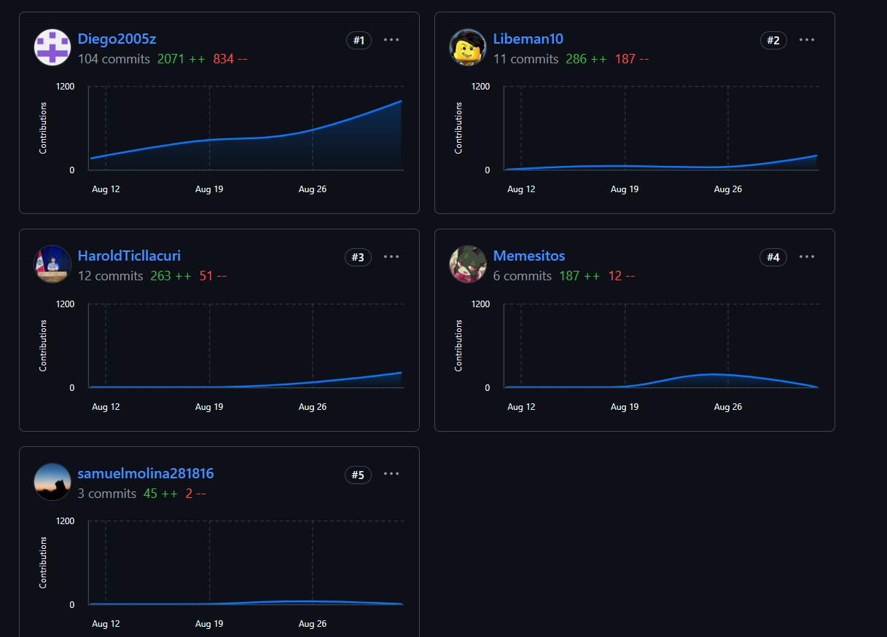

TP1: Durante la preparación del informe, se llevaron a cabo las siguientes actividades:

- Se escribieron y diagramaron los contenidos asignados a cada miembro en formato Markdown, seguido de commits para asegurar el progreso en el repositorio.
- Se crearon los artefactos necesarios utilizando las herramientas recomendadas y se obtuvieron enlaces de imagen a través de la carpeta `Assets` en la rama `develop` del repositorio del informe.
- Se organizaron reuniones para coordinar el progreso de los elementos del informe y para comunicar los avances del Sprint 2, que se enfoca en el front-end de la aplicación web.
  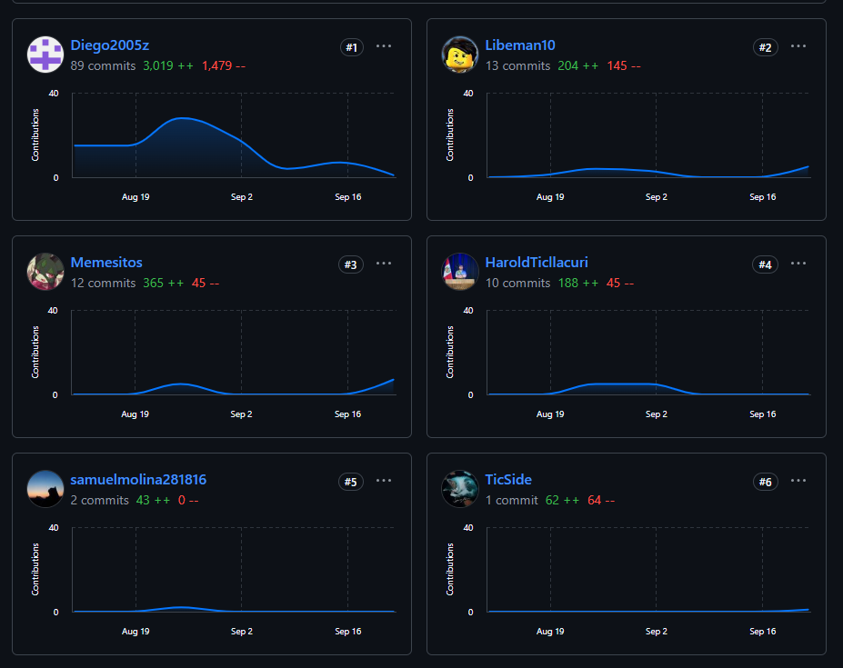

 TB2: Avances del Sprint 3 en el proyecto ParkingNow

Las tareas asignadas para la entrega del Sprint 3 se han completado y están documentadas en el repositorio de GitHub perteneciente a la organización del equipo: https://github.com/UPC-PRE-SI729-SW54-Code-Mondonguito

Durante la preparación del informe, se llevaron a cabo las siguientes actividades:

- **Implementación de Endpoints en Bounded Contexts**: Cada miembro del equipo desarrolló los endpoints correspondientes a los bounded contexts designados previamente en el sprint backlog 3. Estos contexts incluyen módulos clave del backend como el manejo de reservas, transacciones, alertas, asesorías y la administración de usuarios y conductores.
- **Creación y Documentación de Artefactos**: Se generaron los artefactos necesarios utilizando las herramientas recomendadas, y se obtuvieron enlaces de imagen a través de la carpeta `assets` en la rama `develop` del repositorio del informe. Estos artefactos incluyen diagramas de clases, capturas de pantalla de la estructura del backend, y documentación de servicios web.
- **Reuniones de Coordinación**: Se organizaron reuniones regulares para coordinar el progreso de los elementos del informe y comunicar los avances del Sprint 3, que se enfocó en el backend de la aplicación web. Durante estas reuniones, se discutieron temas como la implementación de la arquitectura CLEAN, la integración de CQRS y la separación de servicios en el backend.

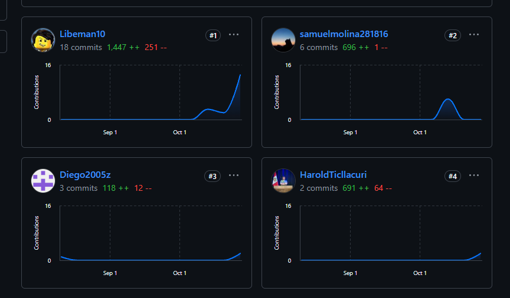

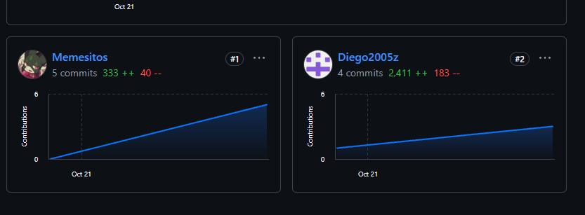

TF: Tareas y Actividades Realizadas para la Entrega TF

Las actividades asignadas para la entrega TF han sido completadas exitosamente y están registradas en el repositorio oficial de GitHub asociado al equipo: https://github.com/UPC-PRE-SI729-SW54-Code-Mondonguito

### Actividades Realizadas

- Cada integrante del equipo fue responsable de implementar los endpoints correspondientes a los módulos establecidos en el backlog del sprint 4. Asimismo, se añadieron endpoints adicionales necesarios para alinear las funcionalidades con las necesidades de la web application.
- Se generaron y documentaron los artefactos requeridos utilizando las herramientas recomendadas. Estos artefactos, incluyendo diagramas y recursos visuales, fueron organizados y almacenados en la carpeta `assets` de la rama `develop` del repositorio.
- Se llevaron a cabo reuniones periódicas para coordinar los avances del proyecto, revisar los elementos del informe y comunicar el progreso alcanzado durante el sprint 4, enfocado en el desarrollo del backend de la aplicación web.

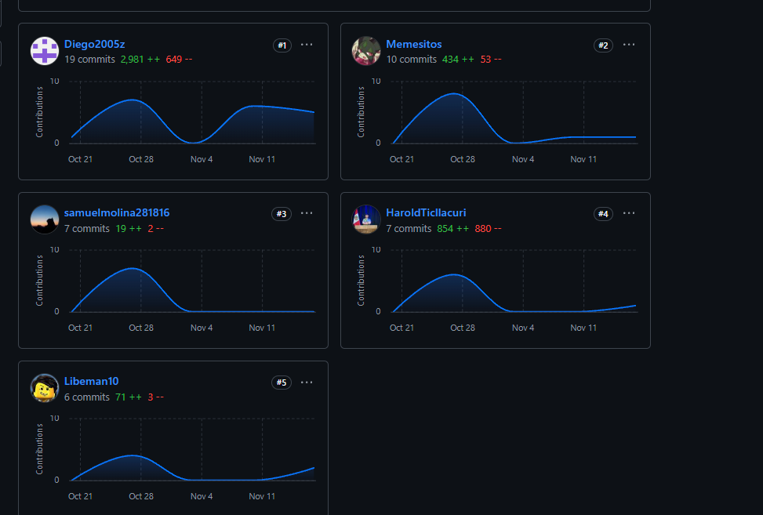

# ABET – EAC - Student Outcome 3

Criterio: Capacidad de comunicarse efectivamente con un rango de audiencias. En el
siguiente cuadro se describen las acciones realizadas y enunciados de conclusiones
por parte del grupo, que permiten sustentar el haber alcanzado el logro del ABET –
EAC - Student Outcome 3.
### ABET – EAC - Resultado del Estudiante 3

| Criterio específico | Acciones realizadas | Conclusiones |
| ------------------- | ------------------- | ------------ |
| **Comunica oralmente con efectividad a diferentes rangos de audiencia** | **TB1:**  **TP:**  **TB2:**  **TF:** | **TB1:**  **TP:**  **TB2:**  **TF:** |
| **Comunica por escrito con efectividad a diferentes rangos de audiencia** | **TB1:**  **TP:**  **TB2:**  **TF:** | **TB1:**  **TP:**  **TB2:**  **TF:** |

# Contenido

- [Registro de Versiones del Informe](#registro-de-versiones-del-informe)
- [Project Report Collaboration Insights](#project-report-collaboration-insights)
- [Student Outcome](#student-outcome)

## Capítulo I: Introducción

- [1.1. Startup Profile](#11-startup-profile)  
  - [1.1.1. Descripción de la Startup](#111-descripción-de-la-startup)  
  - [1.1.2. Perfiles de integrantes del equipo](#112-perfiles-de-integrantes-del-equipo)  
- [1.2. Solution Profile](#12-solution-profile)  
  - [1.2.1. Antecedentes y problemática](#121-antecedentes-y-problemática)  
  - [1.2.2. Lean UX Process](#122-lean-ux-process)  
    - [1.2.2.1. Lean UX Problem Statements](#1221-lean-ux-problem-statements)  
    - [1.2.2.2. Lean UX Assumptions](#1222-lean-ux-assumptions)  
    - [1.2.2.3. Lean UX Hypothesis Statements](#1223-lean-ux-hypothesis-statements)  
    - [1.2.2.4. Lean UX Canvas](#1224-lean-ux-canvas)  
- [1.3. Segmentos objetivo](#13-segmentos-objetivo)

## Capítulo II: Requirements Elicitation & Analysis

- [2.1. Competidores](#21-competidores)  
  - [2.1.1. Análisis competitivo](#211-análisis-competitivo)  
  - [2.1.2. Estrategias y tácticas frente a competidores](#212-estrategias-y-tácticas-frente-a-competidores)  
- [2.2. Entrevistas](#22-entrevistas)  
  - [2.2.1. Diseño de entrevistas](#221-diseño-de-entrevistas)  
  - [2.2.2. Registro de entrevistas](#222-registro-de-entrevistas)  
  - [2.2.3. Análisis de entrevistas](#223-análisis-de-entrevistas)  
- [2.3. Needfinding](#23-needfinding)  
  - [2.3.1. User Personas](#231-user-personas)  
  - [2.3.2. User Task Matrix](#232-user-task-matrix)  
  - [2.3.3. User Journey Mapping](#233-user-journey-mapping)  
  - [2.3.4. Empathy Mapping](#234-empathy-mapping)  
  - [2.3.5. As-is Scenario Mapping](#235-as-is-scenario-mapping)  
- [2.4. Ubiquitous Language](#24-ubiquitous-language)

## Capítulo III: Requirements Specification

- [3.1. To-Be Scenario Mapping](#31-to-be-scenario-mapping)  
- [3.2. User Stories](#32-user-stories)  
- [3.3. Impact Mapping](#33-impact-mapping)  
- [3.4. Product Backlog](#34-product-backlog)

## Capítulo IV: Solution Software Design

- [4.1. Strategic-Level Domain-Driven Design](#41-strategic-level-domain-driven-design)  
  - [4.1.1. EventStorming](#411-eventstorming)  
    - [4.1.1.1. Candidate Context Discovery](#4111-candidate-context-discovery)  
    - [4.1.1.2. Domain Message Flows Modeling](#4112-domain-message-flows-modeling)  
    - [4.1.1.3. Bounded Context Canvases](#4113-bounded-context-canvases)  
  - [4.1.2. Context Mapping](#412-context-mapping)  
  - [4.1.3. Software Architecture](#413-software-architecture)  
    - [4.1.3.1. Software Architecture Context Level Diagrams](#4131-software-architecture-context-level-diagrams)  
    - [4.1.3.2. Software Architecture Container Level Diagrams](#4132-software-architecture-container-level-diagrams)  
    - [4.1.3.3. Software Architecture Deployment Diagrams](#4133-software-architecture-deployment-diagrams)  
- [4.2. Tactical-Level Domain-Driven Design](#42-tactical-level-domain-driven-design)  
  - [4.2.X. Bounded Context: <Bounded Context Name>](#42x-bounded-context-bounded-context-name)  
    - [4.2.X.1. Domain Layer](#42x1-domain-layer)  
    - [4.2.X.2. Interface Layer](#42x2-interface-layer)  
    - [4.2.X.3. Application Layer](#42x3-application-layer)  
    - [4.2.X.4. Infrastructure Layer](#42x4-infrastructure-layer)  
    - [4.2.X.5. Bounded Context Software Architecture Component Level Diagrams](#42x5-bounded-context-software-architecture-component-level-diagrams)  
    - [4.2.X.6. Bounded Context Software Architecture Code Level Diagrams](#42x6-bounded-context-software-architecture-code-level-diagrams)  
    - [4.2.X.6.1. Bounded Context Domain Layer Class Diagrams](#42x61-bounded-context-domain-layer-class-diagrams)  
    - [2.6.X.6.2. Bounded Context Database Design Diagram](#26x62-bounded-context-database-design-diagram)

## Capítulo V: Solution UI/UX Design

- [5.1. Product Design](#51-product-design)  
  - [5.1.1. Style Guidelines](#511-style-guidelines)  
    - [5.1.1.1. General Style Guidelines](#5111-general-style-guidelines)  
  - [5.1.2. Information Architecture](#512-information-architecture)  
    - [5.1.2.1. Organization Systems](#5121-organization-systems)  
    - [5.1.2.2. Labelling Systems](#5122-labelling-systems)  
    - [5.1.2.3. SEO Tags and Meta Tags](#5123-seo-tags-and-meta-tags)  
    - [5.1.2.4. Searching Systems](#5124-searching-systems)  
    - [5.1.2.5. Navigation Systems](#5125-navigation-systems)  
  - [5.1.3. Landing Page UI Design](#513-landing-page-ui-design)  
    - [5.1.3.1. Landing Page Wireframe](#5131-landing-page-wireframe)  
    - [5.1.3.2. Landing Page Mock-up](#5132-landing-page-mock-up)  
  - [5.1.4. Mobile Applications UX/UI Design](#514-mobile-applications-uxui-design)  
    - [5.1.4.1. Mobile Applications Wireframes](#5141-mobile-applications-wireframes)  
    - [5.1.4.2. Mobile Applications Wireflow Diagrams](#5142-mobile-applications-wireflow-diagrams)  
    - [5.1.4.3. Mobile Applications Mock-ups](#5143-mobile-applications-mock-ups)  
    - [5.1.4.4. Mobile Applications User Flow Diagrams](#5144-mobile-applications-user-flow-diagrams)  
    - [5.1.4.5. Mobile Applications Prototyping](#5145-mobile-applications-prototyping)

## Capítulo VI: Product Implementation, Validation & Deployment

- [6.1. Software Configuration Management](#61-software-configuration-management)  
  - [6.1.1. Software Development Environment Configuration](#611-software-development-environment-configuration)  
  - [6.1.2. Source Code Management](#612-source-code-management)  
  - [6.1.3. Source Code Style Guide & Conventions](#613-source-code-style-guide--conventions)  
  - [6.1.4. Software Deployment Configuration](#614-software-deployment-configuration)  
- [6.2. Landing Page & Mobile Application Implementation](#62-landing-page--mobile-application-implementation)  
  - [6.2.X. Sprint n](#62x-sprint-n)  
    - [6.2.X.1. Sprint Planning n](#62x1-sprint-planning-n)  
    - [6.2.X.2. Sprint Backlog n](#62x2-sprint-backlog-n)  
    - [6.2.X.3. Development Evidence for Sprint Review](#62x3-development-evidence-for-sprint-review)  
    - [6.2.X.4. Testing Suite Evidence for Sprint Review](#62x4-testing-suite-evidence-for-sprint-review)  
    - [6.2.X.5. Execution Evidence for Sprint Review](#62x5-execution-evidence-for-sprint-review)  
    - [6.2.X.6. Services Documentation Evidence for Sprint Review](#62x6-services-documentation-evidence-for-sprint-review)  
    - [6.2.X.7. Software Deployment Evidence for Sprint Review](#62x7-software-deployment-evidence-for-sprint-review)  
    - [6.2.X.8. Team Collaboration Insights during Sprint](#62x8-team-collaboration-insights-during-sprint)  
- [6.3. Validation Interviews](#63-validation-interviews)  
  - [6.3.1. Diseño de Entrevistas](#631-diseño-de-entrevistas)  
  - [6.3.2. Registro de Entrevistas](#632-registro-de-entrevistas)  
  - [6.3.3. Evaluaciones según heurísticas](#633-evaluaciones-según-heurísticas)  
- [6.4. Video About-the-Product](#64-video-about-the-product)

- [Conclusiones](#conclusiones)

  - [Conclusiones y recomendaciones](#conclusiones-y-recomendaciones)
  - [Video About-the-Team](#video-about-the-team)
- [Bibliografía](#bibliografía)
- [Anexos](#anexos)

## Capítulo I: Introducción

### 1.1. StartUp Profile

### 1.1.1. Descripción de la Startup

#### 1.1.2. Perfiles de integrantes del equipo
| **Integrantes**                                                      | **Descripción**                                                                                                                                                                                                                                                                                                                                                                                                                                                     | **Conocimientos**                                                                              |
| -------------------------------------------------------------------- | --------------------------------------------------------------------------------------------------------------------------------------------------------------------------------------------------------------------------------------------------------------------------------------------------------------------------------------------------------------------------------------------------------------------------------------------------------------------- | ---------------------------------------------------------------------------------------------------- |
|   Diego Ulises Soto Quispe  | Soy estudiante de 5to ciclo en la carrera de Ingeniería de Software. Soy responsable en las labores que se asignan y puntual con los trabajos por entregar, fuera del mundo de programación, me gusta jugar basquet, salir a pasear, jugar videojuegos y manejar en bicicleta.                                                                                                                                                 | HTML, Base de datos en SQL Server, C++, Python, NoSQL, JSON                                          |
|                                                                      |                                                                                                                                                                                                                                                                                                                                                                                                                                                                     |                                                                                                      |
|                                                                      |                                                                                                                                                                                                                                                                                                                                                                                                                                                                     |                                                                                                      |
|                                                                      |                                                                                                                                                                                                                                                                                                                                                                                                                                                                     |                                                                                                      |
|                                                                      |                                                                                                                                                                                                                                                                                                                                                                                                                                                                     |                                                                                                      |

### 1.2. Solution Profile

### 1.2.1. Antecedentes y problemática

### 1.2.2. Lean UX Process

#### 1.2.2.1. Lean UX Problem Statements

#### 1.2.2.2. Lean UX Assumptions

**Users:**

#### 1.2.2.3. Lean UX Hypothesis Statements

##### 1.2.2.4. Lean UX Canvas

### 1.3. Segmentos objetivo

## Capítulo II: Requirements Elicitation & Analysis

### 2.1. Competidores

**Parkimeter:**

Parkimeter es una plataforma en línea que ofrece servicios relacionados con el estacionamiento y la gestión de plazas de aparcamiento. La plataforma permite a los usuarios buscar, comparar y reservar plazas de estacionamiento en diferentes ubicaciones. Además de la reserva de plazas de estacionamiento, Parkimeter también proporciona información sobre tarifas de estacionamiento, disponibilidad en tiempo real y otras características útiles para ayudar a los conductores a encontrar y gestionar el estacionamiento de manera más conveniente.

**ElParking**

ElParking permite a los usuarios encontrar, reservar y pagar por estacionamiento a través de su plataforma. La aplicación brinda información en tiempo real acerca de sitios de estacionamiento cercanos quitando un peso de los hombros del consumidor, los conductores. Además, tiene la increíble funcionalidad de seguimiento de multas, pagos en parquímetros, etc.

**Aparcados**

Aparcados permite a los conductores encontrar estacionamientos dependiendo de lo que buscan, optimizando así el proceso de estacionamiento en áreas urbanas La app posee también posee una página web, pero la versión en móviles es la más usada hasta el momento, con una interfaz llamativa para todos los usuarios.

#### 2.1.1. Análisis competitivo

A continuacion, se presentara la tabla de competidores para analizar cada punto especifico de algunos competidores más resaltantes al rededor del mundo. Con esto lograremos adecuarnos a lo que nuestro segmento objetivo quiere.

| **Competitive Analysis Landscape**           |                                                                                                                                                                                                                                   |
| -------------------------------------------------- | --------------------------------------------------------------------------------------------------------------------------------------------------------------------------------------------------------------------------------- |
| **¿Por qué llevar a cabo este análisis?** | **Escriba en el recuadro la pregunta que busca responder o el objetivo de este análisis.**                                                                                                                                 |
|                                                    | **Identificar cómo PARKINGNOW se posiciona frente a sus competidores en términos de servicios ofrecidos, ventajas competitivas y estrategias de mercado para mejorar nuestra propuesta de valor y captar más clientes.** |

| ***Competidor***          |                                                                       | ParkingNow                                                                                                                                                                                                      | Parkimeter                                                                                                                                 | ElParking                                                                                                                                             | Aparcados                                                                                                                                                                       |
| --------------------------------- | --------------------------------------------------------------------- | --------------------------------------------------------------------------------------------------------------------------------------------------------------------------------------------------------------- | ------------------------------------------------------------------------------------------------------------------------------------------ | ----------------------------------------------------------------------------------------------------------------------------------------------------- | ------------------------------------------------------------------------------------------------------------------------------------------------------------------------------- |
| ***Logo***                |                                                                       | 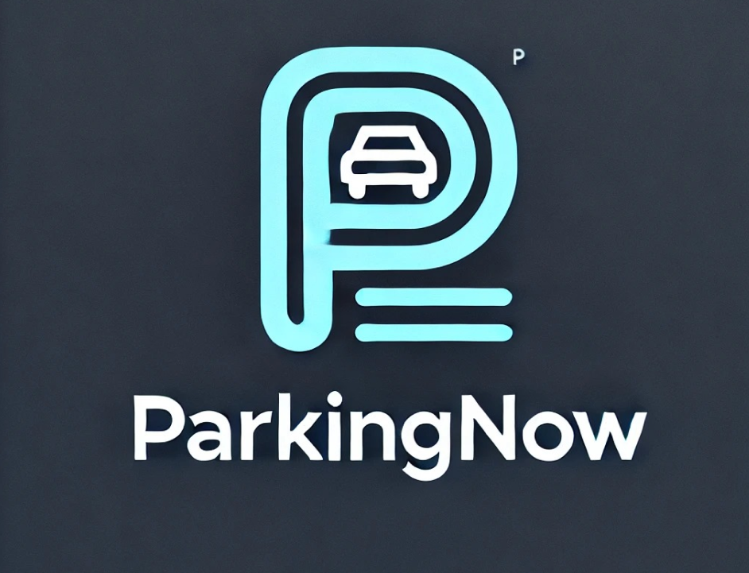                                                                                                                                                                          |                                                                                                          |                                                                                                                       |                                                                                                                                                 |
| ***Perfil***              | Overview                                                              | Es una aplicacion web que brinda la posibilidad de reservar espacios de estacionamiento en múltiples ciudades ademas que brinda la conexion entre los consumidores y dueños de estacionamientos               | Es una aplicacion web y movil que ofrece servicios de reserva de plazas de aparcamiento en  diversas ciudades de Europa y América Latina | Es una aplicacion web y movil que ofrece servicios de reserva de plazas de aparcamiento en  diversas ciudades de Europa y América Latina            | Es una aplicacion web y movil que ofrece servicios de reserva de plazas de aparcamiento en diversas ciudades de España principalmente, pero expandiéndose alrededor del mundo |
|                                   | ***Ventaja competitiva ¿Qué valor ofrece a los clientes?*** | Cancelación gratuita hasta con 24 horas de antelación de la reserva, inclusion de un sensor para el automovil y ser el puente entre los consumidores y dueños de playas de estacionamientos en zonas urbanas | Ofrece descuentos de hasta el 70% y no cobra gastos de gestión                                                                            | Permite más que solo pagar estacionamientos, sino gestionar multas y pagar parquímetros                                                             | La app incluye geolocalización y ofrece notificaciones a tiempo real                                                                                                           |
| ***Perfil de Marketing*** | ***Mercado objetivo***                                        | Personas que buscaban soluciones de estacionamiento en áreas urbanas congestionadas y personas dueñas de estacionamientos de playas.                                                                          | Personas que buscaban soluciones de estacionamiento en áreas urbanas congestionadas                                                       | Personas que buscaban soluciones de estacionamiento en áreas urbanas congestionadas                                                                  | Personas que buscaban soluciones de estacionamiento en áreas urbanas congestionadas                                                                                            |
|                                   | ***Estrategias de marketing***                                | Utiliza publicidad en línea a través de plataformas y redes sociales                                                                                                                                          | Utiliza publicidad en línea a través de plataformas y redes sociales                                                                     | Utiliza publicidad en línea, redes sociales y reciben promociones de influencers                                                                     | Utiliza publicidad en línea a través de plataformas y redes sociales                                                                                                          |
| ***Perfil de Producto***  | ***Productos & Servicios***                                   | Ofrece una serie de servicios relacionados con la reserva de plazas de aparcamiento en áreas urbanas y otros destinos.                                                                                         | Realizar servicios de parking en todo el territorio español y otras grandes ciudades del mundo                                            | Ofrece una serie de servicios relacionados con la reserva de plazas de aparcamiento en ciudades concurridas, seguimiento de multas y pagos sencillos. | Ofrece una serie de servicios relacionados con la reserva de plazas de aparcamiento en áreas urbanas y otros destinos                                                          |
|                                   | ***Precios & Costos***                                        | La plataforma es gratuita, pero se debe pagar las tarifas de estacionamiento correspondientes                                                                                                                   | La plataforma es gratuita, pero se debe pagar las tarifas de estacionamiento correspondientes y las suscripciones VIP.                     | La plataforma es gratuita pero se debe pagar las tarifas de estacionamiento, además de la existencia de tarifas especiales o descuentos              | La plataforma es gratuita, pero se debe pagar las tarifas de estacionamiento correspondientes.                                                                                  |
|                                   | ***Canales de distribución (Web y/o Móvil)***               | Web                                                                                                                                                                                                             | Web/Móvil                                                                                                                                 | Web/Móvil                                                                                                                                            | Web/Movil                                                                                                                                                                       |
| ***Análisis SWOT***      | ***Fortalezas***                                              | Implementa sensores de estacionamiento en los estacionamientos asociados, un objetivo más amplio que otras aplicaciones y soporte en tiempo real para los consumidores                                         | Parkimeter opera en múltiples ciudades de Europa y América Latina                                                                        | ElParking implementa seguimiento de multas y pagos a parte de los estacionamientos                                                                    | Aparcados opera en múltiples ciudades de Europa y Asia                                                                                                                         |
|                                   | ***Debilidades***                                             | La industria de reserva de estacionamientos en línea es muy competitiva .                                                                                                                                      | Varias empresas que proporcionan servicios similares                                                                                       | La industria de reserva de estacionamientos en línea es muy competitiva.                                                                             | Varias empresas que proporcionan servicios similares.                                                                                                                           |
|                                   | ***Oportunidades***                                           | A medida que las ciudades sigan creciendo, la demanda de servicios de reserva podría aumentar                                                                                                                  | La congestión del tráfico se vuelve más común, eso provocaría una alta demanda en la reserva de estacionamientos                      | En su país de origen, España, las personas en zonas urbanas van a tener que aprender más acerca de la app para poder vivir en comodidad.           | Tiene grandes posibilidades de expandir su mercado aun enfocándose en la reserva de estacionamientos en América Latina                                                        |
|                                   | ***Amenazas***                                                | Cambios en las políticas de movilidad urbana.                                                                                                                                                                  | Nuevas startups compitiendo por la misma base de usuarios.                                                                                 | Nuevas startups compitiendo por la misma base de usuarios.                                                                                            | Nuevas startups compitiendo por la misma base de usuarios.                                                                                                                      |

#### 2.1.2. Estrategias y tácticas frente a competidores

A continuacion, encontraremos la tabla de Matriz de FODA y C.A.M.E para poder analisar nuestrar estrategias a futuro para competir contra los competidores anteriormente mencionados.

| ***MATRIZ FODA y C.A.M.E***                                                                           | **Oportunidades:** La demanda de este servicio aumenta bastante con los años                                                                                                                                                                                                   | **Amenazas:** Cambios en la politica de mobilidad urbana                                                                                                                                                                                                                        |
| ------------------------------------------------------------------------------------------------------------- | ------------------------------------------------------------------------------------------------------------------------------------------------------------------------------------------------------------------------------------------------------------------------------------- | ------------------------------------------------------------------------------------------------------------------------------------------------------------------------------------------------------------------------------------------------------------------------------------- |
| **Fortalezas:** Innovacion, publico objetivo más amplio y soporte en tiempo real para los consumidores | La estrategia que podemos tomar en este caso seria la de dar el mejor soporte a los consumidores para que no vayan a otras aplicaciones, además que nuestra propuesta de sensores es algo poco visto que las personas encontraran llamativo y estaran dispuestos a aprender de ello. | Preveer todos estos posibles cambios en la politica gracias a un analisis más amplio de acuerdo al tema                                                                                                                                                                              |
| **Debilidades:** Mercado competitivo y nuevo                                                            | Aumentar la promocion de nuestra app y promocionar nuestra innovacion para que los usuarios puedan validarnos como la mejor opcion del mercado.                                                                                                                                       | Si bien, las politicas pueden afectarnos, a los otros competidores tambien, podemos diseñas campañas de marketing enfocadas a que lo que hacemos no necesita un cambio en la politica de la mobilidad urbana, sino, que mejoramos la gestion de esta en distintos lugares del pais. |

### 2.2. Entrevistas

Esta sección se centra en la recopilación de información mediante entrevistas a representantes de los segmentos objetivo, con el fin de entender sus necesidades y expectativas en relación al servicio.

#### 2.2.1. Diseño de entrevistas

Incluye la elaboración de preguntas principales y complementarias dirigidas a cada segmento, considerando aspectos demográficos, características de personalidad y preferencias tecnológicas para construir perfiles precisos de los usuarios.

**Segmento objetivo \#1: Conductores Urbanos Frecuentes**

**Preguntas demográficas:**

- ¿Cuál es tu nombre?
- ¿Cuál es tu edad?
- ¿Dónde vives?
- ¿A qué te dedicas?
- ¿Cuáles consideras que son tus principales habilidades?

**Preguntas principales:**

* ¿Con qué frecuencia necesitas estacionamiento en la ciudad?
* ¿Cuánto tiempo dedicas normalmente a buscar estacionamiento?
* ¿Utilizas actualmente alguna aplicación o servicio para encontrar estacionamiento?
* ¿Qué tan importante es para ti conocer la disponibilidad de estacionamiento en tiempo real?
* ¿Estarías dispuesto/a a pagar una tarifa adicional por garantizar un espacio de estacionamiento reservado?
* ¿Qué consideras más importante al elegir un estacionamiento: costo, proximidad, o seguridad?
* ¿Te gustaría recibir recomendaciones de rutas hacia el estacionamiento más cercano basado en el tráfico en tiempo real?

**Preguntas complementarias:**

* ¿Has tenido experiencias frustrantes buscando estacionamiento en la ciudad?
* ¿Qué mejoras te gustaría ver en los servicios de estacionamiento que utilizas actualmente?

**Segmento objetivo \#2: Dueños de playas de estacionamientos**

**Preguntas demográficas:**

- ¿Cuál es tu nombre?
- ¿Cuál es tu edad?
- ¿Dónde vives?
- ¿A qué te dedicas?
- ¿Cuáles consideras que son tus principales habilidades?

**Preguntas principales:**

* ¿Consideras sencillo el proceso de gestionamiento de espacios en tu estacionamiento?
* ¿Qué tan importante es para ti contar con información en tiempo real sobre los espacios disponibles?
* ¿Utilizas algún sistema digital para administrar los pagos y reservas de los espacios de estacionamiento?
* ¿Qué beneficios ves en la posibilidad de automatizar el proceso de reserva y pago de los espacios de estacionamiento?
* ¿Qué tan relevante es para ti ofrecer opciones de pago seguras y rápidas a tus clientes?
* ¿De qué manera crees que la integración de una app que gestione datos y pagos podría mejorar la eficiencia de tu negocio?

**Preguntas complementarias:**

* ¿Cuáles son los principales desafíos que enfrentas al administrar tu estacionamiento?
* ¿Qué funcionalidades adicionales te gustaría que una app ofreciera para facilitar la gestión de tu negocio?
* ¿Te gustaría recibir reportes o análisis sobre la ocupación y rotación de vehículos en tu estacionamiento?

#### 2.2.2. Registro de entrevistas

**Segmento objetivo \#1: Conductores Urbanos Frecuentes**

**Segmento objetivo \#2: Dueños de playas de estacionamientos**

#### 2.2.3. Análisis de entrevistas

De acuerdo con la información recopilada de las entrevistas, realizamos el siguiente análisis de entrevistas:

Segmento objetivo \#1:

**Hallazgos:**

* La necesidad de estacionamiento varía: algunos lo requieren con frecuencia, mientras que otros solo ocasionalmente.
* El tiempo dedicado a buscar estacionamiento depende de la zona.
* No se utilizan aplicaciones para encontrar estacionamiento.
* Es muy importante conocer la disponibilidad de estacionamiento antes de llegar.
* Se está dispuesto a pagar tarifas adicionales para reservar un espacio, siempre y cuando estas no sean demasiado altas.
* Factores como el costo, la proximidad y la seguridad son clave al elegir un lugar para estacionar.
* Existen frustraciones comunes relacionadas con la búsqueda de estacionamiento, como perder un espacio o encontrar lugares inadecuados.
* Se desea recibir recomendaciones de rutas para ahorrar tiempo y la opción de que alguien estacione el auto por uno.
* Se valoran los avisos en tiempo real sobre la liberación de espacios cercanos y las notificaciones sobre movimientos sospechosos en el área de estacionamiento.

Segmento objetivo \#2:

**Hallazgos:**

* La gestión de los estacionamientos es generalmente sencilla debido a la baja cantidad de espacios, pero la organización y el manejo del tiempo pueden ser complicados.
* Es importante contar con información en tiempo real sobre la disponibilidad de los espacios para evitar revisiones constantes del estacionamiento.
* Se utilizan aplicaciones de pago como Yape, pero no se emplean aplicaciones para la reserva de espacios.
* La automatización del proceso se ve como una solución clave para ahorrar tiempo, evitar llamadas innecesarias y mejorar la organización de pagos.
* La seguridad es crucial tanto para los clientes como para los dueños, especialmente cuando los espacios se encuentran en áreas residenciales.
* Se valora la posibilidad de acceder a información importante de los clientes (como nombre y teléfono) para garantizar mayor seguridad.

**Conclusiones de ambos segmentos:**

Los resultados del **segmento 1** indican que, aunque las necesidades de estacionamiento varían en frecuencia, hay un consenso en la importancia de conocer la disponibilidad de espacios antes de llegar. La disposición a pagar tarifas adicionales es alta, siempre que estas sean razonables. Los factores de costo, proximidad y seguridad son cruciales al elegir un lugar para estacionar. Existen frustraciones comunes con la búsqueda de estacionamiento, y se valora la tecnología para mejorar la experiencia, como recibir avisos en tiempo real y recomendaciones de rutas. La opción de asistencia para estacionar también es deseada. Por otro lado, en el **segmento 2**, los dueños de playas de estacionamiento encuentran la gestión de pocos espacios generalmente sencilla, aunque la organización y el manejo del tiempo pueden ser desafiantes. Consideran clave contar con información en tiempo real para evitar revisiones constantes y valoran la automatización como una herramienta para ahorrar tiempo y mejorar la eficiencia en pagos. La seguridad, tanto para clientes como para ellos mismos, es esencial, especialmente en áreas residenciales, y ven útil acceder a datos relevantes de los usuarios para aumentar esa seguridad

**Entrevista completa:**

**Análisis por medio de herramientas estadísticas:**

Segmento objetivo 1: [https://forms.gle/Lo3Z69GnkyYDcaAYA](https://forms.gle/Lo3Z69GnkyYDcaAYA)

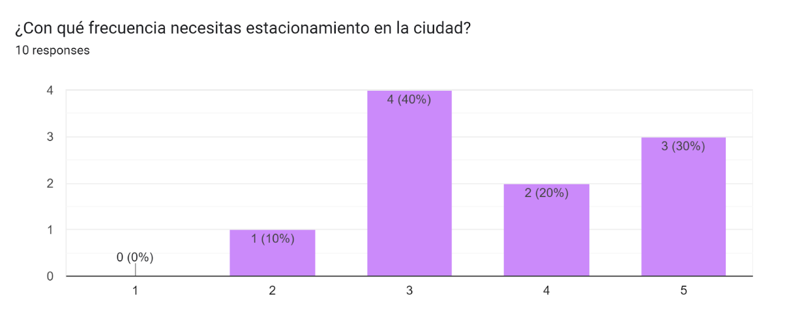

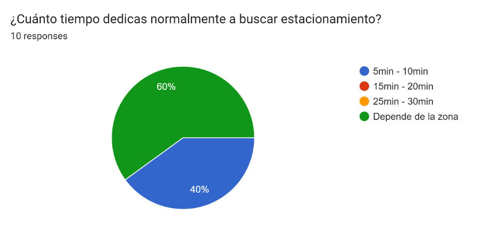

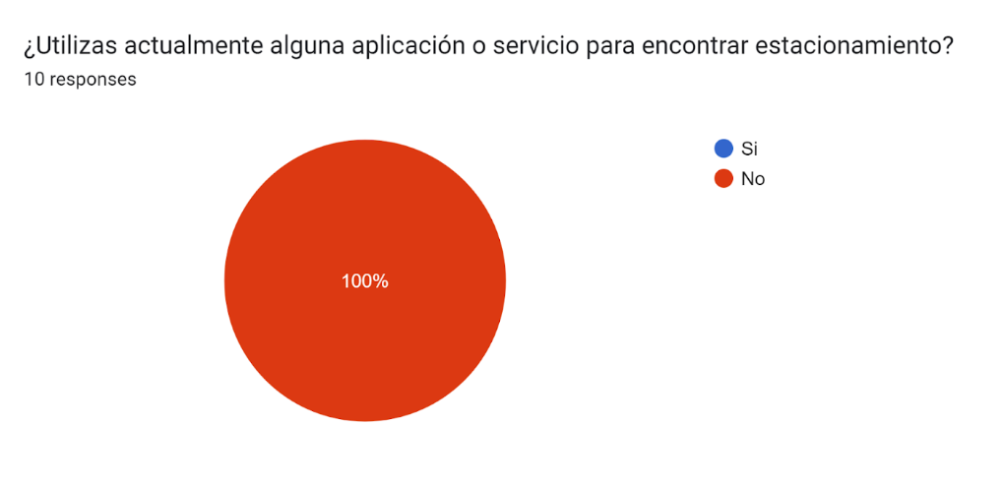

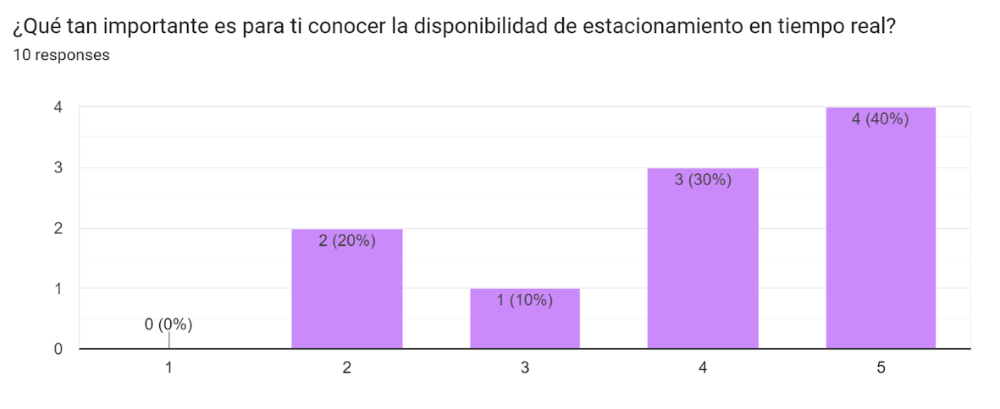

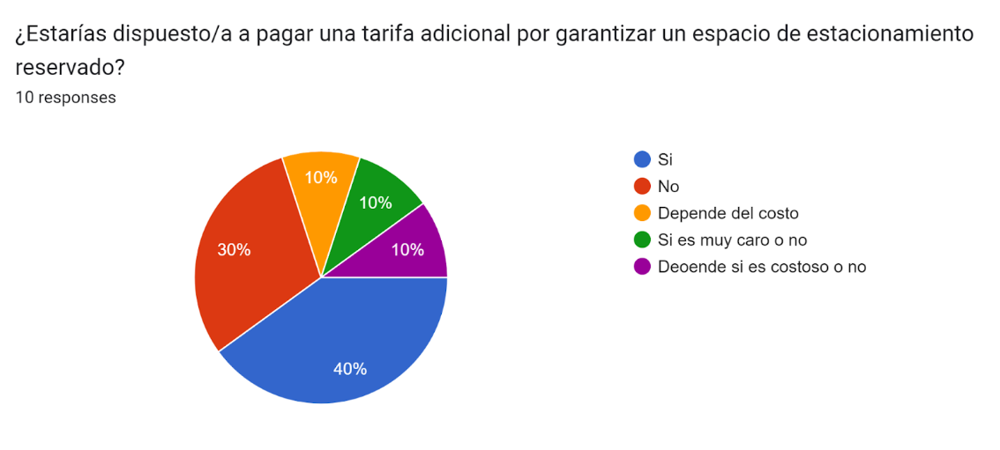

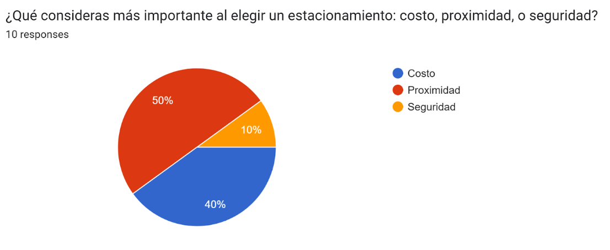

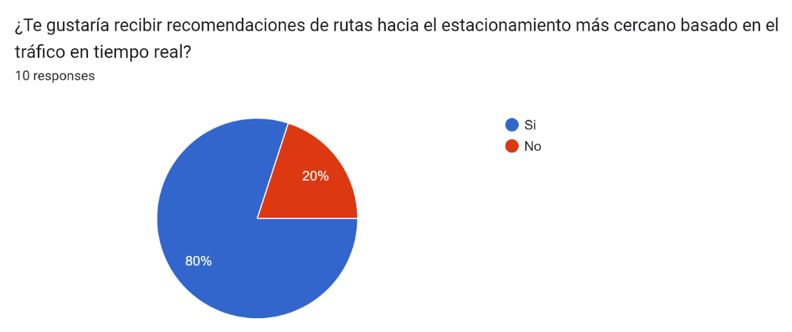

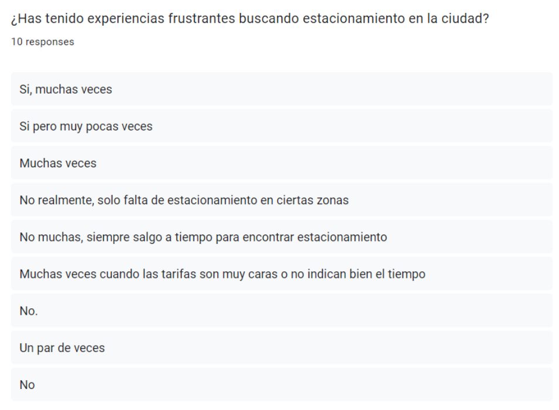

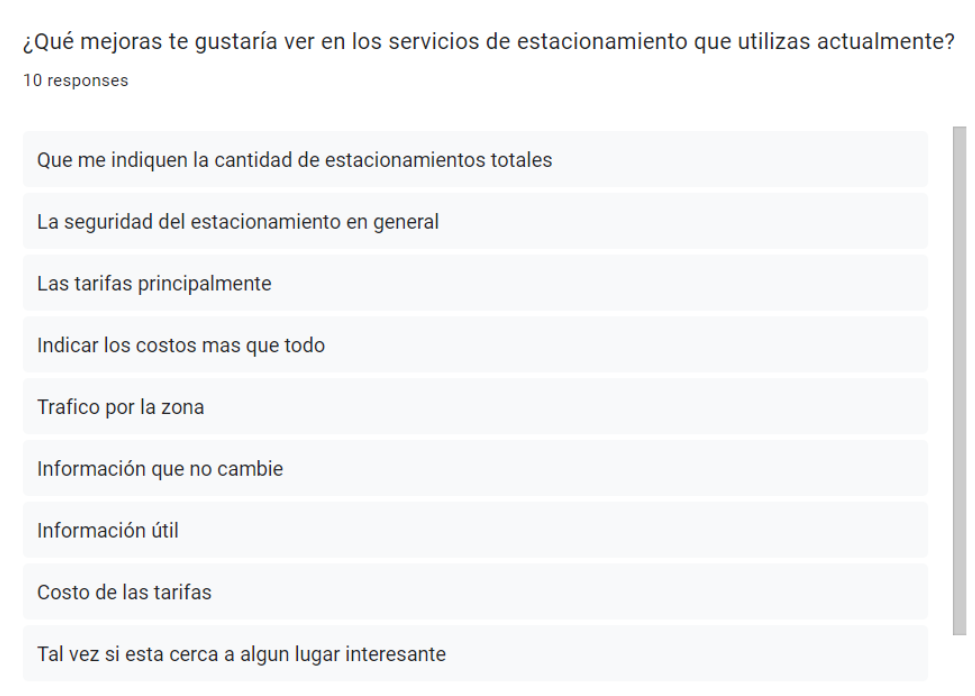

Segmento objetivo 2: [https://forms.gle/pCNNRar5TBzSPoX38](https://forms.gle/pCNNRar5TBzSPoX38)

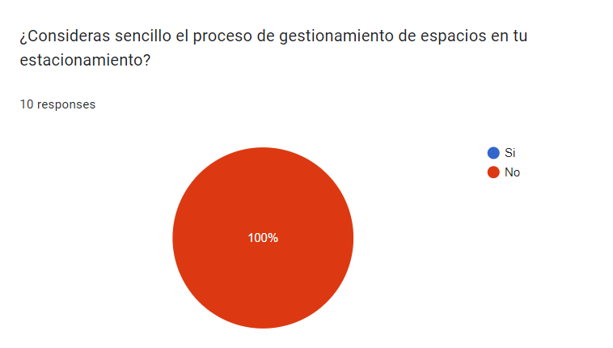

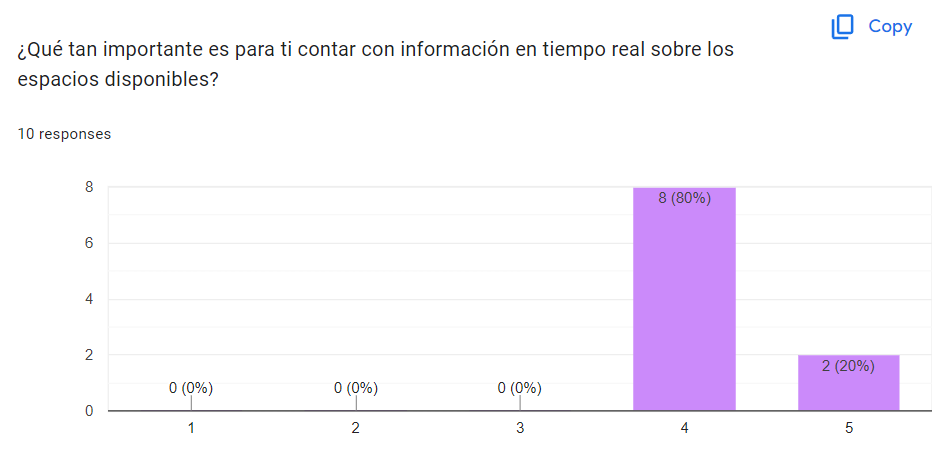

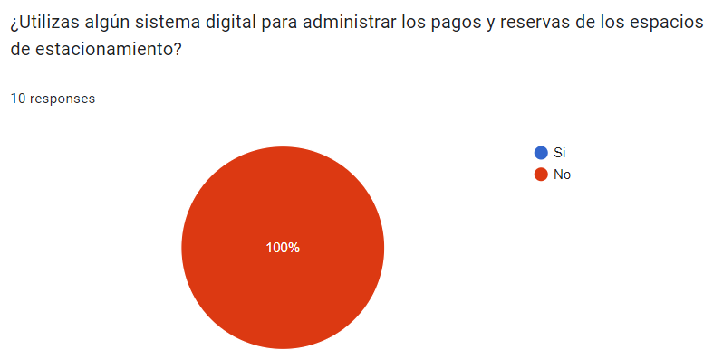

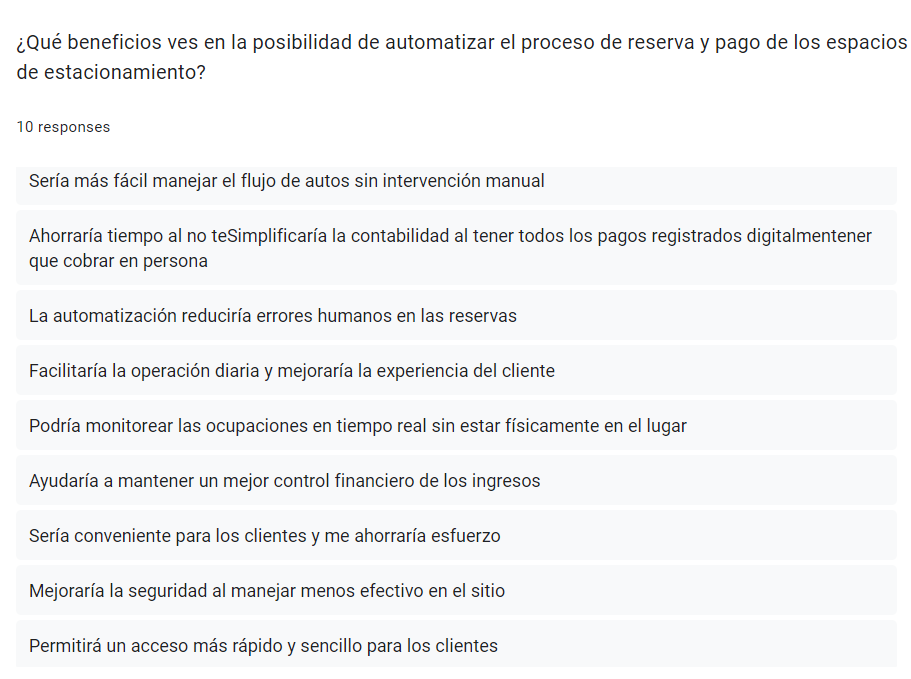

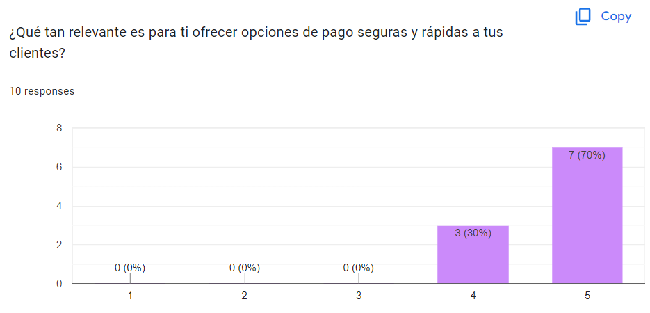

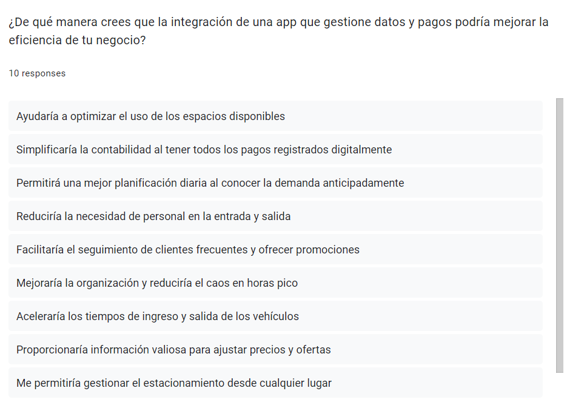

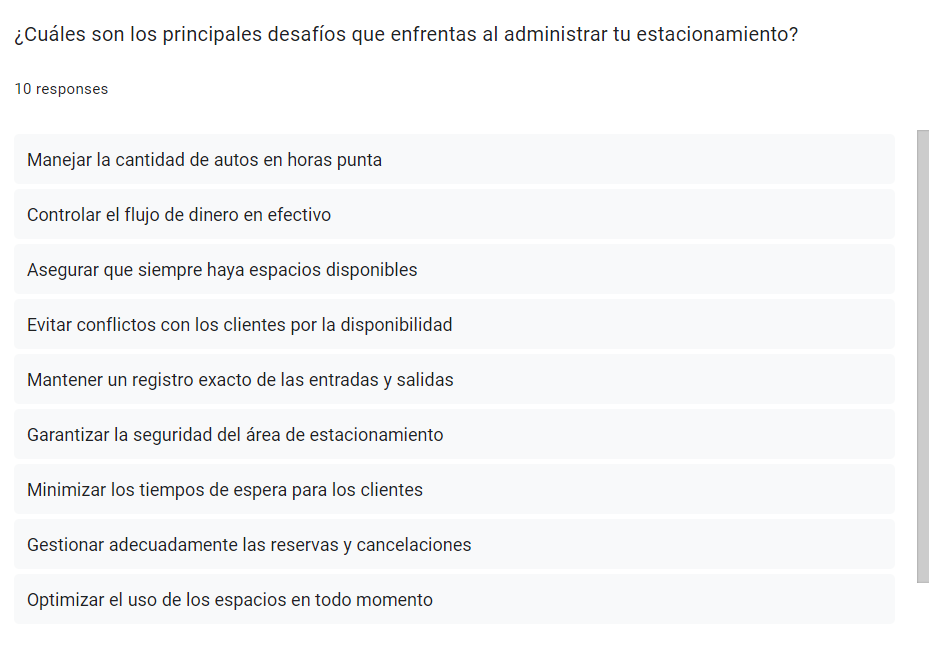

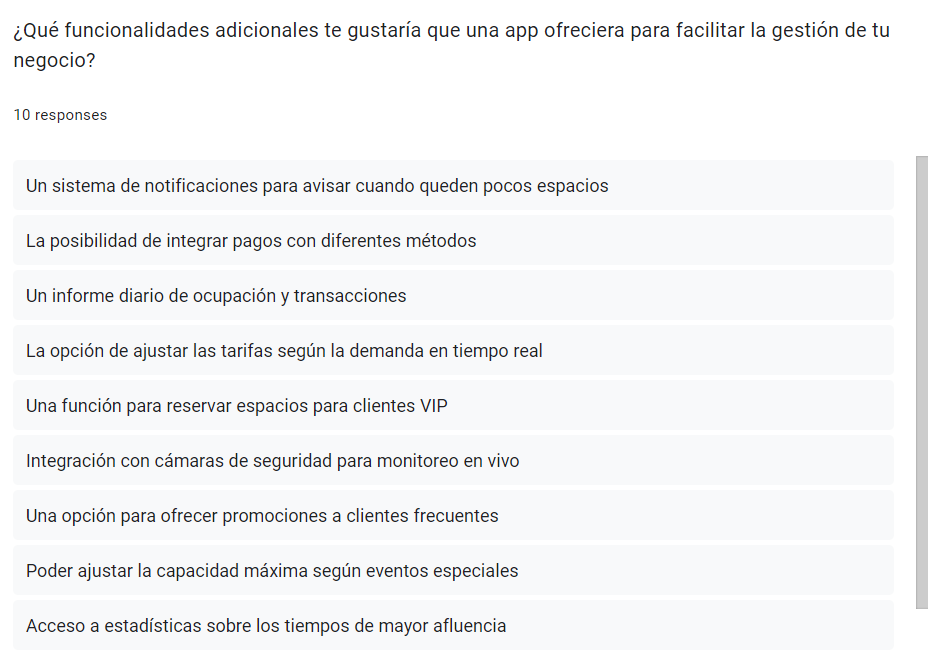

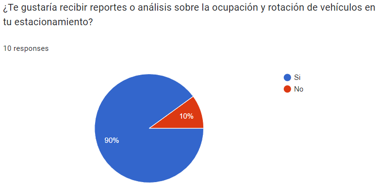

### 2.3. Needfinding

En esta sección se presentarán los artefactos generados a partir del proceso de recopilación llevado a cabo en los segmentos objetivos. Este proceso culmina con la creación de los User Personas, la User Task Matrix, los User Journey Maps, el Empathy Mapping y el As-Is Scenario Mapping.

### 2.3.1. User Personas

En esta sección del documento, se presentan perfiles ficticios que representan a los grupos de interés identificados y que fueron objeto de entrevistas. La información proporcionada incluye datos demográficos, rasgos de personalidad, motivaciones, preferencias, metas, desafíos y comportamientos típicos. Estos detalles están basados en las entrevistas realizadas previamente. Se han utilizado herramientas de UXPressia para facilitar la elaboración de estos perfiles.

###### User Person para Conductores Urbanos

La "User Persona" de Anna Pacheco representa a conductores urbanos que necesitan estacionamientos rápidos y eficientes cerca de sus destinos. Anna es una organizadora de eventos de 29 años, motivada por la comodidad y la rapidez en sus desplazamientos. Se frustra con la falta de disponibilidad de estacionamientos y busca soluciones prácticas y transparentes.

###### User Person para Dueños de playa de estacionamientos

La "User Persona" de Luis Cordova representa a los dueños de playa de estacionamientos interesados en mejorar la gestión y aumentar ingresos. Luis, de 26 años y dueño de un estacionamiento, utiliza tecnología para optimizar la ocupación y reducir tiempos de espera. Sus objetivos incluyen la fidelización de clientes y la expansión del negocio, pero enfrenta frustraciones con problemas tecnológicos y altos costos operativos.

## 2.3.2. User Task Matrix

En el User Task Matrix hemos identificado las actividades que realizan nuestros dos segmentos y hemos evaluado la importancia de cada una de estas tareas para cada segmento.

### Indicadores de Importancia:

- ALTA
- MEDIA
- BAJA

### Indicadores de Frecuencia:

- ALTA
- MEDIA
- BAJA

| **Segmento Objetivo**          | **Tarea**                                                                      | **Frecuencia** | **Importancia** |
| ------------------------------------ | ------------------------------------------------------------------------------------ | -------------------- | --------------------- |
| Conductores Urbanos Frecuentes       | Buscar estacionamientos disponibles                                                  | Media                | Alta                  |
| Conductores Urbanos Frecuentes       | Comparar precios de estacionamientos                                                 | Alta                 | Media                 |
| Conductores Urbanos Frecuentes       | Reservar estacionamientos con anticipación                                          | Media                | Alta                  |
| Conductores Urbanos Frecuentes       | Pagar por estacionamiento a través de la aplicación                                | Alta                 | Alta                  |
| Conductores Urbanos Frecuentes       | Recibir direcciones al estacionamiento reservado                                     | Alta                 | Alta                  |
| Conductores Urbanos Frecuentes       | Filtrar estacionamientos por criterios (precio, seguridad, etc.)                     | Alta                 | Alta                  |
| Conductores Urbanos Frecuentes       | Recibir notificaciones sobre descuentos y ofertas                                    | Media                | Baja                  |
| Conductores Urbanos Frecuentes       | Verificar disponibilidad de estacionamiento en tiempo real                           | Alta                 | Alta                  |
| Conductores Urbanos Frecuentes       | Consultar historial de estacionamientos utilizados                                   | Media                | Baja                  |
| Dueños de Playa de Estacionamientos | Administrar y actualizar la disponibilidad de espacios                               | Alta                 | Alta                  |
| Dueños de Playa de Estacionamientos | Ajustar precios de los espacios de estacionamiento                                   | Media                | Alta                  |
| Dueños de Playa de Estacionamientos | Gestionar reservas de estacionamientos                                               | Alta                 | Alta                  |
| Dueños de Playa de Estacionamientos | Procesar pagos de estacionamiento a través de la aplicación                        | Alta                 | Media                 |
| Dueños de Playa de Estacionamientos | Revisar y ajustar las características del estacionamiento (precio, seguridad, etc.) | Media                | Alta                  |
| Dueños de Playa de Estacionamientos | Revisar reportes de uso y disponibilidad                                             | Media                | Media                 |
| Dueños de Playa de Estacionamientos | Recibir y gestionar comentarios y valoraciones de los usuarios                       | Baja                 | Media                 |
| Dueños de Playa de Estacionamientos | Promocionar descuentos y ofertas especiales                                          | Media                | Media                 |
| Dueños de Playa de Estacionamientos | Consultar el historial de transacciones y reservas                                   | Baja                 | Media                 |

A través del User Task Matrix, podemos identificar las frecuencias e importancias entre los diferentes segmentos que presentamos y usar esta información como guía.

#### Conductores Urbanos:

Para los usuarios, las tareas que presentan mayor frecuencia son:

- Pagar por estacionamiento a través de la aplicación.
- Recibir direcciones al estacionamiento reservado.
- Filtrar estacionamientos por criterios (precio, seguridad, etc.).
- Verificar disponibilidad de estacionamiento en tiempo real.

Estas tareas son cruciales para mejorar la experiencia del usuario en la búsqueda y uso de estacionamientos.

Para los usuarios, las tareas que presentan mayor importancia son:

- Pagar por estacionamiento a través de la aplicación.
- Recibir direcciones al estacionamiento reservado.
- Filtrar estacionamientos por criterios (precio, seguridad, etc.).
- Verificar disponibilidad de estacionamiento en tiempo real.

Estas tareas son importantes porque aseguran una experiencia de estacionamiento eficiente y satisfactoria, desde la búsqueda hasta el pago y la dirección.

#### Dueños de playa de Estacionamientos:

Para los dueños de estacionamientos, las tareas que presentan mayor frecuencia son:

- Administrar y actualizar la disponibilidad de espacios.
- Gestionar reservas de estacionamientos.
- Procesar pagos de estacionamiento a través de la aplicación.
- Revisar y ajustar las características del estacionamiento (precio, seguridad, etc.).

Estas tareas son esenciales para la gestión efectiva de sus espacios de estacionamiento y para asegurar que los usuarios tengan una experiencia positiva.

Para los dueños de estacionamientos, las tareas que presentan mayor importancia son:

- Administrar y actualizar la disponibilidad de espacios.
- Ajustar precios de los espacios de estacionamiento.
- Revisar reportes de uso y disponibilidad.
- Revisar y ajustar las características del estacionamiento (precio, seguridad, etc.).

Estas tareas son importantes porque permiten a los dueños optimizar la gestión de sus espacios y responder a las demandas del mercado de manera efectiva.

#### Diferencias:

Al analizar ambos segmentos objetivo, se observa que los usuarios están enfocados en la eficiencia y la comodidad en el proceso de estacionamiento, mientras que los dueños de estacionamientos se concentran en la gestión y optimización de sus espacios. Aunque cada segmento tiene objetivos distintos, ambos se benefician de un sistema que facilite la disponibilidad, la gestión y la experiencia de estacionamiento.

#### 2.3.3. User Journey Mapping

En esta sección, hemos creado los mapas de recorrido del usuario para cada tipo de usuario (Conductor Urbano y dueños de playa  de estacionamiento). Para el cliente, el proceso comienza con la búsqueda de un espacio de estacionamiento, continúa con la selección y reserva de un espacio, el pago a través de la aplicación, y la obtención de direcciones hacia el lugar reservado. Finalmente, el cliente llega al espacio y lo utiliza. Este recorrido revela las metas, desafíos, oportunidades y pasos cruciales en su experiencia. Por otro lado, desde la perspectiva del propietario de estacionamiento, el enfoque está en gestionar la disponibilidad de espacios, ajustar los precios, procesar las reservas, y asegurarse de que el proceso de pago y uso se realice de manera fluida. El objetivo es ofrecer una experiencia satisfactoria que incentive a los clientes a recomendar el espacio y considerar al propietario como una opción confiable para futuros estacionamientos.

###### User Journey Mapping para Conductores Urbanos

Este "User Journey Mapping" muestra las etapas que un conductor urbano atraviesa al usar una app de estacionamiento, desde descubrir la app hasta evaluar su experiencia. Identifica puntos de contacto (como apps y GPS), problemas (como opciones confusas) y oportunidades para mejorar la usabilidad y la información de la app.

###### User Journey Mapping para Dueños de playa de Estacionamientos

Este "User Journey Mapping" para dueños de estacionamientos describe las etapas de uso de una app de gestión, desde encontrar la herramienta adecuada y configurarla, hasta su instalación y seguimiento para optimización. Destaca desafíos en la selección de la app y la comprensión de sus funciones, con oportunidades para mejorar la personalización, la facilidad de uso y el soporte técnico.

#### 2.3.4. Empathy Mapping

A continuación se pueden apreciar los Empathy Mapping de los segmentos objetivos.

### Segmento objetivo: Conductores Urbanos Frecuentes

Este "Empathy Map" representa a conductores urbanos frecuentes que enfrentan problemas para encontrar estacionamiento. Expresa sus frustraciones por la falta de opciones disponibles y su deseo de contar con herramientas que les brinden información en tiempo real sobre espacios seguros y accesibles.

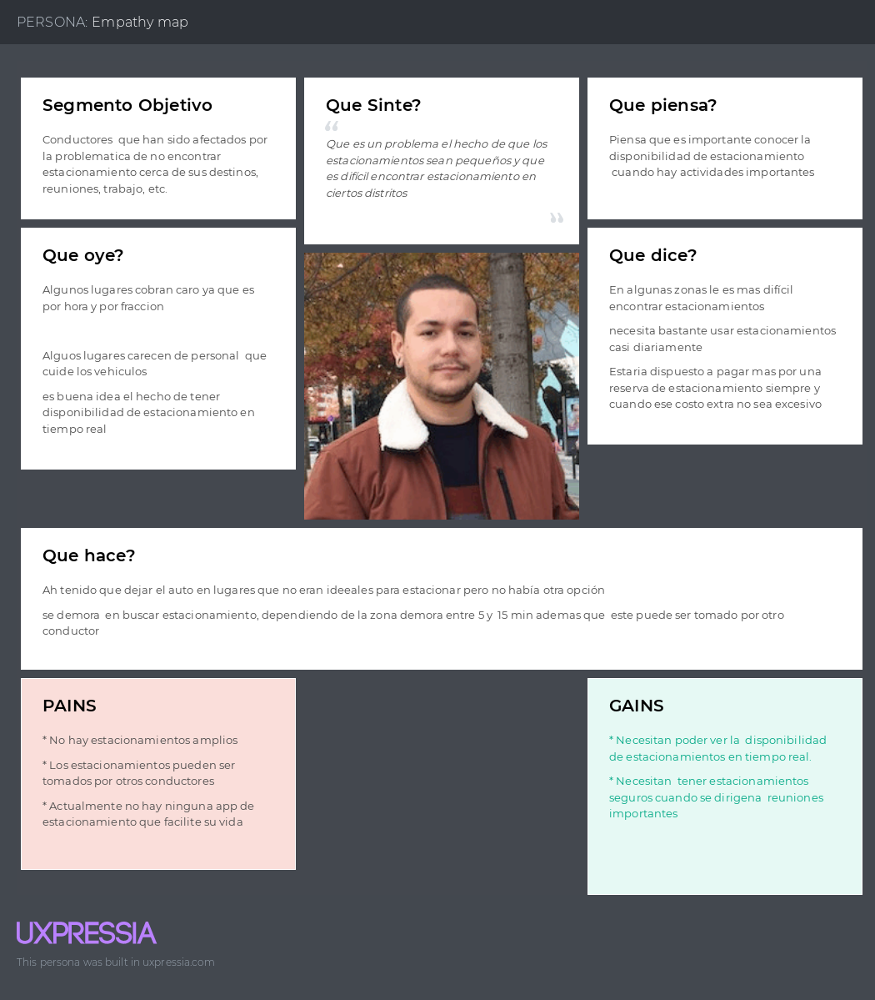

### Segmento objetivo: Dueños de playas de estacionamientos

El mapa de empatía para **Dueños de Playas de Estacionamientos** identifica sus necesidades y preocupaciones al gestionar espacios de estacionamiento, destacando oportunidades para optimizar operaciones y mejorar la experiencia del cliente con PARKINGNOW.

#### 2.3.5. As-is Scenario Mapping

El As-Is nos proporciona un análisis visual de los escenarios actuales para identificar oportunidades de mejora en la experiencia del usuario.

### Segmento Conductores Urbanos Frecuentes

El "As-is Scenario Mapping" para **Conductores Urbanos Frecuentes** resalta los desafíos y mejoras necesarias en la experiencia de estacionamiento, permitiendo optimizar las soluciones de PARKINGNOW.

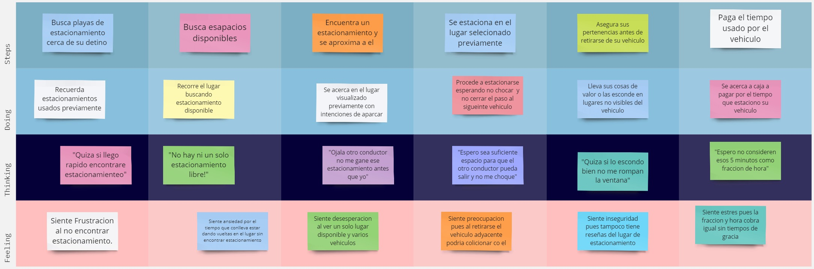

### Segmento Dueños de playas de estacionamientos

El "As-is Scenario Mapping" para **Dueños de Playas de Estacionamientos** identifica sus desafíos y necesidades, desde la preparación del espacio hasta la gestión post-servicio, ayudando a mejorar la eficiencia y satisfacción en la gestión de sus estacionamientos con PARKINGNOW.

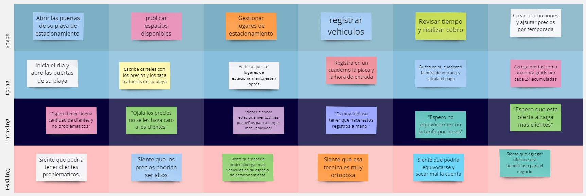

### 2.4. Ubiquitous Language

**Espacio de Estacionamiento:** Un lugar específico dentro de un estacionamiento donde un vehículo puede ser aparcado.

**Reserva:** La acción de reservar un espacio de estacionamiento específico por un periodo de tiempo determinado, garantizando su disponibilidad.

**Disponibilidad en Tiempo Real:** Información actualizada instantáneamente sobre los espacios de estacionamiento libres y ocupados.

**Geolocalización:** El uso de tecnologías de ubicación para determinar la posición geográfica del usuario y mostrar opciones de estacionamiento cercanas.

**Mapa Interactivo:** Un mapa digital dentro de la aplicación que muestra la ubicación de estacionamientos disponibles en tiempo real.

**Tarifas por Hora:** El costo asociado con la reserva de un espacio de estacionamiento, calculado por horas de uso.

**Pago en Línea:** El proceso de completar el pago para una reserva a través de métodos de pago digitales, como tarjetas de crédito, débito o billeteras electrónicas.

**Historial de Reservas:** Un registro de todas las reservas pasadas realizadas por el usuario, que incluye detalles como fecha, hora, ubicación y costo.

**Notificaciones en Tiempo Real:** Alertas enviadas al usuario para informarles sobre cambios en la disponibilidad, confirmaciones de reserva, o vencimientos de tiempo de estacionamiento.

**Usuario:** Persona que utiliza la aplicación para buscar, reservar y pagar por espacios de estacionamiento.

**Propietario de Estacionamiento:** Persona o entidad que posee y administra un estacionamiento y que ofrece espacios para la reserva a través de la aplicación.

**Administrador del Sistema:** Persona responsable de la gestión y mantenimiento de la aplicación, incluyendo la supervisión de la disponibilidad de los espacios y la gestión de usuarios y datos.

**Check-in:** El proceso de confirmar la llegada al espacio de estacionamiento reservado, activando el tiempo de uso.

**Check-out:** El proceso de marcar la salida del espacio de estacionamiento, finalizando el tiempo de uso y actualizando la disponibilidad.

**Zona de Estacionamiento:** Una área geográfica específica que contiene múltiples espacios de estacionamiento, gestionada dentro de la aplicación.

**Tiempo de Gracia:** Un periodo corto de tiempo permitido antes o después de la reserva, en el cual el usuario puede llegar sin incurrir en cargos adicionales.

**Multa por Exceso de Tiempo:** Un cargo adicional aplicado si un usuario excede el tiempo de estacionamiento reservado.

**Sistema de Validación:** Mecanismo para verificar que un vehículo tenga una reserva válida para un espacio de estacionamiento específico.

**Interfaz de Usuario (UI):** La parte visual de la aplicación con la que los usuarios interactúan para realizar reservas, hacer pagos y recibir notificaciones.

**Backend:** Infraestructura que aloja y gestiona los datos de la aplicación, incluyendo la disponibilidad de espacios y la información de los usuarios.

## Capítulo III: Requirements Specification

### 3.1. To-Be Scenario Mapping

### 3.2. User Stories

## 3.3. Impact Mapping

### 3.4. Product Backlog

## Capítulo IV: Product Design

### 4.1. Style Guidelines

En este apartado, se mostrará de manera organizada los estilos y herramientas que se usarán para diseñar nuestra solución.

#### 4.1.1. General Style Guidelines

#### 4.1.2. Web Style Guidelines

### 4.2. Information Architecture

#### 4.2.1. Organization Systems

#### 4.2.2. Labeling Systems

#### 4.2.3. SEO Tags and Meta Tags

#### 4.2.4. Searching Systems

#### 4.2.5. Navigation Systems

### 4.3. Landing Page UI Design

#### 4.3.1. Landing Page Wireframe

#### 4.3.2. Landing Page Mock-up

### 4.4. Web Applications UX/UI Design

#### 4.4.1. Web Applications Wireframes

#### 4.4.2. Web Applications Wireflow Diagrams

#### 4.4.3. Web Applications Mock-ups

#### 4.4.4. Web Applications User Flow Diagrams

### 4.5. Web Applications Prototyping

### 4.6. Domain-Driven Software Architecture

#### 4.6.1. Software Architecture Context Diagram

#### 4.6.2. Software Architecture Container Diagrams

#### 4.6.3. Software Architecture Components Diagrams

### 4.7. Software Object-Oriented Design

#### 4.7.1. Class Diagrams

### 4.8. Database Design

#### 4.8.1. Database Diagram

### Conclusiones y recomendaciones

El proyecto PARKINGNOW ha alcanzado avances significativos en la creación de una solución tecnológica integral para resolver los problemas de estacionamiento en las ciudades. Al combinar sensores infrarrojos de detección en tiempo real con una plataforma intuitiva para los usuarios, PARKINGNOW no solo optimiza la ocupación de los espacios de estacionamiento, sino que también facilita el día a día de los conductores urbanos. Esta solución ha demostrado ser eficaz tanto en la reducción de tiempos de búsqueda como en la mejora de la rentabilidad para los dueños de playas de estacionamiento, mostrando un balance ideal entre tecnología y experiencia del usuario.

A lo largo del desarrollo, se ha priorizado un enfoque en la automatización, lo que ha permitido la integración fluida con los sistemas de gestión de estacionamientos ya existentes. Las entrevistas de validación con usuarios y pruebas de campo han confirmado que la solución no solo cumple con las expectativas iniciales, sino que supera las necesidades de los principales actores involucrados. La aplicación no solo resuelve el problema de encontrar estacionamiento, sino que contribuye al alivio del tráfico urbano y a una gestión más eficiente de los recursos, alineándose con los objetivos de sostenibilidad a largo plazo.

PARKINGNOW tiene el potencial de consolidarse como un referente en la gestión de estacionamientos urbanos, especialmente en grandes ciudades donde los problemas de tráfico y la falta de espacios de estacionamiento representan un desafío diario. La plataforma ha mostrado una capacidad destacada para escalar y adaptarse a diferentes contextos, tanto en términos geográficos como en la evolución tecnológica.

**Recomendaciones:**

1. **Expansión de funcionalidades:** Se recomienda que PARKINGNOW continúe invirtiendo en el desarrollo de nuevas características que agreguen valor para los usuarios y propietarios de estacionamientos. Esto podría incluir la integración de sistemas de pago automatizados, alertas en tiempo real sobre disponibilidad de espacios y la mejora en la personalización de la experiencia del usuario a través de análisis predictivos de patrones de uso. Además, el uso de tecnología avanzada, como inteligencia artificial para pronósticos de ocupación, podría posicionar aún más a PARKINGNOW como un líder en la industria.
2. **Expansión geográfica y sectorial:** Con el éxito demostrado en los primeros mercados, PARKINGNOW debería buscar expandirse a otras ciudades con alta demanda de estacionamiento y problemas recurrentes de tráfico. Además, explorar nuevas oportunidades en sectores específicos, como aeropuertos, centros comerciales y eventos masivos, podría ampliar aún más el mercado objetivo de la plataforma.
3. **Estrategia de marketing y educación:** Para aumentar la adopción de la plataforma, es clave diseñar una campaña de marketing digital dirigida tanto a conductores como a dueños de estacionamientos. El uso de testimonios de usuarios satisfechos y estudios de caso concretos que demuestren la reducción de tiempo y costos puede ser una herramienta eficaz para atraer nuevos usuarios. También es importante educar al público objetivo sobre el impacto positivo que tiene el uso de PARKINGNOW en la mejora del tráfico y la sostenibilidad urbana.
4. **Monitoreo y análisis continuo:** A medida que la plataforma crece, es esencial implementar sistemas de análisis continuo de los datos generados por los usuarios y los espacios de estacionamiento. El análisis de grandes volúmenes de datos permitirá la identificación temprana de problemas y la adaptación rápida a las necesidades cambiantes del mercado. Además, este enfoque de mejora continua garantizará que la experiencia del usuario siga siendo óptima y que el servicio mantenga su competitividad en el tiempo.
5. **Sostenibilidad y responsabilidad social:** A medida que el impacto de PARKINGNOW crece, es recomendable enfocarse aún más en su papel dentro del ecosistema de movilidad sostenible. Iniciativas como reducir la huella de carbono de los conductores mediante la disminución de tiempo en busca de estacionamiento y la colaboración con proyectos de ciudades inteligentes posicionarán a PARKINGNOW no solo como una empresa rentable, sino también como un agente clave en la sostenibilidad urbana.

# Bibliografía

1. **ICCSI**. (2023, 12 de marzo). *Estacionamiento inteligente con sensores: Revolución en estacionamientos*. ICCSI. Recuperado el 6 de septiembre de 2024, de [https://iccsi.com.ar/estacionamiento-inteligente-con-sensores](https://iccsi.com.ar/estacionamiento-inteligente-con-sensores)
2. **Conducimos contigo**. (s.f.). *Elparking.com*. Recuperado el 1 de septiembre de 2024, de [https://elparking.com/](https://elparking.com/)
3. **InnovaTech**. (2023, 15 de junio). *Smart Parking IoT: Descubre cómo funciona*. InnovaTech. Recuperado el 6 de septiembre de 2024, de [https://www.innova-tech.mx/smart-parking-iot](https://www.innova-tech.mx/smart-parking-iot)
4. **People, S.**. (s.f.). *App Aparcados*. Apk2gestion.com. Recuperado el 2 de septiembre de 2024, de [https://apk2gestion.com/es/servicios/conoce-nuestra-app](https://apk2gestion.com/es/servicios/conoce-nuestra-app)
5. **Reserva de parking - Parkimeter**. (s.f.). *Parkimeter.com*. Recuperado el 3 de septiembre de 2024, de [https://parkimeter.com/es?srsltid=AfmBOoqJCDlJN_hdtP3dMuF6fXWF8B1PytqQ2hWnVsgR7rEAH4a00y3P](https://parkimeter.com/es?srsltid=AfmBOoqJCDlJN_hdtP3dMuF6fXWF8B1PytqQ2hWnVsgR7rEAH4a00y3P)
6. **Sernauto**. (s.f.). *Tipos de sensores de los vehículos: Qué función cumplen*. Sernauto. Recuperado el 6 de septiembre de 2024, de [https://www.sernauto.es/blog/tipos-de-sensores-de-losvehiculos-que-funcion-cumplen/](https://www.sernauto.es/blog/tipos-de-sensores-de-losvehiculos-que-funcion-cumplen/)
7. **Propuesta País**. (2023, 22 de julio). *La necesidad de una política de estacionamiento vehicular en Lima Metropolitana*. Propuesta País. Recuperado el 6 de septiembre de 2024, de [https://propuestapais.pe/noticia/la-necesidad-de-una-politica-de-estacionamiento-vehicular-en-lima-metropolitana/](https://propuestapais.pe/noticia/la-necesidad-de-una-politica-de-estacionamiento-vehicular-en-lima-metropolitana/)
8. **Intertraffic**. (2023, 28 de junio). *Revolucionando las experiencias de estacionamiento: Las últimas soluciones inteligentes para un estacionamiento eficiente*. Intertraffic. Recuperado el 6 de septiembre de 2024, de [https://www.intertraffic.com/news/espanol/revolucionando-las-experiencias-de-estacionamiento](https://www.intertraffic.com/news/espanol/revolucionando-las-experiencias-de-estacionamiento)

### Video About-the-Team

Esta sección incluye un video que resume el proceso de trabajo de nuestro equipo, destacando la retrospectiva del grupo y los testimonios de cada miembro. El video será subido a Microsoft Stream y YouTube, y se incrustará en una sección del Landing Page, según las especificaciones proporcionadas.

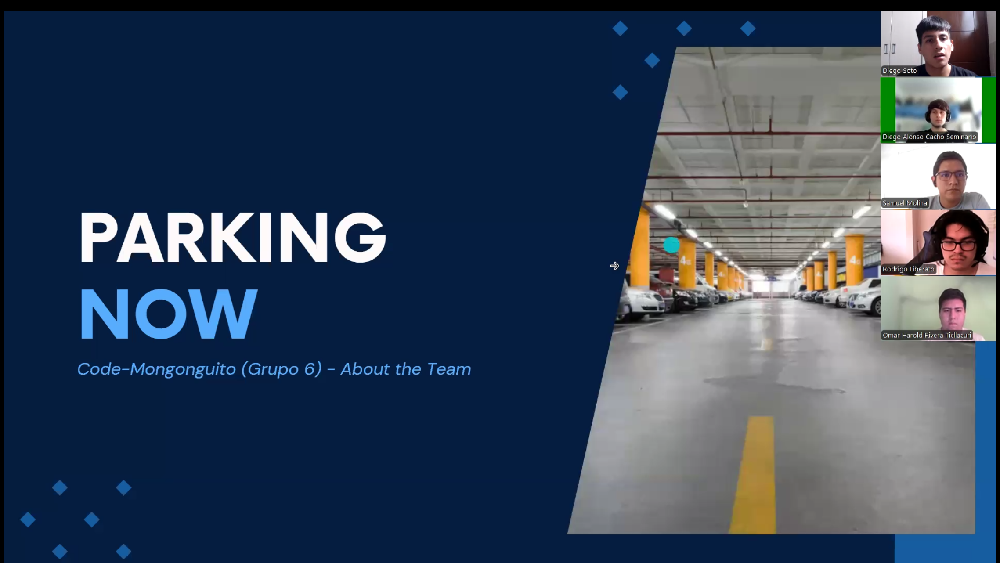

Link de Streams: https://upcedupe-my.sharepoint.com/:v:/g/personal/u202214477_upc_edu_pe/ERG_A1Mf0t5EoGRzU_XUo8QBZJT99rE8sX_XHatsv_G1mQ?e=9MiQih&nav=eyJyZWZlcnJhbEluZm8iOnsicmVmZXJyYWxBcHAiOiJTdHJlYW1XZWJBcHAiLCJyZWZlcnJhbFZpZXciOiJTaGFyZURpYWxvZy1MaW5rIiwicmVmZXJyYWxBcHBQbGF0Zm9ybSI6IldlYiIsInJlZmVycmFsTW9kZSI6InZpZXcifX0%3D

Link de Youtube: https://youtu.be/qoJ8mDAEmEM

## Anexos

| Sección                                                     | Enlace                                                                                                                                                                                                                                                                                                                                                                                                                                                 |
| ------------------------------------------------------------ | ------------------------------------------------------------------------------------------------------------------------------------------------------------------------------------------------------------------------------------------------------------------------------------------------------------------------------------------------------------------------------------------------------------------------------------------------------ |
| Lean UX Canvas                                               | https://www.canva.com/design/DAGOyaW6z7E/ub8lVBXsKH3Em5YVQb223g/edit?utm_content=DAGOyaW6z7E&utm_campaign=designshare&utm_medium=link2&utm_source=sharebutton                                                                                                                                                                                                                                                                                          |
| To be Scenario Mapping - Dueños de playa de estacionamiento | https://miro.com/app/board/uXjVKmNkzqc=/?share_link_id=307784420338                                                                                                                                                                                                                                                                                                                                                                                    |
| To be Scenario Mapping - Conductores Urbanos Frecuentes      | https://miro.com/app/board/uXjVKmOWBhk=/?share_link_id=425124811159                                                                                                                                                                                                                                                                                                                                                                                    |
| Dueños de playas de estacionamientos                        | https://miro.com/app/board/uXjVKwEdZl=/?share_link_id=724391040067                                                                                                                                                                                                                                                                                                                                                                                     |
| Conductores Urbanos Frecuentes                               | https://miro.com/app/board/uXjVKIATTNc=/?share_link_id=958948485500                                                                                                                                                                                                                                                                                                                                                                                    |
| Figma                                                        | https://www.figma.com/design/qb02D1snVoDtoLfT0qdkRV/Parking-now?node-id=0-1&t=32cD1vUOTgXzKlv9-1                                                                                                                                                                                                                                                                                                                                                       |
| Vertabelo                                                    | https://my.vertabelo.com/doc/pYDPCowUTtVaVuDmakCr4QlOKjdT1o1o                                                                                                                                                                                                                                                                                                                                                                                          |
| Entrevistas en general - Segmento 1 y 2                      | https://upcedupe-my.sharepoint.com/:v:/g/personal/u202223990_upc_edu_pe/EbIvmu-9HRFItJu_A2zbRx0BPfLCx2uRJnBarh-nlbO95A?nav=eyJyZWZlcnJhbEluZm8iOnsicmVmZXJyYWxBcHAiOiJTdHJlYW1XZWJBcHAiLCJyZWZlcnJhbFZpZXciOiJTaGFyZURpYWxvZy1MaW5rIiwicmVmZXJyYWxBcHBQbGF0Zm9ybSI6IldlYiIsInJlZmVycmFsTW9kZSI6InZpZXcifX0%3D&e=jlmpb3                                                                                                                                 |
| Link de video de exposición                                 | https://upcedupe-my.sharepoint.com/:v:/g/personal/u202215623_upc_edu_pe/EWKHzhsfxolEvJLdJNUX07sBGrxabKWvXX_kvqdSpUFZTA?e=MpiEeE                                                                                                                                                                                                                                                                                                                        |
| Link del Trello - Sprint 2                                   | https://trello.com/invite/b/66e9b5b8f40799cfcf6b00d3/ATTIa96971e39f8a6c5827fd4d56f290181a384AD640/sprint-backlog-2                                                                                                                                                                                                                                                                                                                                     |
| Link del Trello - Sprint 3                                   | https://trello.com/invite/b/6724d8fb0429d3b504591841/ATTIa159b1edae603492dcfd8a0b4b6e79fa96226B0D/sprint-backlog-3                                                                                                                                                                                                                                                                                                                                     |
| Link del Trello - Sprint 1                                   | https://trello.com/invite/b/66e8592fa7463897e6009305/ATTI40cdd58c92843377c1bb36efe058ba4f83EFDA35/open-source-parkingnow                                                                                                                                                                                                                                                                                                                               |
| Link de video de exposición - TB2                           | [https://upcedupe-my.sharepoint.com/:v:/g/personal/u202215623_upc_edu_pe/EWKHzhsfxolEvJLdJNUX07sBGrxabKWvXX_kvqdSpUFZTA?e=MpiEeE](https://upcedupe-my.sharepoint.com/:v:/g/personal/u202214477_upc_edu_pe/ETI9k7e8ZGFIn6wXMz3eS2EBFgRlxKhWHuoe3WQMqMHqZg?e=E2kvBP&nav=eyJyZWZlcnJhbEluZm8iOnsicmVmZXJyYWxBcHAiOiJTdHJlYW1XZWJBcHAiLCJyZWZlcnJhbFZpZXciOiJTaGFyZURpYWxvZy1MaW5rIiwicmVmZXJyYWxBcHBQbGF0Zm9ybSI6IldlYiIsInJlZmVycmFsTW9kZSI6InZpZXcifX0%3D) |
