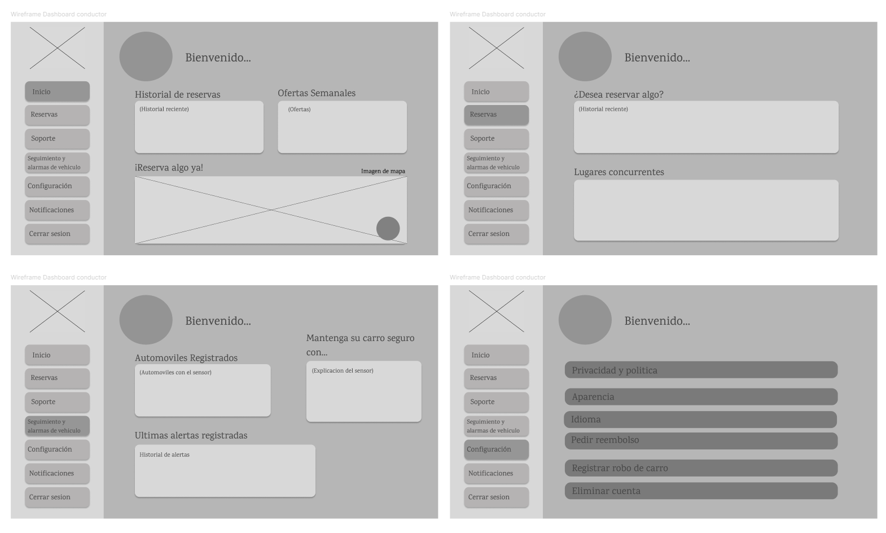
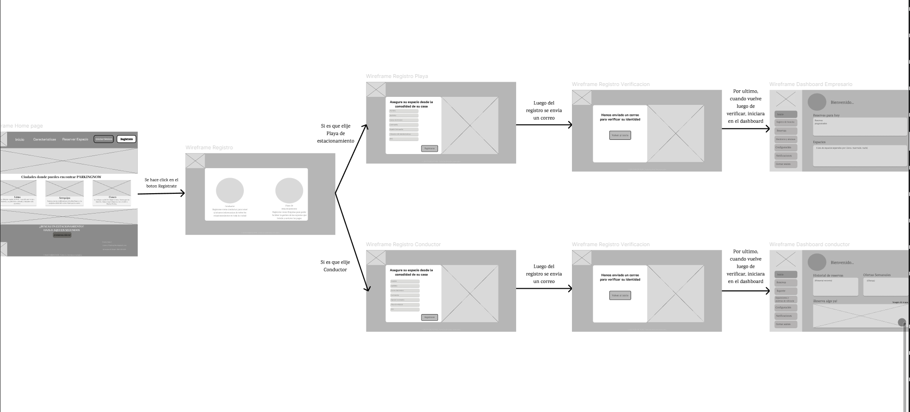
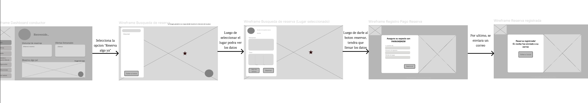
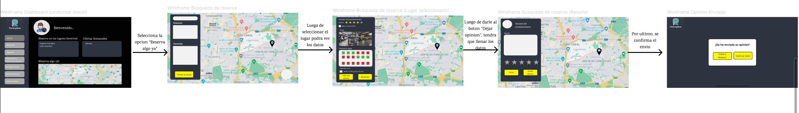

# **COURSE PROJECT**

<p align="center">
  
</p>

<p align="center"><strong>Universidad Peruana de Ciencias Aplicadas</strong></p>

<p align="center"><strong>Ingeniería de Software</strong><br>
Desarrollo de Aplicaciones Open Source - SW54 <br>
Ciclo: 5to <br>
<strong>Profesor:</strong> Alberto Wilmer Sanchez Seña</p>

<h2 align="center">INFORME</h2>

<h3 align="center">Startup: Code Mondoguito</h3>
<p align="center"><strong>Producto: ParkingNow</strong></p>

<h3 align="center">Team Members:</h3>

<div align="center">

| **Member**                           | **Code**     |
|--------------------------------------|--------------|
| Diego Alonso Cacho Seminario      | U202223990   |
| Rodrigo Liberato Saldaña       | U202215623   |
| Samuel Elias Molina Asencios     | U20191A456   |
| Omar Harold Rivera Ticllacuri      | U202214214   |
| Diego Ulises Soto Quispe     | U202214477   |

</div>

<p align="center"><strong>Septiembre 2024</strong></p>

# Registro de Versiones del Informe

| Versión | Fecha       | Autor(es)                                                                                                  | Descripción de la modificación                                                                                                                                                       |
|---------|-------------|------------------------------------------------------------------------------------------------------------|---------------------------------------------------------------------------------------------------------------------------------------------------------------------------------------|
| TB1     | 12/09/2024  | Diego Alonso Cacho Seminario<br><br>Rodrigo Liberato Saldaña<br><br>Samuel Elias Molina Asencios<br><br>Omar Harold Rivera Ticllacuri<br><br>Diego Ulises Soto Quispe | Se agregó el contenido del capítulo 1 (apartados 1.1, 1.2 y 1.3); el contenido del capítulo 2 (apartados 2.1, 2.2, 2.3, 2.4); el contenido del capítulo 3 (apartados 3.1, 3.2, 3.3 y 3.4); el contenido del capítulo 4 (apartados 4.1, 4.2, 4.3, 4.4, 4.5, 4.6, 4.7 y 4.8); y el contenido del capítulo 5 (apartados 5.1 y 5.2). |
| TP1     |             | Diego Alonso Cacho Seminario<br><br>Rodrigo Liberato Saldaña<br><br>Samuel Elias Molina Asencios<br><br>Omar Harold Rivera Ticllacuri<br><br>Diego Ulises Soto Quispe |                                                                                                                                                                                       |
| TB2     |             | Diego Alonso Cacho Seminario<br><br>Rodrigo Liberato Saldaña<br><br>Samuel Elias Molina Asencios<br><br>Omar Harold Rivera Ticllacuri<br><br>Diego Ulises Soto Quispe |                                                                                                                                                                                       |
| TF1     |             | Diego Alonso Cacho Seminario<br><br>Rodrigo Liberato Saldaña<br><br>Samuel Elias Molina Asencios<br><br>Omar Harold Rivera Ticllacuri<br><br>Diego Ulises Soto Quispe |                                                                                                                                                                                       |


# Project Report Collaboration Insights

TB1: Las tareas asignadas para la entrega TB1 se han completado y están documentadas en el siguiente repositorio de GitHub perteneciente a la organización del equipo: [Repositorio GitHub](#).

Durante la preparación del informe, se llevaron a cabo las siguientes actividades:

- Se escribieron y diagramaron los contenidos asignados a cada miembro en formato Markdown, seguido de commits para asegurar el progreso en el repositorio.
- Se crearon los artefactos necesarios utilizando las herramientas recomendadas y se obtuvieron enlaces de imagen a través de la carpeta `Assets` en la rama `develop` del repositorio del informe.
- Se organizaron reuniones para coordinar el progreso de los elementos del informe y para comunicar los avances del Sprint 1, que se enfoca en la Landing Page.

# ABET – EAC - Student Outcome 3

Criterio: Capacidad de comunicarse efectivamente con un rango de audiencias.
En el siguiente cuadro se describen las acciones realizadas y enunciados de conclusiones por parte del grupo, que permiten sustentar el haber alcanzado el logro del ABET – EAC - Student Outcome 3.

| Criterio específico                                                                                 | Acciones realizadas                                                                                                                                                                                                                                      | Conclusiones                                                                                                                                                                                                                                             |
|------------------------------------------------------------------------------------------------------|----------------------------------------------------------------------------------------------------------------------------------------------------------------------------------------------------------------------------------------------------------|------------------------------------------------------------------------------------------------------------------------------------------------------------------------------------------------------------------------------------------------------------|
| **Comunica oralmente con efectividad a diferentes rangos de audiencia.**                             | **Diego Alonso Cacho Seminario *TB1:*** Participé en las secciones del capítulo 2 relacionadas con el diseño, grabación y análisis de entrevistas, además de las encuestas realizadas a nuestros segmentos objetivo. Colaboré en el primer Sprint para esta entrega.<br>**Diego Ulises Soto Quispe *TB1:*** Durante las reuniones del proyecto, participé activamente explicando la introducción del proyecto y la problemática de la startup, utilizando un lenguaje claro para asegurar que todos los miembros del equipo comprendieran las metas y objetivos. Presenté de forma clara los resultados del análisis de requerimientos en el Capítulo 3 y los resultados de las pruebas en el Capítulo 5. <br> **Rodrigo Liberato *TB1:*** Para este entregable, comunique a mis compañeros todos mis avances y cambios que aporte, apoye a los que lo necesitaban y mis aportes significativos fueron en el capitulo 2, analisis de los competidores, capitulo 4, Wireframe y Mockup design, asi como sus Flow, y por ultimo, diseñe la base de datos e hice el PPT para la presentacion. <br>**Omar Harold Rivera Ticllacuri *TB1:*** Durante el desarrollo del proyecto participe de manera activa contribuyendo con el Capitulo 2, con el desarrollo del diseño de los segmentos de user persona,  el Landing Page, y partes del Capitulo 5. Logrando asi los objetivos establecidos para esta entrega. <br>**Molina Asencios Samuel Elias *TB1:*** Durante el desarrollo del proyecto participe de manera activa preguntando y revisando la rubrica, tambien hize el desarrollo de los escenarios As-is para ambos segmentos  y agregue el lenguaje ubiquo que se usara en nuestro sistema luego desarrolle el diagrama de componentes para nuestro aplicativo movil| La participación activa en las entrevistas y análisis de los resultados permitió identificar las necesidades clave de los usuarios, lo que contribuyó a la mejora continua del producto durante los Sprints. La comunicación efectiva fue crucial para asegurar que el equipo técnico comprendiera los requerimientos y los stakeholders estuvieran alineados con los objetivos del proyecto.  |
| **Comunica por escrito con efectividad a diferentes rangos de audiencia.**                           | **Diego Alonso Cacho Seminario *TB1:*** Realicé las correcciones necesarias dadas por mis compañeros respecto a los puntos con los que aporté para la TB1, además subí correctamente mis aportes al repositorio en línea, respetando el formato requerido.<br>**Diego Ulises Soto Quispe *TB1:*** En el Capítulo 1, fui el responsable de documentar el perfil de la startup y el marco teórico del proyecto, utilizando un lenguaje claro y conciso para describir los antecedentes. En el Capítulo 3, redacté los requerimientos específicos del sistema y las historias de usuario. También colaboré en los Capítulos 4 y 5 documentando el diseño del sistema y las configuraciones de implementación. <br> **Rodrigo Liberato** TB1: Para este entregable, los aportes que realize por escrito fueron los commits que realize por Git y los analisis de los competidores. <br>**Omar Harold Rivera Ticllacuri *TB1:***  En el Capitulo 2, contribui al desarrollar los user person, user task matrix y user Journey Mapping. En el Capitulo 4, el desarrollo del Style Guidelines y Landing Page UI Design. En el capitulo 5, trabaje en el desarrollo del Sprint 1 del  Landing Page, Services & Applications Implementation. Y finalmente, desarrolle el Landing Page <br>**Molina Asencios Samuel Elias *TB1:***  Para este entregable desarrolle parte de el punto 4 que consistia en el desarrollo de los diagramas de componentes para el desarrollo de este componente se uso structurizer segun la rubrica | La gestión adecuada de las correcciones y el seguimiento del formato mejoraron la calidad de los documentos del equipo, garantizando una estructura clara y coherente en los entregables. La documentación precisa de los capítulos permitió que el equipo y los stakeholders tuvieran una referencia sólida para cada fase del proyecto. |


# Contenido
- [Registro de Versiones del Informe](#registro-de-versiones-del-informe)
- [Project Report Collaboration Insights](#project-report-collaboration-insights)
- [Student Outcome](#student-outcome)

## Capítulo I: Introducción
- [1.1. Startup Profile](#11-startup-profile)
  - [1.1.1. Descripción de la Startup](#111-descripción-de-la-startup)
  - [1.1.2. Perfiles de integrantes del equipo](#112-perfiles-de-integrantes-del-equipo)
- [1.2. Solution Profile](#12-solution-profile)
  - [1.2.1 Antecedentes y problemática](#121-antecedentes-y-problemática)
  - [1.2.2 Lean UX Process](#122-lean-ux-process)
    - [1.2.2.1. Lean UX Problem Statements](#1221-lean-ux-problem-statements)
    - [1.2.2.2. Lean UX Assumptions](#1222-lean-ux-assumptions)
    - [1.2.2.3. Lean UX Hypothesis Statements](#1223-lean-ux-hypothesis-statements)
    - [1.2.2.4. Lean UX Canvas](#1224-lean-ux-canvas)
- [1.3. Segmentos objetivo](#13-segmentos-objetivo)

## Capítulo II: Requirements Elicitation & Analysis
- [2.1. Competidores](#21-competidores)
  - [2.1.1. Análisis competitivo](#211-análisis-competitivo)
  - [2.1.2. Estrategias y tácticas frente a competidores](#212-estrategias-y-tácticas-frente-a-competidores)
- [2.2. Entrevistas](#22-entrevistas)
  - [2.2.1. Diseño de entrevistas](#221-diseño-de-entrevistas)
  - [2.2.2. Registro de entrevistas](#222-registro-de-entrevistas)
  - [2.2.3. Análisis de entrevistas](#223-análisis-de-entrevistas)
- [2.3. Needfinding](#23-needfinding)
  - [2.3.1. User Personas](#231-user-personas)
  - [2.3.2. User Task Matrix](#232-user-task-matrix)
  - [2.3.3. User Journey Mapping](#233-user-journey-mapping)
  - [2.3.4. Empathy Mapping](#234-empathy-mapping)
  - [2.3.5. As-is Scenario Mapping](#235-as-is-scenario-mapping)
- [2.4. Ubiquitous Language](#24-ubiquitous-language)

## Capítulo III: Requirements Specification
- [3.1. To-Be Scenario Mapping](#31-to-be-scenario-mapping)
- [3.2. User Stories](#32-user-stories)
- [3.3. Impact Mapping](#33-impact-mapping)
- [3.4. Product Backlog](#34-product-backlog)

## Capítulo IV: Product Design
- [4.1. Style Guidelines](#41-style-guidelines)
  - [4.1.1. General Style Guidelines](#411-general-style-guidelines)
  - [4.1.2. Web Style Guidelines](#412-web-style-guidelines)
- [4.2. Information Architecture](#42-information-architecture)
  - [4.2.1. Organization Systems](#421-organization-systems)
  - [4.2.2. Labeling Systems](#422-labeling-systems)
  - [4.2.3. SEO Tags and Meta Tags](#423-seo-tags-and-meta-tags)
  - [4.2.4. Searching Systems](#424-searching-systems)
  - [4.2.5. Navigation Systems](#425-navigation-systems)
- [4.3. Landing Page UI Design](#43-landing-page-ui-design)
  - [4.3.1. Landing Page Wireframe](#431-landing-page-wireframe)
  - [4.3.2. Landing Page Mock-up](#432-landing-page-mock-up)
- [4.4. Web Applications UX/UI Design](#44-web-applications-uxui-design)
  - [4.4.1. Web Applications Wireframes](#441-web-applications-wireframes)
  - [4.4.2. Web Applications Wireflow Diagrams](#442-web-applications-wireflow-diagrams)
  - [4.4.2. Web Applications Mock-ups](#442-web-applications-mock-ups)
  - [4.4.3. Web Applications User Flow Diagrams](#443-web-applications-user-flow-diagrams)
- [4.5. Web Applications Prototyping](#45-web-applications-prototyping)
- [4.6. Domain-Driven Software Architecture](#46-domain-driven-software-architecture)
  - [4.6.1. Software Architecture Context Diagram](#461-software-architecture-context-diagram)
  - [4.6.2. Software Architecture Container Diagrams](#462-software-architecture-container-diagrams)
  - [4.6.3. Software Architecture Components Diagrams](#463-software-architecture-components-diagrams)
- [4.7. Software Object-Oriented Design](#47-software-object-oriented-design)
  - [4.7.1. Class Diagrams](#471-class-diagrams)
  - [4.7.2. Class Dictionary](#472-class-dictionary)
- [4.8. Database Design](#48-database-design)
  - [4.8.1. Database Diagram](#481-database-diagram)

## Capítulo V: Product Implementation, Validation & Deployment
- [5.1. Software Configuration Management](#51-software-configuration-management)
  - [5.1.1. Software Development Environment Configuration](#511-software-development-environment-configuration)
  - [5.1.2. Source Code Management](#512-source-code-management)
  - [5.1.3. Source Code Style Guide & Conventions](#513-source-code-style-guide--conventions)
  - [5.1.4. Software Deployment Configuration](#514-software-deployment-configuration)
- [5.2. Landing Page, Services & Applications Implementation](#52-landing-page-services--applications-implementation)
  - [5.2.1. Sprint 1](#521-sprint-1)
    - [5.2.1.1. Sprint Planning 1](#5211-sprint-planning-1)
    - [5.2.1.2. Sprint Backlog 1](#5212-sprint-backlog-1)
    - [5.2.1.3. Development Evidence for Sprint Review](#5213-development-evidence-for-sprint-review)
    - [5.2.1.4. Testing Suite Evidence for Sprint Review](#5214-testing-suite-evidence-for-sprint-review)
    - [5.2.1.5. Execution Evidence for Sprint Review](#5215-execution-evidence-for-sprint-review)
    - [5.2.1.6. Services Documentation Evidence for Sprint Review](#5216-services-documentation-evidence-for-sprint-review)
    - [5.2.1.7. Software Deployment Evidence for Sprint Review](#5217-software-deployment-evidence-for-sprint-review)
    - [5.2.1.8. Team Collaboration Insights during Sprint](#5218-team-collaboration-insights-during-sprint)

- [Avance de Conclusiones, Bibliografía y Anexos](#avance-de-conclusiones-bibliografía-y-anexos)

## Capítulo I: Introducción

### 1.1. StartUp Profile

En esta sección describiremos la descripción de nuestra Startup.

### 1.1.1. Descripción de la Startup

**PARKINGNOW** es una startup tecnológica enfocada en ofrecer una solución integral para el estacionamiento en tiempo real. Nuestra plataforma digital permite a los usuarios reservar y pagar por espacios de estacionamiento utilizando la localización geográfica y un **sensor infrarrojo** para una gestión más eficiente y automatizada. Basado en un modelo de negocio independiente y sostenible, **PARKINGNOW** se adapta tanto a usuarios frecuentes como a usuarios ocasionales mediante un sistema de transacciones. La innovación de **PARKINGNOW** radica en la integración de datos en tiempo real, incluidos los datos proporcionados por un sensor infrarrojo, para garantizar la disponibilidad de espacios y optimizar las rutas hacia los estacionamientos más cercanos. Este sensor infrarrojo detecta la presencia de vehículos en los espacios de estacionamiento al percibir cuando un objeto interrumpe su señal de luz. Cuando un vehículo ocupa o deja un espacio, el sensor infrarrojo envía una señal a la plataforma para actualizar la disponibilidad en tiempo real, mejorando así la eficiencia y la experiencia del usuario.

**Misión**: Ser el puente entre conductores y propietarios de estacionamientos, optimizando la experiencia de estacionamiento en tiempo real. **PARKINGNOW** facilita el acceso a espacios de estacionamiento utilizando un sensor infrarrojo para una gestión automatizada y eficiente, contribuyendo a la rentabilidad de quienes los poseen y cubriendo así las necesidades de ambos segmentos de mercado.

**Visión**: Convertirnos en la plataforma líder en la gestión de estacionamientos urbanos en los próximos 5 años, mejorando la movilidad en las ciudades mediante soluciones tecnológicas innovadoras y sostenibles, como el uso de un sensor infrarrojo, que beneficien tanto a conductores como a propietarios de estacionamientos.


#### 1.1.2. Perfiles de integrantes del equipo

 **Integrantes**                                              | **Descripción**                                                                                                                                                                                                                                                | **Conocimientos**                               |
|--------------------------------------------------------------|----------------------------------------------------------------------------------------------------------------------------------------------------------------------------------------------------------------------------------------------------------------|-------------------------------------------------|
|  <br> Diego Ulises Soto Quispe | Soy estudiante de 5to ciclo en la carrera de Ingeniería de Software. Soy responsable en las labores que se asignan y puntual con los trabajos por entregar, fuera del mundo de programación, me gusta jugar basquet, salir a pasear, jugar videojuegos y manejar en bicicleta. | HTML, Base de datos en SQL Server, C++, Python, NoSQL, JSON |
|  <br> Diego Alonso Cacho Seminario | Mi nombre es Diego Cacho y tengo 19 años, actualmente me encuentro 5to ciclo de mi carrera como Ingeniero de Software en la UPC. Me considero una persona tranquila y diligente, intento realizar mis tareas y trabajos lo antes posible para evitar contratiempos en un futuro, especialmente si son actividades que consumen mucho tiempo. Como miembro de equipo buscaré ayudar a mis compañeros cuando lo necesiten, realizando además mis entregas lo más temprano posible. | C++, C#, Python, Unity 2D/3D | 
|  <br> Omar Harold Rivera Ticllacuri | Soy estudiante de Ingeniería de Software, tengo 19 años y actualmente me encuentro en el quinto ciclo de mi carrera. Soy una persona con la cual tengo la disciplina y responsable para desarrollar proyectos de software y software de entretenimiento. Cuento con experiencia sobre el desarrollo de software de entretenimiento. Por ende, apoyaré al grupo en todo lo posible para poder desarrollar adecuadamente el trabajo y la propuesta que se nos asignó. | C++, C#, Python, Unity 2D/3D, Html y Css|
|  <br> Samuel Elias Molina Asencios | Soy estudiante de 7mo ciclo en la carrera de Ingeniería de Software. Actualmente formo parte de un equipo de desarrollo ejecutando el rol de Analista desarrollador de software, me gusta mucho el arte y el deporte, en mis tiempos libres toco Piano o voy a nadar no hay nada mejor que la natación. | SQL, NoSQL, C++, Java, JavaScript, Firebird, Vue, Quasar, Node js, Jreport, PHP, Sniffer, HTML, CSS.|
|  <br> Rodrigo Liberato Saldaña | Soy estudiante de 6to ciclo de la carrera de Ingenieria de software, soy una persona que valora el esfuerzo e intenta apoyar en todo lo posible. La responsabilidad y honestidad son unas de mis cualidades y que seran de ayuda para que el trabajo salga lo mejor posible | C++, SQL, Java, PHP, HTML, CSS.|


### 1.2. Solution Profile

**PARKINGNOW** es una solución innovadora diseñada para transformar la experiencia de estacionamiento en las ciudades. Ofrece una plataforma digital que permite a los usuarios encontrar, reservar y pagar por espacios de estacionamiento en tiempo real, utilizando la localización geográfica y un **sensor infrarrojo**. Nuestra tecnología emplea este sensor para detectar automáticamente la presencia de vehículos en los espacios de estacionamiento al percibir cuando un objeto interrumpe su señal de luz. Esto permite actualizar en tiempo real la disponibilidad de los espacios y dirigir a los conductores hacia los estacionamientos más cercanos, optimizando sus rutas y reduciendo el tiempo de búsqueda. Esta funcionalidad mejora significativamente la experiencia de los conductores al proporcionar información precisa y en tiempo real sobre la disponibilidad de espacios. En resumen, **PARKINGNOW** ofrece una solución integral para los desafíos del estacionamiento urbano, beneficiando tanto a los conductores como a los propietarios de estacionamientos.


### 1.2.1. Antecedentes y problemática

En las ciudades con alto movimiento vehicular, es común ver vehículos estacionados de manera indebida, invadiendo veredas o interrumpiendo el flujo vehicular. Esta situación es un problema recurrente para los conductores que enfrentan la dificultad de encontrar estacionamiento, un desafío que se intensifica en áreas urbanas congestionadas. La demanda de espacios de estacionamiento es alta, y la información disponible sobre su disponibilidad suele ser limitada o desactualizada. Además, la ausencia de herramientas para reservar un espacio con anticipación agrava la frustración y aumenta el tiempo que los conductores deben invertir para encontrar un lugar donde estacionarse.

Para entender mejor las necesidades de nuestros usuarios y alinear nuestro enfoque con los principios de Lean UX, hemos realizado un análisis de antecedentes y la problemática utilizando la técnica de "5W’s & 2H’s", una herramienta esencial en Lean UX para identificar oportunidades de diseño centrado en el usuario. A continuación, se presenta la información recopilada:

#### What

**¿Cuál es el problema?**  
El principal problema que **PARKINGNOW** busca resolver es la falta de estacionamientos disponibles y adecuados, lo que lleva a los conductores a estacionarse en zonas no permitidas, generando congestión y exponiéndose a riesgos como multas o robos. Además, la falta de tecnologías avanzadas para la gestión de espacios, como los sensores infrarrojos, limita la capacidad de los estacionamientos para manejar la disponibilidad en tiempo real.

#### When

**¿Cuándo sucede el problema?**  
El problema ocurre principalmente durante las horas pico, cuando la demanda de espacios de estacionamiento es mayor y los conductores no encuentran un lugar disponible que cumpla con sus expectativas.

**¿Cuándo utiliza el cliente el producto?**  
Los clientes utilizan **PARKINGNOW** para verificar la disponibilidad de estacionamientos en tiempo real, realizar reservas, comparar tarifas y asegurarse de que el estacionamiento seleccionado cumpla con sus expectativas, gracias a la información en tiempo real proporcionada por los sensores infrarrojos.

#### Where

**¿Dónde surge el problema?**  
El problema surge en áreas urbanas congestionadas donde los estacionamientos son escasos y la información sobre su disponibilidad es limitada o inaccesible. La falta de sistemas automatizados como sensores infrarrojos contribuye a la escasez de información precisa en tiempo real.

#### Who

**¿Quiénes están involucrados?**  
Los principales involucrados en el problema son los conductores que necesitan un estacionamiento disponible, seguro y asequible, y los propietarios de estacionamientos que buscan optimizar la ocupación de sus espacios y atraer más clientes mediante tecnología avanzada como los sensores infrarrojos.

**¿A quiénes le sucede el problema?**  
El problema afecta a todos los conductores que buscan estacionamiento, independientemente de su edad, género, ubicación o tipo de vehículo.

**¿Quién utilizará el producto?**  
El producto será utilizado por personas que viajan a diario, turistas, estudiantes, y cualquier conductor que necesite estacionar su vehículo en un lugar seguro y conveniente que se ajuste a sus preferencias y presupuesto.

#### Why

**¿Por qué sucede el problema?**  
El problema surge debido a la falta de sistemas tecnológicos avanzados en los estacionamientos tradicionales, como los sensores infrarrojos, que impiden la comunicación en tiempo real sobre la disponibilidad de espacios. Esto crea una desconexión entre la oferta y la demanda.

**¿Qué llevó al usuario a esta situación?**  
La falta de información actualizada y la ausencia de herramientas eficientes para gestionar la disponibilidad de estacionamiento, como los sensores infrarrojos, conducen a situaciones en las que los conductores no encuentran espacios que satisfagan sus necesidades.

#### How

**¿En qué condiciones los clientes usan nuestro producto?**  
Los clientes pueden usar **PARKINGNOW** en diversas situaciones, como al planificar un viaje a una nueva ciudad, al buscar estacionamientos que se ajusten a sus preferencias, o durante eventos importantes donde encontrar estacionamiento puede ser más difícil. Los sensores infrarrojos proporcionan información en tiempo real, mejorando la experiencia del usuario.

**¿Cómo nos conocerán los usuarios?**  
Los usuarios nos conocerán a través de campañas publicitarias en redes sociales que destacarán los beneficios y ventajas de **PARKINGNOW**, incluyendo la tecnología avanzada como los sensores infrarrojos para una gestión de estacionamiento más eficiente.

#### How much

**¿En qué cantidad sucede el problema?**  
El problema de la falta de seguridad y disponibilidad de estacionamientos es significativo. Los constantes robos de vehículos y las multas por estacionamiento indebido son problemas comunes que afectan a muchos conductores. La falta de tecnología de detección como sensores infrarrojos agrava estos problemas.

### 1.2.2. Lean UX Process

En esta sección se realizará el proceso de Lean UX, que abarca la visión del modelo de negocio que será soportado por nuestro producto de software. Gracias a este enfoque metodológico, podemos dirigir nuestra atención hacia el diseño de nuestra solución y los problemas identificados mediante el pensamiento de diseño.

#### 1.2.2.1. Lean UX Problem Statements

A continuación, empleamos la plantilla de Business Opportunity Statements (Gothelf, 2022) para orientar a nuestro equipo de trabajo en la creación de un servicio sin restricciones que puedan limitar la creatividad y la agilidad. Este enfoque nos impulsa a pensar en nuestro trabajo en términos que respondan a las necesidades de los clientes y nos prepara para un lanzamiento exitoso de nuestra idea.

**Plantilla de Business Opportunity Statement:**

El estado actual de [domain] se ha centrado principalmente en [segments, pain points, etc.]

Lo que los productos/servicios existentes no logran abordar es [this gap].

Nuestro producto/servicio abordará esta brecha mediante [vision / strategy].

Nuestro enfoque inicial será [this segment].

Sabremos que tenemos éxito cuando veamos [these behaviors in our target audience].

**PARKINGNOW Lean UX Problem Statements:**

- El estado actual de los servicios de estacionamiento en áreas urbanas se ha centrado principalmente en la disponibilidad limitada de espacios y en la falta de opciones para reservar con anticipación, lo que lleva a la frustración de los conductores y al uso indebido de espacios de estacionamiento.

- Lo que los productos/servicios existentes no logran abordar es la falta de información en tiempo real sobre la disponibilidad de espacios y la optimización de rutas hacia los estacionamientos más cercanos.

- Nuestro producto/servicio abordará esta brecha mediante el desarrollo e implementación de una plataforma digital que utiliza la localización geográfica y datos en tiempo real proporcionados por un sensor infrarrojo para informar a los conductores sobre la disponibilidad de espacios y optimizar sus rutas de manera eficiente.

- Nuestro enfoque inicial será captar el mercado de conductores urbanos en ciudades con alta congestión vehicular, donde la necesidad de soluciones de estacionamiento eficientes es mayor.

- Sabremos que tenemos éxito cuando veamos un aumento significativo en las reservas de estacionamientos a través de nuestra plataforma y una reducción en el tiempo promedio que los conductores dedican a buscar un espacio de estacionamiento.

#### 1.2.2.2. Lean UX Assumptions

**Users:**

- Conductores urbanos que buscan estacionamiento en tiempo real en áreas urbanas congestionadas.
- Propietarios de estacionamientos que desean optimizar la ocupación de sus espacios y mejorar la comunicación con los clientes mediante el uso de sensores infrarrojos.
- Empresas y servicios de transporte que requieren soluciones rápidas y eficientes para estacionar sus flotas.

**User Outcomes:**

**Segmento de Conductores:**

- Acceder a una plataforma en línea que facilite la búsqueda y reserva de estacionamientos disponibles en tiempo real gracias al uso de sensores infrarrojos.
- Utilizar la aplicación para optimizar las rutas hacia los estacionamientos más cercanos y ahorrar tiempo.
- Verificar la disponibilidad de espacios y tarifas de estacionamiento antes de llegar a su destino.

**Segmento de Propietarios de Estacionamientos:**

- Promocionar sus espacios de estacionamiento a una audiencia más amplia de conductores.
- Gestionar todas las reservas y comunicaciones con los clientes desde una sola plataforma utilizando tecnología avanzada de sensores.
- Mejorar la tasa de ocupación de sus espacios mediante herramientas de análisis y optimización proporcionadas por la plataforma.

**Suposiciones de Negocios:**

- Creemos que existe una demanda creciente de soluciones eficientes para encontrar y reservar espacios de estacionamiento en áreas urbanas congestionadas.
- Aunque reconocemos la competencia en el sector de estacionamiento, estamos seguros de que podemos destacarnos ofreciendo una plataforma en línea que utilice datos en tiempo real proporcionados por sensores infrarrojos para mejorar la experiencia tanto para los conductores como para los propietarios de estacionamientos.
- Creemos que los usuarios valorarán la conveniencia, la transparencia y la eficiencia de una plataforma que les permita encontrar y reservar estacionamientos en tiempo real.

**Suposiciones de Usuarios:**

- **¿Quién utiliza nuestra plataforma?** Nuestra plataforma es utilizada por conductores urbanos que necesitan estacionar sus vehículos de manera segura y conveniente, así como por propietarios de estacionamientos que desean maximizar la ocupación de sus espacios.
- **¿Cómo se integra nuestro producto en la rutina diaria?** Nuestro producto se integra en la rutina diaria de los conductores al proporcionar una solución rápida y fácil de usar para encontrar y reservar estacionamientos, reduciendo así el tiempo dedicado a buscar espacios gracias al uso de sensores infrarrojos.
- **¿Cuáles son los desafíos que aborda nuestro producto?** **PARKINGNOW** aborda los desafíos de la falta de información en tiempo real sobre la disponibilidad de estacionamientos y la optimización de rutas hacia los espacios más cercanos.
- **¿Qué imagen deseamos proyectar con nuestro producto?** Deseamos proyectar una imagen de eficiencia, confiabilidad e innovación. Queremos que **PARKINGNOW** sea visto como la solución líder en la industria de estacionamiento urbano.
- **¿Cuál es el propósito fundamental de nuestra aplicación?** El propósito fundamental de **PARKINGNOW** es facilitar el proceso de búsqueda, reserva y gestión de espacios de estacionamiento para conductores urbanos y propietarios de estacionamientos.
- **¿Qué funcionalidades destacan en nuestra aplicación?** Las funcionalidades destacadas incluyen la búsqueda avanzada de estacionamientos basada en localización y disponibilidad en tiempo real, la reserva en línea de espacios, la optimización de rutas y herramientas de análisis para propietarios de estacionamientos.

#### 1.2.2.3. Lean UX Hypothesis Statements

Para la elaboración de los Hypothesis Statements se utilizó el formato Lean UX: [We believe that], [This will achieve] y [We will have demonstrated this when].

**Hipótesis 1:**

- Creemos que si simplificamos el proceso de búsqueda y reserva de espacios de estacionamiento en nuestra plataforma utilizando sensores infrarrojos, esto logrará aumentar significativamente la cantidad de usuarios recurrentes, proyectando un aumento del 30% en la tasa de clientes que regresan dentro de los primeros seis meses de implementación.

- **Sabremos que estamos en lo cierto cuando observemos** un aumento del 30% en la cantidad de reservas realizadas por usuarios recurrentes durante el mismo período.

**Hipótesis 2:**

- Creemos que si implementamos un sistema de notificación en tiempo real sobre la disponibilidad de espacios de estacionamiento mediante sensores infrarrojos, esto logrará reducir el tiempo promedio de búsqueda de estacionamiento en un 20%.

- **Sabremos que estamos en lo cierto cuando observemos** una reducción del 20% en el tiempo promedio que los usuarios pasan buscando estacionamiento después de la implementación.

**Hipótesis 3:**

- Creemos que si ofrecemos descuentos exclusivos para usuarios frecuentes, esto logrará aumentar la conversión de usuarios ocasionales a usuarios frecuentes, proyectando un aumento del 25% en la cantidad de usuarios frecuentes dentro de los primeros seis meses de implementación.

- **Sabremos que estamos en lo cierto cuando observemos** un aumento del 25% en la cantidad de usuarios que utilizan nuestra plataforma más de una vez al mes.

**Hipótesis 4:**

- Creemos que si mejoramos la función de optimización de rutas en nuestra plataforma, permitiendo a los usuarios llegar más rápidamente a los estacionamientos gracias a la información proporcionada por sensores infrarrojos, esto logrará aumentar la satisfacción del usuario y reducir la frustración durante la búsqueda de estacionamiento.

- **Sabremos que estamos en lo cierto cuando observemos** un aumento en las calificaciones de satisfacción del usuario y una reducción en las quejas relacionadas con la búsqueda de estacionamiento.

**Hipótesis 5:**

- Creemos que si implementamos un programa de fidelización que recompense a los usuarios por el uso continuo de nuestra plataforma, esto logrará aumentar la retención de clientes y el crecimiento orgánico de nuestra base de usuarios, proyectando un aumento del 30% en la retención de clientes dentro de los primeros seis meses de implementación del programa.

- **Sabremos que estamos en lo cierto cuando observemos** un aumento del 30% en la retención de clientes y un incremento en el número de usuarios que refieren a otros conductores a la plataforma.
  
##### 1.2.2.4. Lean UX Canvas

El Lean UX Canvas de PARKINGNOW identifica los problemas de los conductores para encontrar estacionamiento y de los propietarios para maximizar su uso. Propone soluciones como sensores infrarrojos y sistemas de reserva anticipada para mejorar la eficiencia y satisfacción del usuario, validando su efectividad mediante hipótesis y métricas claras.

<p align="center">
  
</p>

<p align="center">Fuente: Elaboración propia.</p>

### 1.3. Segmentos objetivo

1. Conductores Urbanos Frecuentes:
   - Descripción: Este segmento incluye a personas que necesitan estacionamiento regular en zonas urbanas.
   - Sexo: Masculino y femenino
   - Edades: Adultos jóvenes (18-34 años), adultos de mediana edad (35-54 años) y adultos mayores (55+)
   - Nivel socioeconómico: Clases B, C y D (media-alta, media y baja)
   - Satisfacción de Necesidades: La plataforma permite a estos usuarios ahorrar tiempo y reducir el estrés al ofrecer reservas anticipadas o en tiempo real, optimizando sus desplazamientos diarios. Asimismo, gracias al sensor, el usuario tendra la seguridad del estado de su carro dentro del estacionamiento.

2. Dueños de playas de estacionamientos:
    - Descripcion: El siguiente segmento incluye a las personas dueñas de playas de estacionamintos, o lugares para aparcar carros en zonas urbanas.
    - Sexo: Masculino y Femenino
    - Edades: Adultos jóvenes (18-34 años), Adultos de mediana edad (35 - 54) y adultos mayores (55+)
    - Nivel socioeconómico: Clases B y C (Media-alta y media)
    - Necesidades por satisfacer: Apoyar con el manejo de datos que sucede al momento de que los conductores urbanos frecuentes deseen un lugar para estacionar, ademas de brindar facilidad y seguridad al momento de pagar y ordenar los lugares de estacionamiento. Además, promueve la formalidad y acelera los procesos tediosos que estos negocios suelen tener.
  
## Capítulo II: Requirements Elicitation & Analysis

### 2.1. Competidores

**Parkimeter:**

Parkimeter es una plataforma en línea que ofrece servicios relacionados con el estacionamiento y la gestión de plazas de aparcamiento. La plataforma permite a los usuarios buscar, comparar y reservar plazas de estacionamiento en diferentes ubicaciones. Además de la reserva de plazas de estacionamiento, Parkimeter también proporciona información sobre tarifas de estacionamiento, disponibilidad en tiempo real y otras características útiles para ayudar a los conductores a encontrar y gestionar el estacionamiento de manera más conveniente.

**ElParking**

ElParking permite a los usuarios encontrar, reservar y pagar por estacionamiento a través de su plataforma. La aplicación brinda información en tiempo real acerca de sitios de estacionamiento cercanos quitando un peso de los hombros del consumidor, los conductores. Además, tiene la increíble funcionalidad de seguimiento de multas, pagos en parquímetros, etc.

**Aparcados**

Aparcados permite a los conductores encontrar estacionamientos dependiendo de lo que buscan, optimizando así el proceso de estacionamiento en áreas urbanas La app posee también posee una página web, pero la versión en móviles es la más usada hasta el momento, con una interfaz llamativa para todos los usuarios.


#### 2.1.1. Análisis competitivo

A continuacion, se presentara la tabla de competidores para analizar cada punto especifico de algunos competidores más resaltantes al rededor del mundo. Con esto lograremos adecuarnos a lo que nuestro segmento objetivo quiere.
| **Competitive Analysis Landscape**                              |                                                                                                                              |
|-----------------------------------------------------------------|------------------------------------------------------------------------------------------------------------------------------|
| **¿Por qué llevar a cabo este análisis?**                       | **Escriba en el recuadro la pregunta que busca responder o el objetivo de este análisis.**                                    |
|                                                                 | **Identificar cómo PARKINGNOW se posiciona frente a sus competidores en términos de servicios ofrecidos, ventajas competitivas y estrategias de mercado para mejorar nuestra propuesta de valor y captar más clientes.** |

| ***Competidor***          || ParkingNow| Parkimeter| ElParking| Aparcados|
| ------------------- | ----------------------------------------------------- | ------------------------------------------------------------------------------------------------------------------------------------------------------------------------------------------------------------------------------------------------------------------------------------------------------- |--------------------------------------------------------------------------------------------------------------------------------------------------------------------------------------------------------------------------------|-----------------------------------------------------------------------------------------------------------------------------------------------------------------------------------------------------------------------------------------------------------------------------------------------------------------------------|------------------------------------------------------------------------------------------------------------------------------------------------------------------------------------------------------------------------------------------|
| ***Logo***| | | ||
| ***Perfil***| Overview| Es una aplicacion web que brinda la posibilidad de reservar espacios de estacionamiento en múltiples ciudades ademas que brinda la conexion entre los consumidores y dueños de estacionamientos| Es una aplicacion web y movil que ofrece servicios de reserva de plazas de aparcamiento en  diversas ciudades de Europa y América Latina| Es una aplicacion web y movil que ofrece servicios de reserva de plazas de aparcamiento en  diversas ciudades de Europa y América Latina| Es una aplicacion web y movil que ofrece servicios de reserva de plazas de aparcamiento en diversas ciudades de España principalmente, pero expandiéndose alrededor del mundo|
|| ***Ventaja competitiva ¿Qué valor ofrece a los clientes?*** | Cancelación gratuita hasta con 24 horas de antelación de la reserva, inclusion de un sensor para el automovil y ser el puente entre los consumidores y dueños de playas de estacionamientos en zonas urbanas| Ofrece descuentos de hasta el 70% y no cobra gastos de gestión | Permite más que solo pagar estacionamientos, sino gestionar multas y pagar parquímetros| La app incluye geolocalización y ofrece notificaciones a tiempo real|
| ***Perfil de Marketing*** | ***Mercado objetivo***| Personas que buscaban soluciones de estacionamiento en áreas urbanas congestionadas y personas dueñas de estacionamientos de playas.| Personas que buscaban soluciones de estacionamiento en áreas urbanas congestionadas| Personas que buscaban soluciones de estacionamiento en áreas urbanas congestionadas| Personas que buscaban soluciones de estacionamiento en áreas urbanas congestionadas|
|| ***Estrategias de marketing***| Utiliza publicidad en línea a través de plataformas y redes sociales| Utiliza publicidad en línea a través de plataformas y redes sociales |Utiliza publicidad en línea, redes sociales y reciben promociones de influencers| Utiliza publicidad en línea a través de plataformas y redes sociales  |
| ***Perfil de Producto*** | ***Productos & Servicios***| Ofrece una serie de servicios relacionados con la reserva de plazas de aparcamiento en áreas urbanas y otros destinos. |Realizar servicios de parking en todo el territorio español y otras grandes ciudades del mundo | Ofrece una serie de servicios relacionados con la reserva de plazas de aparcamiento en ciudades concurridas, seguimiento de multas y pagos sencillos. | Ofrece una serie de servicios relacionados con la reserva de plazas de aparcamiento en áreas urbanas y otros destinos |
|| ***Precios & Costos***| La plataforma es gratuita, pero se debe pagar las tarifas de estacionamiento correspondientes |La plataforma es gratuita, pero se debe pagar las tarifas de estacionamiento correspondientes y las suscripciones VIP. | La plataforma es gratuita pero se debe pagar las tarifas de estacionamiento, además de la existencia de tarifas especiales o descuentos | La plataforma es gratuita, pero se debe pagar las tarifas de estacionamiento correspondientes. |
|| ***Canales de distribución (Web y/o Móvil)***| Web| Web/Móvil| Web/Móvil| Web/Movil|
| ***Análisis SWOT***       | ***Fortalezas***| Implementa sensores de estacionamiento en los estacionamientos asociados, un objetivo más amplio que otras aplicaciones y soporte en tiempo real para los consumidores| Parkimeter opera en múltiples ciudades de Europa y América Latina |ElParking implementa seguimiento de multas y pagos a parte de los estacionamientos | Aparcados opera en múltiples ciudades de Europa y Asia|
|| ***Debilidades***| La industria de reserva de estacionamientos en línea es muy competitiva . | Varias empresas que proporcionan servicios similares | La industria de reserva de estacionamientos en línea es muy competitiva. | Varias empresas que proporcionan servicios similares. |
|| ***Oportunidades***| A medida que las ciudades sigan creciendo, la demanda de servicios de reserva podría aumentar |La congestión del tráfico se vuelve más común, eso provocaría una alta demanda en la reserva de estacionamientos | En su país de origen, España, las personas en zonas urbanas van a tener que aprender más acerca de la app para poder vivir en comodidad. | Tiene grandes posibilidades de expandir su mercado aun enfocándose en la reserva de estacionamientos en América Latina |
|| ***Amenazas***| Cambios en las políticas de movilidad urbana.|Nuevas startups compitiendo por la misma base de usuarios.|Nuevas startups compitiendo por la misma base de usuarios. | Nuevas startups compitiendo por la misma base de usuarios. |

#### 2.1.2. Estrategias y tácticas frente a competidores

A continuacion, encontraremos la tabla de Matriz de FODA y C.A.M.E para poder analisar nuestrar estrategias a futuro para competir contra los competidores anteriormente mencionados.

| ***MATRIZ FODA y C.A.M.E***|**Oportunidades:** La demanda de este servicio aumenta bastante con los años | **Amenazas:** Cambios en la politica de mobilidad urbana|
|---|---|---|
|**Fortalezas:** Innovacion, publico objetivo más amplio y soporte en tiempo real para los consumidores| La estrategia que podemos tomar en este caso seria la de dar el mejor soporte a los consumidores para que no vayan a otras aplicaciones, además que nuestra propuesta de sensores es algo poco visto que las personas encontraran llamativo y estaran dispuestos a aprender de ello. | Preveer todos estos posibles cambios en la politica gracias a un analisis más amplio de acuerdo al tema |
|**Debilidades:** Mercado competitivo y nuevo | Aumentar la promocion de nuestra app y promocionar nuestra innovacion para que los usuarios puedan validarnos como la mejor opcion del mercado.  | Si bien, las politicas pueden afectarnos, a los otros competidores tambien, podemos diseñas campañas de marketing enfocadas a que lo que hacemos no necesita un cambio en la politica de la mobilidad urbana, sino, que mejoramos la gestion de esta en distintos lugares del pais.  |

### 2.2. Entrevistas

Esta sección se centra en la recopilación de información mediante entrevistas a representantes de los segmentos objetivo, con el fin de entender sus necesidades y expectativas en relación al servicio.

#### 2.2.1. Diseño de entrevistas

Incluye la elaboración de preguntas principales y complementarias dirigidas a cada segmento, considerando aspectos demográficos, características de personalidad y preferencias tecnológicas para construir perfiles precisos de los usuarios.

**Segmento objetivo \#1: Conductores Urbanos Frecuentes**

**Preguntas demográficas:**

-  ¿Cuál es tu nombre?
- ¿Cuál es tu edad?
-  ¿Dónde vives?
-  ¿A qué te dedicas?
-  ¿Cuáles consideras que son tus principales habilidades?


**Preguntas principales:**

* ¿Con qué frecuencia necesitas estacionamiento en la ciudad?  
* ¿Cuánto tiempo dedicas normalmente a buscar estacionamiento?  
* ¿Utilizas actualmente alguna aplicación o servicio para encontrar estacionamiento?  
* ¿Qué tan importante es para ti conocer la disponibilidad de estacionamiento en tiempo real?  
* ¿Estarías dispuesto/a a pagar una tarifa adicional por garantizar un espacio de estacionamiento reservado?  
* ¿Qué consideras más importante al elegir un estacionamiento: costo, proximidad, o seguridad?  
* ¿Te gustaría recibir recomendaciones de rutas hacia el estacionamiento más cercano basado en el tráfico en tiempo real?

**Preguntas complementarias:**

* ¿Has tenido experiencias frustrantes buscando estacionamiento en la ciudad?  
* ¿Qué mejoras te gustaría ver en los servicios de estacionamiento que utilizas actualmente?

**Segmento objetivo \#2: Dueños de playas de estacionamientos**

**Preguntas demográficas:**

-  ¿Cuál es tu nombre?
- ¿Cuál es tu edad?
-  ¿Dónde vives?
-  ¿A qué te dedicas?
-  ¿Cuáles consideras que son tus principales habilidades?

**Preguntas principales:**

* ¿Consideras sencillo el proceso de gestionamiento de espacios en tu estacionamiento?  
* ¿Qué tan importante es para ti contar con información en tiempo real sobre los espacios disponibles?  
* ¿Utilizas algún sistema digital para administrar los pagos y reservas de los espacios de estacionamiento?  
* ¿Qué beneficios ves en la posibilidad de automatizar el proceso de reserva y pago de los espacios de estacionamiento?  
* ¿Qué tan relevante es para ti ofrecer opciones de pago seguras y rápidas a tus clientes?  
* ¿De qué manera crees que la integración de una app que gestione datos y pagos podría mejorar la eficiencia de tu negocio?

**Preguntas complementarias:**

* ¿Cuáles son los principales desafíos que enfrentas al administrar tu estacionamiento?  
* ¿Qué funcionalidades adicionales te gustaría que una app ofreciera para facilitar la gestión de tu negocio?  
* ¿Te gustaría recibir reportes o análisis sobre la ocupación y rotación de vehículos en tu estacionamiento?

#### 2.2.2. Registro de entrevistas
**Segmento objetivo \#1: Conductores Urbanos Frecuentes**

Entrevistado N°1: Bárbara Eliana Seminario León

* Sexo: Femenino  
* Edad: 46  
* Ubicación en la que vive: Surco, Lima, Perú.

Acerca de la entrevista:

* Link: [https://youtu.be/qiEsk6I19uM](https://youtu.be/qiEsk6I19uM)   
* Instante en el que inicia: 0:15  
* Duración: 2:45

Resumen:

Para Bárbara, la necesidad de estacionamiento no es frecuente, pero el tiempo que dedica a buscar un lugar varía según la zona. Actualmente, no utiliza aplicaciones para encontrar estacionamiento, pero valora conocer la disponibilidad antes de llegar y recibir recomendaciones sobre rutas para ahorrar tiempo. Está dispuesta a pagar tarifas adicionales para reservar un espacio, y considera el costo, la proximidad y la seguridad como factores clave al elegir dónde estacionar. En ocasiones, ha tenido que estacionar en lugares inconvenientes debido a la falta de opciones y tiempo limitado. Además, le interesaría que alguien pudiera estacionar su auto por ella.

Captura de pantalla:


Entrevistado N°2: Juan Pablo Guija Solis

* Sexo: Masculino  
* Edad: 19  
* Ubicación en la que vive: San Borja

Acerca de la entrevista: 

* Link: [https://youtu.be/HoAftCu6EPA](https://youtu.be/HoAftCu6EPA)   
* Instante en el que inicia: 0:11  
* Duración: 2:48

Resumen:

Para Juan Pablo, que utiliza su vehículo a diario, encontrar estacionamiento es una necesidad frecuente. El tiempo que dedica a buscar un lugar depende de la zona, y actualmente no usa ninguna app para este propósito. Valora mucho conocer la disponibilidad de estacionamiento antes de llegar, ya que esto le permite ahorrar tiempo. Está dispuesto a pagar tarifas adicionales para reservar un espacio, siempre y cuando estas no sean excesivamente altas. Considera importantes el costo y la proximidad al elegir un lugar para estacionar. Ha tenido experiencias frustrantes, como perder un espacio o encontrarse con estacionamientos demasiado pequeños. Le gustaría recibir avisos en tiempo real cuando se libere un espacio cercano y notificaciones sobre posibles movimientos sospechosos en el área donde estaciona.

Captura de pantalla:


Entrevistado N°3: Mario Andre Cacho Seminario

* Sexo: Masculino  
* Edad: 21  
* Ubicación en la que vive: Surco

Acerca de la entrevista:

* Link: [https://youtu.be/pfjcuJ1VLr0](https://youtu.be/pfjcuJ1VLr0)   
* Instante en el que inicia: 0:10  
* Duración: 2:45

Resumen:

Para Mario, que utiliza su vehículo todos los días para el trabajo o actividades recreativas, encontrar estacionamiento es una necesidad frecuente. El tiempo que dedica a buscar un lugar depende de la hora del día, y actualmente no usa aplicaciones para este propósito. Valora mucho conocer la disponibilidad de estacionamiento antes de llegar y está interesado en recibir recomendaciones de rutas para ahorrar tiempo. Está dispuesto a pagar tarifas adicionales para reservar un espacio, siempre que esto le brinde mayor seguridad y proximidad, aspectos que considera cruciales. Ha experimentado frustraciones al buscar estacionamiento, como llegar tarde al trabajo debido a la falta de espacios o el tráfico. También le gustaría poder verificar la ocupación real de los estacionamientos a través de servicios que ofrecen esta función.

Captura de pantalla:


**Segmento objetivo \#2: Dueños de playas de estacionamientos**

Entrevistado N°1: Karen Aquino 

* Sexo: Femenino
* Edad:  26
* Ubicación en la que vive: La Molina

Acerca de la entrevista: 

* Link:[https://youtu.be/OEVdYvxx6_w](https://youtu.be/OEVdYvxx6_w)
* Instante en el que inicia:  00:24
* Duración: 04:34 minutos

Resumen: La entrevistada fue una mujer que trabaja en una playa de estacionamientos y que se encuentra ligada al sector de servicio al cliente. En la entrevista se hicieron las 6 preguntas principales y una complementaria. Los datos que pudimos obtener fueron que la playa de estacionamientos donde trabaja usan tickets fisicos para mantener realizar los registros, sin embargo estos se suelen perder o no llegan a ser tan especificos. Ademas qu esta abierta a la existencia de una aplicaicon web que pueda facilitar el proceso de reserva, ya que sera mas atractivo para los consumidores y podran tener unas mejores reseñas. Por ultimo, nos dio algunas opciones que nos ayudara a mejorar la idea inicial de aplicacion web, que seria agregar el poder ver la gestion de turnos del personal, registro automatico de entrada y salida de los automoviles y la opcion de tarifas flexibles dependiendo del tiempo que los consumidores se mantengan usando el servicio.

Captura de pantalla:


Entrevistado N°2: Joaquin Horacio Delgado

* Sexo: Masculino  
* Edad: 20  
* Ubicación en la que vive: La Molina

Acerca de la entrevista:

* Link: [https://youtu.be/iP7E3OMT3VQ](https://youtu.be/iP7E3OMT3VQ)   
* Instante en el que inicia: 0:08  
* Duración: 8:26

Resumen:

Para Joaquín, el proceso de gestión de su playa de estacionamiento es sencillo en general, aunque a veces la organización se le complica. Considera importante contar con información en tiempo real sobre la disponibilidad de los espacios, lo que le evitaría tener que revisar físicamente la playa, ahorrando tiempo. Utiliza aplicaciones de pago como Yape o Plin, pero no aplicaciones para la reserva de espacios. Valora mucho la oferta de opciones de pago seguras y rápidas, ya que esto agiliza el proceso de entrada y salida de los clientes. Cree que una aplicación que le ayudará a organizar mejor los datos haría más eficiente el flujo y la gestión de los espacios. Además, le gustaría una funcionalidad donde los clientes pudieran indicar el tiempo que se quedarán en el estacionamiento, permitiendo a la app calcular el costo.

Captura de pantalla:


Entrevistado N°3: Johan Bottger Salazar

* Sexo: Masculino  
* Edad: 21  
* Ubicación en la que vive: San Borja

Acerca de la entrevista:

* Link: [https://youtu.be/IXmJUVjCEaI](https://youtu.be/IXmJUVjCEaI)   
* Instante en el que inicia: 0:08  
* Duración: 4:40

Resumen:

Para Johan, el proceso de gestión de sus dos espacios de estacionamiento es sencillo debido a su baja cantidad, aunque a veces le resulta complicado organizar su tiempo. Considera importante disponer de información en tiempo real sobre la disponibilidad de los espacios para evitar revisar el estacionamiento constantemente. Usa aplicaciones de pago como Yape, pero no utiliza apps para reservas. Piensa que una automatización del proceso le ahorraría tiempo, evitaría llamadas innecesarias y mejoraría la organización de los pagos. La seguridad es un factor crucial, tanto para sus clientes como para él mismo, ya que alquila los espacios dentro del edificio en el que reside. Además, le gustaría contar con una funcionalidad que le permita ver información relevante de sus clientes, como nombre y teléfono, para garantizar una mayor seguridad.

Captura de pantalla:


#### 2.2.3. Análisis de entrevistas
De acuerdo con la información recopilada de las entrevistas, realizamos el siguiente análisis de entrevistas:

Segmento objetivo \#1:

**Hallazgos:**

* La necesidad de estacionamiento varía: algunos lo requieren con frecuencia, mientras que otros solo ocasionalmente.  
* El tiempo dedicado a buscar estacionamiento depende de la zona.  
* No se utilizan aplicaciones para encontrar estacionamiento.  
* Es muy importante conocer la disponibilidad de estacionamiento antes de llegar.  
* Se está dispuesto a pagar tarifas adicionales para reservar un espacio, siempre y cuando estas no sean demasiado altas.  
* Factores como el costo, la proximidad y la seguridad son clave al elegir un lugar para estacionar.  
* Existen frustraciones comunes relacionadas con la búsqueda de estacionamiento, como perder un espacio o encontrar lugares inadecuados.  
* Se desea recibir recomendaciones de rutas para ahorrar tiempo y la opción de que alguien estacione el auto por uno.  
* Se valoran los avisos en tiempo real sobre la liberación de espacios cercanos y las notificaciones sobre movimientos sospechosos en el área de estacionamiento.

Segmento objetivo \#2: 

**Hallazgos:**

* La gestión de los estacionamientos es generalmente sencilla debido a la baja cantidad de espacios, pero la organización y el manejo del tiempo pueden ser complicados.  
* Es importante contar con información en tiempo real sobre la disponibilidad de los espacios para evitar revisiones constantes del estacionamiento.  
* Se utilizan aplicaciones de pago como Yape, pero no se emplean aplicaciones para la reserva de espacios.  
* La automatización del proceso se ve como una solución clave para ahorrar tiempo, evitar llamadas innecesarias y mejorar la organización de pagos.  
* La seguridad es crucial tanto para los clientes como para los dueños, especialmente cuando los espacios se encuentran en áreas residenciales.  
* Se valora la posibilidad de acceder a información importante de los clientes (como nombre y teléfono) para garantizar mayor seguridad.

**Conclusiones de ambos segmentos:**

Los resultados del **segmento 1** indican que, aunque las necesidades de estacionamiento varían en frecuencia, hay un consenso en la importancia de conocer la disponibilidad de espacios antes de llegar. La disposición a pagar tarifas adicionales es alta, siempre que estas sean razonables. Los factores de costo, proximidad y seguridad son cruciales al elegir un lugar para estacionar. Existen frustraciones comunes con la búsqueda de estacionamiento, y se valora la tecnología para mejorar la experiencia, como recibir avisos en tiempo real y recomendaciones de rutas. La opción de asistencia para estacionar también es deseada. Por otro lado, en el **segmento 2**, los dueños de playas de estacionamiento encuentran la gestión de pocos espacios generalmente sencilla, aunque la organización y el manejo del tiempo pueden ser desafiantes. Consideran clave contar con información en tiempo real para evitar revisiones constantes y valoran la automatización como una herramienta para ahorrar tiempo y mejorar la eficiencia en pagos. La seguridad, tanto para clientes como para ellos mismos, es esencial, especialmente en áreas residenciales, y ven útil acceder a datos relevantes de los usuarios para aumentar esa seguridad

**Entrevista completa:**

Link de las entrevistas completas: [ParkingNow \- Entrevistas Final.mp4](https://upcedupe-my.sharepoint.com/:v:/g/personal/u202223990_upc_edu_pe/EbIvmu-9HRFItJu_A2zbRx0BPfLCx2uRJnBarh-nlbO95A?nav=eyJyZWZlcnJhbEluZm8iOnsicmVmZXJyYWxBcHAiOiJTdHJlYW1XZWJBcHAiLCJyZWZlcnJhbFZpZXciOiJTaGFyZURpYWxvZy1MaW5rIiwicmVmZXJyYWxBcHBQbGF0Zm9ybSI6IldlYiIsInJlZmVycmFsTW9kZSI6InZpZXcifX0%3D&e=jlmpb3)

**Análisis por medio de herramientas estadísticas:**

Segmento objetivo 1: [https://forms.gle/Lo3Z69GnkyYDcaAYA](https://forms.gle/Lo3Z69GnkyYDcaAYA) 


Segmento objetivo 2: [https://forms.gle/pCNNRar5TBzSPoX38](https://forms.gle/pCNNRar5TBzSPoX38) 


### 2.3. Needfinding
En esta sección se presentarán los artefactos generados a partir del proceso de recopilación llevado a cabo en los segmentos objetivos. Este proceso culmina con la creación de los User Personas, la User Task Matrix, los User Journey Maps, el Empathy Mapping y el As-Is Scenario Mapping.
#### 2.3.1. User Personas
En esta sección del documento, se presentan perfiles ficticios que representan a los grupos de interés identificados y que fueron objeto de entrevistas. La información proporcionada incluye datos demográficos, rasgos de personalidad, motivaciones, preferencias, metas, desafíos y comportamientos típicos. Estos detalles están basados en las entrevistas realizadas previamente. Se han utilizado herramientas de UXPressia para facilitar la elaboración de estos perfiles.


###### User Person para Conductores Urbanos

La "User Persona" de Anna Pacheco representa a conductores urbanos que necesitan estacionamientos rápidos y eficientes cerca de sus destinos. Anna es una organizadora de eventos de 29 años, motivada por la comodidad y la rapidez en sus desplazamientos. Se frustra con la falta de disponibilidad de estacionamientos y busca soluciones prácticas y transparentes.


###### User Person para Dueños de playa de estacionamientos

La "User Persona" de Luis Cordova representa a propietarios de estacionamientos interesados en mejorar la gestión y aumentar ingresos. Luis, de 26 años y dueño de un estacionamiento, utiliza tecnología para optimizar la ocupación y reducir tiempos de espera. Sus objetivos incluyen la fidelización de clientes y la expansión del negocio, pero enfrenta frustraciones con problemas tecnológicos y altos costos operativos.


## 2.3.2. User Task Matrix

En el User Task Matrix hemos identificado las actividades que realizan nuestros dos segmentos y hemos evaluado la importancia de cada una de estas tareas para cada segmento.

### Indicadores de Importancia:
- ALTA
- MEDIA
- BAJA

### Indicadores de Frecuencia:
- ALTA
- MEDIA
- BAJA

### Segmento Objetivo: Conductores Urbanos Frecuentes
| **Tarea**                                           | **Frecuencia** | **Importancia**   |
|-----------------------------------------------------|----------------|--------------------|
| Buscar estacionamientos disponibles                | Media          | Alta               |
| Comparar precios de estacionamientos               | Alta           | Media              |
| Reservar estacionamientos con anticipación          | Media          | Alta               |
| Pagar por estacionamiento a través de la aplicación | Alta           | Alta               |
| Recibir direcciones al estacionamiento reservado   | Alta           | Alta               |
| Filtrar estacionamientos por criterios (precio, seguridad, etc.) | Alta           | Alta               |
| Recibir notificaciones sobre descuentos y ofertas  | Media          | Baja               |
| Verificar disponibilidad de estacionamiento en tiempo real | Alta           | Alta               |
| Consultar historial de estacionamientos utilizados | Media          | Baja               |


### Segmento Objetivo: Dueños de Estacionamientos
| **Tarea**                                           | **Frecuencia** | **Importancia**   |
|-----------------------------------------------------|----------------|--------------------|
| Administrar y actualizar la disponibilidad de espacios | Alta           | Alta               |
| Ajustar precios de los espacios de estacionamiento  | Media          | Alta               |
| Gestionar reservas de estacionamientos             | Alta           | Alta               |
| Procesar pagos de estacionamiento a través de la aplicación | Alta           | Media              |
| Revisar y ajustar las características del estacionamiento (precio, seguridad, etc.) | Media          | Alta               |
| Revisar reportes de uso y disponibilidad            | Media          | Media              |
| Recibir y gestionar comentarios y valoraciones de los usuarios | Baja           | Media              |
| Promocionar descuentos y ofertas especiales         | Media          | Media              |
| Consultar el historial de transacciones y reservas  | Baja           | Media              |

A través del User Task Matrix, podemos identificar las frecuencias e importancias entre los diferentes segmentos que presentamos y usar esta información como guía.

#### Usuarios:
Para los usuarios, las tareas que presentan mayor frecuencia son:
- Pagar por estacionamiento a través de la aplicación.
- Recibir direcciones al estacionamiento reservado.
- Filtrar estacionamientos por criterios (precio, seguridad, etc.).
- Verificar disponibilidad de estacionamiento en tiempo real.

Estas tareas son cruciales para mejorar la experiencia del usuario en la búsqueda y uso de estacionamientos.

Para los usuarios, las tareas que presentan mayor importancia son:
- Pagar por estacionamiento a través de la aplicación.
- Recibir direcciones al estacionamiento reservado.
- Filtrar estacionamientos por criterios (precio, seguridad, etc.).
- Verificar disponibilidad de estacionamiento en tiempo real.

Estas tareas son importantes porque aseguran una experiencia de estacionamiento eficiente y satisfactoria, desde la búsqueda hasta el pago y la dirección.

#### Dueños de Estacionamientos:
Para los dueños de estacionamientos, las tareas que presentan mayor frecuencia son:
- Administrar y actualizar la disponibilidad de espacios.
- Gestionar reservas de estacionamientos.
- Procesar pagos de estacionamiento a través de la aplicación.
- Revisar y ajustar las características del estacionamiento (precio, seguridad, etc.).

Estas tareas son esenciales para la gestión efectiva de sus espacios de estacionamiento y para asegurar que los usuarios tengan una experiencia positiva.

Para los dueños de estacionamientos, las tareas que presentan mayor importancia son:
- Administrar y actualizar la disponibilidad de espacios.
- Ajustar precios de los espacios de estacionamiento.
- Revisar reportes de uso y disponibilidad.
- Revisar y ajustar las características del estacionamiento (precio, seguridad, etc.).

Estas tareas son importantes porque permiten a los dueños optimizar la gestión de sus espacios y responder a las demandas del mercado de manera efectiva.

#### Diferencias:
Al analizar ambos segmentos objetivo, se observa que los usuarios están enfocados en la eficiencia y la comodidad en el proceso de estacionamiento, mientras que los dueños de estacionamientos se concentran en la gestión y optimización de sus espacios. Aunque cada segmento tiene objetivos distintos, ambos se benefician de un sistema que facilite la disponibilidad, la gestión y la experiencia de estacionamiento.

#### 2.3.3. User Journey Mapping
En esta sección, hemos creado los mapas de recorrido del usuario para cada tipo de usuario (cliente y propietario de estacionamiento). Para el cliente, el proceso comienza con la búsqueda de un espacio de estacionamiento, continúa con la selección y reserva de un espacio, el pago a través de la aplicación, y la obtención de direcciones hacia el lugar reservado. Finalmente, el cliente llega al espacio y lo utiliza. Este recorrido revela las metas, desafíos, oportunidades y pasos cruciales en su experiencia. Por otro lado, desde la perspectiva del propietario de estacionamiento, el enfoque está en gestionar la disponibilidad de espacios, ajustar los precios, procesar las reservas, y asegurarse de que el proceso de pago y uso se realice de manera fluida. El objetivo es ofrecer una experiencia satisfactoria que incentive a los clientes a recomendar el espacio y considerar al propietario como una opción confiable para futuros estacionamientos.
###### User Journey Mapping para Conductores Urbanos
Este "User Journey Mapping" muestra las etapas que un conductor urbano atraviesa al usar una app de estacionamiento, desde descubrir la app hasta evaluar su experiencia. Identifica puntos de contacto (como apps y GPS), problemas (como opciones confusas) y oportunidades para mejorar la usabilidad y la información de la app.


###### User Journey Mapping para Dueños de playa de Estacionamientos

Este "User Journey Mapping" para dueños de estacionamientos describe las etapas de uso de una app de gestión, desde encontrar la herramienta adecuada y configurarla, hasta su instalación y seguimiento para optimización. Destaca desafíos en la selección de la app y la comprensión de sus funciones, con oportunidades para mejorar la personalización, la facilidad de uso y el soporte técnico.


#### 2.3.4. Empathy Mapping

A continuación se pueden apreciar los Empathy Mapping de los segmentos objetivos.

### Segmento objetivo: Conductores Urbanos Frecuentes
Este "Empathy Map" representa a conductores urbanos frecuentes que enfrentan problemas para encontrar estacionamiento. Expresa sus frustraciones por la falta de opciones disponibles y su deseo de contar con herramientas que les brinden información en tiempo real sobre espacios seguros y accesibles.


### Segmento objetivo: Dueños de playas de estacionamientos

El mapa de empatía para **Dueños de Playas de Estacionamientos** identifica sus necesidades y preocupaciones al gestionar espacios de estacionamiento, destacando oportunidades para optimizar operaciones y mejorar la experiencia del cliente con **PARKINGNOW**.


#### 2.3.5. As-is Scenario Mapping

El As-Is nos proporciona un análisis visual de los escenarios actuales para identificar oportunidades de mejora en la experiencia del usuario.

### Segmento Conductores Urbanos Frecuentes

El "As-is Scenario Mapping" para **Conductores Urbanos Frecuentes** resalta los desafíos y mejoras necesarias en la experiencia de estacionamiento, permitiendo optimizar las soluciones de **PARKINGNOW**.

 


### Segmento Dueños de playas de estacionamientos

El "As-is Scenario Mapping" para **Dueños de Playas de Estacionamientos** identifica sus desafíos y necesidades, desde la preparación del espacio hasta la gestión post-servicio, ayudando a mejorar la eficiencia y satisfacción en la gestión de sus estacionamientos con **PARKINGNOW**.


### 2.4. Ubiquitous Language
**Espacio de Estacionamiento:** Un lugar específico dentro de un estacionamiento donde un vehículo puede ser aparcado.

**Reserva:** La acción de reservar un espacio de estacionamiento específico por un periodo de tiempo determinado, garantizando su disponibilidad.

**Disponibilidad en Tiempo Real:** Información actualizada instantáneamente sobre los espacios de estacionamiento libres y ocupados.

**Geolocalización:** El uso de tecnologías de ubicación para determinar la posición geográfica del usuario y mostrar opciones de estacionamiento cercanas.

**Mapa Interactivo:** Un mapa digital dentro de la aplicación que muestra la ubicación de estacionamientos disponibles en tiempo real.

**Tarifas por Hora:** El costo asociado con la reserva de un espacio de estacionamiento, calculado por horas de uso.

**Pago en Línea:** El proceso de completar el pago para una reserva a través de métodos de pago digitales, como tarjetas de crédito, débito o billeteras electrónicas.

**Historial de Reservas:** Un registro de todas las reservas pasadas realizadas por el usuario, que incluye detalles como fecha, hora, ubicación y costo.

**Notificaciones en Tiempo Real:** Alertas enviadas al usuario para informarles sobre cambios en la disponibilidad, confirmaciones de reserva, o vencimientos de tiempo de estacionamiento.

**Usuario:** Persona que utiliza la aplicación para buscar, reservar y pagar por espacios de estacionamiento.

**Propietario de Estacionamiento:** Persona o entidad que posee y administra un estacionamiento y que ofrece espacios para la reserva a través de la aplicación.

**Administrador del Sistema:** Persona responsable de la gestión y mantenimiento de la aplicación, incluyendo la supervisión de la disponibilidad de los espacios y la gestión de usuarios y datos.

**Check-in:** El proceso de confirmar la llegada al espacio de estacionamiento reservado, activando el tiempo de uso.

**Check-out:** El proceso de marcar la salida del espacio de estacionamiento, finalizando el tiempo de uso y actualizando la disponibilidad.

**Zona de Estacionamiento:** Una área geográfica específica que contiene múltiples espacios de estacionamiento, gestionada dentro de la aplicación.

**Tiempo de Gracia:** Un periodo corto de tiempo permitido antes o después de la reserva, en el cual el usuario puede llegar sin incurrir en cargos adicionales.

**Multa por Exceso de Tiempo:** Un cargo adicional aplicado si un usuario excede el tiempo de estacionamiento reservado.

**Sistema de Validación:** Mecanismo para verificar que un vehículo tenga una reserva válida para un espacio de estacionamiento específico.

**Interfaz de Usuario (UI):** La parte visual de la aplicación con la que los usuarios interactúan para realizar reservas, hacer pagos y recibir notificaciones.

**Backend:** Infraestructura que aloja y gestiona los datos de la aplicación, incluyendo la disponibilidad de espacios y la información de los usuarios.

## Capítulo III: Requirements Specification

### 3.1. To-Be Scenario Mapping
**To Be Scenario Mapping para Conductores Urbanos Frecuentes**


Destaca la experiencia optimizada para los conductores, desde la búsqueda hasta el pago y retroalimentación. Cada paso del usuario está claramente delineado para mejorar la eficiencia del estacionamiento y la satisfacción del cliente.

<p align="center">
  
</p>

**To Be Scenario Mapping para Dueños de Playas de Estacionamientos**

Enfocado en la gestión y optimización de recursos, este mapeo resalta las funcionalidades clave para los propietarios, como la gestión de reservas, revisión de métricas y optimización de ingresos, fomentando una operación más rentable y eficiente.

<p align="center">
  
</p>

### 3.2. User Stories

## EPICS

Las **epics** definidas para el proyecto **PARKINGNOW** están diseñadas para abordar las necesidades clave de los usuarios y el equipo de desarrollo. Estas epics cubren funcionalidades críticas para la plataforma de gestión de estacionamiento en tiempo real, asegurando que tanto los visitantes como los desarrolladores puedan interactuar eficazmente con el sistema. Desde la experiencia del usuario en la landing page hasta la gestión técnica del backend, frontend y web services, las epics proporcionan una guía estructurada para el desarrollo de características esenciales, garantizando una implementación exitosa y alineada con los objetivos del proyecto.

| **Epic / Story ID** | **Título**                                    | **Descripción**                                                                                                                                                             |
|---------------------|-----------------------------------------------|-----------------------------------------------------------------------------------------------------------------------------------------------------------------------------|
| **EP01**            | Navegación y Acceso Rápido                    | **Como** usuario de PARKINGNOW, **deseo** poder navegar fácilmente por la landing page y acceder rápidamente a las funciones principales (registro, login) **para** una experiencia de usuario fluida. |
| **EP02**            | Opciones de Registro Diversas                 | **Como** usuario, **deseo** tener múltiples opciones para registrarme (correo electrónico, Google, Facebook) **para** facilitar el proceso de registro y comenzar a usar la plataforma rápidamente. |
| **EP03**            | Recuperación de Credenciales                  | **Como** usuario, **deseo** poder recuperar mi contraseña de forma segura desde la landing page **para** restaurar el acceso a mi cuenta en caso de que la olvide. |
| **EP04**            | Búsqueda de Estacionamiento en la App          | **Como** usuario de la app PARKINGNOW, **deseo** poder buscar estacionamientos y ver la disponibilidad en tiempo real **en la app** **para** elegir el mejor lugar para estacionar antes de dirigirme allí. |
| **EP05**            | Gestión de Reservas en la App                 | **Como** usuario de la app PARKINGNOW, **deseo** poder modificar o cancelar mis reservas directamente desde la app **para** mayor flexibilidad en mi planificación. |
| **EP06**            | Información Detallada de Estacionamientos     | **Como** usuario, **deseo** acceder a información detallada sobre cada estacionamiento, incluidas las medidas de seguridad, servicios adicionales y calificaciones **para** tomar decisiones informadas. |
| **EP07**            | Soporte y Ayuda al Usuario                    | **Como** usuario, **deseo** tener acceso a soporte técnico en vivo y una sección de preguntas frecuentes en la landing page **para** resolver rápidamente cualquier problema o duda que pueda tener. |
| **EP08**            | Personalización de la Experiencia de Usuario   | **Como** usuario, **deseo** personalizar la interfaz de usuario de la plataforma **para** ajustar la experiencia según mis preferencias y necesidades, incluyendo ajustes de notificaciones y temas de color. |
| **EP09**            | Notificaciones y Alertas en Tiempo Real en la App | **Como** usuario de la app PARKINGNOW, **deseo** recibir notificaciones y alertas sobre eventos especiales, cierres de calles y mis reservas futuras **para** planificar mejor mis movimientos y evitar inconvenientes. |
| **EP10**            | Integración con Servicios de Mapas en la App   | **Como** usuario de la app PARKINGNOW, **deseo** que la plataforma esté integrada con servicios de mapas avanzados (como Google Maps) **para** facilitar la búsqueda de ubicaciones y planificación de rutas. |
| **EP11**            | Opiniones y Feedback                          | **Como** usuario, **deseo** poder ver y dejar opiniones y calificaciones sobre los estacionamientos en la plataforma **para** ayudar a otros usuarios y mejorar la calidad del servicio. |
| **EP12**            | Promociones y Recompensas                     | **Como** usuario frecuente, **deseo** acceder a programas de fidelización y ver promociones personalizadas en la plataforma **para** maximizar mis beneficios al usar el servicio. |
| **EP13**            | Seguridad y Privacidad de Usuario en la App    | **Como** usuario, **deseo** que mis datos personales y de pago sean gestionados con altos estándares de seguridad y privacidad en la app **para** sentirme seguro utilizando la plataforma. |
| **EP14**            | Interacción Social y Compartibilidad           | **Como** usuario, **deseo** conectar mi cuenta de PARKINGNOW con mis redes sociales **para** compartir mi experiencia y aprovechar ofertas referidas. |
| **EP15**            | Experiencia de Usuario Multiplataforma         | **Como** usuario, **deseo** que la plataforma sea accesible y funcional en diferentes dispositivos (móvil, tablet, escritorio) **para** mantener una experiencia consistente y conveniente. |
| **EP16**            | Actualización Automática de Disponibilidad en la App | **Como** usuario de la app PARKINGNOW, **deseo** que la disponibilidad de los estacionamientos se actualice automáticamente en la app **para** evitar reservar un espacio ya ocupado. |
| **EP17**            | Funcionalidad de Favoritos                    | **Como** usuario, **deseo** poder marcar estacionamientos como favoritos en la plataforma **para** acceder rápidamente a los lugares que uso frecuentemente. |
| **EP18**            | Integración con Calendarios Digitales          | **Como** usuario, **deseo** integrar mis reservas de estacionamiento con mi calendario digital **para** recibir recordatorios y planificar mejor mi tiempo. |
| **EP19**            | Mejora del Tiempo de Respuesta del Backend en la App | **Como** usuario, **deseo** que las consultas y búsquedas en la app sean rápidas y eficientes **para** evitar esperas prolongadas y mejorar mi experiencia general. |


---

### User Stories 
Las **historias de usuario** para el proyecto **PARKINGNOW** están orientadas a mejorar la experiencia del usuario final y facilitar las tareas del equipo de desarrollo. Estas historias cubren múltiples aspectos de la plataforma, incluyendo la **landing page**, la integración y mejora del **backend**, el desarrollo de interfaces de usuario eficientes en el **frontend**, y la implementación de servicios robustos a través de **web services**. Cada historia está diseñada para ser fácilmente comprensible y directamente aplicable, con criterios de aceptación específicos que guían el desarrollo y aseguran que las funcionalidades implementadas satisfagan los requisitos del negocio y las expectativas del usuario final.

| **Epic / Story ID** | **Título**                                    | **Descripción**                                                                                                                                                             | **Criterios de Aceptación**                                                                                                                | **Relacionado con (Epic ID)** |
|---------------------|-----------------------------------------------|-----------------------------------------------------------------------------------------------------------------------------------------------------------------------------|--------------------------------------------------------------------------------------------------------------------------------------------------------------------------------|------------------------------|
| **US01**            | Navegación Intuitiva                           | **Como** visitante de la plataforma PARKINGNOW, **deseo** que la landing page tenga una barra de navegación clara y accesible **para** encontrar fácilmente las funciones clave de reserva de estacionamientos. | **Escenario 01**: **Given** que estoy en la landing page de PARKINGNOW, **When** hago clic en el menú, **Then** debo ver todas las funciones clave de reserva y búsqueda listadas claramente. <br> **Escenario 02**: **Given** que navego por la página, **When** paso el mouse por los ítems del menú, **Then** deben destacarse para indicar que son interactivos. | **EP01**                      |
| **US02**            | Registro con Redes Sociales                    | **Como** usuario de la plataforma PARKINGNOW, **deseo** poder registrarme utilizando mis cuentas de Google o Facebook **para** acelerar el proceso de registro y comenzar a reservar estacionamientos rápidamente. | **Escenario 01**: **Given** que estoy en la página de registro de PARKINGNOW, **When** hago clic en el botón de Google, **Then** debo poder usar mis credenciales de Google para registrarme. <br> **Escenario 02**: **Given** que selecciono Facebook, **When** ingreso mis credenciales de Facebook, **Then** mi cuenta debe ser creada automáticamente. | **EP02**                      |
| **US03**            | Recuperación de Contraseña                     | **Como** usuario de la plataforma PARKINGNOW, **deseo** poder recuperar mi contraseña mediante un enlace enviado a mi correo electrónico **para** restablecer el acceso a mi cuenta fácilmente y continuar reservando estacionamientos. | **Escenario 01**: **Given** que olvidé mi contraseña en PARKINGNOW, **When** ingreso mi correo y solicito un enlace de recuperación, **Then** debería recibir un correo con un enlace para restablecerla. <br> **Escenario 02**: **Given** que sigo el enlace de recuperación, **When** ingreso una nueva contraseña, **Then** mi contraseña debe actualizarse exitosamente. | **EP03**                      |
| **US04**            | Gestión de Reservas en Tiempo Real             | **Como** usuario de la plataforma PARKINGNOW, **deseo** poder modificar o cancelar mis reservas directamente desde la landing page **para** tener mayor flexibilidad en mi planificación de estacionamiento. | **Escenario 01**: **Given** que quiero cancelar una reserva en PARKINGNOW, **When** selecciono mi reserva y hago clic en "Cancelar", **Then** debería recibir una confirmación de la cancelación. <br> **Escenario 02**: **Given** que modifico una reserva, **When** cambio la hora de la reserva, **Then** el sistema debe actualizar mi reserva automáticamente. | **EP05**                      |
| **US05**            | Chat de Soporte en Vivo                        | **Como** usuario de la plataforma PARKINGNOW, **deseo** tener acceso a un chat en vivo con soporte técnico desde la landing page **para** resolver rápidamente cualquier problema con mis reservas de estacionamiento. | **Escenario 01**: **Given** que necesito ayuda en PARKINGNOW, **When** hago clic en el botón de chat de soporte, **Then** debería abrirse una ventana de chat en vivo con un agente de soporte. <br> **Escenario 02**: **Given** que tengo una pregunta, **When** utilizo el chat en vivo, **Then** debería recibir una respuesta útil y rápida de un agente de soporte. | **EP07**                      |
| **US06**            | Alertas de Disponibilidad de Espacios          | **Como** usuario de la plataforma PARKINGNOW, **deseo** recibir alertas sobre la disponibilidad de estacionamientos en tiempo real **para** tomar decisiones rápidas al buscar un espacio utilizando sensores infrarrojos. | **Escenario 01**: **Given** que busco estacionamiento en PARKINGNOW, **When** un espacio se desocupa cerca de mi ubicación, **Then** debería recibir una alerta en la landing page. <br> **Escenario 02**: **Given** que todos los espacios están ocupados, **When** uno se desocupa, **Then** la información debe actualizarse y notificarme automáticamente. | **EP09**                      |
| **US07**            | Ver y Dejar Opiniones                          | **Como** usuario de la plataforma PARKINGNOW, **deseo** poder ver y dejar opiniones sobre los estacionamientos en la landing page **para** ayudar a otros visitantes a tomar decisiones informadas sobre dónde estacionar. | **Escenario 01**: **Given** que reviso un estacionamiento en PARKINGNOW, **When** hago clic en "Opiniones", **Then** debería ver una lista de opiniones de otros visitantes. <br> **Escenario 02**: **Given** que quiero dejar mi opinión, **When** completo el formulario de opinión y lo envío, **Then** mi opinión debería aparecer en la lista para ese estacionamiento. | **EP11**                      |
| **US08**            | Visualización de Promociones Disponibles       | **Como** visitante de la plataforma PARKINGNOW, **deseo** ver promociones y descuentos disponibles en la landing page **para** aprovechar las ofertas y reducir mis gastos de estacionamiento. | **Escenario 01**: **Given** que soy un visitante frecuente de PARKINGNOW, **When** ingreso a la landing page, **Then** debería ver promociones destacadas basadas en mi ubicación actual. <br> **Escenario 02**: **Given** que aplico una promoción, **When** selecciono un descuento disponible, **Then** el descuento debería aplicarse automáticamente a mi reserva. | **EP12**                      |
| **US09**            | Verificación de Seguridad para Reservas        | **Como** usuario de la plataforma PARKINGNOW, **deseo** que la plataforma me informe de cualquier problema de seguridad en un estacionamiento reservado **para** asegurarme de que mi vehículo esté seguro. | **Escenario 01**: **Given** que he reservado un estacionamiento en PARKINGNOW, **When** hay un problema de seguridad reportado, **Then** debería recibir una alerta indicando el problema. <br> **Escenario 02**: **Given** que me preocupo por la seguridad, **When** selecciono un estacionamiento, **Then** debería ver una verificación de seguridad actualizada. | **EP13**                      |
| **US10**            | Compartibilidad en Redes Sociales               | **Como** visitante de la plataforma PARKINGNOW, **deseo** compartir mi experiencia de uso de PARKINGNOW en mis redes sociales **para** recomendar la plataforma a mis amigos y seguidores. | **Escenario 01**: **Given** que quiero compartir mi experiencia, **When** hago clic en el botón de compartir en redes sociales, **Then** debería poder seleccionar la red social donde quiero publicar. <br> **Escenario 02**: **Given** que publico en mi red social, **When** comparto mi experiencia, **Then** debería incluir un enlace a PARKINGNOW y una descripción predeterminada. | **EP15**                      |
| **US11**            | Notificaciones de Cambios en Reservas          | **Como** usuario de la plataforma PARKINGNOW, **deseo** recibir notificaciones automáticas sobre cualquier cambio en mi reserva **para** estar siempre informado y ajustar mis planes. | **Escenario 01**: **Given** que mi reserva cambia en PARKINGNOW, **When** el administrador cambia el tiempo de mi reserva, **Then** debería recibir una notificación inmediata por correo y push. <br> **Escenario 02**: **Given** que mi reserva se cancela, **When** el estacionamiento ya no está disponible, **Then** debería recibir un mensaje con opciones alternativas. | **EP09**                      |
| **US12**            | Desarrollo de Funcionalidad de Favoritos        | **Como** visitante de la plataforma PARKINGNOW, **deseo** poder marcar estacionamientos como favoritos **para** acceder rápidamente a ellos en futuras visitas y reservas. | **Escenario 01**: **Given** que encuentro un estacionamiento favorito, **When** hago clic en "Añadir a Favoritos", **Then** debería agregarse a mi lista de estacionamientos favoritos. <br> **Escenario 02**: **Given** que quiero acceder a mis favoritos, **When** accedo a "Mis Favoritos" desde el menú, **Then** debería ver una lista de todos los estacionamientos que he marcado. | **EP18**                      |
| **US13**            | Creación de Endpoint para Obtener Disponibilidad | **Como** developer de backend de PARKINGNOW, **necesito** crear un endpoint RESTful API que devuelva la disponibilidad de estacionamientos en tiempo real **para** que las aplicaciones cliente puedan mostrar esta información a los usuarios. | **Escenario 01**: **Given** una solicitud GET al endpoint `/api/availability` con un parámetro de ubicación, **When** se realiza la solicitud, **Then** la respuesta debe contener un JSON con la lista de estacionamientos disponibles y su estado. <br> **Escenario 02**: **Given** una solicitud GET al endpoint `/api/availability` sin parámetros, **When** se realiza la solicitud, **Then** la respuesta debe contener un mensaje de error y un código de estado 400 indicando la falta de parámetros requeridos. | **EP19**                      |
| **US14**            | Implementación de Seguridad para Transacciones   | **Como** developer de backend de PARKINGNOW, **necesito** implementar medidas de seguridad avanzadas en las transacciones de la plataforma **para** proteger los datos del usuario y evitar fraudes. | **Escenario 01**: **Given** que soy developer de backend, **When** implemento medidas de seguridad, **Then** todas las transacciones deben pasar por un sistema de autenticación de dos factores. <br> **Escenario 02**: **Given** que monitorizo la seguridad, **When** detecto una transacción sospechosa, **Then** debería generarse una alerta automática para el equipo de seguridad. | **EP13**                      |
| **US15**            | Integración de Notificaciones Push               | **Como** developer de backend de PARKINGNOW, **necesito** integrar servicios de notificaciones push en la plataforma **para** mantener a los usuarios informados en tiempo real sobre cambios en la disponibilidad de espacios. | **Escenario 01**: **Given** que soy developer de backend, **When** integro el servicio de notificaciones push, **Then** debería ser capaz de enviar notificaciones en tiempo real a todos los usuarios registrados en la plataforma. <br> **Escenario 02**: **Given** que configuro alertas automáticas, **When** cambia la disponibilidad de un estacionamiento, **Then** la notificación push debe enviarse inmediatamente a los dispositivos registrados. | **EP09**                      |
| **US16**            | Simplificación del Proceso de Pago Digital     | **Como** developer de backend de PARKINGNOW, **necesito** implementar métodos de pago simplificados utilizando plataformas conocidas (como PayPal y Google Pay) **para** que los usuarios puedan completar sus pagos rápidamente. | **Escenario 01**: Dado que estoy desarrollando la integración de Google Pay, cuando configuro el endpoint de pago, entonces debería permitir completar la transacción en menos de 3 clics. <br> **Escenario 02**: Dado que configuro PayPal como opción de pago, cuando los usuarios seleccionen esta opción, entonces debería procesar el pago sin pasos adicionales complicados. | **EP12**                      |**EP20**                      |
| **US17**            | Implementación de Logs de Auditoría              | **Como** developer de backend de PARKINGNOW, **necesito** implementar logs de auditoría **para** registrar todas las acciones críticas en la plataforma y mejorar la seguridad y el seguimiento. | **Escenario 01**: **Given** que soy developer de backend, **When** configuro los logs de auditoría, **Then** todas las acciones críticas deben registrarse automáticamente. <br> **Escenario 02**: **Given** que reviso los logs de auditoría, **When** se detecta un comportamiento sospechoso, **Then** se debe generar una alerta automática para el equipo de seguridad. | **EP13**                      |
| **US18**            | Gestión Básica de Promociones                  | **Como** developer de backend de PARKINGNOW, **necesito** desarrollar una API para crear y gestionar promociones de estacionamiento **para** que los administradores puedan atraer más usuarios. | **Escenario 01**: Dado que estoy desarrollando la API de promociones, cuando se envía una solicitud POST para crear una nueva promoción, entonces la promoción debería guardarse correctamente en la base de datos. <br> **Escenario 02**: Dado que un administrador quiere editar una promoción existente, cuando se envía una solicitud PUT, entonces los detalles de la promoción deberían actualizarse sin errores. | **EP12**                      |
| **US19**            | Implementación de Funcionalidades de Seguridad Avanzadas | **Como** developer de backend de PARKINGNOW, **necesito** implementar funcionalidades de seguridad avanzadas **para** proteger la plataforma contra amenazas de seguridad y ataques maliciosos. | **Escenario 01**: **Given** que soy developer de backend, **When** implemento las medidas de seguridad avanzadas, **Then** el sistema debe ser capaz de detectar y bloquear intentos de acceso no autorizado. <br> **Escenario 02**: **Given** que se detecta una vulnerabilidad de seguridad, **When** se intenta un ataque, **Then** el sistema debe alertar automáticamente al equipo de seguridad y tomar medidas inmediatas para mitigar el riesgo. | **EP13**                      |
| **US20**            | Creación de API para Gestión de Usuarios         | **Como** developer de backend de PARKINGNOW, **necesito** crear un endpoint RESTful API para la gestión de usuarios **para** permitir a los administradores realizar operaciones CRUD en cuentas de usuario. | **Escenario 01**: **Given** que soy developer de backend, **When** creo el endpoint `/api/users`, **Then** debería permitir operaciones CRUD en la base de datos de usuarios. <br> **Escenario 02**: **Given** que se realiza una operación inválida, **When** los parámetros son incorrectos o faltan, **Then** el sistema debe devolver un mensaje de error apropiado con un código de estado 400. | **EP05**                      |
| **US21**            | Implementación Básica de Seguridad en Transacciones | **Como** developer de backend de PARKINGNOW, **necesito** implementar medidas de seguridad básicas para las transacciones **para** proteger la información financiera de los usuarios. | **Escenario 01**: Dado que implemento seguridad en transacciones, cuando configuro el cifrado de datos, entonces todas las transacciones deben estar protegidas con métodos estándar. <br> **Escenario 02**: Dado que se detecta un intento de fraude, cuando ocurre, entonces el sistema debe bloquear la transacción y alertar al administrador automáticamente. | **EP13**                      |
| **US22**            | Desarrollo de API para Gestión de Reservas de Estacionamiento | **Como** developer de backend de PARKINGNOW, **necesito** desarrollar un endpoint API para la gestión de reservas de estacionamiento **para** permitir a los usuarios reservar y gestionar sus espacios de manera eficiente. | **Escenario 01**: **Given** que soy developer de backend, **When** creo el endpoint `/api/reservation-management`, **Then** debería permitir a los usuarios reservar, modificar y cancelar sus reservas de estacionamiento. <br> **Escenario 02**: **Given** que se produce un error en la reserva, **When** los datos de entrada no son válidos, **Then** el sistema debe devolver un mensaje de error adecuado. | **EP05**                      |
| **US23**            | Implementación de Funcionalidades de Monitoreo de Salud del Sistema | **Como** developer de backend de PARKINGNOW, **necesito** implementar funcionalidades de monitoreo de salud del sistema **para** asegurar que todos los componentes críticos del sistema estén funcionando correctamente. | **Escenario 01**: **Given** que soy developer de backend, **When** configuro el monitoreo de salud del sistema, **Then** el sistema debe verificar regularmente el estado de todos los componentes y reportar cualquier anomalía. <br> **Escenario 02**: **Given** que se detecta un problema en un componente crítico, **When** se genera una alerta, **Then** el equipo de soporte debe ser notificado inmediatamente para tomar medidas correctivas. | **EP19**                      |
| **US24**            | Implementación de Funcionalidades de Análisis de Datos | **Como** developer de backend de PARKINGNOW, **necesito** implementar funcionalidades de análisis de datos en la plataforma **para** que los administradores puedan obtener insights sobre el uso de la plataforma. | **Escenario 01**: **Given** que soy developer de backend, **When** implemento las funcionalidades de análisis, **Then** los administradores deberían poder generar gráficos e informes detallados del uso de la plataforma. <br> **Escenario 02**: **Given** que los datos de uso se actualizan, **When** se generan nuevos informes, **Then** estos deben reflejar los datos más recientes con precisión. | **EP06**                      |
| **US25**            | Implementación de Funcionalidades de Pruebas de Carga | **Como** developer de backend de PARKINGNOW, **necesito** implementar funcionalidades de pruebas de carga **para** medir la capacidad del sistema y mejorar su resiliencia bajo condiciones de alta demanda. | **Escenario 01**: **Given** que soy developer de backend, **When** realizo pruebas de carga, **Then** el sistema debería soportar el tráfico previsto sin fallos significativos. <br> **Escenario 02**: **Given** que los resultados de las pruebas muestran debilidades, **When** se identifican áreas problemáticas, **Then** se deben realizar ajustes y mejoras para fortalecer la plataforma. | **EP20**                      |
| **US26**            | Generación de Reportes Básicos de Uso          | **Como** developer de backend de PARKINGNOW, **necesito** desarrollar una API para generar reportes simples sobre el uso de la plataforma **para** que los administradores puedan analizar el rendimiento y la interacción de los usuarios. | **Escenario 01**: Dado que soy developer de backend, cuando accedo al endpoint de reportes, entonces debería poder generar un reporte diario de las reservas realizadas. <br> **Escenario 02**: Dado que quiero visualizar tendencias, cuando utilizo el endpoint de reporte mensual, entonces debería generarse un gráfico básico con la información del uso mensual. | **EP06**                      |**EP19**                      |
| **US27**            | Creación de Funcionalidad de Cierre Automático de Sesiones Inactivas | **Como** developer de backend de PARKINGNOW, **necesito** implementar una funcionalidad de cierre automático de sesiones inactivas **para** mejorar la seguridad y la eficiencia de la plataforma. | **Escenario 01**: **Given** que soy developer de backend, **When** configuro la funcionalidad de cierre automático, **Then** todas las sesiones inactivas durante más de 15 minutos deben cerrarse automáticamente. <br> **Escenario 02**: **Given** que un usuario intenta reanudar una sesión inactiva, **When** la sesión ha sido cerrada, **Then** el usuario debe ser redirigido a la página de inicio de sesión con un mensaje adecuado. | **EP05**                      |
| **US28**            | Desarrollo de Funcionalidades de Configuración de Alertas | **Como** developer de backend de PARKINGNOW, **necesito** implementar funcionalidades de configuración de alertas **para** que los administradores puedan personalizar las alertas según las necesidades del sistema. | **Escenario 01**: **Given** que soy developer de backend, **When** configuro las alertas, **Then** los administradores deben poder establecer criterios específicos para cada tipo de alerta. <br> **Escenario 02**: **Given** que se detecta un problema, **When** se activa una alerta, **Then** el sistema debe notificar al administrador responsable a través del canal de comunicación configurado. | **EP12**                      |
| **US29**            | Implementación de Funcionalidad de Verificación de Identidad | **Como** developer de backend de PARKINGNOW, **necesito** implementar una funcionalidad de verificación de identidad **para** asegurar que solo los usuarios autenticados accedan a recursos sensibles. | **Escenario 01**: **Given** que soy developer de backend, **When** implemento la verificación de identidad, **Then** solo los usuarios autenticados deben poder acceder a ciertas funcionalidades y datos sensibles. <br> **Escenario 02**: **Given** que un usuario no autenticado intenta acceder a recursos restringidos, **When** se detecta este intento, **Then** el sistema debe bloquear el acceso y registrar el intento. | **EP13**                      |
| **US30**            | Creación de Funcionalidad de Notificaciones por Email | **Como** developer de backend de PARKINGNOW, **necesito** implementar una funcionalidad de notificaciones por email **para** mantener informados a los usuarios sobre cambios importantes en sus cuentas. | **Escenario 01**: **Given** que soy developer de backend, **When** configuro las notificaciones por email, **Then** los usuarios deben recibir correos electrónicos de notificación sobre eventos importantes como cambios de contraseña o transacciones. <br> **Escenario 02**: **Given** que un correo de notificación no se entrega, **When** se detecta un fallo de entrega, **Then** el sistema debe registrar el error y reintentar el envío. | **EP12**                      |
| **US31**            | Mejora de la Interfaz de Búsqueda                | **Como** developer de frontend de PARKINGNOW, **necesito** mejorar la interfaz de búsqueda en la landing page **para** que los usuarios puedan encontrar estacionamientos disponibles de manera más eficiente. | **Escenario 01**: **Given** que soy developer de frontend, **When** optimizo la interfaz de búsqueda, **Then** la página debería mostrar resultados más relevantes basados en filtros aplicados. <br> **Escenario 02**: **Given** que agrego nuevos criterios de búsqueda, **When** los usuarios utilizan estos filtros, **Then** los resultados deben actualizarse dinámicamente sin necesidad de recargar la página. | **EP10**                      |
| **US32**            | Integración de Servicios de Mapas Interactivos   | **Como** developer de frontend de PARKINGNOW, **necesito** integrar mapas interactivos en la plataforma **para** mostrar la ubicación de los estacionamientos y mejorar la experiencia de usuario. | **Escenario 01**: **Given** que soy developer de frontend, **When** integro un mapa interactivo, **Then** los usuarios deben poder ver la ubicación de los estacionamientos en tiempo real. <br> **Escenario 02**: **Given** que un usuario selecciona un estacionamiento en el mapa, **When** hace clic en él, **Then** debe mostrar información detallada y opciones de reserva. | **EP10**                      |
| **US33**            | Desarrollo de Módulos de Soporte Multilingüe     | **Como** developer de frontend de PARKINGNOW, **necesito** desarrollar módulos para soporte multilingüe en la plataforma **para** que los usuarios de diferentes regiones puedan usar la plataforma en su idioma nativo. | **Escenario 01**: **Given** que soy developer de frontend, **When** implemento el soporte multilingüe, **Then** todas las páginas de la plataforma deben traducirse correctamente al idioma seleccionado. <br> **Escenario 02**: **Given** que reviso las traducciones, **When** un usuario selecciona un nuevo idioma, **Then** la interfaz debe actualizarse inmediatamente para reflejar la elección del usuario. | **EP08**                      |
| **US34**            | Soporte para Dispositivos Móviles                | **Como** developer de frontend de PARKINGNOW, **necesito** optimizar la plataforma para dispositivos móviles **para** garantizar una experiencia de usuario fluida en teléfonos y tabletas. | **Escenario 01**: **Given** que soy developer de frontend, **When** optimizo el código para móviles, **Then** la plataforma debe ser completamente funcional y eficiente en cualquier dispositivo. <br> **Escenario 02**: **Given** que realizo pruebas en diferentes dispositivos móviles, **When** se detecta un problema, **Then** debe resolverse antes de la implementación. | **EP16**                      |
| **US35**            | Creación de Funcionalidad de Feedback en Tiempo Real | **Como** developer de frontend de PARKINGNOW, **necesito** implementar una funcionalidad de feedback en tiempo real **para** que los usuarios puedan reportar problemas y sugerencias directamente desde la plataforma. | **Escenario 01**: **Given** que soy developer de frontend, **When** implemento la funcionalidad de feedback, **Then** los usuarios deben poder enviar sus comentarios y recibir una confirmación de recepción. <br> **Escenario 02**: **Given** que se envía feedback, **When** se analiza el comentario, **Then** los administradores deben poder responder directamente desde la plataforma. | **EP11**                      |
| **US36**            | Opciones Básicas de Accesibilidad              | **Como** developer de frontend de PARKINGNOW, **necesito** desarrollar opciones básicas para ajustar el tamaño del texto y el contraste de colores **para** mejorar la accesibilidad de la plataforma. | **Escenario 01**: Dado que implemento la configuración de accesibilidad, cuando un usuario ajusta el tamaño del texto, entonces la interfaz debe reflejar inmediatamente el cambio. <br> **Escenario 02**: Dado que un usuario necesita mayor contraste, cuando selecciona la opción de alto contraste, entonces la interfaz debe ajustar los colores de manera apropiada. | **EP01**                      |
| **US37**            | Integración de Funcionalidades de Pago           | **Como** developer de frontend de PARKINGNOW, **necesito** integrar un módulo de pago seguro en la plataforma **para** permitir que los usuarios realicen transacciones de manera rápida y segura. | **Escenario 01**: **Given** que soy developer de frontend, **When** integro el módulo de pago, **Then** los usuarios deben poder completar transacciones sin problemas. <br> **Escenario 02**: **Given** que un usuario ingresa detalles de pago, **When** se procesa la transacción, **Then** el sistema debe confirmar el pago y emitir un recibo. | **EP12**                      |
| **US38**            | Creación de Funcionalidad de Registro y Login    | **Como** developer de frontend de PARKINGNOW, **necesito** desarrollar una interfaz de usuario para el registro y login **para** que los usuarios puedan crear cuentas y acceder a la plataforma fácilmente. | **Escenario 01**: **Given** que soy developer de frontend, **When** desarrollo la funcionalidad de registro, **Then** los usuarios deben poder registrarse utilizando su correo electrónico o redes sociales. <br> **Escenario 02**: **Given** que un usuario intenta iniciar sesión, **When** ingresa credenciales válidas, **Then** debe ser redirigido a su página de inicio de usuario. | **EP02**                      |
| **US39**            | Desarrollo de Funcionalidad de Carga de Documentos | **Como** developer de frontend de PARKINGNOW, **necesito** crear una interfaz para cargar documentos **para** permitir a los usuarios subir documentos necesarios para la verificación de sus cuentas. | **Escenario 01**: **Given** que soy developer de frontend, **When** desarrollo la interfaz de carga de documentos, **Then** los usuarios deben poder cargar documentos en formatos como PDF, JPG, PNG. <br> **Escenario 02**: **Given** que un usuario sube un documento, **When** el formato no es compatible, **Then** el sistema debe mostrar un mensaje de error y rechazar la carga. | **EP05**                      |
| **US40**            | Creación de Funcionalidad de Configuración de Usuario | **Como** developer de frontend de PARKINGNOW, **necesito** implementar una funcionalidad de configuración de usuario **para** que los usuarios puedan personalizar su experiencia en la plataforma. | **Escenario 01**: **Given** que soy developer de frontend, **When** desarrollo la funcionalidad de configuración de usuario, **Then** los usuarios deben poder cambiar su información personal, preferencias de notificación y configuración de privacidad. <br> **Escenario 02**: **Given** que un usuario realiza cambios en su configuración, **When** guarda los cambios, **Then** la plataforma debe actualizar su perfil con las nuevas preferencias. | **EP08**                      |
| **US41**            | Implementación de Funcionalidades de Seguimiento de Actividad del Usuario | **Como** developer de frontend de PARKINGNOW, **necesito** implementar un sistema de seguimiento de actividad del usuario **para** proporcionar estadísticas de uso y mejorar la experiencia del usuario. | **Escenario 01**: **Given** que soy developer de frontend, **When** implemento el seguimiento de actividad, **Then** el sistema debe registrar todas las acciones del usuario, como clics y movimientos. <br> **Escenario 02**: **Given** que un usuario solicita ver su historial de actividades, **When** accede a su perfil, **Then** debe ver un resumen detallado de su actividad reciente. | **EP19**                      |
| **US42**            | Creación de Funcionalidad de Auto-Saving        | **Como** developer de frontend de PARKINGNOW, **necesito** implementar una funcionalidad de auto-saving en formularios de entrada **para** que los datos del usuario no se pierdan en caso de un cierre inesperado del navegador. | **Escenario 01**: **Given** que soy developer de frontend, **When** desarrollo la funcionalidad de auto-saving, **Then** los datos ingresados en los formularios deben guardarse automáticamente cada 5 segundos. <br> **Escenario 02**: **Given** que un usuario cierra el navegador accidentalmente, **When** vuelve a abrir la página, **Then** los datos ingresados anteriormente deben ser restaurados. | **EP08**                      |
| **US43**            | Creación de Funcionalidad de Integración con Redes Sociales | **Como** developer de frontend de PARKINGNOW, **necesito** implementar la integración con redes sociales **para** que los usuarios puedan compartir sus experiencias y logros directamente desde la plataforma. | **Escenario 01**: **Given** que soy developer de frontend, **When** implemento la integración con redes sociales, **Then** los usuarios deben poder compartir publicaciones, logros y reservas en plataformas como Facebook y Twitter. <br> **Escenario 02**: **Given** que un usuario intenta compartir una publicación, **When** se produce un error, **Then** el sistema debe mostrar un mensaje explicando el error y sugerir soluciones. | **EP15**                      |
| **US44**            | Optimización de Componentes de Carga de Imágenes | **Como** developer de frontend de PARKINGNOW, **necesito** optimizar los componentes de carga de imágenes **para** mejorar la velocidad y el rendimiento de la plataforma. | **Escenario 01**: **Given** que soy developer de frontend, **When** optimizo los componentes de carga de imágenes, **Then** la plataforma debe cargar todas las imágenes de manera más rápida y eficiente. <br> **Escenario 02**: **Given** que se cargan imágenes grandes, **When** la plataforma detecta la carga lenta, **Then** debería reducir la calidad de las imágenes para mejorar la velocidad. | **EP10**                      |
| **US45**            | Creación de Funcionalidad de Gestión de Pop-ups | **Como** developer de frontend de PARKINGNOW, **necesito** implementar una funcionalidad de gestión de pop-ups **para** controlar cuándo y cómo se muestran a los usuarios. | **Escenario 01**: **Given** que soy developer de frontend, **When** implemento la gestión de pop-ups, **Then** los pop-ups deben aparecer solo cuando sea necesario, como al recibir una alerta o promoción. <br> **Escenario 02**: **Given** que un pop-up se muestra innecesariamente, **When** el usuario lo cierra, **Then** no debería volver a aparecer a menos que se justifique. | **EP01**                      |
| **US46**            | Sugerencias Automáticas en Búsqueda            | **Como** developer de frontend de PARKINGNOW, **necesito** implementar una barra de búsqueda con sugerencias automáticas **para** que los usuarios encuentren estacionamientos más rápidamente. | **Escenario 01**: Dado que estoy desarrollando la funcionalidad de búsqueda, cuando el usuario empieza a escribir en la barra de búsqueda, entonces deben aparecer sugerencias basadas en las búsquedas más populares. <br> **Escenario 02**: Dado que un usuario selecciona una sugerencia, cuando hace clic en ella, entonces debería redirigirse automáticamente a la página de resultados para esa búsqueda específica. | **EP10**                      |**EP10**                      |
| **US47**            | Creación de Funcionalidad de Soporte Chatbot   | **Como** developer de frontend de PARKINGNOW, **necesito** implementar una funcionalidad de soporte con chatbot **para** proporcionar asistencia automatizada a los usuarios en tiempo real. | **Escenario 01**: **Given** que soy developer de frontend, **When** implemento el chatbot, **Then** los usuarios deben poder interactuar con el chatbot para obtener respuestas rápidas a preguntas frecuentes. <br> **Escenario 02**: **Given** que un usuario tiene una consulta más compleja, **When** el chatbot no puede resolverla, **Then** debe redirigir al usuario a un agente de soporte humano. | **EP07**                      |
| **US48**            | Implementación de API para Gestión de Transacciones Seguras | **Como** developer de web services de PARKINGNOW, **necesito** desarrollar un endpoint API para la gestión de transacciones seguras **para** permitir a los administradores y usuarios manejar sus pagos con confianza. | **Escenario 01**: **Given** que soy developer de web services, **When** creo el endpoint `/api/secure-transactions`, **Then** debería permitir la creación, actualización y cancelación de transacciones de forma segura. <br> **Escenario 02**: **Given** que se realiza una operación de pago, **When** los datos de transacción no son válidos, **Then** el sistema debe devolver un error con un mensaje claro y código de estado 400. | **EP13**                      |
| **US49**            | Creación de API para Gestión de Tarifas de Estacionamiento   | **Como** developer de web services de PARKINGNOW, **necesito** crear un endpoint API para la gestión de tarifas de estacionamiento **para** que los administradores puedan actualizar y gestionar precios en tiempo real. | **Escenario 01**: **Given** que soy developer de web services, **When** creo el endpoint `/api/parking-rates`, **Then** debería permitir operaciones CRUD en la base de datos de tarifas. <br> **Escenario 02**: **Given** que se realiza una operación inválida, **When** los parámetros son incorrectos, **Then** el sistema debe devolver un mensaje de error adecuado y un código de estado 400. | **EP12**                      |
| **US50**            | Implementación de API para Gestión de Usuarios             | **Como** developer de web services de PARKINGNOW, **necesito** desarrollar un endpoint API para la gestión de usuarios **para** que los administradores puedan realizar operaciones CRUD en las cuentas de usuario. | **Escenario 01**: **Given** que soy developer de web services, **When** creo el endpoint `/api/users`, **Then** debería permitir operaciones CRUD en la base de datos de usuarios. <br> **Escenario 02**: **Given** que se realiza una operación inválida, **When** los parámetros son incorrectos o faltan, **Then** el sistema debe devolver un mensaje de error apropiado con un código de estado 400. | **EP05**                      |
| **US51**            | Desarrollo de API para Gestión de Eventos de Estacionamiento | **Como** developer de web services de PARKINGNOW, **necesito** desarrollar un endpoint API para la gestión de eventos de estacionamiento **para** permitir a los administradores crear y gestionar eventos especiales en los estacionamientos. | **Escenario 01**: **Given** que soy developer de web services, **When** creo el endpoint `/api/event-management`, **Then** debería permitir a los administradores crear, actualizar y eliminar eventos en los estacionamientos. <br> **Escenario 02**: **Given** que se produce un error al crear un evento, **When** los datos de entrada no son válidos, **Then** el sistema debe devolver un mensaje de error adecuado. | **EP12**                      |
| **US52**            | Creación de API para Gestión de Reservas de Estacionamiento | **Como** developer de web services de PARKINGNOW, **necesito** desarrollar un endpoint API para la gestión de reservas de estacionamiento **para** permitir a los usuarios reservar y gestionar sus espacios de manera eficiente. | **Escenario 01**: **Given** que soy developer de web services, **When** creo el endpoint `/api/reservation-management`, **Then** debería permitir a los usuarios reservar, modificar y cancelar sus reservas de estacionamiento. <br> **Escenario 02**: **Given** que se produce un error en la reserva, **When** los datos de entrada no son válidos, **Then** el sistema debe devolver un mensaje de error adecuado. | **EP05**                      |
| **US53**            | Implementación de API para Reportes de Transacciones        | **Como** developer de web services de PARKINGNOW, **necesito** crear un endpoint de API que permita generar reportes de transacciones **para** que los administradores puedan analizar el rendimiento financiero. | **Escenario 01**: **Given** que soy developer de web services, **When** creo el endpoint `/api/transaction-reports`, **Then** debería permitir generar reportes detallados de todas las transacciones. <br> **Escenario 02**: **Given** que se realiza una solicitud de reporte, **When** los parámetros son inválidos, **Then** el sistema debe devolver un error con un mensaje claro sobre los parámetros correctos. | **EP13**                      |
| **US54**            | Implementación de API para Gestión de Datos de Estacionamientos | **Como** developer de web services de PARKINGNOW, **necesito** desarrollar un endpoint API para la gestión de datos de estacionamientos **para** que los administradores puedan actualizar y gestionar la información en tiempo real. | **Escenario 01**: **Given** que soy developer de backend, **When** creo el endpoint `/api/parking-data-management`, **Then** debería permitir a los administradores actualizar y gestionar los datos de los estacionamientos. <br> **Escenario 02**: **Given** que se produce un error en la actualización de datos, **When** los datos de entrada son incorrectos, **Then** el sistema debe devolver un mensaje de error adecuado. | **EP04**                      |
| **US55**            | Creación de API para Gestión de Seguridad de Estacionamientos | **Como** developer de web services de PARKINGNOW, **necesito** desarrollar un endpoint API para la gestión de seguridad de los estacionamientos **para** que los administradores puedan monitorear y gestionar la seguridad en tiempo real. | **Escenario 01**: **Given** que soy developer de backend, **When** creo el endpoint `/api/security-management`, **Then** debería permitir a los administradores monitorear y gestionar la seguridad de los estacionamientos en tiempo real. <br> **Escenario 02**: **Given** que se detecta una amenaza de seguridad, **When** se activa una alerta, **Then** el sistema debe generar un reporte detallado y enviar notificaciones automáticas. | **EP13**                      |
| **US56**            | Gestión Básica de Comentarios de Conductores   | **Como** developer de web services de PARKINGNOW, **necesito** desarrollar una interfaz para gestionar los comentarios de conductores **para** que los administradores puedan analizar y mejorar la experiencia del usuario. | **Escenario 01**: **Given** que estoy desarrollando la funcionalidad de feedback, **When** un administrador accede a la sección de comentarios, **Then** debería poder ver todos los comentarios recientes de los conductores. <br> **Escenario 02**: **Given** que un comentario requiere respuesta, **When**  el administrador responde a través de la interfaz, **Then**  el conductor debería recibir una notificación con la respuesta. | **EP11**                      |**EP19**                      |
| **US57**            | Implementación de API para Gestión de Feedback de Usuarios   | **Como** developer de web services de PARKINGNOW, **necesito** desarrollar un endpoint API para la gestión del feedback de usuarios **para** que los administradores puedan revisar y responder a los comentarios en tiempo real. | **Escenario 01**: **Given** que soy developer de web services, **When** creo el endpoint `/api/user-feedback`, **Then** debería permitir a los administradores revisar y responder a los comentarios de los usuarios. <br> **Escenario 02**: **Given** que se recibe un comentario negativo, **When** el administrador responde, **Then** el usuario debe recibir una notificación con la respuesta. | **EP11**                      |
| **US58**            | Creación de API para Gestión de Promociones y Recompensas   | **Como** developer de web services de PARKINGNOW, **necesito** desarrollar un endpoint API para la gestión de promociones y recompensas **para** permitir a los administradores crear y gestionar promociones en tiempo real. | **Escenario 01**: **Given** que soy developer de web services, **When** creo el endpoint `/api/promotions`, **Then** debería permitir a los administradores crear, actualizar y eliminar promociones. <br> **Escenario 02**: **Given** que se realiza una operación de promoción, **When** los datos de entrada no son válidos, **Then** el sistema debe devolver un mensaje de error adecuado. | **EP12**                      |
| **US59**            | Implementación de API para Notificaciones Push en la App    | **Como** developer de web services de PARKINGNOW, **necesito** desarrollar un endpoint API para la gestión de notificaciones push **para** mantener a los usuarios informados en tiempo real sobre cambios en la disponibilidad de espacios. | **Escenario 01**: **Given** que soy developer de web services, **When** creo el endpoint `/api/push-notifications`, **Then** debería permitir enviar notificaciones push en tiempo real a los usuarios registrados. <br> **Escenario 02**: **Given** que se detecta un cambio en la disponibilidad de espacios, **When** se genera una notificación, **Then** el usuario debe recibir la notificación de inmediato. | **EP09**                      |
| **US60**            | Desarrollo de API para Gestión de Análisis Predictivo       | **Como** developer de web services de PARKINGNOW, **necesito** desarrollar un endpoint API para la gestión de análisis predictivo **para** permitir a los administradores realizar análisis avanzados de uso y tendencias de estacionamiento. | **Escenario 01**: **Given** que soy developer de web services, **When** creo el endpoint `/api/predictive-analytics`, **Then** debería proporcionar análisis avanzados y predicciones basadas en datos históricos. <br> **Escenario 02**: **Given** que se realiza un análisis predictivo, **When** los datos de entrada son incorrectos, **Then** el sistema debe devolver un mensaje de error con detalles sobre los datos correctos. | **EP06**                      |
| **US61**            | Implementación de API para Integración con Servicios de Terceros | **Como** developer de web services de PARKINGNOW, **necesito** desarrollar un endpoint API para la integración con servicios de terceros **para** que los usuarios puedan acceder a servicios adicionales como pagos, mapas, y más. | **Escenario 01**: **Given** que soy developer de web services, **When** creo el endpoint `/api/third-party-integration`, **Then** debería permitir la integración con servicios de terceros como Google Maps y Stripe. <br> **Escenario 02**: **Given** que se produce un error en la integración, **When** los datos de entrada son incorrectos, **Then** el sistema debe devolver un mensaje de error adecuado y sugerir soluciones. | **EP10**                      |
| **US62**            | Creación de API para Gestión de Alertas de Seguridad        | **Como** developer de web services de PARKINGNOW, **necesito** desarrollar un endpoint API para la gestión de alertas de seguridad **para** que los administradores puedan monitorear y responder a eventos de seguridad en tiempo real. | **Escenario 01**: **Given** que soy developer de web services, **When** creo el endpoint `/api/security-alerts`, **Then** debería permitir a los administradores monitorear y gestionar alertas de seguridad en tiempo real. <br> **Escenario 02**: **Given** que se detecta una alerta de seguridad, **When** el administrador responde, **Then** el sistema debe registrar la respuesta y actualizar el estado de la alerta. | **EP13**                      |
| **US63**            | Desarrollo de API para Gestión de Análisis de Datos         | **Como** developer de web services de PARKINGNOW, **necesito** desarrollar un endpoint API para la gestión de análisis de datos **para** permitir a los administradores generar informes y gráficos sobre el uso de la plataforma. | **Escenario 01**: **Given** que soy developer de web services, **When** creo el endpoint `/api/data-analysis`, **Then** debería permitir a los administradores generar informes detallados y gráficos sobre el uso de la plataforma. <br> **Escenario 02**: **Given** que se genera un informe de análisis de datos, **When** los datos de entrada son incorrectos, **Then** el sistema debe devolver un mensaje de error con detalles sobre los datos correctos. | **EP06**                      |
| **US64**            | Creación de API para Gestión de Feedback de Conductores     | **Como** developer de backend de PARKINGNOW, **necesito** desarrollar un endpoint API para la gestión del feedback de conductores **para** que los administradores puedan analizar y mejorar la experiencia del usuario. | **Escenario 01**: **Given** que soy developer de web services, **When** creo el endpoint `/api/driver-feedback`, **Then** debería permitir a los administradores revisar y analizar el feedback de los conductores. <br> **Escenario 02**: **Given** que se recibe un feedback negativo, **When** el administrador responde, **Then** el conductor debe recibir una notificación con la respuesta y detalles sobre cualquier acción tomada. | **EP11**                      |

## 3.3. Impact Mapping

**Descripción del Impact Map: Conductor Urbano Frecuente para PARKINGNOW**

Este Impact Map de PARKINGNOW se enfoca en mejorar la retención de conductores urbanos frecuentes mediante el aumento de la seguridad y la accesibilidad del estacionamiento en zonas urbanas. Define objetivos de negocio, como incrementar la retención en un 30%, e identifica soluciones como sistemas de navegación, sensores infrarrojos para monitoreo en tiempo real y notificaciones de disponibilidad de espacios. Las historias de usuario asociadas abordan la optimización de rutas, la verificación de seguridad y la gestión de alertas para mejorar la experiencia del usuario.

<p align="center">
  
</p>


**Descripción del Impact Map: Dueño de Playa de Estacionamiento para PARKINGNOW**

Este Impact Map está diseñado para dueños de playas de estacionamiento, enfocado en mejorar la gestión y optimización de sus espacios. El objetivo es aumentar la eficiencia operativa y la satisfacción del cliente en un 30% en los próximos seis meses. Para lograrlo, se proponen soluciones como un sistema de gestión de reservas en tiempo real, visualización de disponibilidad de espacios mediante sensores, y herramientas de feedback de clientes. Estas funcionalidades permiten a los propietarios maximizar la ocupación, reducir tiempos de espera y mejorar la calidad del servicio a través de la retroalimentación directa de los usuarios.
<p align="center">
  
</p>


### 3.4. Product Backlog

Utilizamos la escala de Fibonacci para la estimación de los Story Points.

| **# Orden** | **User Story ID** | **Título**                                                       | **Descripción**                                                                                                                                                     | **Story Points (1/2/3/5/8)** |
|-------------|-------------------|------------------------------------------------------------------|---------------------------------------------------------------------------------------------------------------------------------------------------------------------|------------------|
| 1           | US01              | Navegación Intuitiva                                              | Como visitante de la plataforma PARKINGNOW, deseo que la landing page tenga una barra de navegación clara y accesible para encontrar fácilmente las funciones clave de reserva de estacionamientos.          | 3                |
| 2           | US02              | Registro con Redes Sociales                                       | Como usuario de la plataforma PARKINGNOW, deseo poder registrarme utilizando mis cuentas de Google o Facebook para acelerar el proceso de registro y comenzar a reservar estacionamientos rápidamente.        | 5                |
| 3           | US03              | Recuperación de Contraseña                                        | Como usuario de la plataforma PARKINGNOW, deseo poder recuperar mi contraseña mediante un enlace enviado a mi correo electrónico para restablecer el acceso a mi cuenta fácilmente y continuar reservando.   | 2                |
| 4           | US04              | Gestión de Reservas en Tiempo Real                                 | Como usuario de la plataforma PARKINGNOW, deseo poder modificar o cancelar mis reservas directamente desde la landing page para tener mayor flexibilidad en mi planificación de estacionamiento.            | 5                |
| 5           | US05              | Chat de Soporte en Vivo                                           | Como usuario de la plataforma PARKINGNOW, deseo tener acceso a un chat en vivo con soporte técnico desde la landing page para resolver rápidamente cualquier problema con mis reservas de estacionamiento.    | 5                |
| 6           | US06              | Alertas de Disponibilidad de Espacios                             | Como usuario de la plataforma PARKINGNOW, deseo recibir alertas sobre la disponibilidad de estacionamientos en tiempo real para tomar decisiones rápidas al buscar un espacio utilizando sensores infrarrojos. | 8                |
| 7          | US07              | Ver y Dejar Opiniones                                             | Como usuario de la plataforma PARKINGNOW, deseo poder ver y dejar opiniones sobre los estacionamientos en la landing page para ayudar a otros visitantes a tomar decisiones informadas sobre dónde estacionar. | 2                |
| 8          | US08              | Visualización de Promociones Disponibles                          | Como visitante de la plataforma PARKINGNOW, deseo ver promociones y descuentos disponibles en la landing page para aprovechar las ofertas y reducir mis gastos de estacionamiento.                          | 3                |
| 9          | US09              | Verificación de Seguridad para Reservas                           | Como usuario de la plataforma PARKINGNOW, deseo que la plataforma me informe de cualquier problema de seguridad en un estacionamiento reservado para asegurarme de que mi vehículo esté seguro.             | 5                |
| 10          | US10              | Compartibilidad en Redes Sociales                                 | Como visitante de la plataforma PARKINGNOW, deseo compartir mi experiencia de uso de PARKINGNOW en mis redes sociales para recomendar la plataforma a mis amigos y seguidores.                              | 3                |
| 11          | US11              | Notificaciones de Cambios en Reservas                             | Como usuario de la plataforma PARKINGNOW, deseo recibir notificaciones automáticas sobre cualquier cambio en mi reserva para estar siempre informado y ajustar mis planes.                                  | 8                |
| 12          | US12              | Desarrollo de Funcionalidad de Favoritos                          | Como visitante de la plataforma PARKINGNOW, deseo poder marcar estacionamientos como favoritos para acceder rápidamente a ellos en futuras visitas y reservas.                                              | 5                |
| 13          | US13              | Creación de Endpoint para Obtener Disponibilidad                  | Como developer de backend de PARKINGNOW, necesito crear un endpoint RESTful API que devuelva la disponibilidad de estacionamientos en tiempo real para que las aplicaciones cliente puedan mostrar esta información a los usuarios. | 5           |
| 14          | US14              | Implementación de Seguridad para Transacciones                    | Como developer de backend de PARKINGNOW, necesito implementar medidas de seguridad avanzadas en las transacciones de la plataforma para proteger los datos del usuario y evitar fraudes.                       | 8             |
| 15          | US15              | Integración de Notificaciones Push                                | Como developer de backend de PARKINGNOW, necesito integrar servicios de notificaciones push en la plataforma para mantener a los usuarios informados en tiempo real sobre cambios en la disponibilidad de espacios. | 5          |
| 16          | US16              | Simplificación del Proceso de Pago Digital                        | Como developer de backend de PARKINGNOW, necesito implementar métodos de pago simplificados utilizando plataformas conocidas (como PayPal y Google Pay) para que los usuarios puedan completar sus pagos rápidamente. | 5           |
| 17          | US17              | Implementación de Logs de Auditoría                               | Como developer de backend de PARKINGNOW, necesito implementar logs de auditoría para registrar todas las acciones críticas en la plataforma y mejorar la seguridad y el seguimiento.                         | 5                |
| 18          | US18              | Gestión Básica de Promociones                                     | Como developer de backend de PARKINGNOW, necesito desarrollar una API para crear y gestionar promociones de estacionamiento para que los administradores puedan atraer más usuarios.                         | 5                |
| 19          | US19              | Implementación de Funcionalidades de Seguridad Avanzadas          | Como developer de backend de PARKINGNOW, necesito implementar funcionalidades de seguridad avanzadas para proteger la plataforma contra amenazas de seguridad y ataques maliciosos.                          | 8                |
| 20          | US20              | Creación de API para Gestión de Usuarios                          | Como developer de backend de PARKINGNOW, necesito crear un endpoint RESTful API para la gestión de usuarios para permitir a los administradores realizar operaciones CRUD en cuentas de usuario.               | 5                |
| 21          | US21              | Implementación Básica de Seguridad en Transacciones               | Como developer de backend de PARKINGNOW, necesito implementar medidas de seguridad básicas para las transacciones para proteger la información financiera de los usuarios.                                   | 3                |
| 22          | US22              | Desarrollo de API para Gestión de Reservas de Estacionamiento     | Como developer de backend de PARKINGNOW, necesito desarrollar un endpoint API para la gestión de reservas de estacionamiento para permitir a los usuarios reservar y gestionar sus espacios de manera eficiente. | 3            |
| 23          | US23              | Implementación de Funcionalidades de Monitoreo de Salud del Sistema | Como developer de backend de PARKINGNOW, necesito implementar funcionalidades de monitoreo de salud del sistema para asegurar que todos los componentes críticos del sistema estén funcionando correctamente. | 8              |
| 24          | US24              | Implementación de Funcionalidades de Análisis de Datos            | Como developer de backend de PARKINGNOW, necesito implementar funcionalidades de análisis de datos en la plataforma para que los administradores puedan obtener insights sobre el uso de la plataforma.       | 5                |
| 25          | US25              | Implementación de Funcionalidades de Pruebas de Carga             | Como developer de backend de PARKINGNOW, necesito implementar funcionalidades de pruebas de carga para medir la capacidad del sistema y mejorar su resiliencia bajo condiciones de alta demanda.              | 8                |
| 26          | US26              | Generación de Reportes Básicos de Uso                             | Como developer de backend de PARKINGNOW, necesito desarrollar una API para generar reportes simples sobre el uso de la plataforma para que los administradores puedan analizar el rendimiento y la interacción de los usuarios. | 3           |
| 27          | US27              | Creación de Funcionalidad de Cierre Automático de Sesiones Inactivas | Como developer de backend de PARKINGNOW, necesito implementar una funcionalidad de cierre automático de sesiones inactivas para mejorar la seguridad y la eficiencia de la plataforma.                         | 5            |
| 28          | US28              | Desarrollo de Funcionalidades de Configuración de Alertas         | Como developer de backend de PARKINGNOW, necesito implementar funcionalidades de configuración de alertas para que los administradores puedan personalizar las alertas según las necesidades del sistema.    | 5                |
| 29          | US29              | Implementación de Funcionalidad de Verificación de Identidad      | Como developer de backend de PARKINGNOW, necesito implementar una funcionalidad de verificación de identidad para asegurar que solo los usuarios autenticados accedan a recursos sensibles.                    | 5                |
| 30          | US30              | Creación de Funcionalidad de Notificaciones por Email             | Como developer de backend de PARKINGNOW, necesito implementar una funcionalidad de notificaciones por email para mantener informados a los usuarios sobre cambios importantes en sus cuentas.                   | 5            |
| 31          | US31              | Mejora de la Interfaz de Búsqueda                                 | Como developer de frontend de PARKINGNOW, necesito mejorar la interfaz de búsqueda en la landing page para que los usuarios puedan encontrar estacionamientos disponibles de manera más eficiente.            | 5                |
| 32          | US32              | Integración de Servicios de Mapas Interactivos                    | Como developer de frontend de PARKINGNOW, necesito integrar mapas interactivos en la plataforma para mostrar la ubicación de los estacionamientos y mejorar la experiencia de usuario.                        | 5                |
| 33          | US33              | Desarrollo de Módulos de Soporte Multilingüe                      | Como developer de frontend de PARKINGNOW, necesito desarrollar módulos para soporte multilingüe en la plataforma para que los usuarios de diferentes regiones puedan usar la plataforma en su idioma nativo.    | 3                |
| 34          | US34              | Soporte para Dispositivos Móviles                                 | Como developer de frontend de PARKINGNOW, necesito optimizar la plataforma para dispositivos móviles para garantizar una experiencia de usuario fluida en teléfonos y tabletas.                              | 8                |
| 35          | US35              | Creación de Funcionalidad de Feedback en Tiempo Real              | Como developer de frontend de PARKINGNOW, necesito implementar una funcionalidad de feedback en tiempo real para que los usuarios puedan reportar problemas y sugerencias directamente desde la plataforma.   | 5                |
| 36          | US36              | Opciones Básicas de Accesibilidad                                 | Como developer de frontend de PARKINGNOW, necesito desarrollar opciones básicas para ajustar el tamaño del texto y el contraste de colores para mejorar la accesibilidad de la plataforma.                     | 3            |
| 37          | US37              | Integración de Funcionalidades de Pago                            | Como developer de frontend de PARKINGNOW, necesito integrar un módulo de pago seguro en la plataforma para permitir que los usuarios realicen transacciones de manera rápida y segura.                        | 5                |
| 38          | US38              | Creación de Funcionalidad de Registro y Login                     | Como developer de frontend de PARKINGNOW, necesito desarrollar una interfaz de usuario para el registro y login para que los usuarios puedan crear cuentas y acceder a la plataforma fácilmente.              | 5                |
| 39          | US39              | Desarrollo de Funcionalidad de Carga de Documentos                | Como developer de frontend de PARKINGNOW, necesito crear una interfaz para cargar documentos para permitir a los usuarios subir documentos necesarios para la verificación de sus cuentas.                    | 3                |
| 40          | US40              | Creación de Funcionalidad de Configuración de Usuario             | Como developer de frontend de PARKINGNOW, necesito implementar una funcionalidad de configuración de usuario para que los usuarios puedan personalizar su experiencia en la plataforma.                       | 5            |
| 41          | US41              | Implementación de Funcionalidades de Seguimiento de Actividad del Usuario | Como developer de frontend de PARKINGNOW, necesito implementar un sistema de seguimiento de actividad del usuario para proporcionar estadísticas de uso y mejorar la experiencia del usuario.                 | 5           |
| 42          | US42              | Creación de Funcionalidad de Auto-Saving                          | Como developer de frontend de PARKINGNOW, necesito implementar una funcionalidad de auto-saving en formularios de entrada para que los datos del usuario no se pierdan en caso de un cierre inesperado del navegador. | 3         |
| 43          | US43              | Creación de Funcionalidad de Integración con Redes Sociales       | Como developer de frontend de PARKINGNOW, necesito implementar la integración con redes sociales para que los usuarios puedan compartir sus experiencias y logros directamente desde la plataforma.             | 3            |
| 44          | US44              | Optimización de Componentes de Carga de Imágenes                  | Como developer de frontend de PARKINGNOW, necesito optimizar los componentes de carga de imágenes para mejorar la velocidad y el rendimiento de la plataforma.                                               | 5            |
| 45          | US45              | Creación de Funcionalidad de Gestión de Pop-ups                   | Como developer de frontend de PARKINGNOW, necesito implementar una funcionalidad de gestión de pop-ups para controlar cuándo y cómo se muestran a los usuarios.                                             | 3                |
| 46          | US46              | Sugerencias Automáticas en Búsqueda                               | Como developer de frontend de PARKINGNOW, necesito implementar una barra de búsqueda con sugerencias automáticas para que los usuarios encuentren estacionamientos más rápidamente.                          | 5                |
| 47          | US47              | Creación de Funcionalidad de Soporte Chatbot                      | Como developer de frontend de PARKINGNOW, necesito implementar una funcionalidad de soporte con chatbot para proporcionar asistencia automatizada a los usuarios en tiempo real.                            | 5                |
| 48          | US48              | Implementación de API para Gestión de Transacciones Seguras       | Como developer de web services de PARKINGNOW, necesito desarrollar un endpoint API para la gestión de transacciones seguras para permitir a los administradores y usuarios manejar sus pagos con confianza.   | 5                |
| 49          | US49              | Creación de API para Gestión de Tarifas de Estacionamiento        | Como developer de web services de PARKINGNOW, necesito crear un endpoint API para la gestión de tarifas de estacionamiento para que los administradores puedan actualizar y gestionar precios en tiempo real.   | 5            |
| 50          | US50              | Implementación de API para Gestión de Usuarios                    | Como developer de web services de PARKINGNOW, necesito desarrollar un endpoint API para la gestión de usuarios para que los administradores puedan realizar operaciones CRUD en las cuentas de usuario.        | 5                |
| 51          | US51              | Desarrollo de API para Gestión de Eventos de Estacionamiento      | Como developer de web services de PARKINGNOW, necesito desarrollar un endpoint API para la gestión de eventos de estacionamiento para permitir a los administradores crear y gestionar eventos especiales en los estacionamientos. | 5       |
| 52          | US52              | Creación de API para Gestión de Reservas de Estacionamiento       | Como developer de web services de PARKINGNOW, necesito desarrollar un endpoint API para la gestión de reservas de estacionamiento para permitir a los usuarios reservar y gestionar sus espacios de manera eficiente. | 5            |
| 53          | US53              | Implementación de API para Reportes de Transacciones              | Como developer de web services de PARKINGNOW, necesito crear un endpoint de API que permita generar reportes de transacciones para que los administradores puedan analizar el rendimiento financiero.          | 5                |
| 54          | US54              | Implementación de API para Gestión de Datos de Estacionamientos   | Como developer de web services de PARKINGNOW, necesito desarrollar un endpoint API para la gestión de datos de estacionamientos para que los administradores puedan actualizar y gestionar la información en tiempo real. | 5        |
| 55          | US55              | Creación de API para Gestión de Seguridad de Estacionamientos     | Como developer de web services de PARKINGNOW, necesito desarrollar un endpoint API para la gestión de seguridad de los estacionamientos para que los administradores puedan monitorear y gestionar la seguridad en tiempo real. | 5        |
| 56          | US56              | Gestión Básica de Comentarios de Conductores                      | Como developer de web services de PARKINGNOW, necesito desarrollar una interfaz para gestionar los comentarios de conductores para que los administradores puedan analizar y mejorar la experiencia del usuario. | 3           |
| 57          | US57              | Implementación de API para Gestión de Feedback de Usuarios        | Como developer de web services de PARKINGNOW, necesito desarrollar un endpoint API para la gestión del feedback de usuarios para que los administradores puedan revisar y responder a los comentarios en tiempo real. | 5            |
| 58          | US58              | Creación de API para Gestión de Promociones y Recompensas         | Como developer de web services de PARKINGNOW, necesito desarrollar un endpoint API para la gestión de promociones y recompensas para permitir a los administradores crear y gestionar promociones en tiempo real. | 5            |
| 59          | US59              | Implementación de API para Notificaciones Push en la App          | Como developer de web services de PARKINGNOW, necesito desarrollar un endpoint API para la gestión de notificaciones push para mantener a los usuarios informados en tiempo real sobre cambios en la disponibilidad de espacios. | 5        |
| 60          | US60              | Desarrollo de API para Gestión de Análisis Predictivo             | Como developer de web services de PARKINGNOW, necesito desarrollar un endpoint API para la gestión de análisis predictivo para permitir a los administradores realizar análisis avanzados de uso y tendencias de estacionamiento. | 8       |
| 61          | US61              | Implementación de API para Integración con Servicios de Terceros  | Como developer de web services de PARKINGNOW, necesito desarrollar un endpoint API para la integración con servicios de terceros para que los usuarios puedan acceder a servicios adicionales como pagos, mapas, y más. | 5            |
| 62          | US62              | Creación de API para Gestión de Alertas de Seguridad              | Como developer de web services de PARKINGNOW, necesito desarrollar un endpoint API para la gestión de alertas de seguridad para que los administradores puedan monitorear y responder a eventos de seguridad en tiempo real. | 5       |
| 63          | US63              | Desarrollo de API para Gestión de Análisis de Datos               | Como developer de web services de PARKINGNOW, necesito desarrollar un endpoint API para la gestión de análisis de datos para permitir a los administradores generar informes y gráficos sobre el uso de la plataforma. | 5       |
| 64          | US64              | Creación de API para Gestión de Feedback de Conductores           | Como developer de backend de PARKINGNOW, necesito desarrollar un endpoint API para la gestión del feedback de conductores para que los administradores puedan analizar y mejorar la experiencia del usuario.    | 5               |


## Capítulo IV: Product Design

### 4.1. Style Guidelines

#### 4.1.1. General Style Guidelines

#### 4.1.2. Web Style Guidelines

### 4.2. Information Architecture

En esta sección, el equipo detalla las decisiones y fundamentos que guían la organización del contenido en las experiencias web y móvil de PARKINGNOW, incluyendo tanto la Landing Page como las Aplicaciones Web. Estas propuestas están diseñadas para asegurar que los visitantes y usuarios se adapten fácilmente a la funcionalidad de cada producto y puedan encontrar lo que necesitan sin esfuerzo. Las decisiones incluyen los sistemas de organización, etiquetado, navegación y búsqueda.

#### 4.2.1. Organization Systems

Para estructurar la arquitectura de la información de **PARKINGNOW**, se ha adoptado un sistema de organización jerárquico tanto en la **Landing Page** como en la **Aplicación Web**. Este sistema facilita la navegación intuitiva y garantiza que los usuarios puedan encontrar fácilmente la información y las funciones que necesitan.

#### **Landing Page** 

La **Landing Page** de **PARKINGNOW** se organiza de manera jerárquica para que los usuarios puedan acceder rápidamente a la información más relevante y a las acciones necesarias para interactuar con la plataforma:

1. **Barra de Navegación Principal**: Situada en la parte superior de la página, proporciona accesos rápidos a las secciones clave:
   - **Inicio (Home)**: La página de inicio que da la bienvenida a los usuarios y proporciona una visión general de los servicios de **PARKINGNOW**. Incluye un banner destacado con un mensaje central y botones de llamada a la acción para el registro e inicio de sesión.
   - **Servicios (Services)**: Desglosa los servicios ofrecidos tanto a conductores urbanos como a dueños de playas de estacionamiento. Esta sección está organizada para que cada tipo de usuario pueda rápidamente identificar cómo **PARKINGNOW** les beneficiará.
   - **Transacción (Plans):** Explica las diferentes opciones de transacción disponibles para los usuarios, incluyendo características y beneficios de cada una. Esta sección está diseñada para facilitar la comprensión y comparación de opciones.
   - **Contáctanos (Contact Us)**: Proporciona información de contacto, un formulario de consulta y enlaces a redes sociales, facilitando la comunicación entre los usuarios y el equipo de soporte de **PARKINGNOW**.
   - **Nosotros (About Us)**: Describe la misión, visión, y el equipo detrás de **PARKINGNOW**, generando confianza y transparencia con los usuarios.

2. **Estructura de Contenido Jerárquica**:
   - **Encabezados y Subencabezados**: Organizan el contenido dentro de cada sección, permitiendo a los usuarios explorar más a fondo según sus intereses.
   - **Botones de Llamada a la Acción (CTAs)**: Colocados estratégicamente para guiar a los usuarios hacia acciones deseadas, como registrarse, iniciar sesión o contactar con el equipo.

3. **Footer**:
   - Incluye enlaces a secciones importantes como políticas de privacidad, términos de servicio, contacto, y enlaces a redes sociales. El footer proporciona una navegación adicional para usuarios que desean explorar más sobre **PARKINGNOW**.

#### **Aplicación Web**

La **Aplicación Web** de **PARKINGNOW** está diseñada para ofrecer una experiencia personalizada para dos segmentos principales de usuarios: **Conductores Urbanos Frecuentes** y **Dueños de Playas de Estacionamiento**. La organización del contenido está estructurada de manera que cada tipo de usuario pueda navegar eficientemente por la aplicación.

1. **Para Conductores Urbanos Frecuentes**:
   - **Inicio (Home)**: Muestra una vista general de las reservas actuales y accesos rápidos a funcionalidades clave como la búsqueda de estacionamientos y favoritos.
   - **Búsqueda de Estacionamiento (Search Parking)**: Permite a los usuarios buscar y ver la disponibilidad de espacios de estacionamiento en tiempo real, utilizando filtros avanzados para una experiencia de búsqueda más eficiente.
   - **Favoritos (Favorites)**: Contiene una lista de los estacionamientos que el usuario ha marcado como favoritos, permitiendo un acceso rápido para futuras reservas.
   - **Historial (History)**: Proporciona un registro completo de todas las reservas pasadas, ayudando a los usuarios a llevar un control de sus actividades de estacionamiento.

2. **Para Dueños de Playas de Estacionamiento**:
   - **Inicio (Home)**: Proporciona un resumen de la ocupación actual y las notificaciones relevantes.
   - **Monitoreo (Monitoring)**: Herramientas para supervisar en tiempo real la ocupación de los estacionamientos y gestionar las reservas.
   - **Reservas (Reservations)**: Permite la gestión de reservas, incluyendo la capacidad de aprobar o rechazar solicitudes de espacio de estacionamiento.
   - **Estadísticas (Statistics)**: Proporciona análisis detallados del uso de los estacionamientos y métricas de ingresos, ayudando a los propietarios a optimizar su operación.

3. **Interacción y Flujo de Trabajo**:
   - Las interfaces están diseñadas para ser intuitivas y fáciles de usar, permitiendo a los usuarios completar tareas rápidamente con un mínimo de pasos.
   - Cada sección dentro de la aplicación está claramente etiquetada y utiliza una combinación de texto e íconos para mejorar la usabilidad y la comprensión.

#### 4.2.2. Labeling Systems

En este apartado se describen los sistemas de etiquetado utilizados en la **Landing Page** y la **Aplicación Web** de **PARKINGNOW**. El etiquetado está diseñado para facilitar la navegación y mejorar la experiencia del usuario, asegurando que cada sección y funcionalidad sea fácilmente reconocible y accesible.

#### **Etiquetas de Encabezados (Headings)**
Las etiquetas de encabezado en **PARKINGNOW** se utilizan para definir claramente las secciones principales de la página y la aplicación. Esto permite a los usuarios identificar rápidamente el contenido de cada sección:

- **Inicio/Home**: Este encabezado se utiliza en la página principal para dar la bienvenida a los usuarios y proporcionar una introducción general a la plataforma. Aquí se muestra un banner con la misión de la empresa y botones de acceso rápido para registro e inicio de sesión.
  
- **Servicios/Services**: Sección que describe las funciones principales de la plataforma, como búsqueda y reserva de estacionamientos, optimización de rutas y monitoreo en tiempo real de espacios disponibles.

- **Planes y Precios/Transaction Pricing:** Encabezado que detalla las opciones de precios y planes de transacción disponibles para los usuarios, tanto para conductores urbanos como para propietarios de estacionamientos.

- **Contactanos/Contact Us**: Proporciona información de contacto y un formulario para que los usuarios puedan enviar consultas o solicitar soporte.

- **Sobre Nosotros/About Us**: Ofrece información sobre la empresa, su misión, visión y el equipo detrás de **PARKINGNOW**.

#### **Etiquetas Textuales (Text Labels)**
Las etiquetas textuales son utilizadas para identificar categorías específicas o acciones dentro de la plataforma. Estas etiquetas ayudan a los usuarios a navegar de manera efectiva y realizar acciones específicas:

- **Buscar Estacionamiento/Find Parking**: Utilizada en la barra de búsqueda, permite a los usuarios ingresar su ubicación deseada y buscar estacionamientos disponibles en tiempo real.

- **Reservar/Reserve**: Botón que permite a los usuarios seleccionar y confirmar un espacio de estacionamiento disponible.

- **Historial/History**: Etiqueta utilizada para acceder al historial de reservas del usuario, mostrando las reservas pasadas y las futuras.

- **Favoritos/Favorites**: Sección donde los usuarios pueden ver los estacionamientos marcados como favoritos para un acceso rápido en futuras visitas.

- **Configuraciones/Settings**: Permite a los usuarios acceder a sus preferencias de cuenta, notificaciones y ajustes de la aplicación.

#### **Etiquetas Icónicas (Iconic Labels)**
Las etiquetas icónicas se basan en imágenes o iconos que transmiten significado visualmente. Estas etiquetas son intuitivas y ayudan a los usuarios a comprender rápidamente las funcionalidades sin necesidad de texto:

- **Icono de Búsqueda (Lupa)**: Representa la función de búsqueda de estacionamientos, facilitando la identificación rápida de esta acción.

- **Icono de Calendario**: Utilizado para indicar la fecha y hora de las reservas en la sección de reservas y confirmación.

- **Icono de Estrella**: Marca los estacionamientos favoritos del usuario, permitiendo un fácil acceso a estos en el futuro.

- **Icono de Coche**: Representa la función de seguimiento del vehículo en el estacionamiento, asegurando que el usuario pueda ubicar su coche fácilmente.

- **Icono de Notificación**: Utilizado para alertar a los usuarios sobre actualizaciones importantes, como cambios en la disponibilidad de estacionamientos o confirmaciones de reservas.

Estas etiquetas se encuentran distribuidas en la barra de navegación y en las distintas secciones de la página y la aplicación, guiando a los usuarios de manera intuitiva y mejorando la experiencia de uso en **PARKINGNOW**.

#### 4.2.3. SEO Tags and Meta Tags
Los SEO Tag y Meta Tags ayudaran a que la pagina estatica y la aplicacion web sea posible de analizar facilmente y se pueda gestionar de manera eficiente y optima.

**Titulo**
El titulo de nuestra Startup se definira de la siguiente manera:

``<title> PARKINGNOW </title>``

**Description**
Las descriopciones de nuestra Startup se definira de la siguiente manera:

``<meta name="description" content="ParkingNow es una aplicacion que ayudara a los usuarios a reservar lugares de estacionamiento"/>``

**Keywords**
Algunas Keywords como "viewport" se definira de la siguiente manera:

``<meta name="viewport" content="width=device-width, initial-scale=1.0">``

**Author**
Nuestra marca sera registrada en nuestra pagina de la siguiente manera:

``<meta name="copyright" content="© 2024 PARKINGNOW. Todos los derechos reservados"./``

#### 4.2.4. Searching Systems
Estos metodos de busqueda ayudaran a los usuarios a navegar por nuestra aplicacion web con mas facilidad y podran encontrar lo que estan buscando de forma intuitiva. Los metodos de busqueda para nuestra aplicacion web seran las siguientes:

**Busqueda por caracteres:** Los usuarios podran buscar sus establecimientos por medio del nombre o dueño en la barra de busqueda de playa de estacionamiento.

**Busqueda por ubicacion:** Los usuarios podran usar la ubicacion exacta para encontrar el establecimiento en la barra de busqeuda de playa de estacionamiento.

**Busqueda por mapa:** Para hacerlo de forma mas intuitiva, decidimos que los usuarios tambien puedan usar el mapa para buscar locales lejanos o cercanos a su ubicacion.

#### 4.2.5. Navigation Systems

El metodo de navegacion para nuestro usuario por medio de las paginas de la aplicacion web sera intuitivo y sencillo para el usuario, donde tendra todo la vista y los colores llamativos ayudara a que sepa que hacer al momento de realizar alguna accion, como inicar sesion, registrarse, realizar una reserva, ver las estadisticas de sus establecimientos, etc. Asimismo la busqueda de playas de estacionamiento sera rapido y sin interrupciones para los usuarios.

### 4.3. Landing Page UI Design

En el siguiente punto, mostraremos los dieños más tempranos de la pagina estatica y la aplicacion web.

#### 4.3.1. Landing Page Wireframe


#### 4.3.2. Landing Page Mock-up


### 4.4. Web Applications UX/UI Design

En esta seccion, se presentara los resultados del diseño de la Aplicacion Web en Figma.

#### 4.4.1. Web Applications Wireframes

Link: [Figma](https://www.figma.com/design/qb02D1snVoDtoLfT0qdkRV/Parking-now?node-id=0-1&t=dsT3kQGDkndD6UwX-1)

En estas imagenes, podemos ver el wireframde la home page, donde da la bienvenida al suauri y brinda informacion sobre quienes somos y que es lo queremos. En la parte de la derecha podemos ver el Inicio de Sesion, y las formas en que los usuarios se pueden registrar en la aplicacion web, es decir, como conductor o dueño de una playa de estacionamiento


En estas imagenes se puede ver donde el usuario selecciona si es que es un conductor o el dueño de una playa de estacionamiento. Asimismo, se pueden ver las pantallas de confirmarcion de reservas, registro y de opinion enviada.


En estas imagenes se peuden ver la forma en que se vera al momento de buscar un lugar para la reserva, de esta manera el usuario podra ver el nombre del establecimiento, las reseñas, descripcion, fotos del estacionamient, podra dejar una reseña o reservar en el establecimiento.

Además en la segunda imagen podra ver su historial y revisar sus lugares marcados como favoritos.


En las siguientes imagenes lo que se puede ver es el Dashboard del dueño de playas de estacionamiento, donde tendra las siguientes opciones: Inicio, registro de locales, reservas, monitoreo de Automoviles y alarmas de los locales, las configuraciones, notificaciones que llegaran a la aplicacion dependiendo de las preferencias del usuario y por ultimo, cerrar sesion.


En las siguientes imagenes lo que se puede ver es el Dashboard de los condutores, donde tendra las siguientes opciones: Inicio, reservas, soporte a tiempo real,seguimiento y alarmas del automovil que posea el escaner, las configuraciones, notificaciones que llegaran a la aplicacion dependiendo de las preferencias del usuario y por ultimo, cerrar sesion.




#### 4.4.2. Web Applications Wireflow Diagrams

User goal: Registrarse como conductor o dueno de playa de estacionamiento.


User goal: Iniciar sesion como conductor o dueno de playa de estacionamiento.


User goal: Hacer una reserva como conductor en la aplicacion.


User goal: Dejar una opinion a una playa de estacionamiento.


User goal: Recibir soporte en la pestaña de "Soporte" como conductor.


User Goal: Como usuario revisar el estado de mi carro por medio del sensor.


User Goal: Como dueño de la playa de estacionamiento, revisar las reservas programadas para el dia de hoy.


User Goal: Como dueño de la playa de estacionamiento monitorear las alertas y carros que se quedan en el estacionamiento.


#### 4.4.3. Web Applications Mock-ups

Link: [Figma](https://www.figma.com/design/qb02D1snVoDtoLfT0qdkRV/Parking-now?node-id=0-1&t=dsT3kQGDkndD6UwX-1)

Las dos siguientes imagenes son la homepage y la pagina donde se describen las caracteristicas de nuestro producto.


Aqui se pueden ver las pestañas de inicio de sesion, registro y por ultimo para realizar el pago de una reserva.


Aqui se pueden ver las pestañas de confirmacion de pago de reserva, registro y de envio de opinion.


En las siguientes 4 imagenes se puede ver el mapa de busqueda para las playas de estacionamiento, la forma de reservar un espacio y como dejar una opinion en los establecimientos.


A continuacion se puede ver el Dashboard de los usuarios conductores, donde tendran las opciones que se mencionaron en la seccion del Wireframe.


A continuacion se puede ver el Dashboard de los Dueños de playas de estacionamiento, donde tendran las opciones que se mencionaron en la seccion del Wireframe.


#### 4.4.4. Web Applications User Flow Diagrams

User goal: Registrarse como conductor o dueno de playa de estacionamiento.


User goal: Iniciar sesion como conductor o dueno de playa de estacionamiento.


User goal: Dejar una opinion como conductor en la aplicacion.


User goal: Hacer una reserva como conductor en la aplicacion.


User Goal: Como conductor revisar mis reservas actias, poder reservar y ver los lugares marcados como favoritos


User Goal: Como dueño de una playa de estacionamientos revisar los locales y estadisticas.


### 4.5. Web Applications Prototyping
Link: [Figma](https://www.figma.com/design/qb02D1snVoDtoLfT0qdkRV/Parking-now?node-id=0-1&t=dsT3kQGDkndD6UwX-1)


### 4.6. Domain-Driven Software Architecture

Los diagramas de arquitectura de software nos ayudan a plantear el sistema de nuestro software, basándonos en el enfoque de desarrollo de Domain Driven Design.

#### 4.6.1. Software Architecture Context Diagram

Este diagrama de contexto muestra la interacción entre nuestros segmentos objetivo y la aplicación PARKINGNOW, destacando las conexiones con sistemas externos como geolocalización y procesamiento de pagos.


#### 4.6.2. Software Architecture Container Diagrams

Este diagrama de contenedores ilustra los componentes clave de la plataforma PARKINGNOW y cómo interactúan entre sí y con sistemas externos. Se destacan la Aplicación Web, la API Backend, la Base de Datos, y servicios externos como la pasarela de pago y geolocalización. Cada contenedor cumple una función específica para asegurar el funcionamiento integral del sistema.


#### 4.6.3. Software Architecture Components Diagrams
***Parking Component diagram***
Diagrama que refiere a todo el componente que involucra los parkeos (playas de estacionamiento)
 

***Reservation Component diagram***
Diagrama que refiere a todo el componente que involucra a las reservaciones
 

***Location Component diagram***
Diagrama que refiere a todo el componente que involucra a la gestion de ubicación en tiempo real
 


### 4.7. Software Object-Oriented Design

#### 4.7.1. Class Diagrams

#### 4.7.2. Class Dictionary

### 4.8. Database Design

En este punto se mostrara la base de datos utilizada en nuestro projecto en relacion a los contextos definidos anteriormente.
#### 4.8.1. Database Diagram
Link: [Vertabelo](https://my.vertabelo.com/doc/pYDPCowUTtVaVuDmakCr4QlOKjdT1o1o)


## Capítulo V: Product Implementation, Validation & Deployment

### 5.1. Software Configuration Management

En esta sección, el equipo establece las decisiones y convenciones para mantener la consistencia durante el ciclo de vida del desarrollo del software. Estas convenciones son cruciales para asegurar que todo el equipo esté alineado en términos de uso de herramientas, prácticas de codificación, y procesos de despliegue.

#### 5.1.1. Software Development Environment Configuration

En este apartado se mencionarán los distintos productos de software empleados por el equipo de desarrollo para llevar a cabo las actividades relacionadas con la elaboración del proyecto **PARKINGNOW**.

#### Product UX/UI Design

1. **UXPressia**: [https://uxpressia.com/](https://uxpressia.com/)  
   Se utilizó para la creación de User Personas, Empathy Maps, Journey Maps e Impact Maps, proporcionando una visión centrada en el usuario.

2. **Figma**: [https://www.figma.com/](https://www.figma.com/)  
   Herramienta de diseño colaborativo utilizada para la creación de wireframes, mock-ups y prototipos de aplicaciones móviles y de escritorio.

3. **Miro**: [https://miro.com/](https://miro.com/)  
   Utilizada para la creación de los As-Is y To-Be Scenario Maps, ayudando a visualizar y planificar los diferentes escenarios de uso de la plataforma.

#### Software Development

4. **Visual Studio Code**: [https://code.visualstudio.com/](https://code.visualstudio.com/)  
   Entorno de desarrollo ligero empleado para la creación del landing page y las aplicaciones web, utilizando HTML5, CSS3, JavaScript y TypeScript.

5. **WebStorm**:  
   Entorno de desarrollo utilizado para trabajar con HTML, CSS, JavaScript y frameworks como Vue y Angular.

6. **Rider**:  
   Entorno de desarrollo usado para trabajar con el lenguaje C# y la plataforma .NET, utilizada para crear Web Services basados en ASP.NET para el proyecto.

7. **Spring Boot Framework**:  
   Framework utilizado para desarrollar servicios web RESTful en Java, proporcionando una base escalable y robusta.

8. **GitHub**: [https://github.com/](https://github.com/)  
   Plataforma de control de versiones utilizada para la gestión del código fuente, aplicando el flujo de trabajo GitFlow para garantizar un desarrollo ordenado.

9. **Git**: [https://git-scm.com/](https://git-scm.com/)  
   Software de control de versiones utilizado para gestionar los cambios en el código a través de commits y facilitar el trabajo colaborativo.

#### Project Management and Collaboration

10. **WhatsApp**: [https://web.whatsapp.com/](https://web.whatsapp.com/)  
   Aplicación de mensajería utilizada para la coordinación y discusión de temas relacionados con el proyecto en tiempo real.

11. **Google Docs**: [https://docs.google.com/](https://docs.google.com/)  
   Utilizado para la creación y edición colaborativa de documentos relacionados con el proyecto, permitiendo a varios miembros trabajar simultáneamente.

#### Software Documentation

12. **Vertabelo**: [https://vertabelo.com/](https://vertabelo.com/)  
   Herramienta online utilizada para el diseño, creación y gestión colaborativa de bases de datos para el proyecto.

13. **LucidChart**: [https://lucid.app/](https://lucid.app/)  
   Plataforma utilizada para la creación de diagramas UML, wireflows y user flows, facilitando la visualización y planificación del sistema.

14. **Structurizr**: [https://www.structurizr.com/](https://www.structurizr.com/)  
   Herramienta utilizada para modelar la arquitectura de software mediante diagramas C4, permitiendo un modelado claro de la estructura del proyecto.

#### Software Testing

15. **Swagger / OpenAPI Specification**: [https://swagger.io/specification/](https://swagger.io/specification/)  
   Utilizado para documentar y probar las APIs RESTful desarrolladas con Spring Boot, facilitando la creación de documentación interactiva.

16. **Markdown**  
   Lenguaje de marcado ligero utilizado para documentar el proyecto y en los archivos README del repositorio de la organización.

### 5.1.2. Source Code Management

La gestión del código fuente es una parte fundamental del desarrollo de cualquier proyecto de software, ya que permite rastrear cambios, revertir versiones y coordinar a varios desarrolladores trabajando simultáneamente. En PARKINGNOW, utilizaremos **Git** como sistema de control de versiones y **GitHub** como plataforma para alojar nuestros repositorios.

### URL de los Repositorios:
- **Organización:**  https://github.com/UPC-PRE-SI729-SW54-Code-Mondonguito
- **Reporte:**  https://github.com/UPC-PRE-SI729-SW54-Code-Mondonguito/Report
- **Landing Page:** https://github.com/UPC-PRE-SI729-SW54-Code-Mondonguito/Landing-Page
- **Frontend:** https://github.com/UPC-PRE-SI729-SW54-Code-Mondonguito/Frontend
- **Backend:** https://github.com/UPC-PRE-SI729-SW54-Code-Mondonguito/Backend


### GitFlow

Para la gestión del desarrollo de código, PARKINGNOW sigue el flujo de trabajo **GitFlow**, que permite la creación de ramas para distintas funciones y asegura un proceso de integración continuo y ordenado. A continuación, se detallan las ramas y su funcionamiento:

1. **Master Branch:** Rama principal que contiene las versiones estables del proyecto. Todas las demás ramas se derivan de aquí.
2. **Develop Branch:** Rama secundaria que almacena las características en desarrollo antes de fusionarse a la rama principal.
3. **Feature Branches:** Ramas temporales que se crean para desarrollar nuevas funcionalidades. Estas se crean desde `develop` y, al completarse, se fusionan de nuevo en `develop`.
4. **Feature Branches:**
   - Son ramas temporales que se crean para desarrollar nuevas funcionalidades o solucionar problemas específicos. Estas ramas se crean a partir de **develop** y, una vez finalizado el trabajo, se fusionan nuevamente en **develop**. Cada **feature branch** debe tener un nombre descriptivo, como `feature/nueva-funcionalidad`, que indique la naturaleza de la tarea en desarrollo.

5. **Release Branches:**
   - Estas ramas se crean cuando el equipo decide que la rama **develop** está lista para ser convertida en una nueva versión estable. A partir de aquí, se realizan los últimos ajustes y correcciones antes de fusionarse en la **Master**. Esta rama también permite preparar versiones de prueba para el equipo de QA.

6. **Hotfix Branches:**
   - Son ramas dedicadas a solucionar errores críticos en la **Master** que no pueden esperar a la siguiente versión. Se crean a partir de **Master** y, una vez solucionado el error, se fusionan tanto en **Master** como en **develop** para asegurar que las correcciones también se apliquen a la rama de desarrollo.

### Implementación de GitFlow

Para implementar **GitFlow** en PARKINGNOW, se utiliza la siguiente estructura de ramas:

- **Master:** La versión estable del proyecto, lista para ser lanzada o en producción.
- **Develop:** La rama de desarrollo donde se integran todas las nuevas características antes de ser lanzadas.
- **Feature Branches:** Ramas temporales, nombradas `feature/nombre-funcionalidad`, para el desarrollo de características individuales.
- **Release Branches:** Ramas temporales, nombradas `release/nombre-version`, utilizadas para preparar versiones finales antes de ser fusionadas en **Master**.
- **Hotfix Branches:** Ramas temporales, nombradas `hotfix/nombre-problema`, que permiten arreglar errores críticos en la **Master** y luego se fusionan en **Develop** para mantener el proyecto sincronizado.

### Commits Convencionales

Para los mensajes de commit en el proyecto **PARKINGNOW**, se sigue la convención **Conventional Commits**. Estos mensajes deben seguir el formato estándar para facilitar la lectura y entendimiento del historial del proyecto:

```plaintext
<type>[optional scope]: <description>

[optional body]

[optional footer(s)]
```

- **Type:** 
   - `feat`: Se usa cuando se añade una nueva característica.
   - `fix`: Para la corrección de errores.
   - `docs`: Modificaciones en la documentación.
   - `style`: Cambios que no afectan la lógica del código, como formato o estilo.
   - `refactor`: Modificaciones que no añaden características ni corrigen errores.
   - `test`: Adición o modificación de pruebas.
   
- **Scope:** Proporciona información adicional sobre el área del código afectada. Ejemplo: `feat(auth): add login functionality`.

### Ejemplos de commits:

- `feat(login): add user authentication module`
- `fix(payment): resolve payment gateway issue`
- `docs(README): update setup instructions`

Con esta estructura, **PARKINGNOW** puede gestionar eficientemente el flujo de trabajo del desarrollo, asegurando una integración continua y una organización clara del código fuente.

#### 5.1.3. Source Code Style Guide & Conventions

En el proyecto **PARKINGNOW**, hemos implementado una serie de guías de estilo y convenciones para asegurar que todo el equipo de desarrollo siga una estructura consistente y clara en todo el ciclo de vida del proyecto. Esto facilita la legibilidad del código, mejora la colaboración entre los desarrolladores y asegura que el código sea mantenible a largo plazo.

#### Nomenclatura General

Para asegurar la coherencia en todo el código, se seguirán las siguientes directrices:

- Los nombres de variables, funciones y métodos deben utilizar **camelCase**.
- Los nombres de clases y componentes seguirán la convención **PascalCase**.
- Para los archivos y carpetas, se empleará la convención **kebab-case**.

El uso de **inglés** para todos los nombres es obligatorio, con el fin de asegurar la comprensión entre los miembros del equipo y facilitar la colaboración internacional.

**Ejemplos**:

- Variables: `parkingSpace`, `userLocation`
- Clases: `ParkingManager`, `User`
- Archivos: `parking-manager.service.ts`, `user.controller.js`

#### Espacios y Sangría

La **sangría** de código en **PARKINGNOW** seguirá las siguientes reglas para asegurar la claridad y el orden del código:

- Se utilizarán **2 espacios** para la sangría en archivos HTML, CSS, JavaScript, y TypeScript.
- En archivos **Java**, se utilizarán **4 espacios** para la sangría.

Esta convención ayuda a mantener la consistencia en todos los lenguajes empleados en el proyecto y facilita la colaboración entre diferentes desarrolladores.

**Ejemplo de HTML con sangría**:

```html
<!DOCTYPE html>
<html>
  <head>
    <title>ParkingNOW</title>
  </head>
  <body>
    <h1>Parking Disponibles</h1>
    <p>Encuentra y reserva tu espacio fácilmente</p>
  </body>
</html>
```

#### Convenciones por Lenguaje

1. **HTML/CSS/JavaScript**:
   - Se utilizará la [Google HTML/CSS Style Guide](https://google.github.io/styleguide/htmlcssguide.html) para asegurar la consistencia en la estructura y la presentación de los archivos HTML y CSS.
   - Para JavaScript, adoptamos la [Airbnb JavaScript Style Guide](https://github.com/airbnb/javascript), ampliamente conocida y utilizada en la industria.

2. **TypeScript**:
   - **Angular** es el framework elegido para el frontend de PARKINGNOW, por lo que seguimos la [Angular Style Guide](https://angular.io/guide/styleguide), que dicta cómo deben estructurarse los módulos, servicios y componentes.
   - También seguimos la [Google TypeScript Style Guide](https://google.github.io/styleguide/tsguide.html) para garantizar la correcta tipificación y legibilidad del código.

3. **Java**:
   - En el backend, utilizamos **Spring Boot** para crear APIs y servicios web. Seguimos la [Google Java Style Guide](https://google.github.io/styleguide/javaguide.html) para mantener consistencia en la estructura de las clases y los métodos.
   - Los nombres de clases serán descriptivos, utilizando sustantivos para clases y verbos para métodos.

**Ejemplo de una clase Java**:

```java
public class ParkingManager {
  private int availableSpaces;

  public ParkingManager(int spaces) {
    this.availableSpaces = spaces;
  }

  public void reserveSpace() {
    if (availableSpaces > 0) {
      availableSpaces--;
    }
  }
}
```

4. **Gherkin**:
   - Para escribir los tests automatizados, seguimos la convención de [Gherkin Syntax](https://cucumber.io/docs/gherkin/). Esto permite una descripción clara y precisa de los escenarios de prueba en los archivos `.feature`.
   - Utilizamos **Given-When-Then** para describir el comportamiento esperado en cada escenario.

**Ejemplo de Gherkin**:

```gherkin
Feature: Reserva de espacio de estacionamiento

  Scenario: Reserva exitosa
    Given el usuario ha iniciado sesión
    When selecciona un espacio disponible
    Then el sistema debe confirmar la reserva
```

#### Espaciado y Comillas

- **Espacios**: Siempre se debe colocar un espacio alrededor de los operadores y entre los parámetros en las funciones.
  
  **Ejemplo**:
  ```javascript
  let totalSpaces = 50;
  let bookedSpaces = 10;
  let availableSpaces = totalSpaces - bookedSpaces;
  ```

- **Comillas**: En **JavaScript** y **TypeScript**, se utilizan comillas simples (`'`) para cadenas, mientras que en **HTML** se prefieren las comillas dobles (`"`).

#### Límite de Longitud de Línea

El código no debe exceder las **80 columnas** por línea. En caso de necesitar más espacio, se recomienda dividir la línea de código para mejorar la legibilidad.

#### 5.1.4. Software Deployment Configuration

En esta sección se detalla la configuración necesaria para el despliegue de la solución **PARKINGNOW**, incluyendo los pasos clave para lograr la publicación satisfactoria de la **Landing Page**, **Servicios Web** y **Aplicaciones Web Frontend** utilizando GitHub Pages para visualizar cada commit del **Landing Page**.

A continuación, se describen los pasos para realizar el despliegue de la **Landing Page** del proyecto **PARKINGNOW**:

1. **Actualización de Ramas:**
   Asegúrate de que todas las ramas del repositorio estén actualizadas. Luego, ingresa a GitHub y dirígete al repositorio del proyecto **PARKINGNOW**.

2. **Acceso a las Configuraciones:**
   Una vez dentro del repositorio, haz clic en la pestaña **Settings** en la parte superior del repositorio.


3. **Selección de GitHub Pages:**
   Dentro de la sección **Settings**, en el menú lateral, busca la opción llamada **Pages**. Esta opción permite configurar el despliegue de la página desde una rama específica del repositorio.

   


4. **Configuración de la Rama Principal:**
   En la opción **Pages**, selecciona la rama principal (generalmente llamada **main** o **master**). Luego, haz clic en el botón **Save** para iniciar el proceso de deploy de la página.

  

5. **Confirmación del Deploy:**
   Una vez que GitHub complete el proceso de deploy, en la parte superior de la sección **Pages** se mostrará un mensaje de confirmación junto con el enlace generado para acceder a la **Landing Page** del proyecto.

   


6. **Acceso a la Página:**
   Finalmente, podrás acceder a la **Landing Page** desde el enlace que se generó al finalizar el deploy. Aquí está el enlace para el proyecto **PARKINGNOW**: https://upc-pre-si729-sw54-code-mondonguito.github.io/Landing-Page/

   


### 5.2. Landing Page, Services & Applications Implementation

#### 5.2.X. Sprint n

##### 5.2.X.1. Sprint Planning n

##### 5.2.X.2. Sprint Backlog n

##### 5.2.X.3. Development Evidence for Sprint Review

##### 5.2.X.4. Testing Suite Evidence for Sprint Review

##### 5.2.1.5. Execution Evidence for Sprint Review.
Tras finalizar el Sprint 1, pudimos implementar todas las secciones de nuestra Landing Page, asegurando que se vea perfectamente. También le dimos un formato llamativo que atrae la atención del usuario hacia sus distintos elementos. Además, incorporamos métodos de navegación en la página, como botones al principio y al final, que permiten desplazarse fácilmente entre las secciones. A continuación, te compartimos imágenes que muestran los avances logrados.

Es importante destacar que el objetivo principal del Landing Page es convertir a los visitantes en futuros clientes o usuarios habituales de nuestro servicio. Para lograrlo, utilizamos llamados a la acción (Call To Action) que los guían hacia la aplicación web.

A continuación, te presentamos capturas de pantalla del desarrollo del Landing Page:

En la parte superior, el encabezado (Header) presenta botones para Inicio (Home), Características (Characteristics), Reserva de Espacio (Reserve-Space), y Contáctenos (Contact-Us), así como información sobre nosotros. Estos elementos permiten a los visitantes navegar fácilmente a la sección que desean ver.


**Imagen 1:** Encabezado y botones de desplazamiento.

Se muestra la sección "Transforma", que ofrece una breve descripción y una frase representativa de ParkingNow. Esta sección facilita el inicio del uso del servicio web y presenta una imagen vinculada al mismo.


**Imagen 2:** Sección Transforma.


Se presenta la sección de beneficios del servicio, destacando las ventajas específicas para cada segmento objetivo definido por el equipo.


**Imagen 3:** Sección Beneficios del servicio

La sección de tipos de clientes en la landing page muestra a los posibles usuarios los distintos perfiles de clientes disponibles.


**Imagen 4:** Sección tipo de cliente.

Seguidamente se presenta la sección de contacto, aquí nuestros posibles usuarios pueden realizarnos preguntas personalizadas acerca de la aplicación que se está presentando.


**Imagen 5:** Sección Contáctenos

A continuación, se muestra la sección "Sobre nosotros" (about-us), donde se ofrece un resumen con información sobre los integrantes que están desarrollando la solución de software.


**Imagen 6:** Sección footer.
Finalmente, se muestra la sección del pie de página, donde están disponibles nuestros enlaces para que el usuario pueda volver a las secciones que prefiera.

##### 5.2.1.6. Services Documentation Evidence for Sprint Review.

En el primer sprint, hemos desarrollado y lanzado la página de inicio de la aplicación web "PARKINGNOW". Esta página incluye diferentes secciones, las cuales fueron creadas por el equipo Code Mondonguito, con cada miembro del grupo responsable de una sección específica.

<table> 
  <tr>
    <td> <strong>End Point </strong></td>
    <td align="center"> <strong>Funciones</strong> </td>
  </tr>

  <tr>
    <td> CAMBIAR https://upc-pre-si729-sw54-code-mondonguito.github.io/Landing-Page/</td>
    <td> Desplegar Landing Page de PARKINGNOW</td>
  </tr>
</table>

##### 5.2.1.7. Software Deployment Evidence for Sprint Review.

Para implementar nuestra página, decidimos usar GitHub Pages. Durante este proceso, creamos un repositorio en GitHub para gestionar el control de versiones. En la sección de Configuración, publicamos el proyecto desde la rama "main", que anteriormente estaba en la rama "developer".

**Link de la Landing Page desplegada:** [PARKINGNOW](https://upc-pre-si729-sw54-code-mondonguito.github.io/Landing-Page/) **-** CAMBIAR https://upc-pre-si729-sw54-code-mondonguito.github.io/Landing-Page/

##### 5.2.1.8. Team Collaboration Insights during Sprint.
En esta entrega, nuestro objetivo principal fue la creación de la Landing Page. Para lograrlo, utilizamos varias herramientas, incluyendo GitHub, Visual Studio Code, WebStorm, HTML, CSS y JavaScript. A continuación, presentamos los diagramas de flujo que muestran los commits realizados por cada miembro del equipo PARKINGNOW:

--ingresar imagen de los commits

Esta imagen proporciona una representación visual de las fechas en que se realizaron modificaciones en el repositorio de nuestra Landing Page, así como el número de cambios efectuados en cada commit. Este gráfico es útil para entender cómo ha evolucionado el proyecto a lo largo del tiempo y la intensidad del desarrollo.

--ingresar imagen de los modificaciones del repositorio del landing page

Estos gráficos muestran de manera visual las clonaciones realizadas en nuestro repositorio y las fechas en que ocurrieron. También proporcionan información sobre el número de visitantes que ha tenido el repositorio a lo largo del tiempo.

--ingresar imagen de los branchs


### Conclusiones y recomendaciones


El proyecto PARKINGNOW ha alcanzado avances significativos en la creación de una solución tecnológica integral para resolver los problemas de estacionamiento en las ciudades. Al combinar sensores infrarrojos de detección en tiempo real con una plataforma intuitiva para los usuarios, PARKINGNOW no solo optimiza la ocupación de los espacios de estacionamiento, sino que también facilita el día a día de los conductores urbanos. Esta solución ha demostrado ser eficaz tanto en la reducción de tiempos de búsqueda como en la mejora de la rentabilidad para los dueños de playas de estacionamiento, mostrando un balance ideal entre tecnología y experiencia del usuario.

A lo largo del desarrollo, se ha priorizado un enfoque en la automatización, lo que ha permitido la integración fluida con los sistemas de gestión de estacionamientos ya existentes. Las entrevistas de validación con usuarios y pruebas de campo han confirmado que la solución no solo cumple con las expectativas iniciales, sino que supera las necesidades de los principales actores involucrados. La aplicación no solo resuelve el problema de encontrar estacionamiento, sino que contribuye al alivio del tráfico urbano y a una gestión más eficiente de los recursos, alineándose con los objetivos de sostenibilidad a largo plazo.

PARKINGNOW tiene el potencial de consolidarse como un referente en la gestión de estacionamientos urbanos, especialmente en grandes ciudades donde los problemas de tráfico y la falta de espacios de estacionamiento representan un desafío diario. La plataforma ha mostrado una capacidad destacada para escalar y adaptarse a diferentes contextos, tanto en términos geográficos como en la evolución tecnológica.

**Recomendaciones:**

1. **Expansión de funcionalidades:** Se recomienda que PARKINGNOW continúe invirtiendo en el desarrollo de nuevas características que agreguen valor para los usuarios y propietarios de estacionamientos. Esto podría incluir la integración de sistemas de pago automatizados, alertas en tiempo real sobre disponibilidad de espacios y la mejora en la personalización de la experiencia del usuario a través de análisis predictivos de patrones de uso. Además, el uso de tecnología avanzada, como inteligencia artificial para pronósticos de ocupación, podría posicionar aún más a PARKINGNOW como un líder en la industria.

2. **Expansión geográfica y sectorial:** Con el éxito demostrado en los primeros mercados, PARKINGNOW debería buscar expandirse a otras ciudades con alta demanda de estacionamiento y problemas recurrentes de tráfico. Además, explorar nuevas oportunidades en sectores específicos, como aeropuertos, centros comerciales y eventos masivos, podría ampliar aún más el mercado objetivo de la plataforma.

3. **Estrategia de marketing y educación:** Para aumentar la adopción de la plataforma, es clave diseñar una campaña de marketing digital dirigida tanto a conductores como a dueños de estacionamientos. El uso de testimonios de usuarios satisfechos y estudios de caso concretos que demuestren la reducción de tiempo y costos puede ser una herramienta eficaz para atraer nuevos usuarios. También es importante educar al público objetivo sobre el impacto positivo que tiene el uso de PARKINGNOW en la mejora del tráfico y la sostenibilidad urbana.

4. **Monitoreo y análisis continuo:** A medida que la plataforma crece, es esencial implementar sistemas de análisis continuo de los datos generados por los usuarios y los espacios de estacionamiento. El análisis de grandes volúmenes de datos permitirá la identificación temprana de problemas y la adaptación rápida a las necesidades cambiantes del mercado. Además, este enfoque de mejora continua garantizará que la experiencia del usuario siga siendo óptima y que el servicio mantenga su competitividad en el tiempo.

5. **Sostenibilidad y responsabilidad social:** A medida que el impacto de PARKINGNOW crece, es recomendable enfocarse aún más en su papel dentro del ecosistema de movilidad sostenible. Iniciativas como reducir la huella de carbono de los conductores mediante la disminución de tiempo en busca de estacionamiento y la colaboración con proyectos de ciudades inteligentes posicionarán a PARKINGNOW no solo como una empresa rentable, sino también como un agente clave en la sostenibilidad urbana.


### Video About-the-Team


# Bibliografía

1. **ICCSI**. (2023, 12 de marzo). *Estacionamiento inteligente con sensores: Revolución en estacionamientos*. ICCSI. Recuperado el 6 de septiembre de 2024, de [https://iccsi.com.ar/estacionamiento-inteligente-con-sensores](https://iccsi.com.ar/estacionamiento-inteligente-con-sensores)

2. **Conducimos contigo**. (s.f.). *Elparking.com*. Recuperado el 1 de septiembre de 2024, de [https://elparking.com/](https://elparking.com/)

3. **InnovaTech**. (2023, 15 de junio). *Smart Parking IoT: Descubre cómo funciona*. InnovaTech. Recuperado el 6 de septiembre de 2024, de [https://www.innova-tech.mx/smart-parking-iot](https://www.innova-tech.mx/smart-parking-iot)

4. **People, S.**. (s.f.). *App Aparcados*. Apk2gestion.com. Recuperado el 2 de septiembre de 2024, de [https://apk2gestion.com/es/servicios/conoce-nuestra-app](https://apk2gestion.com/es/servicios/conoce-nuestra-app)

5. **Reserva de parking - Parkimeter**. (s.f.). *Parkimeter.com*. Recuperado el 3 de septiembre de 2024, de [https://parkimeter.com/es?srsltid=AfmBOoqJCDlJN_hdtP3dMuF6fXWF8B1PytqQ2hWnVsgR7rEAH4a00y3P](https://parkimeter.com/es?srsltid=AfmBOoqJCDlJN_hdtP3dMuF6fXWF8B1PytqQ2hWnVsgR7rEAH4a00y3P)

6. **Sernauto**. (s.f.). *Tipos de sensores de los vehículos: Qué función cumplen*. Sernauto. Recuperado el 6 de septiembre de 2024, de [https://www.sernauto.es/blog/tipos-de-sensores-de-losvehiculos-que-funcion-cumplen/](https://www.sernauto.es/blog/tipos-de-sensores-de-losvehiculos-que-funcion-cumplen/)

7. **Propuesta País**. (2023, 22 de julio). *La necesidad de una política de estacionamiento vehicular en Lima Metropolitana*. Propuesta País. Recuperado el 6 de septiembre de 2024, de [https://propuestapais.pe/noticia/la-necesidad-de-una-politica-de-estacionamiento-vehicular-en-lima-metropolitana/](https://propuestapais.pe/noticia/la-necesidad-de-una-politica-de-estacionamiento-vehicular-en-lima-metropolitana/)

8. **Intertraffic**. (2023, 28 de junio). *Revolucionando las experiencias de estacionamiento: Las últimas soluciones inteligentes para un estacionamiento eficiente*. Intertraffic. Recuperado el 6 de septiembre de 2024, de [https://www.intertraffic.com/news/espanol/revolucionando-las-experiencias-de-estacionamiento](https://www.intertraffic.com/news/espanol/revolucionando-las-experiencias-de-estacionamiento)


## Anexos

| Sección                                                   | Enlace                                                                                                                                                             |
|-----------------------------------------------------------|--------------------------------------------------------------------------------------------------------------------------------------------------------------------|
| Lean UX Canvas                                             | [https://www.canva.com/design/DAGOyaW6z7E/ub8lVBXsKH3Em5YVQb223g/edit?utm_content=DAGOyaW6z7E&utm_campaign=designshare&utm_medium=link2&utm_source=sharebutton](https://www.canva.com/design/DAGOyaW6z7E/ub8lVBXsKH3Em5YVQb223g/edit?utm_content=DAGOyaW6z7E&utm_campaign=designshare&utm_medium=link2&utm_source=sharebutton) |
| To be Scenario Mapping - Dueños de playa de estacionamiento | [https://miro.com/app/board/uXjVKmNkzqc=/?share_link_id=307784420338](https://miro.com/app/board/uXjVKmNkzqc=/?share_link_id=307784420338)                                                               |
| To be Scenario Mapping - Conductores Urbanos Frecuentes     | [https://miro.com/app/board/uXjVKmOWBhk=/?share_link_id=425124811159](https://miro.com/app/board/uXjVKmOWBhk=/?share_link_id=425124811159)                                                               |
| Dueños de playas de estacionamientos                       | [https://miro.com/app/board/uXjVKkwEdZI=/?share_link_id=724391040067](https://miro.com/app/board/uXjVKkwEdZI=/?share_link_id=724391040067)                                                               |
| Conductores Urbanos Frecuentes                             | [https://miro.com/app/board/uXjVKlATTNc=/?share_link_id=958948485500](https://miro.com/app/board/uXjVKlATTNc=/?share_link_id=958948485500)                                                               |
| Figma                                                     | [https://www.figma.com/design/qb02D1snVoDtoLfT0qdkRV/Parking-now?node-id=0-1&t=32cD1vUOTgXzKlv9-1](https://www.figma.com/design/qb02D1snVoDtoLfT0qdkRV/Parking-now?node-id=0-1&t=32cD1vUOTgXzKlv9-1)     |
| Vertabelo                                                 | [https://my.vertabelo.com/doc/pYDPCowUTtVaVuDmakCr4QlOKjdT1o1o](https://my.vertabelo.com/doc/pYDPCowUTtVaVuDmakCr4QlOKjdT1o1o)                                                                           |
| Entrevistas en general - Segmento 1 y 2                                     | [https://upcedupe-my.sharepoint.com/:v:/g/personal/u202223990_upc_edu_pe/EbIvmu-9HRFItJu_A2zbRx0BPfLCx2uRJnBarh-nlbO95A?nav=eyJyZWZlcnJhbEluZm8iOnsicmVmZXJyYWxBcHAiOiJTdHJlYW1XZWJBcHAiLCJyZWZlcnJhbFZpZXciOiJTaGFyZURpYWxvZy1MaW5rIiwicmVmZXJyYWxBcHBQbGF0Zm9ybSI6IldlYiIsInJlZmVycmFsTW9kZSI6InZpZXcifX0%3D&e=jlmpb3](https://upcedupe-my.sharepoint.com/:v:/g/personal/u202223990_upc_edu_pe/EbIvmu-9HRFItJu_A2zbRx0BPfLCx2uRJnBarh-nlbO95A?nav=eyJyZWZlcnJhbEluZm8iOnsicmVmZXJyYWxBcHAiOiJTdHJlYW1XZWJBcHAiLCJyZWZlcnJhbFZpZXciOiJTaGFyZURpYWxvZy1MaW5rIiwicmVmZXJyYWxBcHBQbGF0Zm9ybSI6IldlYiIsInJlZmVycmFsTW9kZSI6InZpZXcifX0%3D&e=jlmpb3) |
