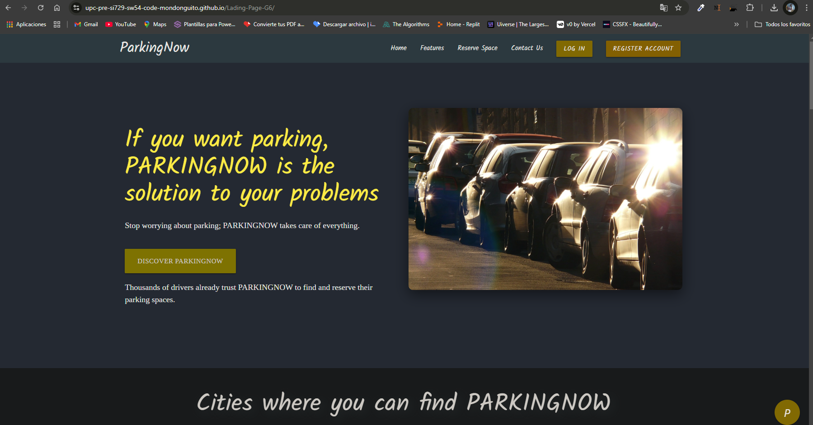
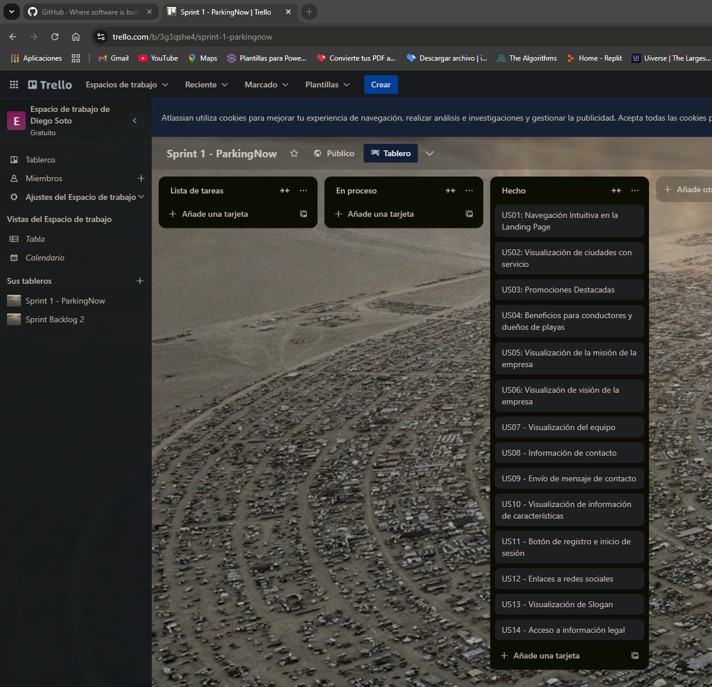

## Capítulo V: Product Implementation, Validation & Deployment

### 5.1. Software Configuration Management

En esta sección, el equipo establece las decisiones y convenciones para mantener la consistencia durante el ciclo de vida del desarrollo del software. Estas convenciones son cruciales para asegurar que todo el equipo esté alineado en términos de uso de herramientas, prácticas de codificación, y procesos de despliegue.

#### 5.1.1. Software Development Environment Configuration

En este apartado se mencionarán los distintos productos de software empleados por el equipo de desarrollo para llevar a cabo las actividades relacionadas con la elaboración del proyecto **PARKINGNOW**.

#### Product UX/UI Design

1. **UXPressia**: [https://uxpressia.com/](https://uxpressia.com/)  
   Se utilizó para la creación de User Personas, Empathy Maps, Journey Maps e Impact Maps, proporcionando una visión centrada en el usuario.

2. **Figma**: [https://www.figma.com/](https://www.figma.com/)  
   Herramienta de diseño colaborativo utilizada para la creación de wireframes, mock-ups y prototipos de aplicaciones móviles y de escritorio.

3. **Miro**: [https://miro.com/](https://miro.com/)  
   Utilizada para la creación de los As-Is y To-Be Scenario Maps, ayudando a visualizar y planificar los diferentes escenarios de uso de la plataforma.

#### Software Development

4. **Visual Studio Code**: [https://code.visualstudio.com/](https://code.visualstudio.com/)  
   Entorno de desarrollo ligero empleado para la creación del landing page y las aplicaciones web, utilizando HTML5, CSS3, JavaScript y TypeScript.

5. **WebStorm**:  
   Entorno de desarrollo utilizado para trabajar con HTML, CSS, JavaScript y frameworks como Vue y Angular.

6. **Rider**:  
   Entorno de desarrollo usado para trabajar con el lenguaje C# y la plataforma .NET, utilizada para crear Web Services basados en ASP.NET para el proyecto.

7. **Spring Boot Framework**:  
   Framework utilizado para desarrollar servicios web RESTful en Java, proporcionando una base escalable y robusta.

8. **GitHub**: [https://github.com/](https://github.com/)  
   Plataforma de control de versiones utilizada para la gestión del código fuente, aplicando el flujo de trabajo GitFlow para garantizar un desarrollo ordenado.

9. **Git**: [https://git-scm.com/](https://git-scm.com/)  
   Software de control de versiones utilizado para gestionar los cambios en el código a través de commits y facilitar el trabajo colaborativo.

#### Project Management and Collaboration

10. **WhatsApp**: [https://web.whatsapp.com/](https://web.whatsapp.com/)  
   Aplicación de mensajería utilizada para la coordinación y discusión de temas relacionados con el proyecto en tiempo real.

11. **Google Docs**: [https://docs.google.com/](https://docs.google.com/)  
   Utilizado para la creación y edición colaborativa de documentos relacionados con el proyecto, permitiendo a varios miembros trabajar simultáneamente.

#### Software Documentation

12. **Vertabelo**: [https://vertabelo.com/](https://vertabelo.com/)  
   Herramienta online utilizada para el diseño, creación y gestión colaborativa de bases de datos para el proyecto.

13. **LucidChart**: [https://lucid.app/](https://lucid.app/)  
   Plataforma utilizada para la creación de diagramas UML, wireflows y user flows, facilitando la visualización y planificación del sistema.

14. **Structurizr**: [https://www.structurizr.com/](https://www.structurizr.com/)  
   Herramienta utilizada para modelar la arquitectura de software mediante diagramas C4, permitiendo un modelado claro de la estructura del proyecto.

#### Software Testing

15. **Swagger / OpenAPI Specification**: [https://swagger.io/specification/](https://swagger.io/specification/)  
   Utilizado para documentar y probar las APIs RESTful desarrolladas con Spring Boot, facilitando la creación de documentación interactiva.

16. **Markdown**  
   Lenguaje de marcado ligero utilizado para documentar el proyecto y en los archivos README del repositorio de la organización.

### 5.1.2. Source Code Management

La gestión del código fuente es una parte fundamental del desarrollo de cualquier proyecto de software, ya que permite rastrear cambios, revertir versiones y coordinar a varios desarrolladores trabajando simultáneamente. En PARKINGNOW, utilizaremos **Git** como sistema de control de versiones y **GitHub** como plataforma para alojar nuestros repositorios.

### URL de los Repositorios:
- **Organización:**  https://github.com/UPC-PRE-SI729-SW54-Code-Mondonguito
- **Reporte:**  https://github.com/UPC-PRE-SI729-SW54-Code-Mondonguito/Report
- **Landing Page:** https://github.com/UPC-PRE-SI729-SW54-Code-Mondonguito/Landing-Page
- **Frontend:** https://github.com/UPC-PRE-SI729-SW54-Code-Mondonguito/Frontend
- **Backend:** https://github.com/UPC-PRE-SI729-SW54-Code-Mondonguito/Backend

### GitFlow

Para la gestión del desarrollo de código, PARKINGNOW sigue el flujo de trabajo **GitFlow**, que permite la creación de ramas para distintas funciones y asegura un proceso de integración continuo y ordenado. A continuación, se detallan las ramas y su funcionamiento:

1. **Master Branch:** Rama principal que contiene las versiones estables del proyecto. Todas las demás ramas se derivan de aquí.
2. **Develop Branch:** Rama secundaria que almacena las características en desarrollo antes de fusionarse a la rama principal.
3. **Feature Branches:** Ramas temporales que se crean para desarrollar nuevas funcionalidades. Estas se crean desde `develop` y, al completarse, se fusionan de nuevo en `develop`.
4. **Feature Branches:**
   - Son ramas temporales que se crean para desarrollar nuevas funcionalidades o solucionar problemas específicos. Estas ramas se crean a partir de **develop** y, una vez finalizado el trabajo, se fusionan nuevamente en **develop**. Cada **feature branch** debe tener un nombre descriptivo, como `feature/nueva-funcionalidad`, que indique la naturaleza de la tarea en desarrollo.

5. **Release Branches:**
   - Estas ramas se crean cuando el equipo decide que la rama **develop** está lista para ser convertida en una nueva versión estable. A partir de aquí, se realizan los últimos ajustes y correcciones antes de fusionarse en la **Master**. Esta rama también permite preparar versiones de prueba para el equipo de QA.

6. **Hotfix Branches:**
   - Son ramas dedicadas a solucionar errores críticos en la **Master** que no pueden esperar a la siguiente versión. Se crean a partir de **Master** y, una vez solucionado el error, se fusionan tanto en **Master** como en **develop** para asegurar que las correcciones también se apliquen a la rama de desarrollo.

### Implementación de GitFlow

Para implementar **GitFlow** en PARKINGNOW, se utiliza la siguiente estructura de ramas:

- **Master:** La versión estable del proyecto, lista para ser lanzada o en producción.
- **Develop:** La rama de desarrollo donde se integran todas las nuevas características antes de ser lanzadas.
- **Feature Branches:** Ramas temporales, nombradas `feature/nombre-funcionalidad`, para el desarrollo de características individuales.
- **Release Branches:** Ramas temporales, nombradas `release/nombre-version`, utilizadas para preparar versiones finales antes de ser fusionadas en **Master**.
- **Hotfix Branches:** Ramas temporales, nombradas `hotfix/nombre-problema`, que permiten arreglar errores críticos en la **Master** y luego se fusionan en **Develop** para mantener el proyecto sincronizado.

### Commits Convencionales

Para los mensajes de commit en el proyecto **PARKINGNOW**, se sigue la convención **Conventional Commits**. Estos mensajes deben seguir el formato estándar para facilitar la lectura y entendimiento del historial del proyecto:

```plaintext
<type>[optional scope]: <description>

[optional body]

[optional footer(s)]
```

- **Type:** 
   - `feat`: Se usa cuando se añade una nueva característica.
   - `fix`: Para la corrección de errores.
   - `docs`: Modificaciones en la documentación.
   - `style`: Cambios que no afectan la lógica del código, como formato o estilo.
   - `refactor`: Modificaciones que no añaden características ni corrigen errores.
   - `test`: Adición o modificación de pruebas.
   
- **Scope:** Proporciona información adicional sobre el área del código afectada. Ejemplo: `feat(auth): add login functionality`.

### Ejemplos de commits:

- `feat(login): add user authentication module`
- `fix(payment): resolve payment gateway issue`
- `docs(README): update setup instructions`

Con esta estructura, **PARKINGNOW** puede gestionar eficientemente el flujo de trabajo del desarrollo, asegurando una integración continua y una organización clara del código fuente.

#### 5.1.3. Source Code Style Guide & Conventions

En el proyecto **PARKINGNOW**, hemos implementado una serie de guías de estilo y convenciones para asegurar que todo el equipo de desarrollo siga una estructura consistente y clara en todo el ciclo de vida del proyecto. Esto facilita la legibilidad del código, mejora la colaboración entre los desarrolladores y asegura que el código sea mantenible a largo plazo.

#### Nomenclatura General

Para asegurar la coherencia en todo el código, se seguirán las siguientes directrices:

- Los nombres de variables, funciones y métodos deben utilizar **camelCase**.
- Los nombres de clases y componentes seguirán la convención **PascalCase**.
- Para los archivos y carpetas, se empleará la convención **kebab-case**.

El uso de **inglés** para todos los nombres es obligatorio, con el fin de asegurar la comprensión entre los miembros del equipo y facilitar la colaboración internacional.

**Ejemplos**:

- Variables: `parkingSpace`, `userLocation`
- Clases: `ParkingManager`, `User`
- Archivos: `parking-manager.service.ts`, `user.controller.js`

#### Espacios y Sangría

La **sangría** de código en **PARKINGNOW** seguirá las siguientes reglas para asegurar la claridad y el orden del código:

- Se utilizarán **2 espacios** para la sangría en archivos HTML, CSS, JavaScript, y TypeScript.
- En archivos **Java**, se utilizarán **4 espacios** para la sangría.

Esta convención ayuda a mantener la consistencia en todos los lenguajes empleados en el proyecto y facilita la colaboración entre diferentes desarrolladores.

**Ejemplo de HTML con sangría**:

```html
<!DOCTYPE html>
<html>
  <head>
    <title>ParkingNOW</title>
  </head>
  <body>
    <h1>Parking Disponibles</h1>
    <p>Encuentra y reserva tu espacio fácilmente</p>
  </body>
</html>
```

#### Convenciones por Lenguaje

1. **HTML/CSS/JavaScript**:
   - Se utilizará la [Google HTML/CSS Style Guide](https://google.github.io/styleguide/htmlcssguide.html) para asegurar la consistencia en la estructura y la presentación de los archivos HTML y CSS.
   - Para JavaScript, adoptamos la [Airbnb JavaScript Style Guide](https://github.com/airbnb/javascript), ampliamente conocida y utilizada en la industria.

2. **TypeScript**:
   - **Angular** es el framework elegido para el frontend de PARKINGNOW, por lo que seguimos la [Angular Style Guide](https://angular.io/guide/styleguide), que dicta cómo deben estructurarse los módulos, servicios y componentes.
   - También seguimos la [Google TypeScript Style Guide](https://google.github.io/styleguide/tsguide.html) para garantizar la correcta tipificación y legibilidad del código.

3. **Java**:
   - En el backend, utilizamos **Spring Boot** para crear APIs y servicios web. Seguimos la [Google Java Style Guide](https://google.github.io/styleguide/javaguide.html) para mantener consistencia en la estructura de las clases y los métodos.
   - Los nombres de clases serán descriptivos, utilizando sustantivos para clases y verbos para métodos.

**Ejemplo de una clase Java**:

```java
public class ParkingManager {
  private int availableSpaces;

  public ParkingManager(int spaces) {
    this.availableSpaces = spaces;
  }

  public void reserveSpace() {
    if (availableSpaces > 0) {
      availableSpaces--;
    }
  }
}
```

4. **Gherkin**:
   - Para escribir los tests automatizados, seguimos la convención de [Gherkin Syntax](https://cucumber.io/docs/gherkin/). Esto permite una descripción clara y precisa de los escenarios de prueba en los archivos `.feature`.
   - Utilizamos **Given-When-Then** para describir el comportamiento esperado en cada escenario.

**Ejemplo de Gherkin**:

```gherkin
Feature: Reserva de espacio de estacionamiento

  Scenario: Reserva exitosa
    Given el usuario ha iniciado sesión
    When selecciona un espacio disponible
    Then el sistema debe confirmar la reserva
```

#### Espaciado y Comillas

- **Espacios**: Siempre se debe colocar un espacio alrededor de los operadores y entre los parámetros en las funciones.
  
  **Ejemplo**:
  ```javascript
  let totalSpaces = 50;
  let bookedSpaces = 10;
  let availableSpaces = totalSpaces - bookedSpaces;
  ```

- **Comillas**: En **JavaScript** y **TypeScript**, se utilizan comillas simples (`'`) para cadenas, mientras que en **HTML** se prefieren las comillas dobles (`"`).

#### Límite de Longitud de Línea

El código no debe exceder las **80 columnas** por línea. En caso de necesitar más espacio, se recomienda dividir la línea de código para mejorar la legibilidad.

#### 5.1.4. Software Deployment Configuration

En esta sección se detalla la configuración necesaria para el despliegue de la solución **PARKINGNOW**, incluyendo los pasos clave para lograr la publicación satisfactoria de la **Landing Page**, **Servicios Web** y **Aplicaciones Web Frontend** utilizando GitHub Pages para visualizar cada commit del **Landing Page**.

A continuación, se describen los pasos para realizar el despliegue de la **Landing Page** del proyecto **PARKINGNOW**:

1. **Actualización de Ramas:**
   Asegúrate de que todas las ramas del repositorio estén actualizadas. Luego, ingresa a GitHub y dirígete al repositorio del proyecto **PARKINGNOW**.

2. **Acceso a las Configuraciones:**
   Una vez dentro del repositorio, haz clic en la pestaña **Settings** en la parte superior del repositorio.


3. **Selección de GitHub Pages:**
   Dentro de la sección **Settings**, en el menú lateral, busca la opción llamada **Pages**. Esta opción permite configurar el despliegue de la página desde una rama específica del repositorio.

   

4. **Configuración de la Rama Principal:**
   En la opción **Pages**, selecciona la rama principal (generalmente llamada **main** o **master**). Luego, haz clic en el botón **Save** para iniciar el proceso de deploy de la página.

  

5. **Confirmación del Deploy:**
   Una vez que GitHub complete el proceso de deploy, en la parte superior de la sección **Pages** se mostrará un mensaje de confirmación junto con el enlace generado para acceder a la **Landing Page** del proyecto.

   

6. **Acceso a la Página:**
   Finalmente, podrás acceder a la **Landing Page** desde el enlace que se generó al finalizar el deploy. Aquí está el enlace para el proyecto **PARKINGNOW**: https://upc-pre-si729-sw54-code-mondonguito.github.io/Landing-Page/

   

### 5.2. Landing Page, Services & Applications Implementation

#### 5.2.1. Sprint 1

En el **Sprint 1**, el equipo se enfocó en desarrollar las principales secciones de la Landing Page de PARKINGNOW, como la navegación intuitiva, el registro de usuarios a través de redes sociales y la visualización de promociones. Durante este sprint, se distribuyeron las tareas entre los miembros del equipo, quienes trabajaron en la implementación del diseño responsivo y funcional de la página.

##### 5.2.1.1. Sprint Planning 1

| Sprint \# | Sprint 1 |
| :---: | :---: |
| **Sprint Planning Background** |  |
| Date | 03/09/24 |
| Time | 22:10 horas |
| Location | Virtual meeting \- Zoom |
| Prepared By | Diego Ulises Soto Quispe |
| Attendees | \- Diego Ulises Soto Quispe <br> \- Diego Alonso Cacho Seminario <br> \- Rodrigo Liberato Saldaña <br> \- Omar Harold Rivera Ticllacuri <br> \- Samuel Elias Molina Asencios |
| Sprint 1 Review Summary | La opinión del product owner y las partes interesadas con respecto al avance realizado sobre el desarrollo de la landing page de PARKINGNOW fue positiva, cumpliendo con los objetivos esperados. |
| Sprint 1 Retrospective Summary | Se completó la implementación de la primera versión de la landing page, aunque se identificaron algunas deficiencias en cuanto al diseño visual y la usabilidad de la plataforma. Se mejorará en futuros sprints. |
| **Sprint Goal & User Stories** |  |
| Sprint 1 Goal | Desarrollar la Landing Page de PARKINGNOW. |
| Sprint 1 Velocity | Velocidad de 30 \- Primer Sprint |
| Sum of Story Points | Sprint 1 \- 23 Story Points |

##### 5.2.1.2. Sprint Backlog 1



Link del Trello: https://trello.com/invite/b/66e8592fa7463897e6009305/ATTI40cdd58c92843377c1bb36efe058ba4f83EFDA35/open-source-parkingnow

| Sprint \# | Sprint 1 |  |  |  |  |  |  |
| :---: | :---: | :---: | :---: | :---: | :---: | :---: | :---: |
| User Story |  | Work-Item / Task |  |  |  |  |  |
| ID | Title | ID | Title | Description | Estimation (Hours) | Assigned To | Status |
| US31 | Mejora de la Interfaz de Búsqueda | T01 | Implementación del header, estilos y barra de navegación | Realizar la barra de navegación utilizando JS/CSS | 3 | Diego Ulises | Done |
| US01 | Navegación Intuitiva	 | T02 | Implementación de la sección Inicio  | Realizar la sección de Inicio empleando estilo responsive | 2 | Omar Harold | Done |
| US02 | Registro con Redes Sociales	 | T03 | Implementación de registro con Redes Sociales | Realizar la sección de registro con Redes Sociales | 2 | Diego Cacho | Done |
| US38 | Creación de Funcionalidad de Registro y Login | T04 | Implementación de la sección Iniciar Sesión/Registrar Cuenta | Realizar la sección de Iniciar Sesión/Registrar Cuenta | 3 | Rodrigo Liberato | Done |
| US04 | Gestión de Reservas en Tiempo Real	 | T05 | Implementación de la sección Reservar y modificar Espacio | Realizar la sección de Reservar y modificar Espacio | 4 | Samuel Elias | Done |

##### 5.2.1.3. Development Evidence for Sprint Review

| Repository | Branch | Commit ID | Commit Message | Commit Message Body | Committed on (Date) |
| :---: | :---: | :---: | :---: | :---: | :---: |
| [https://github.com/UPC-PRE-SI729-SW54-Code-Mondonguito/Landing-Page](https://github.com/UPC-PRE-SI729-SW54-Code-Mondonguito/Landing-Page)  | Feature/main | d033f50 | Update README.md | \- | 15/09/24 |
|  | Feature/main | fcff3d9 | Update README.md | \- | 26/09/24 |
|  | Feature/main | 236b776 | Update README.md | \- | 26/09/24 |
|  | Feature/main | ab49487 | Update README.md | \- | 27/09/24 |
|  | Feature/main | 2f0a9d7 | Update README.md | \- | 27/09/24 |

##### 5.2.1.4. Testing Suite Evidence for Sprint Review

En la presente entrega para el Sprint 1 no se incluye esta sección debido a que se desarrolló principalmente el Landing Page como base. Este se logró realizar satisfactoriamente según las necesidades de nuestros usuarios siguiendo las especificaciones de nuestro Sprint Backlog.

##### 5.2.1.5. Execution Evidence for Sprint Review.
Tras finalizar el Sprint 1, pudimos implementar todas las secciones de nuestra Landing Page, asegurando que se vea perfectamente. También le dimos un formato llamativo que atrae la atención del usuario hacia sus distintos elementos. Además, incorporamos métodos de navegación en la página, como botones al principio y al final, que permiten desplazarse fácilmente entre las secciones. A continuación, te compartimos imágenes que muestran los avances logrados.

Es importante destacar que el objetivo principal del Landing Page es convertir a los visitantes en futuros clientes o usuarios habituales de nuestro servicio. Para lograrlo, utilizamos llamados a la acción (Call To Action) que los guían hacia la aplicación web.

A continuación, te presentamos capturas de pantalla del desarrollo del Landing Page:

En la parte superior, el encabezado (Header) presenta botones para Inicio (Home), Características (Characteristics), Reserva de Espacio (Reserve-Space), y Contáctenos (Contact-Us), así como información sobre nosotros. Estos elementos permiten a los visitantes navegar fácilmente a la sección que desean ver.


**Imagen 1:** Encabezado y botones de desplazamiento.

Se muestra la sección "Transforma", que ofrece una breve descripción y una frase representativa de ParkingNow. Esta sección facilita el inicio del uso del servicio web y presenta una imagen vinculada al mismo.


**Imagen 2:** Sección Transforma.

Se presenta la sección de beneficios del servicio, destacando las ventajas específicas para cada segmento objetivo definido por el equipo.


**Imagen 3:** Sección Beneficios del servicio

La sección de tipos de clientes en la landing page muestra a los posibles usuarios los distintos perfiles de clientes disponibles.


**Imagen 4:** Sección tipo de cliente.

Seguidamente se presenta la sección de contacto, aquí nuestros posibles usuarios pueden realizarnos preguntas personalizadas acerca de la aplicación que se está presentando.


**Imagen 5:** Sección Contáctenos

A continuación, se muestra la sección "Sobre nosotros" (about-us), donde se ofrece un resumen con información sobre los integrantes que están desarrollando la solución de software.


**Imagen 6:** Sección footer.
Finalmente, se muestra la sección del pie de página, donde están disponibles nuestros enlaces para que el usuario pueda volver a las secciones que prefiera.

##### 5.2.1.6. Services Documentation Evidence for Sprint Review.

En el primer sprint, hemos desarrollado y lanzado la página de inicio de la aplicación web "PARKINGNOW". Esta página incluye diferentes secciones, las cuales fueron creadas por el equipo Code Mondonguito, con cada miembro del grupo responsable de una sección específica.

<table> 
  <tr>
    <td> <strong>End Point </strong></td>
    <td align="center"> <strong>Funciones</strong> </td>
  </tr>

  <tr>
    <td>  https://upc-pre-si729-sw54-code-mondonguito.github.io/Landing-Page/</td>
    <td> Desplegar Landing Page de PARKINGNOW</td>
  </tr>
</table>

##### 5.2.1.7. Software Deployment Evidence for Sprint Review.

Para implementar nuestra página, decidimos usar GitHub Pages. Durante este proceso, creamos un repositorio en GitHub para gestionar el control de versiones. En la sección de Configuración, publicamos el proyecto desde la rama "main", que anteriormente estaba en la rama "developer".

**Link de la Landing Page desplegada:** [PARKINGNOW](https://upc-pre-si729-sw54-code-mondonguito.github.io/Landing-Page/) **-**  https://upc-pre-si729-sw54-code-mondonguito.github.io/Landing-Page/

##### 5.2.1.8. Team Collaboration Insights during Sprint.
En esta entrega, nuestro objetivo principal fue la creación de la Landing Page. Para lograrlo, utilizamos varias herramientas, incluyendo GitHub, Visual Studio Code, WebStorm, HTML, CSS y JavaScript. A continuación, presentamos los diagramas de flujo que muestran los commits realizados por cada miembro del equipo PARKINGNOW:


Esta imagen proporciona una representación visual de las fechas en que se realizaron modificaciones en el repositorio de nuestra Landing Page, así como el número de cambios efectuados en cada commit. Este gráfico es útil para entender cómo ha evolucionado el proyecto a lo largo del tiempo y la intensidad del desarrollo.


Estos gráficos muestran de manera visual las clonaciones realizadas en nuestro repositorio y las fechas en que ocurrieron. También proporcionan información sobre el número de visitantes que ha tenido el repositorio a lo largo del tiempo.


#### 5.2.2 Sprint 2

##### 5.2.2.1.Sprint Planning 2 

En esta sección se especifican los detalles del Sprint Planning Meeting, que es una reunión que se lleva a cabo al inicio de cada sprint con la finalidad de establecer las tareas que se realizarán durante el período determinado.

##### 5.2.2.2. Sprint Planning 2

| Sprint # | Sprint 2 |
| :---: | :---: |
| **Sprint Planning Background** |  |
| Date | 21/09/24 |
| Time | 11:00 AM |
| Location | Virtual meeting \- Zoom |
| Prepared By | Diego Ulises Soto Quispe |
| Attendees | \- Diego Ulises Soto Quispe <br> \- Diego Alonso Cacho Seminario <br> \- Rodrigo Liberato Saldaña <br> \- Omar Harold Rivera Ticllacuri <br> \- Samuel Elias Molina Asencios |
| Sprint 2 Review Summary | El objetivo del Sprint fue mejorar la experiencia del usuario con la optimización de las funcionalidades de la página PARKINGNOW. Se completaron tareas técnicas relacionadas con la API y la gestión de usuarios. |
| Sprint 2 Retrospective Summary | La ejecución del Sprint fue efectiva, aunque se presentaron retos en la integración de la API. En el siguiente Sprint se mejorarán las funciones de notificaciones y seguridad. |
| **Sprint Goal & User Stories** |  |
| Sprint 2 Goal | Desarrollar la gestión de usuarios y la creación de APIs básicas para la plataforma PARKINGNOW. |
| Sprint 2 Velocity | Velocidad de 30 - Segundo Sprint |
| Sum of Story Points | Sprint 2 - 30 Story Points |


##### Sprint Backlog 2


Link del Trello: https://trello.com/invite/b/66e9b5b8f40799cfcf6b00d3/ATTIa96971e39f8a6c5827fd4d56f290181a384AD640/sprint-backlog-2

| Sprint \# | Sprint 2 |  |  |  |  |  |  |
| :---: | :---: | :---: | :---: | :---: | :---: | :---: | :---: |
| User Story |  | Work-Item / Task |  |  |  |  |  |
| ID | Title | ID | Title | Description | Estimation (Hours) | Assigned To | Status |
| US13 | Creación de Endpoint | T01 | Obtener Disponibilidad | Crear un endpoint que devuelva la disponibilidad de los espacios en tiempo real | 6 | Omar Harold | To-do |
| US17 | Implementación de Logs | T02 | Auditoría | Implementar el sistema de auditoría para registrar las acciones importantes en la plataforma | 4 | Samuel Elias | To-do |
| US20 | Creación de API | T03 | Gestión de Usuarios | Desarrollar una API que permita la gestión CRUD de usuarios | 4 | Rodrigo Liberato | In-Process |
| US16 | Simplificación del Proceso de Reservas | T04 | Proceso Simplificado | Implementar un proceso simplificado para hacer reservas de espacios de estacionamiento más rápido | 4 | Diego Alonso | Done |
| US18 | Gestión Básica de Promociones | T05 | Gestión de Promociones | Desarrollar una funcionalidad para gestionar promociones básicas en la plataforma | 5 | Diego Ulises | Done |
| US19 | Implementación de Funcionalidades de Seguridad Avanzadas | T06 | Seguridad Avanzada | Implementar características avanzadas de seguridad para proteger las transacciones y los datos del usuario | 6 | Omar Harold | Done |

##### 5.2.2.3. Development Evidence for Sprint Review
| Repository | Branch | Commit ID | Commit Message | Commit Message Body | Committed on (Date) |
| :---: | :---: | :---: | :---: | :---: | :---: |
| [https://github.com/UPC-PRE-SI729-SW54-Code-Mondonguito/Landing-Page](https://github.com/UPC-PRE-SI729-SW54-Code-Mondonguito/Landing-Page)  | feature/chapter-5 | f93fb7c | Add Sprint 2 table to README | \- | 17/09/24 |
|  | feature/chapter-5 | b3ba393 | Added 5.2.2.6 section on README.md | \- | 24/09/24 |
|  | feature/chapter-5 | a5224f0 | Update README.md | \- | 23/09/24 |
|  | feature/chapter-5 | 0581697 | Updated README.md and added Trello board screenshot | \- | 17/09/24 |
|  | feature/chapter-5 | 74b2f9c | Update README.md | \- | 24/09/24 |

##### 5.2.2.4. Testing Suite Evidence for Sprint Review
Debido al desarrollo del Landing Page y del Front End Application dentro del Sprint 2, se omite esta sección para el presente avance del proyecto. En futuro desarrollo se brindará información con mayor detalle.

#### 5.2.3 Sprint 3

##### 5.2.3.1.Sprint Planning 3 

En esta sección se especifican los detalles del Sprint Planning Meeting, que es una reunión que se lleva a cabo al inicio de cada sprint con la finalidad de establecer las tareas que se realizarán durante el período determinado.

##### 5.2.3.2. Sprint Backlog 3

##### 5.2.3.3. Development Evidence for Sprint Review

##### 5.2.3.4. Testing Suite Evidence for Sprint Review
##### 5.2.3.5. Execution Evidence for Sprint Review. 
##### 5.2.3.6. Services Documentation Evidence for Sprint Review. 

En el tercer sprint se logró avanzar con el 50% del desarrollo del BackEnd; sin embargo, aún no se ha implementado, aunque sí se ha conseguido desplegarlo.


| **EndPoint**                                                                                                                    | **HttpVerb**               | **Action**                                                                                                                                                     |
|-------------------------------------------------------------------------------------------------------------------------------|----------------------------|----------------------------------------------------------------------------------------------------------------------------------------------------------------|
| https://raw.githubusercontent.com/UPC-PRE-SI729-SW54-Code-Mondonguito/Backend/main/src/public/conductores.json               | GET, POST                  | - Obtener todos los conductores.<br>- Crear un nuevo conductor.                                                                                             |
| https://raw.githubusercontent.com/UPC-PRE-SI729-SW54-Code-Mondonguito/Backend/main/src/public/reservas.json                 | GET, POST                  | - Obtener todas las reservas.<br>- Crear una nueva reserva.                                                                                                |
| https://raw.githubusercontent.com/UPC-PRE-SI729-SW54-Code-Mondonguito/Backend/main/src/public/espacios.json                 | GET                        | - Obtener todos los espacios.                                                                                                                                 |
| https://raw.githubusercontent.com/UPC-PRE-SI729-SW54-Code-Mondonguito/Backend/main/src/public/locales.json                  | GET                        | - Obtener todos los locales.                                                                                                                                 |
| https://raw.githubusercontent.com/UPC-PRE-SI729-SW54-Code-Mondonguito/Backend/main/src/public/dueniosDePlaya.json           | GET, POST                  | - Obtener todos los dueños de playa.<br>- Crear un nuevo dueño de playa.                                                                                   |

##### 5.2.3.7. Software Deployment Evidence for Sprint Review.

##### 5.2.3.8. Team Collaboration Insights during Sprint.  
**Backend**
En esta entrega, nuestro objetivo principal fue avanzar en la implementación parcial del backend. Para lograr esta meta, empleamos varias herramientas, incluyendo GitHub, IntelliJ y Java. A continuación, presentamos los diagramas de flujo que muestran los commits realizados por cada integrante del equipo CodeMondonguito.


La imagen muestra un gráfico de barras que representa la cantidad de commits realizados por cada miembro del equipo.


Esta imagen proporciona una representación visual de las fechas en las que se efectuaron cambios en el repositorio de nuestra Landing Page, junto con el número de modificaciones realizadas en cada commit. Este gráfico es una herramienta útil para entender la evolución del proyecto a lo largo del tiempo y la intensidad del desarrollo en diferentes periodos.


En esta imagen se muestra las ramas realizadas para el desarrollo del backend de nuestra app web. Siendo una muestra del desarrollo de esta.


En esta imagen se muestra las ramas realizadas para el desarrollo del frontend de nuestra app web.Siendo una muestra del desarrollo de esta.


**Frontend**

En esta entrega, nuestra segunda meta fue la implementación total del fontend. Para llevar a cabo este objetivo, hicimos uso de diversas herramientas como GitHub y Webstrom. A continuación, vamos a presentar los diagramas de flujo que representan los commits realizados por cada miembro del equipo CodeMondonguito:


En la imagen se evidencia el gráfico de barras de la cantidad de commits realizadas por cada uno de los integrantes del equipo.


Esta imagen presenta una visualización de las fechas en las que se realizaron cambios en el repositorio de nuestra Landing Page, así como el número de modificaciones efectuadas en cada commit. Esta representación gráfica es útil para entender la evolución del proyecto a lo largo del tiempo y la intensidad del desarrollo.


**Landing Page**

Finalmente, en esta sección nos enfocamos en el desarrollo de nuestra Landing Page. Utilizando herramientas como GitHub, Webstorm y Figma, creamos una interfaz atractiva y funcional que sirve como la primera impresión para los usuarios. A continuación, se presentan los diagramas de flujo que detallan los commits realizados en este aspecto del proyecto:


Esta imagen muestra un gráfico que ilustra el progreso en los commits relacionados con la Landing Page, destacando la colaboración de cada miembro del equipo en esta fase.


Además, esta imagen proporciona un análisis temporal de las modificaciones efectuadas en la Landing Page, permitiendo observar cómo ha evolucionado su diseño y funcionalidad a lo largo del desarrollo. Esta información es esencial para evaluar el rendimiento del equipo y la efectividad de las estrategias implementadas en el diseño de la interfaz.


### 5.3 Validation Interviews

#### 5.3.1 Diseño de entrevistas

### Con el objetivo de obtener un mejor entendimiento de nuestros usuarios, realizamos una serie de entrevistas para verificar el rendimiento de nuestra página web.

**Segmento objetivo \#1: Conductores Urbanos Frecuentes**

**Preguntas personales:**

* ¿Cual es tu nombre?  
* ¿Cuántos años tienes?

**Preguntas principales:**

* ¿Sientes que lograste navegar por la página sin complicaciones?  
* ¿Qué opinas acerca del diseño que presenta la página web?  
* ¿Tuviste algún problema al navegar por la página web utilizando tu navegador de preferencia?  
* ¿Consideras que la traducción a Inglés de la página web funciona correctamente?  
* ¿Tuviste algún problema al realizar los pagos para las reservas?  
* ¿Tienes alguna sugerencia o comentario que desees compartir?

**Segmento objetivo \#2: Dueños de playas de estacionamientos**

**Preguntas personales:**

* ¿Cual es tu nombre?  
* ¿Cuántos años tienes?

**Preguntas principales:**

* ¿Sientes que lograste navegar por la página sin complicaciones?  
* ¿Qué opinas acerca del diseño que presenta la página web?  
* ¿Tuviste algún problema al navegar por la página web utilizando tu navegador de preferencia?  
* ¿Consideras que la traducción a Inglés de la página web funciona correctamente?  
* ¿Tuviste algún problema al registrar tu local en la página?  
* ¿Crees que la información estadística que te brinda la página es suficiente?  
* ¿Tienes alguna sugerencia o comentario que desees compartir?

#### 5.3.2 Registro de entrevistas

**Segmento objetivo \#1: Conductores Urbanos Frecuentes**

Entrevistado N°1: Bárbara Eliana Seminario León

* Sexo: Femenino  
* Edad: 50  
* Ubicación en la que vive: Surco, Lima, Perú.

Acerca de la entrevista:

* Link: [https://youtu.be/EnEIqclMmDc](https://youtu.be/EnEIqclMmDc)   
* Instante en el que inicia: 3:50  
* Duración: 5:12

Resumen:

Para Bárbara, el desarrollo de la página web la deja bastante satisfecha, considera que esta presenta lo necesario para realizar las reservas y cree que las opciones de lenguaje extra podrían ayudar bastante.

Captura de pantalla:


Entrevistado N°2: Mario Andre Cacho Seminario

* Sexo: Masculino  
* Edad: 21  
* Ubicación en la que vive: Surco

Acerca de la entrevista:

* Link: [https://youtu.be/M2yHrYElMV0](https://youtu.be/M2yHrYElMV0)   
* Instante en el que inicia: 3:41  
* Duración: 4:46

Resumen:

Para Mario el diseño de la página web le permite realizar las reservas sin ningún problema, considera que la organización de esta funciona de manera correcta, además indica que, dentro de una futura actualización, le gustaría que hubieran más lenguajes disponibles para la traducción.

Captura de Pantalla:


**Segmento objetivo \#2: Dueños de playas de estacionamientos**

Entrevistado N°1: Johan Bottger Salazar

* Sexo: Masculino  
* Edad: 21  
* Ubicación en la que vive: San Borja

Acerca de la entrevista:

* Link: [https://youtu.be/otzYnbKWOJY](https://youtu.be/otzYnbKWOJY)   
* Instante en el que inicia: 3:20  
* Duración: 5:15

Resumen:

Para Johan, la vista de dueños de playas de estacionamiento es perfecta, cumple con las expectativas que tenía en las entrevistas pasadas y considera que la sección de las estadísticas le podrían ser bastante útil cuando tenga que verificar cómo le está yendo a su negocio.

Captura de pantalla:


Entrevistado N°2: Sebastián de las Casas Latour

* Sexo: Masculino  
* Edad: 20  
* Ubicación en la que vive: San Borja

Acerca de la entrevista: 

* Link: [https://youtu.be/tMtGGK4e4YE](https://youtu.be/tMtGGK4e4YE)   
* Instante en el que inicia:  3:16  
* Duración: 5:23

Resumen:

Para Sebastián, la página web presenta la información de una manera sencilla e intuitiva, considera que las sección de reservas y estadísticas le ayudarían bastante al organizar ciertos aspectos en su playa de estacionamiento.

Captura de pantalla:


#### 5.3.3 Evaluaciones según heurísticas

SITE o APP A EVALUAR: PARKINGNOW

TAREAS A EVALUAR:

El alcance de esta evaluación incluye la revisión de la usabilidad de las siguientes tareas:

1. Inicio de sesión  
2. Registro de nuevo usuario  
3. Navegación de usuario  
4. Detalles de reservas  
5. Pestaña de inicio

No están incluidas en esta versión de la evaluación las siguientes tareas:

1. Métodos de pago  
2. Soporte  
3. Sección de notificaciones

ESCALA DE SEVERIDAD:

Los errores serán puntuados tomando en cuenta la siguiente escala de severidad

| Nivel | Descripción |
| ----- | :---- |
| 1 | Problema superficial: puede ser fácilmente superado por el usuario ó ocurre con muy poco frecuencia. No necesita ser arreglado a no ser que exista disponibilidad de tiempo. |
| 2 | Problema menor: puede ocurrir un poco más frecuentemente o es un poco más difícil de superar para el usuario. Se le debería asignar una prioridad baja resolverlo de cara al siguiente reléase |
| 3 | Problema mayor: ocurre frecuentemente o los usuarios no son capaces de resolverlos. Es importante que sean corregidos y se les debe asignar una prioridad alta. |
| 4 | Problema muy grave: un error de gran impacto que impide al usuario continuar con el uso de la herramienta. Es imperativo que sea corregido antes del lanzamiento. |

**TABLA RESUMEN:**

| \# | Problema | Escala de severidad | Heurística/Principio violado(o) |
| :---: | ----- | :---: | ----- |
| 1 | En la página de inicio de sesión, al seleccionar los botones de “Google” y “Facebook” la aplicación no permite iniciar sesión por esos medios | 2 | Information Architecture: Is it usable? |
| 2 | En la página de inicio de sesión, al presionar el botón de “Iniciar sesión”, no se dirige a una página en concreto | 4 | Information Architecture: Is it usable? |
| 3 | En la sección de registro de usuario, los campos para rellenar no verifican que los datos presenten el formato dado | 1 | Information Architecture: Is it usable? |
| 4 | La sección de “Seguimiento y alarmas” en la vista de conductores frecuentes presenta un botón con texto que no está completo | 1 | Information Architecture: Is it usable? |
| 5 | La sección de “Configuración” presenta varias formas para cambiar el idioma | 1 | Usability: Consistencia y estándares |
| 6 | En la sección de inicio de la vista de dueños de playas de estacionamiento, existen dos botones con el mismo nombre de “Reservas” | 1 | Usability: Consistencia y estándares |
| 7 | En la sección de inicio de la vista de dueños de playas de estacionamiento, el primer botón de Reserva no permite interactuar con los datos que se presentan | 2 | Information Architecture: Is it usable? |

**DESCRIPCIÓN DE PROBLEMAS:**

PROBLEMA \#1: En la página de inicio de sesión, al seleccionar los botones de “Google” y “Facebook” la aplicación no permite iniciar sesión por esos medios

Severidad: 2

Heurística violada: Information Architecture: Is it usable?

Problema:

Al ingresar a la página de inicio de sesión, cuando se selecciona el botón de iniciar sesión con Google o Facebook, estos no brindan un menú para rellenar los datos de nuestra cuenta de respectivamente.


Recomendación:

Permitir al usuario iniciar sesión con los servicios disponibles que se indican.

PROBLEMA \#2: En la página de inicio de sesión, al presionar el botón de “Iniciar sesión”, no se dirige a una página en concreto

Severidad: 4

Heurística violada: Information Architecture: Is it usable?

Problema:

Al ingresar a la página de inicio de sesión, cuando se presiona el botón “Iniciar sesión” nos dirige hacia la página “Page Not Found”, evitando el inicio de sesión correcto.


Recomendación:

Permitir al usuario iniciar sesión al presionar el botón correspondiente.

PROBLEMA \#3: En la sección de registro de usuario, los campos para rellenar no verifican que los datos presenten el formato dado

Severidad: 1

Heurística violada: Information Architecture: Is it usable?

Problema:

Al rellenar los datos de registro de cuenta, la aplicación web requiere de que ciertos campos cumplan con los requisitos necesarios para verificar el uso correcto de datos ingresados, sin embargo, solo la sección de correo emplea esta verificación. 


Recomendación:

No permitir al usuario ingresar con datos incorrectos.

PROBLEMA \#4: La sección de “Seguimiento y alarmas” en la vista de conductores frecuentes presenta un botón con texto que no está completo

Severidad: 1

Heurística violada: Information Architecture: Is it usable?

Problema:

Al ingresar a la sección de “Seguimiento y alarmas” en la vista de conductores frecuentes, existen ciertos botones que, debido al tamaño de la fuente utilizada, no se logra visualizar de manera correcta el contenido del botón.


Recomendación:

Reducir el tamaño de la fuente utilizada para el texto de los botones, reducir el tamaño de los mismos botones o mostrar los datos requeridos en forma de un solo cuadro de texto.

PROBLEMA \#5: La sección de “Configuración” presenta varias formas para cambiar el idioma

Severidad: 1

Heurística violada: Usability: Consistencia y estándares

Problema:

Al ingresar a la sección de “Configuración” en ambas vistas, existen varias maneras de cambiar el idioma correspondiente, primero la barra superior que se encuentra en todas las otras secciones de la página web y la segunda encontrada en forma de cuadro a la derecha en la sección de “Idioma”


Recomendación:

Uniformizar la manera de cambiar el idioma de la página para evitar redundancias.

PROBLEMA \#6: En la sección de inicio de la vista de dueños de playas de estacionamiento, existen dos botones con el mismo nombre de “Reservas”

Severidad: 1

Heurística violada: Usability: Consistencia y estándares

Problema:

Dentro de la sección Inicio de la página web en la vista de dueños de playas de estacionamiento existen dos botones que presentan el nombre de “Reservas”, sin embargo, cada uno presenta información distinta.


Recomendación:

Realizar el cambio de nombre a uno de los botones o juntar la información que se tiene en ambas secciones.

PROBLEMA \#7: En la sección de inicio de la vista de dueños de playas de estacionamiento, el primer botón de Reserva no permite interactuar con los datos que se presentan

Severidad: 2

Heurística violada: Information Architecture: Is it usable?

Problema:

Dentro de la primera sección “Reserva” en el inicio de la página web en la vista de dueños de playas de estacionamiento al presionar los botones ninguno realiza alguna acción. 


Recomendación:

Brindar algún cambio de página o interfaz al presionar los botones dentro de esta sección o indicar la información de cada uno en un solo bloque de texto.


### Conclusiones y recomendaciones

El proyecto PARKINGNOW ha alcanzado avances significativos en la creación de una solución tecnológica integral para resolver los problemas de estacionamiento en las ciudades. Al combinar sensores infrarrojos de detección en tiempo real con una plataforma intuitiva para los usuarios, PARKINGNOW no solo optimiza la ocupación de los espacios de estacionamiento, sino que también facilita el día a día de los conductores urbanos. Esta solución ha demostrado ser eficaz tanto en la reducción de tiempos de búsqueda como en la mejora de la rentabilidad para los dueños de playas de estacionamiento, mostrando un balance ideal entre tecnología y experiencia del usuario.

A lo largo del desarrollo, se ha priorizado un enfoque en la automatización, lo que ha permitido la integración fluida con los sistemas de gestión de estacionamientos ya existentes. Las entrevistas de validación con usuarios y pruebas de campo han confirmado que la solución no solo cumple con las expectativas iniciales, sino que supera las necesidades de los principales actores involucrados. La aplicación no solo resuelve el problema de encontrar estacionamiento, sino que contribuye al alivio del tráfico urbano y a una gestión más eficiente de los recursos, alineándose con los objetivos de sostenibilidad a largo plazo.

PARKINGNOW tiene el potencial de consolidarse como un referente en la gestión de estacionamientos urbanos, especialmente en grandes ciudades donde los problemas de tráfico y la falta de espacios de estacionamiento representan un desafío diario. La plataforma ha mostrado una capacidad destacada para escalar y adaptarse a diferentes contextos, tanto en términos geográficos como en la evolución tecnológica.

**Recomendaciones:**

1. **Expansión de funcionalidades:** Se recomienda que PARKINGNOW continúe invirtiendo en el desarrollo de nuevas características que agreguen valor para los usuarios y propietarios de estacionamientos. Esto podría incluir la integración de sistemas de pago automatizados, alertas en tiempo real sobre disponibilidad de espacios y la mejora en la personalización de la experiencia del usuario a través de análisis predictivos de patrones de uso. Además, el uso de tecnología avanzada, como inteligencia artificial para pronósticos de ocupación, podría posicionar aún más a PARKINGNOW como un líder en la industria.

2. **Expansión geográfica y sectorial:** Con el éxito demostrado en los primeros mercados, PARKINGNOW debería buscar expandirse a otras ciudades con alta demanda de estacionamiento y problemas recurrentes de tráfico. Además, explorar nuevas oportunidades en sectores específicos, como aeropuertos, centros comerciales y eventos masivos, podría ampliar aún más el mercado objetivo de la plataforma.

3. **Estrategia de marketing y educación:** Para aumentar la adopción de la plataforma, es clave diseñar una campaña de marketing digital dirigida tanto a conductores como a dueños de estacionamientos. El uso de testimonios de usuarios satisfechos y estudios de caso concretos que demuestren la reducción de tiempo y costos puede ser una herramienta eficaz para atraer nuevos usuarios. También es importante educar al público objetivo sobre el impacto positivo que tiene el uso de PARKINGNOW en la mejora del tráfico y la sostenibilidad urbana.

4. **Monitoreo y análisis continuo:** A medida que la plataforma crece, es esencial implementar sistemas de análisis continuo de los datos generados por los usuarios y los espacios de estacionamiento. El análisis de grandes volúmenes de datos permitirá la identificación temprana de problemas y la adaptación rápida a las necesidades cambiantes del mercado. Además, este enfoque de mejora continua garantizará que la experiencia del usuario siga siendo óptima y que el servicio mantenga su competitividad en el tiempo.

5. **Sostenibilidad y responsabilidad social:** A medida que el impacto de PARKINGNOW crece, es recomendable enfocarse aún más en su papel dentro del ecosistema de movilidad sostenible. Iniciativas como reducir la huella de carbono de los conductores mediante la disminución de tiempo en busca de estacionamiento y la colaboración con proyectos de ciudades inteligentes posicionarán a PARKINGNOW no solo como una empresa rentable, sino también como un agente clave en la sostenibilidad urbana.

### Video About-the-Team


# Bibliografía

1. **ICCSI**. (2023, 12 de marzo). *Estacionamiento inteligente con sensores: Revolución en estacionamientos*. ICCSI. Recuperado el 6 de septiembre de 2024, de [https://iccsi.com.ar/estacionamiento-inteligente-con-sensores](https://iccsi.com.ar/estacionamiento-inteligente-con-sensores)

2. **Conducimos contigo**. (s.f.). *Elparking.com*. Recuperado el 1 de septiembre de 2024, de [https://elparking.com/](https://elparking.com/)

3. **InnovaTech**. (2023, 15 de junio). *Smart Parking IoT: Descubre cómo funciona*. InnovaTech. Recuperado el 6 de septiembre de 2024, de [https://www.innova-tech.mx/smart-parking-iot](https://www.innova-tech.mx/smart-parking-iot)

4. **People, S.**. (s.f.). *App Aparcados*. Apk2gestion.com. Recuperado el 2 de septiembre de 2024, de [https://apk2gestion.com/es/servicios/conoce-nuestra-app](https://apk2gestion.com/es/servicios/conoce-nuestra-app)

5. **Reserva de parking - Parkimeter**. (s.f.). *Parkimeter.com*. Recuperado el 3 de septiembre de 2024, de [https://parkimeter.com/es?srsltid=AfmBOoqJCDlJN_hdtP3dMuF6fXWF8B1PytqQ2hWnVsgR7rEAH4a00y3P](https://parkimeter.com/es?srsltid=AfmBOoqJCDlJN_hdtP3dMuF6fXWF8B1PytqQ2hWnVsgR7rEAH4a00y3P)

6. **Sernauto**. (s.f.). *Tipos de sensores de los vehículos: Qué función cumplen*. Sernauto. Recuperado el 6 de septiembre de 2024, de [https://www.sernauto.es/blog/tipos-de-sensores-de-losvehiculos-que-funcion-cumplen/](https://www.sernauto.es/blog/tipos-de-sensores-de-losvehiculos-que-funcion-cumplen/)

7. **Propuesta País**. (2023, 22 de julio). *La necesidad de una política de estacionamiento vehicular en Lima Metropolitana*. Propuesta País. Recuperado el 6 de septiembre de 2024, de [https://propuestapais.pe/noticia/la-necesidad-de-una-politica-de-estacionamiento-vehicular-en-lima-metropolitana/](https://propuestapais.pe/noticia/la-necesidad-de-una-politica-de-estacionamiento-vehicular-en-lima-metropolitana/)

8. **Intertraffic**. (2023, 28 de junio). *Revolucionando las experiencias de estacionamiento: Las últimas soluciones inteligentes para un estacionamiento eficiente*. Intertraffic. Recuperado el 6 de septiembre de 2024, de [https://www.intertraffic.com/news/espanol/revolucionando-las-experiencias-de-estacionamiento](https://www.intertraffic.com/news/espanol/revolucionando-las-experiencias-de-estacionamiento)

## Anexos

| Sección                                                   | Enlace                                                                                                                                                             |
|-----------------------------------------------------------|--------------------------------------------------------------------------------------------------------------------------------------------------------------------|
| Lean UX Canvas                                             | [https://www.canva.com/design/DAGOyaW6z7E/ub8lVBXsKH3Em5YVQb223g/edit?utm_content=DAGOyaW6z7E&utm_campaign=designshare&utm_medium=link2&utm_source=sharebutton](https://www.canva.com/design/DAGOyaW6z7E/ub8lVBXsKH3Em5YVQb223g/edit?utm_content=DAGOyaW6z7E&utm_campaign=designshare&utm_medium=link2&utm_source=sharebutton) |
| To be Scenario Mapping - Dueños de playa de estacionamiento | [https://miro.com/app/board/uXjVKmNkzqc=/?share_link_id=307784420338](https://miro.com/app/board/uXjVKmNkzqc=/?share_link_id=307784420338)                                                               |
| To be Scenario Mapping - Conductores Urbanos Frecuentes     | [https://miro.com/app/board/uXjVKmOWBhk=/?share_link_id=425124811159](https://miro.com/app/board/uXjVKmOWBhk=/?share_link_id=425124811159)                                                               |
| Dueños de playas de estacionamientos                       | [https://miro.com/app/board/uXjVKkwEdZI=/?share_link_id=724391040067](https://miro.com/app/board/uXjVKkwEdZI=/?share_link_id=724391040067)                                                               |
| Conductores Urbanos Frecuentes                             | [https://miro.com/app/board/uXjVKlATTNc=/?share_link_id=958948485500](https://miro.com/app/board/uXjVKlATTNc=/?share_link_id=958948485500)                                                               |
| Figma                                                     | [https://www.figma.com/design/qb02D1snVoDtoLfT0qdkRV/Parking-now?node-id=0-1&t=32cD1vUOTgXzKlv9-1](https://www.figma.com/design/qb02D1snVoDtoLfT0qdkRV/Parking-now?node-id=0-1&t=32cD1vUOTgXzKlv9-1)     |
| Vertabelo                                                 | [https://my.vertabelo.com/doc/pYDPCowUTtVaVuDmakCr4QlOKjdT1o1o](https://my.vertabelo.com/doc/pYDPCowUTtVaVuDmakCr4QlOKjdT1o1o)                                                                           |
| Entrevistas en general - Segmento 1 y 2                                     | [https://upcedupe-my.sharepoint.com/:v:/g/personal/u202223990_upc_edu_pe/EbIvmu-9HRFItJu_A2zbRx0BPfLCx2uRJnBarh-nlbO95A?nav=eyJyZWZlcnJhbEluZm8iOnsicmVmZXJyYWxBcHAiOiJTdHJlYW1XZWJBcHAiLCJyZWZlcnJhbFZpZXciOiJTaGFyZURpYWxvZy1MaW5rIiwicmVmZXJyYWxBcHBQbGF0Zm9ybSI6IldlYiIsInJlZmVycmFsTW9kZSI6InZpZXcifX0%3D&e=jlmpb3](https://upcedupe-my.sharepoint.com/:v:/g/personal/u202223990_upc_edu_pe/EbIvmu-9HRFItJu_A2zbRx0BPfLCx2uRJnBarh-nlbO95A?nav=eyJyZWZlcnJhbEluZm8iOnsicmVmZXJyYWxBcHAiOiJTdHJlYW1XZWJBcHAiLCJyZWZlcnJhbFZpZXciOiJTaGFyZURpYWxvZy1MaW5rIiwicmVmZXJyYWxBcHBQbGF0Zm9ybSI6IldlYiIsInJlZmVycmFsTW9kZSI6InZpZXcifX0%3D&e=jlmpb3) |
|Link de video de exposicion |[https://upcedupe-my.sharepoint.com/:v:/g/personal/u202215623_upc_edu_pe/EWKHzhsfxolEvJLdJNUX07sBGrxabKWvXX_kvqdSpUFZTA?e=MpiEeE ](https://upcedupe-my.sharepoint.com/:v:/g/personal/u202215623_upc_edu_pe/EWKHzhsfxolEvJLdJNUX07sBGrxabKWvXX_kvqdSpUFZTA?e=MpiEeE ) |
|Link del Trello | https://trello.com/invite/b/66e8592fa7463897e6009305/ATTI40cdd58c92843377c1bb36efe058ba4f83EFDA35/open-source-parkingnow |
