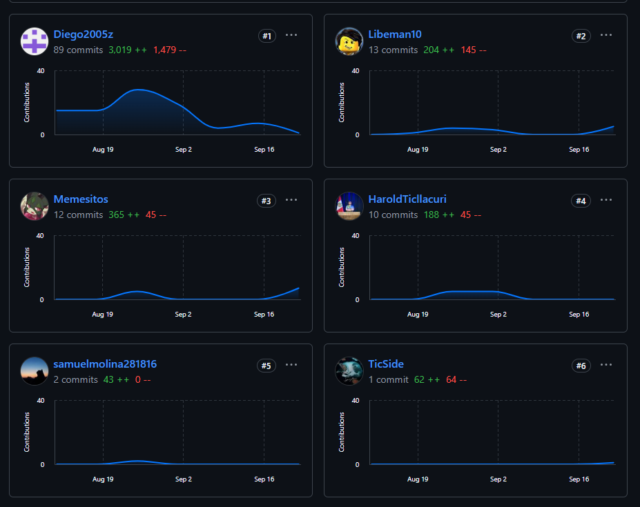
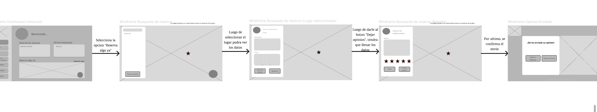
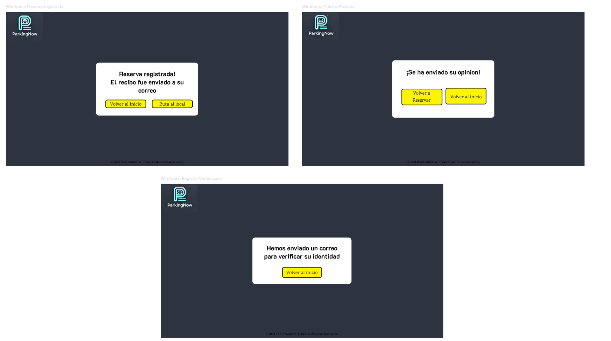
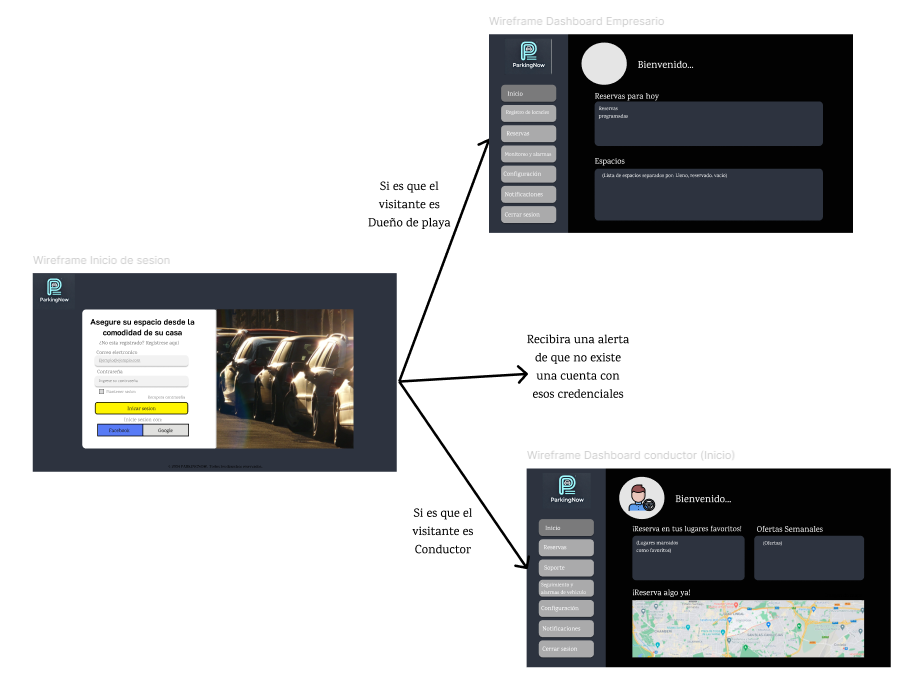
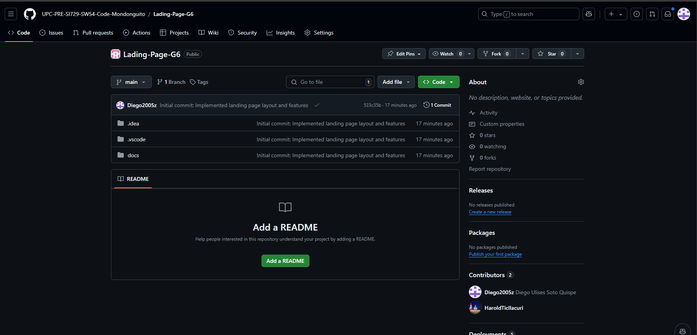
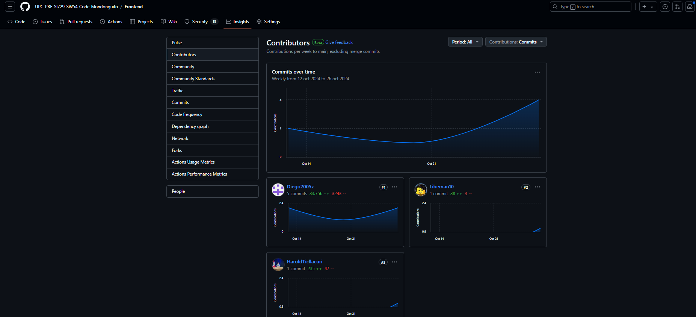
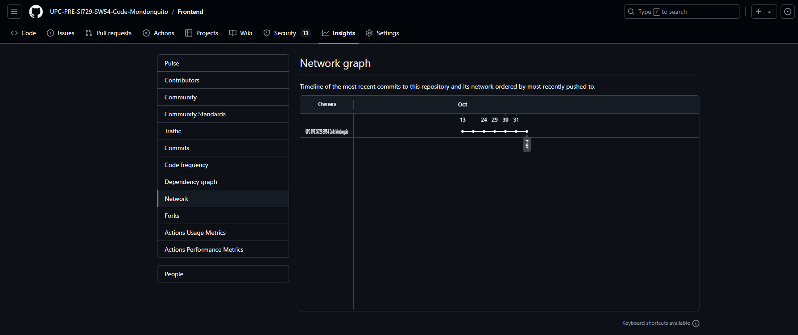

# **COURSE PROJECT**

<p align="center">
  
</p>

<p align="center"><strong>Universidad Peruana de Ciencias Aplicadas</strong></p>

<p align="center"><strong>Ingeniería de Software</strong><br>
Desarrollo de Aplicaciones Open Source - SW54 <br>
Ciclo: 5to <br>
<strong>Profesor:</strong> Alberto Wilmer Sanchez Seña</p>

<h2 align="center">INFORME</h2>

<h3 align="center">Startup: Code Mondoguito</h3>
<p align="center"><strong>Producto: ParkingNow</strong></p>

<h3 align="center">Team Members:</h3>

<div align="center">

| **Member**                           | **Code**     |
|--------------------------------------|--------------|
| Diego Alonso Cacho Seminario      | U202223990   |
| Rodrigo Liberato Saldaña       | U202215623   |
| Samuel Elias Molina Asencios     | U20191A456   |
| Omar Harold Rivera Ticllacuri      | U202214214   |
| Diego Ulises Soto Quispe     | U2022144778   |

</div>

<p align="center"><strong>Septiembre 2024</strong></p>

# Registro de Versiones del Informe

| Versión | Fecha       | Autor(es)                                                                                                  | Descripción de la modificación                                                                                                                                                       |
|---------|-------------|------------------------------------------------------------------------------------------------------------|---------------------------------------------------------------------------------------------------------------------------------------------------------------------------------------|
| TB1     | 07/09/2024  | Diego Alonso Cacho Seminario<br><br>Rodrigo Liberato Saldaña<br><br>Samuel Elias Molina Asencios<br><br>Omar Harold Rivera Ticllacuri<br><br>Diego Ulises Soto Quispe | Se agregó el contenido del capítulo 1 (apartados 1.1, 1.2 y 1.3); el contenido del capítulo 2 (apartados 2.1, 2.2, 2.3, 2.4); el contenido del capítulo 3 (apartados 3.1, 3.2, 3.3 y 3.4); el contenido del capítulo 4 (apartados 4.1, 4.2, 4.3, 4.4, 4.5, 4.6, 4.7 y 4.8); y el contenido del capítulo 5 (apartados 5.1 y 5.2). |
| TP1     |  25/09/2024          | Diego Alonso Cacho Seminario<br><br>Rodrigo Liberato Saldaña<br><br>Samuel Elias Molina Asencios<br><br>Omar Harold Rivera Ticllacuri<br><br>Diego Ulises Soto Quispe |    Se agregó el contenido del capítulo 5, apartados 5.2.2, 5.2.2.1, 5.2.2.2, 5.2.2.3, 5.2.2.4, 5.2.2.5, 5.2.2.6, 5.2.2.7, 5.2.2.8|                                                                                                                                                                                    |
| TB2     |   01/11/2024          | Diego Alonso Cacho Seminario<br><br>Rodrigo Liberato Saldaña<br><br>Samuel Elias Molina Asencios<br><br>Omar Harold Rivera Ticllacuri<br><br>Diego Ulises Soto Quispe |               Se agregó el contenido del capítulo 5, apartados 5.2.3, 5.2.3.1, 5.2.3.2, 5.2.3.3, 5.2.3.4, 5.2.3.5, 5.2.3.6, 5.2.3.7, 5.2.3.8, 5.3, 5.3.1, 5.3.2, 5.3.3, 5.4 y las conclusiones.                                                                                                                                                                        |
| TF1     |             | Diego Alonso Cacho Seminario<br><br>Rodrigo Liberato Saldaña<br><br>Samuel Elias Molina Asencios<br><br>Omar Harold Rivera Ticllacuri<br><br>Diego Ulises Soto Quispe |       Se agregó el contenido del capítulo 5, apartados 5.2.4, 5.2.4.1, 5.2.4.2, 5.2.4.3, 5.2.4.4, 5.2.4.5, 5.2.4.6, 5.2.4.7, 5.2.4.8 y al capítulo de Conclusiones.                                                                                                                                                                                |


# Project Report Collaboration Insights

TB1: Las tareas asignadas para la entrega TB1 se han completado y están documentadas en el siguiente repositorio de GitHub perteneciente a la organización del equipo: [Repositorio GitHub](https://github.com/UPC-PRE-SI729-SW54-Code-Mondonguito/Report). (https://github.com/UPC-PRE-SI729-SW54-Code-Mondonguito/Report)

Durante la preparación del informe, se llevaron a cabo las siguientes actividades:

- Se escribieron y diagramaron los contenidos asignados a cada miembro en formato Markdown, seguido de commits para asegurar el progreso en el repositorio.
- Se crearon los artefactos necesarios utilizando las herramientas recomendadas y se obtuvieron enlaces de imagen a través de la carpeta `Assets` en la rama `develop` del repositorio del informe.
- Se organizaron reuniones para coordinar el progreso de los elementos del informe y para comunicar los avances del Sprint 1, que se enfoca en la Landing Page.


TP1: Durante la preparación del informe, se llevaron a cabo las siguientes actividades:

- Se escribieron y diagramaron los contenidos asignados a cada miembro en formato Markdown, seguido de commits para asegurar el progreso en el repositorio.
- Se crearon los artefactos necesarios utilizando las herramientas recomendadas y se obtuvieron enlaces de imagen a través de la carpeta `Assets` en la rama `develop` del repositorio del informe.
- Se organizaron reuniones para coordinar el progreso de los elementos del informe y para comunicar los avances del Sprint 2, que se enfoca en el front-end de la aplicación web.


 TB2: Avances del Sprint 3 en el proyecto ParkingNow

Las tareas asignadas para la entrega del Sprint 3 se han completado y están documentadas en el repositorio de GitHub perteneciente a la organización del equipo: https://github.com/UPC-PRE-SI729-SW54-Code-Mondonguito

Durante la preparación del informe, se llevaron a cabo las siguientes actividades:

- **Implementación de Endpoints en Bounded Contexts**: Cada miembro del equipo desarrolló los endpoints correspondientes a los bounded contexts designados previamente en el sprint backlog 3. Estos contexts incluyen módulos clave del backend como el manejo de reservas, transacciones, alertas, asesorías y la administración de usuarios y conductores.

- **Creación y Documentación de Artefactos**: Se generaron los artefactos necesarios utilizando las herramientas recomendadas, y se obtuvieron enlaces de imagen a través de la carpeta `assets` en la rama `develop` del repositorio del informe. Estos artefactos incluyen diagramas de clases, capturas de pantalla de la estructura del backend, y documentación de servicios web.

- **Reuniones de Coordinación**: Se organizaron reuniones regulares para coordinar el progreso de los elementos del informe y comunicar los avances del Sprint 3, que se enfocó en el backend de la aplicación web. Durante estas reuniones, se discutieron temas como la implementación de la arquitectura CLEAN, la integración de CQRS y la separación de servicios en el backend.


TF: Tareas y Actividades Realizadas para la Entrega TF

Las actividades asignadas para la entrega TF han sido completadas exitosamente y están registradas en el repositorio oficial de GitHub asociado al equipo: https://github.com/UPC-PRE-SI729-SW54-Code-Mondonguito

### Actividades Realizadas

- Cada integrante del equipo fue responsable de implementar los endpoints correspondientes a los módulos establecidos en el backlog del sprint 4. Asimismo, se añadieron endpoints adicionales necesarios para alinear las funcionalidades con las necesidades de la web application.

- Se generaron y documentaron los artefactos requeridos utilizando las herramientas recomendadas. Estos artefactos, incluyendo diagramas y recursos visuales, fueron organizados y almacenados en la carpeta `assets` de la rama `develop` del repositorio.

- Se llevaron a cabo reuniones periódicas para coordinar los avances del proyecto, revisar los elementos del informe y comunicar el progreso alcanzado durante el sprint 4, enfocado en el desarrollo del backend de la aplicación web.


# ABET – EAC - Student Outcome 3

Criterio: Capacidad de comunicarse efectivamente con un rango de audiencias. En el 
siguiente cuadro se describen las acciones realizadas y enunciados de conclusiones 
por parte del grupo, que permiten sustentar el haber alcanzado el logro del ABET – 
EAC - Student Outcome 3.

### ABET – EAC - Resultado del Estudiante 3
| Criterio específico | Acciones realizadas | Conclusiones |
|---------------------|---------------------|--------------|
| **Comunica oralmente con efectividad a diferentes rangos de audiencia** | **Diego Alonso Cacho Seminario - TB1:** Realicé las correcciones necesarias dadas por mis compañeros respecto a los puntos con los que aporté para la TB1, además de subir correctamente mis aportes al repositorio en línea, respetando el formato requerido. **Diego Alonso Cacho Seminario - TP:** Para esta entrega, corregí las secciones necesarias y además aporté por medio de commits en Git. **Diego Alonso Cacho Seminario - TB2:** Para la entrega TB2, realicé las correcciones de las secciones anteriormente realizadas, además aporté por medio de commits en Git. **TB1: Diego Ulises Soto Quispe:** En el Capítulo 1, fui el responsable de documentar el perfil de la startup y el marco teórico del proyecto. En el Capítulo 3, redacté los requerimientos específicos del sistema y las historias de usuario. También colaboré en los Capítulos 4 y 5 documentando el diseño del sistema y las configuraciones de implementación. **TP1: Diego Ulises Soto Quispe:** Para el trabajo se estructuraron las ideas principales de cada parte. Posteriormente, se realizó una investigación adicional para asegurar la coherencia de los datos y ajustando la redacción de manera clara. **Rodrigo Liberato Saldaña - TB1:** Para este entregable, los aportes que realicé por escrito fueron los commits por Git y los análisis de los competidores. **Rodrigo Liberato Saldaña - TP:** Para este entregable, considero que se logró la comunicación con el equipo, logrando avanzar todos por igual y realizar un trabajo en equipo eficiente. Mis aportes fueron las correcciones en los puntos necesarios y en la documentación de servicios. **TB2 Rodrigo Liberato:** Para este entregable mi aporte se centró en el backend y en el reporte, gracias a la comunicación constante logramos acabar el trabajo en el tiempo requerido **TB1: Omar Harold Rivera Ticllacuri:** En el Capítulo 2, contribuí desarrollando los user personas, la matriz de tareas de usuario y el user journey mapping. En el Capítulo 4, desarrollé las Style Guidelines y el Landing Page UI Design. **TP:** En este entregable, se estableció una comunicación efectiva con el equipo, lo que facilitó un avance equitativo y la realización de un trabajo colaborativo eficiente. Mis aportes incluyeron ajustes en los aspectos necesarios y la documentación de servicios, lo que permitió identificar áreas que necesitaban información adicional o aclaraciones. **TB2: Omar Harold Rivera Ticllacuri:** Colaboré en la elaboración de una documentación esencial que detalla los endpoints y sus parámetros, con el propósito de facilitar la comprensión y continuidad del trabajo para otros desarrolladores. También brindé apoyo en la organización y carga de estos documentos en el repositorio, asegurándome de emplear un lenguaje técnico claro y una estructura bien definida. **Samuel Elias Molina Asencios - TP:** En este hito, participé en el despliegue de nuestro proyecto también en la consolidación de nuestro reporte. También desarrollé el diagrama de componentes para nuestro aplicativo móvil. **Samuel Elias Molina Asencios - TB2:** En este entregable me encargué de generar el proyecto principal del backend, la configuración de las APIs de usuario y la configuración para conectarse a la base de datos de MySQL. También aporté en el desarrollo de las pruebas unitarias con el uso de Jasmine y Karma, finalmente documenté nuestro código tanto backend como frontend. **TB2: Diego Ulises Soto Quispe:** Realicé la documentación detallada de los endpoints implementados en el backend, asegurando que cada endpoint tuviera una descripción clara de su funcionalidad y parámetros. Redacté un informe con las funcionalidades del backend y coordiné la carga de los documentos al repositorio. Utilicé un lenguaje técnico adecuado y una estructura organizada para que otros desarrolladores pudieran entender y continuar el trabajo. **TF: Diego Ulises Soto Quispe:** La documentación técnica precisa y detallada realizada para los endpoints del backend permitió un avance fluido y eficiente del proyecto. Los documentos fueron organizados de manera que facilitaran la comprensión y la continuidad del trabajo. | **TB1:** La documentación escrita y precisa realizada por los miembros del equipo permitió un seguimiento detallado de los avances del proyecto y aseguró que todos los involucrados tuvieran una referencia sólida para cada fase del desarrollo. **TP:** En el segundo Sprint, la claridad y coherencia en la documentación escrita mejoraron, facilitando una mejor comprensión entre los miembros del equipo y agilizando el desarrollo, lo que resultó en una entrega más estructurada y organizada. **TB2:** La documentación técnica precisa y organizada permitió que los desarrolladores se alinearan en el desarrollo de los endpoints del backend, facilitando la colaboración y la continuidad del trabajo. La estructura utilizada en los informes fue clave para que el equipo técnico comprendiera las funcionalidades implementadas, asegurando un avance fluido y sin contratiempos en el Sprint 3. **TF:** La documentación técnica precisa y detallada realizada por los miembros del equipo permitió un avance fluido y eficiente del proyecto. La estructura utilizada en los informes facilitó la comprensión de las funcionalidades implementadas, asegurando un avance continuo sin contratiempos durante el Sprint 4. Además, la coordinación constante entre los miembros del equipo, y la claridad en las explicaciones, permitieron una implementación correcta de las funcionalidades del backend, lo que resultó en un desarrollo ágil y eficaz en el que los objetivos se alcanzaron con éxito. |
| **Comunica por escrito con efectividad a diferentes rangos de audiencia** | **Diego Alonso Cacho Seminario - TB1:** Realicé las correcciones necesarias dadas por mis compañeros respecto a los puntos con los que aporté para la TB1, además de subir correctamente mis aportes al repositorio en línea, respetando el formato requerido. **Diego Alonso Cacho Seminario - TP:** Para esta entrega, corregí las secciones necesarias y además aporté por medio de commits en Git. **Diego Alonso Cacho Seminario - TB2:** Para la entrega TB2, realicé las correcciones de las secciones anteriormente realizadas, además aporté por medio de commits en Git. **TB1: Diego Ulises Soto Quispe:** En el Capítulo 1, fui el responsable de documentar el perfil de la startup y el marco teórico del proyecto. En el Capítulo 3, redacté los requerimientos específicos del sistema y las historias de usuario. También colaboré en los Capítulos 4 y 5 documentando el diseño del sistema y las configuraciones de implementación. **TP1: Diego Ulises Soto Quispe:** Para el trabajo se estructuraron las ideas principales de cada parte. Posteriormente, se realizó una investigación adicional para asegurar la coherencia de los datos y ajustando la redacción de manera clara. **Rodrigo Liberato Saldaña - TB1:** Para este entregable, los aportes que realicé por escrito fueron los commits por Git y los análisis de los competidores. **Rodrigo Liberato Saldaña - TP:** Para este entregable, considero que se logró la comunicación con el equipo, logrando avanzar todos por igual y realizar un trabajo en equipo eficiente. Mis aportes fueron las correcciones en los puntos necesarios y en la documentación de servicios. **TB2 Rodrigo Liberato:** Para este entregable mi aporte se centró en el backend y en el reporte, gracias a la comunicación constante logramos acabar el trabajo en el tiempo requerido **TB1: Omar Harold Rivera Ticllacuri:** En el Capítulo 2, contribuí desarrollando los user personas, la matriz de tareas de usuario y el user journey mapping. En el Capítulo 4, desarrollé las Style Guidelines y el Landing Page UI Design. **TP:** En este entregable, se estableció una comunicación efectiva con el equipo, lo que facilitó un avance equitativo y la realización de un trabajo colaborativo eficiente. Mis aportes incluyeron ajustes en los aspectos necesarios y la documentación de servicios, lo que permitió identificar áreas que necesitaban información adicional o aclaraciones. **TB2: Omar Harold Rivera Ticllacuri:** Colaboré en la elaboración de una documentación esencial que detalla los endpoints y sus parámetros, con el propósito de facilitar la comprensión y continuidad del trabajo para otros desarrolladores. También brindé apoyo en la organización y carga de estos documentos en el repositorio, asegurándome de emplear un lenguaje técnico claro y una estructura bien definida. **Samuel Elias Molina Asencios - TP:** En este hito, participé en el despliegue de nuestro proyecto también en la consolidación de nuestro reporte. También desarrollé el diagrama de componentes para nuestro aplicativo móvil. **Samuel Elias Molina Asencios - TB2:** En este entregable me encargué de generar el proyecto principal del backend, la configuración de las APIs de usuario y la configuración para conectarse a la base de datos de MySQL. También aporté en el desarrollo de las pruebas unitarias con el uso de Jasmine y Karma, finalmente documenté nuestro código tanto backend como frontend. **TB2: Diego Ulises Soto Quispe:** Realicé la documentación detallada de los endpoints implementados en el backend, asegurando que cada endpoint tuviera una descripción clara de su funcionalidad y parámetros. Redacté un informe con las funcionalidades del backend y coordiné la carga de los documentos al repositorio. Utilicé un lenguaje técnico adecuado y una estructura organizada para que otros desarrolladores pudieran entender y continuar el trabajo. **TF: Diego Ulises Soto Quispe:** La documentación técnica precisa y detallada realizada para los endpoints del backend permitió un avance fluido y eficiente del proyecto. Los documentos fueron organizados de manera que facilitaran la comprensión y la continuidad del trabajo. | **TB1:** La documentación escrita y precisa realizada por los miembros del equipo permitió un seguimiento detallado de los avances del proyecto y aseguró que todos los involucrados tuvieran una referencia sólida para cada fase del desarrollo. **TP:** En el segundo Sprint, la claridad y coherencia en la documentación escrita mejoraron, facilitando una mejor comprensión entre los miembros del equipo y agilizando el desarrollo, lo que resultó en una entrega más estructurada y organizada. **TB2:** La documentación técnica precisa y organizada permitió que los desarrolladores se alinearan en el desarrollo de los endpoints del backend, facilitando la colaboración y la continuidad del trabajo. La estructura utilizada en los informes fue clave para que el equipo técnico comprendiera las funcionalidades implementadas, asegurando un avance fluido y sin contratiempos en el Sprint 3. **TF:** La documentación técnica precisa y detallada realizada por los miembros del equipo permitió un avance fluido y eficiente del proyecto. La estructura utilizada en los informes facilitó la comprensión de las funcionalidades implementadas, asegurando un avance continuo sin contratiempos durante el Sprint4. Además, la coordinación constante entre los miembros del equipo, y la claridad en las explicaciones, permitieron una implementación correcta de las funcionalidades del backend, lo que resultó en un desarrollo ágil y eficaz en el que los objetivos se alcanzaron con éxito.


# Contenido
- [Registro de Versiones del Informe](#registro-de-versiones-del-informe)
- [Project Report Collaboration Insights](#project-report-collaboration-insights)
- [Student Outcome](#student-outcome)

## Capítulo I: Introducción
- [1.1. Startup Profile](#11-startup-profile)
  - [1.1.1. Descripción de la Startup](#111-descripción-de-la-startup)
  - [1.1.2. Perfiles de integrantes del equipo](#112-perfiles-de-integrantes-del-equipo)
- [1.2. Solution Profile](#12-solution-profile)
  - [1.2.1 Antecedentes y problemática](#121-antecedentes-y-problemática)
  - [1.2.2 Lean UX Process](#122-lean-ux-process)
    - [1.2.2.1. Lean UX Problem Statements](#1221-lean-ux-problem-statements)
    - [1.2.2.2. Lean UX Assumptions](#1222-lean-ux-assumptions)
    - [1.2.2.3. Lean UX Hypothesis Statements](#1223-lean-ux-hypothesis-statements)
    - [1.2.2.4. Lean UX Canvas](#1224-lean-ux-canvas)
- [1.3. Segmentos objetivo](#13-segmentos-objetivo)

## Capítulo II: Requirements Elicitation & Analysis
- [2.1. Competidores](#21-competidores)
  - [2.1.1. Análisis competitivo](#211-análisis-competitivo)
  - [2.1.2. Estrategias y tácticas frente a competidores](#212-estrategias-y-tácticas-frente-a-competidores)
- [2.2. Entrevistas](#22-entrevistas)
  - [2.2.1. Diseño de entrevistas](#221-diseño-de-entrevistas)
  - [2.2.2. Registro de entrevistas](#222-registro-de-entrevistas)
  - [2.2.3. Análisis de entrevistas](#223-análisis-de-entrevistas)
- [2.3. Needfinding](#23-needfinding)
  - [2.3.1. User Personas](#231-user-personas)
  - [2.3.2. User Task Matrix](#232-user-task-matrix)
  - [2.3.3. User Journey Mapping](#233-user-journey-mapping)
  - [2.3.4. Empathy Mapping](#234-empathy-mapping)
  - [2.3.5. As-is Scenario Mapping](#235-as-is-scenario-mapping)
- [2.4. Ubiquitous Language](#24-ubiquitous-language)

## Capítulo III: Requirements Specification
- [3.1. To-Be Scenario Mapping](#31-to-be-scenario-mapping)
- [3.2. User Stories](#32-user-stories)
- [3.3. Impact Mapping](#33-impact-mapping)
- [3.4. Product Backlog](#34-product-backlog)

## Capítulo IV: Product Design
- [4.1. Style Guidelines](#41-style-guidelines)
  - [4.1.1. General Style Guidelines](#411-general-style-guidelines)
  - [4.1.2. Web Style Guidelines](#412-web-style-guidelines)
- [4.2. Information Architecture](#42-information-architecture)
  - [4.2.1. Organization Systems](#421-organization-systems)
  - [4.2.2. Labeling Systems](#422-labeling-systems)
  - [4.2.3. SEO Tags and Meta Tags](#423-seo-tags-and-meta-tags)
  - [4.2.4. Searching Systems](#424-searching-systems)
  - [4.2.5. Navigation Systems](#425-navigation-systems)
- [4.3. Landing Page UI Design](#43-landing-page-ui-design)
  - [4.3.1. Landing Page Wireframe](#431-landing-page-wireframe)
  - [4.3.2. Landing Page Mock-up](#432-landing-page-mock-up)
- [4.4. Web Applications UX/UI Design](#44-web-applications-uxui-design)
  - [4.4.1. Web Applications Wireframes](#441-web-applications-wireframes)
  - [4.4.2. Web Applications Wireflow Diagrams](#442-web-applications-wireflow-diagrams)
  - [4.4.2. Web Applications Mock-ups](#442-web-applications-mock-ups)
  - [4.4.3. Web Applications User Flow Diagrams](#443-web-applications-user-flow-diagrams)
- [4.5. Web Applications Prototyping](#45-web-applications-prototyping)
- [4.6. Domain-Driven Software Architecture](#46-domain-driven-software-architecture)
  - [4.6.1. Software Architecture Context Diagram](#461-software-architecture-context-diagram)
  - [4.6.2. Software Architecture Container Diagrams](#462-software-architecture-container-diagrams)
  - [4.6.3. Software Architecture Components Diagrams](#463-software-architecture-components-diagrams)
- [4.7. Software Object-Oriented Design](#47-software-object-oriented-design)
  - [4.7.1. Class Diagrams](#471-class-diagrams)
  - [4.7.2. Class Dictionary](#472-class-dictionary)
- [4.8. Database Design](#48-database-design)
  - [4.8.1. Database Diagram](#481-database-diagram)
  - 
## Capítulo V: Product Implementation, Validation & Deployment
- [5.1. Software Configuration Management](#51-software-configuration-management)
  - [5.1.1. Software Development Environment Configuration](#511-software-development-environment-configuration)
  - [5.1.2. Source Code Management](#512-source-code-management)
  - [5.1.3. Source Code Style Guide & Conventions](#513-source-code-style-guide--conventions)
  - [5.1.4. Software Deployment Configuration](#514-software-deployment-configuration)
- [5.2. Landing Page, Services & Applications Implementation](#52-landing-page-services--applications-implementation)
  - [5.2.1. Sprint 1](#521-sprint-1)
    - [5.2.1.1. Sprint Planning 1](#5211-sprint-planning-1)
    - [5.2.1.2. Sprint Backlog 1](#5212-sprint-backlog-1)
    - [5.2.1.3. Development Evidence for Sprint Review](#5213-development-evidence-for-sprint-review)
    - [5.2.1.4. Testing Suite Evidence for Sprint Review](#5214-testing-suite-evidence-for-sprint-review)
    - [5.2.1.5. Execution Evidence for Sprint Review](#5215-execution-evidence-for-sprint-review)
    - [5.2.1.6. Services Documentation Evidence for Sprint Review](#5216-services-documentation-evidence-for-sprint-review)
    - [5.2.1.7. Software Deployment Evidence for Sprint Review](#5217-software-deployment-evidence-for-sprint-review)
    - [5.2.1.8. Team Collaboration Insights during Sprint](#5218-team-collaboration-insights-during-sprint)
  - [5.2.2. Sprint 2](#522-sprint-2)
    - [5.2.2.1. Sprint Planning 2](#5221-sprint-planning-2)
    - [5.2.2.2. Sprint Backlog 2](#5222-sprint-backlog-2)
    - [5.2.2.3. Development Evidence for Sprint Review](#5223-development-evidence-for-sprint-review)
    - [5.2.2.4. Testing Suite Evidence for Sprint Review](#5224-testing-suite-evidence-for-sprint-review)
    - [5.2.2.5. Execution Evidence for Sprint Review](#5225-execution-evidence-for-sprint-review)
    - [5.2.2.6. Services Documentation Evidence for Sprint Review](#5226-services-documentation-evidence-for-sprint-review)
    - [5.2.2.7. Software Deployment Evidence for Sprint Review](#5227-software-deployment-evidence-for-sprint-review)
    - [5.2.2.8. Team Collaboration Insights during Sprint](#5228-team-collaboration-insights-during-sprint)
  - [5.2.3. Sprint 3](#523-sprint-3)
    - [5.2.3.1. Sprint Planning 3](#5231-sprint-planning-3)
    - [5.2.3.2. Sprint Backlog 3](#5232-sprint-backlog-3)
    - [5.2.3.3. Development Evidence for Sprint Review](#5233-development-evidence-for-sprint-review)
    - [5.2.3.4. Testing Suite Evidence for Sprint Review](#5234-testing-suite-evidence-for-sprint-review)
    - [5.2.3.5. Execution Evidence for Sprint Review](#5235-execution-evidence-for-sprint-review)
    - [5.2.3.6. Services Documentation Evidence for Sprint Review](#5236-services-documentation-evidence-for-sprint-review)
    - [5.2.3.7. Software Deployment Evidence for Sprint Review](#5237-software-deployment-evidence-for-sprint-review)
    - [5.2.3.8. Team Collaboration Insights during Sprint](#5238-team-collaboration-insights-during-sprint)
  - [5.2.4. Sprint 4](#524-sprint-4)
    - [5.2.4.1. Sprint Planning 4](#5241-sprint-planning-4)
    - [5.2.4.2. Sprint Backlog 4](#5242-sprint-backlog-4)
    - [5.2.4.3. Development Evidence for Sprint Review](#5243-development-evidence-for-sprint-review)
    - [5.2.4.4. Testing Suite Evidence for Sprint Review](#5244-testing-suite-evidence-for-sprint-review)
    - [5.2.4.5. Execution Evidence for Sprint Review](#5245-execution-evidence-for-sprint-review)
    - [5.2.4.6. Services Documentation Evidence for Sprint Review](#5246-services-documentation-evidence-for-sprint-review)
    - [5.2.4.7. Software Deployment Evidence for Sprint Review](#5247-software-deployment-evidence-for-sprint-review)
    - [5.2.4.8. Team Collaboration Insights during Sprint](#5248-team-collaboration-insights-during-sprint)
- [5.3. Validation Interviews](#53-validation-interviews)
  - [5.3.1. Diseño de Entrevistas](#531-diseño-de-entrevistas)
  - [5.3.2. Registro de Entrevistas](#532-registro-de-entrevistas)
  - [5.3.3. Evaluaciones según heurísticas](#533-evaluaciones-según-heurísticas)
- [5.4. Video About-the-Product](#54-video-about-the-product)

    - [Conclusiones y recomendaciones](#conclusiones-y-recomendaciones)
    - [Video About-the-Team](#video-about-the-team)
- [Bibliografía](#bibliografía)
  - [Anexos](#anexos)

## Capítulo I: Introducción

### 1.1. StartUp Profile

En esta sección describiremos la descripción de nuestra Startup.

### 1.1.1. Descripción de la Startup

PARKINGNOW es una startup tecnológica enfocada en ofrecer una solución integral para el estacionamiento en tiempo real. Nuestra plataforma digital permite a los usuarios reservar y pagar por espacios de estacionamiento utilizando la localización geográfica y un sensor infrarrojo para una gestión más eficiente y automatizada. Basado en un modelo de negocio independiente y sostenible, PARKINGNOW se adapta tanto a usuarios frecuentes como a usuarios ocasionales mediante un sistema de transacciones. La innovación de PARKINGNOW radica en la integración de datos en tiempo real, incluidos los datos proporcionados por un sensor infrarrojo, para garantizar la disponibilidad de espacios y optimizar las rutas hacia los estacionamientos más cercanos. Este sensor infrarrojo detecta la presencia de vehículos en los espacios de estacionamiento al percibir cuando un objeto interrumpe su señal de luz. Cuando un vehículo ocupa o deja un espacio, el sensor infrarrojo envía una señal a la plataforma para actualizar la disponibilidad en tiempo real, mejorando así la eficiencia y la experiencia del usuario.

**Misión**: Ser el puente entre conductores y propietarios de estacionamientos, optimizando la experiencia de estacionamiento en tiempo real. PARKINGNOW facilita el acceso a espacios de estacionamiento utilizando un sensor infrarrojo para una gestión automatizada y eficiente, contribuyendo a la rentabilidad de quienes los poseen y cubriendo así las necesidades de ambos segmentos de mercado.

**Visión**: Convertirnos en la plataforma líder en la gestión de estacionamientos urbanos en los próximos 5 años, mejorando la movilidad en las ciudades mediante soluciones tecnológicas innovadoras y sostenibles, como el uso de un sensor infrarrojo, que beneficien tanto a conductores como a propietarios de estacionamientos.


#### 1.1.2. Perfiles de integrantes del equipo

 **Integrantes**                                              | **Descripción**                                                                                                                                                                                                                                                | **Conocimientos**                               |
|--------------------------------------------------------------|----------------------------------------------------------------------------------------------------------------------------------------------------------------------------------------------------------------------------------------------------------------|-------------------------------------------------|
|  <br> Diego Ulises Soto Quispe | Soy estudiante de 5to ciclo en la carrera de Ingeniería de Software. Soy responsable en las labores que se asignan y puntual con los trabajos por entregar, fuera del mundo de programación, me gusta jugar basquet, salir a pasear, jugar videojuegos y manejar en bicicleta. | HTML, Base de datos en SQL Server, C++, Python, NoSQL, JSON |
|  <br> Diego Alonso Cacho Seminario | Soy estudiante de Ingeniería de Software cursanso el 5to ciclo de mi carrera en la UPC y tengo 19 años. Me considero una persona tranquila y diligente, intento realizar mis tareas y trabajos lo antes posible para evitar contratiempos en un futuro, especialmente si son actividades que consumen mucho tiempo. Como miembro de equipo buscaré ayudar a mis compañeros cuando lo necesiten, realizando además mis entregas lo más temprano posible. | C++, C#, Python, Unity 2D/3D | 
|  <br> Omar Harold Rivera Ticllacuri | Soy estudiante de Ingeniería de Software, tengo 19 años y actualmente me encuentro en el quinto ciclo de mi carrera. Soy una persona con la cual tengo la disciplina y responsable para desarrollar proyectos de software y software de entretenimiento. Cuento con experiencia sobre el desarrollo de software de entretenimiento. Por ende, apoyaré al grupo en todo lo posible para poder desarrollar adecuadamente el trabajo y la propuesta que se nos asignó. | C++, C#, Python, Unity 2D/3D, Html y Css|
|  <br> Samuel Elias Molina Asencios | Soy estudiante de 7mo ciclo en la carrera de Ingeniería de Software. Actualmente formo parte de un equipo de desarrollo ejecutando el rol de Analista desarrollador de software, me gusta mucho el arte y el deporte, en mis tiempos libres toco Piano o voy a nadar no hay nada mejor que la natación. | SQL, NoSQL, C++, Java, JavaScript, Firebird, Vue, Quasar, Node js, Jreport, PHP, Sniffer, HTML, CSS.|
|  <br> Rodrigo Liberato Saldaña | Soy estudiante de 6to ciclo de la carrera de Ingenieria de software, soy una persona que valora el esfuerzo e intenta apoyar en todo lo posible. La responsabilidad y honestidad son unas de mis cualidades y que seran de ayuda para que el trabajo salga lo mejor posible | C++, SQL, Java, PHP, HTML, CSS.|


### 1.2. Solution Profile

PARKINGNOW es una solución innovadora diseñada para transformar la experiencia de estacionamiento en las ciudades. Ofrece una plataforma digital que permite a los usuarios encontrar, reservar y pagar por espacios de estacionamiento en tiempo real, utilizando la localización geográfica y un sensor infrarrojo. Nuestra tecnología emplea este sensor para detectar automáticamente la presencia de vehículos en los espacios de estacionamiento al percibir cuando un objeto interrumpe su señal de luz. Esto permite actualizar en tiempo real la disponibilidad de los espacios y dirigir a los conductores hacia los estacionamientos más cercanos, optimizando sus rutas y reduciendo el tiempo de búsqueda. Esta funcionalidad mejora significativamente la experiencia de los conductores al proporcionar información precisa y en tiempo real sobre la disponibilidad de espacios. En resumen, PARKINGNOW ofrece una solución integral para los desafíos del estacionamiento urbano, beneficiando tanto a los conductores como a los propietarios de estacionamientos.


### 1.2.1. Antecedentes y problemática

En las ciudades con alto movimiento vehicular, es común ver vehículos estacionados de manera indebida, invadiendo veredas o interrumpiendo el flujo vehicular. Esta situación es un problema recurrente para los conductores que enfrentan la dificultad de encontrar estacionamiento, un desafío que se intensifica en áreas urbanas congestionadas. La demanda de espacios de estacionamiento es alta, y la información disponible sobre su disponibilidad suele ser limitada o desactualizada. Además, la ausencia de herramientas para reservar un espacio con anticipación agrava la frustración y aumenta el tiempo que los conductores deben invertir para encontrar un lugar donde estacionarse.

Para entender mejor las necesidades de nuestros usuarios y alinear nuestro enfoque con los principios de Lean UX, hemos realizado un análisis de antecedentes y la problemática utilizando la técnica de "5W’s & 2H’s", una herramienta esencial en Lean UX para identificar oportunidades de diseño centrado en el usuario. A continuación, se presenta la información recopilada:

#### What

**¿Cuál es el problema?**  
El principal problema que PARKINGNOW busca resolver es la falta de estacionamientos disponibles y adecuados, lo que lleva a los conductores a estacionarse en zonas no permitidas, generando congestión y exponiéndose a riesgos como multas o robos. Además, la falta de tecnologías avanzadas para la gestión de espacios, como los sensores infrarrojos, limita la capacidad de los estacionamientos para manejar la disponibilidad en tiempo real.

#### When

**¿Cuándo sucede el problema?**  
El problema ocurre principalmente durante las horas pico, cuando la demanda de espacios de estacionamiento es mayor y los conductores no encuentran un lugar disponible que cumpla con sus expectativas.

**¿Cuándo utiliza el cliente el producto?**  
Los clientes utilizan PARKINGNOW para verificar la disponibilidad de estacionamientos en tiempo real, realizar reservas, comparar tarifas y asegurarse de que el estacionamiento seleccionado cumpla con sus expectativas, gracias a la información en tiempo real proporcionada por los sensores infrarrojos.

#### Where

**¿Dónde surge el problema?**  
El problema surge en áreas urbanas congestionadas donde los estacionamientos son escasos y la información sobre su disponibilidad es limitada o inaccesible. La falta de sistemas automatizados como sensores infrarrojos contribuye a la escasez de información precisa en tiempo real.

#### Who

**¿Quiénes están involucrados?**  
Los principales involucrados en el problema son los conductores que necesitan un estacionamiento disponible, seguro y asequible, y los propietarios de estacionamientos que buscan optimizar la ocupación de sus espacios y atraer más clientes mediante tecnología avanzada como los sensores infrarrojos.

**¿A quiénes le sucede el problema?**  
El problema afecta a todos los conductores que buscan estacionamiento, independientemente de su edad, género, ubicación o tipo de vehículo.

**¿Quién utilizará el producto?**  
El producto será utilizado por personas que viajan a diario, turistas, estudiantes, y cualquier conductor que necesite estacionar su vehículo en un lugar seguro y conveniente que se ajuste a sus preferencias y presupuesto.

#### Why

**¿Por qué sucede el problema?**  
El problema surge debido a la falta de sistemas tecnológicos avanzados en los estacionamientos tradicionales, como los sensores infrarrojos, que impiden la comunicación en tiempo real sobre la disponibilidad de espacios. Esto crea una desconexión entre la oferta y la demanda.

**¿Qué llevó al usuario a esta situación?**  
La falta de información actualizada y la ausencia de herramientas eficientes para gestionar la disponibilidad de estacionamiento, como los sensores infrarrojos, conducen a situaciones en las que los conductores no encuentran espacios que satisfagan sus necesidades.

#### How

**¿En qué condiciones los clientes usan nuestro producto?**  
Los clientes pueden usar PARKINGNOW en diversas situaciones, como al planificar un viaje a una nueva ciudad, al buscar estacionamientos que se ajusten a sus preferencias, o durante eventos importantes donde encontrar estacionamiento puede ser más difícil. Los sensores infrarrojos proporcionan información en tiempo real, mejorando la experiencia del usuario.

**¿Cómo nos conocerán los usuarios?**  
Los usuarios nos conocerán a través de campañas publicitarias en redes sociales que destacarán los beneficios y ventajas de PARKINGNOW, incluyendo la tecnología avanzada como los sensores infrarrojos para una gestión de estacionamiento más eficiente.

#### How much

**¿En qué cantidad sucede el problema?**  
El problema de la falta de seguridad y disponibilidad de estacionamientos es significativo. Los constantes robos de vehículos y las multas por estacionamiento indebido son problemas comunes que afectan a muchos conductores. La falta de tecnología de detección como sensores infrarrojos agrava estos problemas.

### 1.2.2. Lean UX Process

En esta sección se realizará el proceso de Lean UX, que abarca la visión del modelo de negocio que será soportado por nuestro producto de software. Gracias a este enfoque metodológico, podemos dirigir nuestra atención hacia el diseño de nuestra solución y los problemas identificados mediante el pensamiento de diseño.

#### 1.2.2.1. Lean UX Problem Statements

A continuación, empleamos la plantilla de Business Opportunity Statements (Gothelf, 2022) para orientar a nuestro equipo de trabajo en la creación de un servicio sin restricciones que puedan limitar la creatividad y la agilidad. Este enfoque nos impulsa a pensar en nuestro trabajo en términos que respondan a las necesidades de los clientes y nos prepara para un lanzamiento exitoso de nuestra idea.

**Plantilla de Business Opportunity Statement:**

El estado actual de [domain] se ha centrado principalmente en [segments, pain points, etc.]

Lo que los productos/servicios existentes no logran abordar es [this gap].

Nuestro producto/servicio abordará esta brecha mediante [vision / strategy].

Nuestro enfoque inicial será [this segment].

Sabremos que tenemos éxito cuando veamos [these behaviors in our target audience].

**PARKINGNOW Lean UX Problem Statements:**

- El estado actual de los servicios de estacionamiento en áreas urbanas se ha centrado principalmente en la disponibilidad limitada de espacios y en la falta de opciones para reservar con anticipación, lo que lleva a la frustración de los conductores y al uso indebido de espacios de estacionamiento.

- Lo que los productos/servicios existentes no logran abordar es la falta de información en tiempo real sobre la disponibilidad de espacios y la optimización de rutas hacia los estacionamientos más cercanos.

- Nuestro producto/servicio abordará esta brecha mediante el desarrollo e implementación de una plataforma digital que utiliza la localización geográfica y datos en tiempo real proporcionados por un sensor infrarrojo para informar a los conductores sobre la disponibilidad de espacios y optimizar sus rutas de manera eficiente.

- Nuestro enfoque inicial será captar el mercado de conductores urbanos en ciudades con alta congestión vehicular, donde la necesidad de soluciones de estacionamiento eficientes es mayor.

- Sabremos que tenemos éxito cuando veamos un aumento significativo en las reservas de estacionamientos a través de nuestra plataforma y una reducción en el tiempo promedio que los conductores dedican a buscar un espacio de estacionamiento.

#### 1.2.2.2. Lean UX Assumptions

**Users:**

- Conductores urbanos que buscan estacionamiento en tiempo real en áreas urbanas congestionadas.
- Propietarios de estacionamientos que desean optimizar la ocupación de sus espacios y mejorar la comunicación con los clientes mediante el uso de sensores infrarrojos.
- Empresas y servicios de transporte que requieren soluciones rápidas y eficientes para estacionar sus flotas.

**User Outcomes:**

**Segmento de Conductores:**

- Acceder a una plataforma en línea que facilite la búsqueda y reserva de estacionamientos disponibles en tiempo real gracias al uso de sensores infrarrojos.
- Utilizar la aplicación para optimizar las rutas hacia los estacionamientos más cercanos y ahorrar tiempo.
- Verificar la disponibilidad de espacios y tarifas de estacionamiento antes de llegar a su destino.

**Segmento de Propietarios de Estacionamientos:**

- Promocionar sus espacios de estacionamiento a una audiencia más amplia de conductores.
- Gestionar todas las reservas y comunicaciones con los clientes desde una sola plataforma utilizando tecnología avanzada de sensores.
- Mejorar la tasa de ocupación de sus espacios mediante herramientas de análisis y optimización proporcionadas por la plataforma.

**Suposiciones de Negocios:**

- Creemos que existe una demanda creciente de soluciones eficientes para encontrar y reservar espacios de estacionamiento en áreas urbanas congestionadas.
- Aunque reconocemos la competencia en el sector de estacionamiento, estamos seguros de que podemos destacarnos ofreciendo una plataforma en línea que utilice datos en tiempo real proporcionados por sensores infrarrojos para mejorar la experiencia tanto para los conductores como para los propietarios de estacionamientos.
- Creemos que los usuarios valorarán la conveniencia, la transparencia y la eficiencia de una plataforma que les permita encontrar y reservar estacionamientos en tiempo real.

**Suposiciones de Usuarios:**

- **¿Quién utiliza nuestra plataforma?** Nuestra plataforma es utilizada por conductores urbanos que necesitan estacionar sus vehículos de manera segura y conveniente, así como por propietarios de estacionamientos que desean maximizar la ocupación de sus espacios.
- **¿Cómo se integra nuestro producto en la rutina diaria?** Nuestro producto se integra en la rutina diaria de los conductores al proporcionar una solución rápida y fácil de usar para encontrar y reservar estacionamientos, reduciendo así el tiempo dedicado a buscar espacios gracias al uso de sensores infrarrojos.
- **¿Cuáles son los desafíos que aborda nuestro producto?** PARKINGNOW aborda los desafíos de la falta de información en tiempo real sobre la disponibilidad de estacionamientos y la optimización de rutas hacia los espacios más cercanos.
- **¿Qué imagen deseamos proyectar con nuestro producto?** Deseamos proyectar una imagen de eficiencia, confiabilidad e innovación. Queremos que PARKINGNOW sea visto como la solución líder en la industria de estacionamiento urbano.
- **¿Cuál es el propósito fundamental de nuestra aplicación?** El propósito fundamental de PARKINGNOW es facilitar el proceso de búsqueda, reserva y gestión de espacios de estacionamiento para conductores urbanos y propietarios de estacionamientos.
- **¿Qué funcionalidades destacan en nuestra aplicación?** Las funcionalidades destacadas incluyen la búsqueda avanzada de estacionamientos basada en localización y disponibilidad en tiempo real, la reserva en línea de espacios, la optimización de rutas y herramientas de análisis para propietarios de estacionamientos.

#### 1.2.2.3. Lean UX Hypothesis Statements

Para la elaboración de los Hypothesis Statements se utilizó el formato Lean UX: [We believe that], [This will achieve] y [We will have demonstrated this when].

**Hipótesis 1:**

- Creemos que si simplificamos el proceso de búsqueda y reserva de espacios de estacionamiento en nuestra plataforma utilizando sensores infrarrojos, esto logrará aumentar significativamente la cantidad de usuarios recurrentes, proyectando un aumento del 30% en la tasa de clientes que regresan dentro de los primeros seis meses de implementación.

- **Sabremos que estamos en lo cierto cuando observemos** un aumento del 30% en la cantidad de reservas realizadas por usuarios recurrentes durante el mismo período.

**Hipótesis 2:**

- Creemos que si implementamos un sistema de notificación en tiempo real sobre la disponibilidad de espacios de estacionamiento mediante sensores infrarrojos, esto logrará reducir el tiempo promedio de búsqueda de estacionamiento en un 20%.

- **Sabremos que estamos en lo cierto cuando observemos** una reducción del 20% en el tiempo promedio que los usuarios pasan buscando estacionamiento después de la implementación.

**Hipótesis 3:**

- Creemos que si ofrecemos descuentos exclusivos para usuarios frecuentes, esto logrará aumentar la conversión de usuarios ocasionales a usuarios frecuentes, proyectando un aumento del 25% en la cantidad de usuarios frecuentes dentro de los primeros seis meses de implementación.

- **Sabremos que estamos en lo cierto cuando observemos** un aumento del 25% en la cantidad de usuarios que utilizan nuestra plataforma más de una vez al mes.

**Hipótesis 4:**

- Creemos que si mejoramos la función de optimización de rutas en nuestra plataforma, permitiendo a los usuarios llegar más rápidamente a los estacionamientos gracias a la información proporcionada por sensores infrarrojos, esto logrará aumentar la satisfacción del usuario y reducir la frustración durante la búsqueda de estacionamiento.

- **Sabremos que estamos en lo cierto cuando observemos** un aumento en las calificaciones de satisfacción del usuario y una reducción en las quejas relacionadas con la búsqueda de estacionamiento.

**Hipótesis 5:**

- Creemos que si implementamos un programa de fidelización que recompense a los usuarios por el uso continuo de nuestra plataforma, esto logrará aumentar la retención de clientes y el crecimiento orgánico de nuestra base de usuarios, proyectando un aumento del 30% en la retención de clientes dentro de los primeros seis meses de implementación del programa.

- **Sabremos que estamos en lo cierto cuando observemos** un aumento del 30% en la retención de clientes y un incremento en el número de usuarios que refieren a otros conductores a la plataforma.
  
##### 1.2.2.4. Lean UX Canvas

El Lean UX Canvas de PARKINGNOW identifica los problemas de los conductores para encontrar estacionamiento y de los propietarios para maximizar su uso. Propone soluciones como sensores infrarrojos y sistemas de reserva anticipada para mejorar la eficiencia y satisfacción del usuario, validando su efectividad mediante hipótesis y métricas claras.

<p align="center">
  
</p>

<p align="center">Fuente: Elaboración propia.</p>

### 1.3. Segmentos objetivo

1. Conductores Urbanos Frecuentes:
   - Descripción: Este segmento incluye a personas que necesitan estacionamiento regular en zonas urbanas.
   - Sexo: Masculino y femenino
   - Edades: Adultos jóvenes (18-34 años), adultos de mediana edad (35-54 años) y adultos mayores (55+)
   - Nivel socioeconómico: Clases B, C y D (media-alta, media y baja)
   - Satisfacción de Necesidades: La plataforma permite a estos usuarios ahorrar tiempo y reducir el estrés al ofrecer reservas anticipadas o en tiempo real, optimizando sus desplazamientos diarios. Asimismo, gracias al sensor, el usuario tendra la seguridad del estado de su carro dentro del estacionamiento.

2. Dueños de playas de estacionamientos:
    - Descripcion: El siguiente segmento incluye a las personas dueñas de playas de estacionamintos, o lugares para aparcar carros en zonas urbanas.
    - Sexo: Masculino y Femenino
    - Edades: Adultos jóvenes (18-34 años), Adultos de mediana edad (35 - 54) y adultos mayores (55+)
    - Nivel socioeconómico: Clases B y C (Media-alta y media)
    - Necesidades por satisfacer: Apoyar con el manejo de datos que sucede al momento de que los conductores urbanos frecuentes deseen un lugar para estacionar, ademas de brindar facilidad y seguridad al momento de pagar y ordenar los lugares de estacionamiento. Además, promueve la formalidad y acelera los procesos tediosos que estos negocios suelen tener.
  

  
## Capítulo II: Requirements Elicitation & Analysis

### 2.1. Competidores

**Parkimeter:**

Parkimeter es una plataforma en línea que ofrece servicios relacionados con el estacionamiento y la gestión de plazas de aparcamiento. La plataforma permite a los usuarios buscar, comparar y reservar plazas de estacionamiento en diferentes ubicaciones. Además de la reserva de plazas de estacionamiento, Parkimeter también proporciona información sobre tarifas de estacionamiento, disponibilidad en tiempo real y otras características útiles para ayudar a los conductores a encontrar y gestionar el estacionamiento de manera más conveniente.

**ElParking**

ElParking permite a los usuarios encontrar, reservar y pagar por estacionamiento a través de su plataforma. La aplicación brinda información en tiempo real acerca de sitios de estacionamiento cercanos quitando un peso de los hombros del consumidor, los conductores. Además, tiene la increíble funcionalidad de seguimiento de multas, pagos en parquímetros, etc.

**Aparcados**

Aparcados permite a los conductores encontrar estacionamientos dependiendo de lo que buscan, optimizando así el proceso de estacionamiento en áreas urbanas La app posee también posee una página web, pero la versión en móviles es la más usada hasta el momento, con una interfaz llamativa para todos los usuarios.


#### 2.1.1. Análisis competitivo

A continuacion, se presentara la tabla de competidores para analizar cada punto especifico de algunos competidores más resaltantes al rededor del mundo. Con esto lograremos adecuarnos a lo que nuestro segmento objetivo quiere.
| **Competitive Analysis Landscape**                              |                                                                                                                              |
|-----------------------------------------------------------------|------------------------------------------------------------------------------------------------------------------------------|
| **¿Por qué llevar a cabo este análisis?**                       | **Escriba en el recuadro la pregunta que busca responder o el objetivo de este análisis.**                                    |
|                                                                 | **Identificar cómo PARKINGNOW se posiciona frente a sus competidores en términos de servicios ofrecidos, ventajas competitivas y estrategias de mercado para mejorar nuestra propuesta de valor y captar más clientes.** |

| ***Competidor***          || ParkingNow| Parkimeter| ElParking| Aparcados|
| ------------------- | ----------------------------------------------------- | ------------------------------------------------------------------------------------------------------------------------------------------------------------------------------------------------------------------------------------------------------------------------------------------------------- |--------------------------------------------------------------------------------------------------------------------------------------------------------------------------------------------------------------------------------|-----------------------------------------------------------------------------------------------------------------------------------------------------------------------------------------------------------------------------------------------------------------------------------------------------------------------------|------------------------------------------------------------------------------------------------------------------------------------------------------------------------------------------------------------------------------------------|
| ***Logo***| | | ||
| ***Perfil***| Overview| Es una aplicacion web que brinda la posibilidad de reservar espacios de estacionamiento en múltiples ciudades ademas que brinda la conexion entre los consumidores y dueños de estacionamientos| Es una aplicacion web y movil que ofrece servicios de reserva de plazas de aparcamiento en  diversas ciudades de Europa y América Latina| Es una aplicacion web y movil que ofrece servicios de reserva de plazas de aparcamiento en  diversas ciudades de Europa y América Latina| Es una aplicacion web y movil que ofrece servicios de reserva de plazas de aparcamiento en diversas ciudades de España principalmente, pero expandiéndose alrededor del mundo|
|| ***Ventaja competitiva ¿Qué valor ofrece a los clientes?*** | Cancelación gratuita hasta con 24 horas de antelación de la reserva, inclusion de un sensor para el automovil y ser el puente entre los consumidores y dueños de playas de estacionamientos en zonas urbanas| Ofrece descuentos de hasta el 70% y no cobra gastos de gestión | Permite más que solo pagar estacionamientos, sino gestionar multas y pagar parquímetros| La app incluye geolocalización y ofrece notificaciones a tiempo real|
| ***Perfil de Marketing*** | ***Mercado objetivo***| Personas que buscaban soluciones de estacionamiento en áreas urbanas congestionadas y personas dueñas de estacionamientos de playas.| Personas que buscaban soluciones de estacionamiento en áreas urbanas congestionadas| Personas que buscaban soluciones de estacionamiento en áreas urbanas congestionadas| Personas que buscaban soluciones de estacionamiento en áreas urbanas congestionadas|
|| ***Estrategias de marketing***| Utiliza publicidad en línea a través de plataformas y redes sociales| Utiliza publicidad en línea a través de plataformas y redes sociales |Utiliza publicidad en línea, redes sociales y reciben promociones de influencers| Utiliza publicidad en línea a través de plataformas y redes sociales  |
| ***Perfil de Producto*** | ***Productos & Servicios***| Ofrece una serie de servicios relacionados con la reserva de plazas de aparcamiento en áreas urbanas y otros destinos. |Realizar servicios de parking en todo el territorio español y otras grandes ciudades del mundo | Ofrece una serie de servicios relacionados con la reserva de plazas de aparcamiento en ciudades concurridas, seguimiento de multas y pagos sencillos. | Ofrece una serie de servicios relacionados con la reserva de plazas de aparcamiento en áreas urbanas y otros destinos |
|| ***Precios & Costos***| La plataforma es gratuita, pero se debe pagar las tarifas de estacionamiento correspondientes |La plataforma es gratuita, pero se debe pagar las tarifas de estacionamiento correspondientes y las suscripciones VIP. | La plataforma es gratuita pero se debe pagar las tarifas de estacionamiento, además de la existencia de tarifas especiales o descuentos | La plataforma es gratuita, pero se debe pagar las tarifas de estacionamiento correspondientes. |
|| ***Canales de distribución (Web y/o Móvil)***| Web| Web/Móvil| Web/Móvil| Web/Movil|
| ***Análisis SWOT***       | ***Fortalezas***| Implementa sensores de estacionamiento en los estacionamientos asociados, un objetivo más amplio que otras aplicaciones y soporte en tiempo real para los consumidores| Parkimeter opera en múltiples ciudades de Europa y América Latina |ElParking implementa seguimiento de multas y pagos a parte de los estacionamientos | Aparcados opera en múltiples ciudades de Europa y Asia|
|| ***Debilidades***| La industria de reserva de estacionamientos en línea es muy competitiva . | Varias empresas que proporcionan servicios similares | La industria de reserva de estacionamientos en línea es muy competitiva. | Varias empresas que proporcionan servicios similares. |
|| ***Oportunidades***| A medida que las ciudades sigan creciendo, la demanda de servicios de reserva podría aumentar |La congestión del tráfico se vuelve más común, eso provocaría una alta demanda en la reserva de estacionamientos | En su país de origen, España, las personas en zonas urbanas van a tener que aprender más acerca de la app para poder vivir en comodidad. | Tiene grandes posibilidades de expandir su mercado aun enfocándose en la reserva de estacionamientos en América Latina |
|| ***Amenazas***| Cambios en las políticas de movilidad urbana.|Nuevas startups compitiendo por la misma base de usuarios.|Nuevas startups compitiendo por la misma base de usuarios. | Nuevas startups compitiendo por la misma base de usuarios. |

#### 2.1.2. Estrategias y tácticas frente a competidores

A continuacion, encontraremos la tabla de Matriz de FODA y C.A.M.E para poder analisar nuestrar estrategias a futuro para competir contra los competidores anteriormente mencionados.

| ***MATRIZ FODA y C.A.M.E***|**Oportunidades:** La demanda de este servicio aumenta bastante con los años | **Amenazas:** Cambios en la politica de mobilidad urbana|
|---|---|---|
|**Fortalezas:** Innovacion, publico objetivo más amplio y soporte en tiempo real para los consumidores| La estrategia que podemos tomar en este caso seria la de dar el mejor soporte a los consumidores para que no vayan a otras aplicaciones, además que nuestra propuesta de sensores es algo poco visto que las personas encontraran llamativo y estaran dispuestos a aprender de ello. | Preveer todos estos posibles cambios en la politica gracias a un analisis más amplio de acuerdo al tema |
|**Debilidades:** Mercado competitivo y nuevo | Aumentar la promocion de nuestra app y promocionar nuestra innovacion para que los usuarios puedan validarnos como la mejor opcion del mercado.  | Si bien, las politicas pueden afectarnos, a los otros competidores tambien, podemos diseñas campañas de marketing enfocadas a que lo que hacemos no necesita un cambio en la politica de la mobilidad urbana, sino, que mejoramos la gestion de esta en distintos lugares del pais.  |

### 2.2. Entrevistas

Esta sección se centra en la recopilación de información mediante entrevistas a representantes de los segmentos objetivo, con el fin de entender sus necesidades y expectativas en relación al servicio.

#### 2.2.1. Diseño de entrevistas

Incluye la elaboración de preguntas principales y complementarias dirigidas a cada segmento, considerando aspectos demográficos, características de personalidad y preferencias tecnológicas para construir perfiles precisos de los usuarios.

**Segmento objetivo \#1: Conductores Urbanos Frecuentes**

**Preguntas demográficas:**

-  ¿Cuál es tu nombre?
- ¿Cuál es tu edad?
-  ¿Dónde vives?
-  ¿A qué te dedicas?
-  ¿Cuáles consideras que son tus principales habilidades?


**Preguntas principales:**

* ¿Con qué frecuencia necesitas estacionamiento en la ciudad?  
* ¿Cuánto tiempo dedicas normalmente a buscar estacionamiento?  
* ¿Utilizas actualmente alguna aplicación o servicio para encontrar estacionamiento?  
* ¿Qué tan importante es para ti conocer la disponibilidad de estacionamiento en tiempo real?  
* ¿Estarías dispuesto/a a pagar una tarifa adicional por garantizar un espacio de estacionamiento reservado?  
* ¿Qué consideras más importante al elegir un estacionamiento: costo, proximidad, o seguridad?  
* ¿Te gustaría recibir recomendaciones de rutas hacia el estacionamiento más cercano basado en el tráfico en tiempo real?

**Preguntas complementarias:**

* ¿Has tenido experiencias frustrantes buscando estacionamiento en la ciudad?  
* ¿Qué mejoras te gustaría ver en los servicios de estacionamiento que utilizas actualmente?

**Segmento objetivo \#2: Dueños de playas de estacionamientos**

**Preguntas demográficas:**

-  ¿Cuál es tu nombre?
- ¿Cuál es tu edad?
-  ¿Dónde vives?
-  ¿A qué te dedicas?
-  ¿Cuáles consideras que son tus principales habilidades?

**Preguntas principales:**

* ¿Consideras sencillo el proceso de gestionamiento de espacios en tu estacionamiento?  
* ¿Qué tan importante es para ti contar con información en tiempo real sobre los espacios disponibles?  
* ¿Utilizas algún sistema digital para administrar los pagos y reservas de los espacios de estacionamiento?  
* ¿Qué beneficios ves en la posibilidad de automatizar el proceso de reserva y pago de los espacios de estacionamiento?  
* ¿Qué tan relevante es para ti ofrecer opciones de pago seguras y rápidas a tus clientes?  
* ¿De qué manera crees que la integración de una app que gestione datos y pagos podría mejorar la eficiencia de tu negocio?

**Preguntas complementarias:**

* ¿Cuáles son los principales desafíos que enfrentas al administrar tu estacionamiento?  
* ¿Qué funcionalidades adicionales te gustaría que una app ofreciera para facilitar la gestión de tu negocio?  
* ¿Te gustaría recibir reportes o análisis sobre la ocupación y rotación de vehículos en tu estacionamiento?

#### 2.2.2. Registro de entrevistas
**Segmento objetivo \#1: Conductores Urbanos Frecuentes**

Entrevistado N°1: Bárbara Eliana Seminario León

* Sexo: Femenino  
* Edad: 46  
* Ubicación en la que vive: Surco, Lima, Perú.

Acerca de la entrevista:

* Link: [https://youtu.be/qiEsk6I19uM](https://youtu.be/qiEsk6I19uM)   
* Instante en el que inicia: 0:15  
* Duración: 2:45

Resumen:

Para Bárbara, la necesidad de estacionamiento no es frecuente, pero el tiempo que dedica a buscar un lugar varía según la zona. Actualmente, no utiliza aplicaciones para encontrar estacionamiento, pero valora conocer la disponibilidad antes de llegar y recibir recomendaciones sobre rutas para ahorrar tiempo. Está dispuesta a pagar tarifas adicionales para reservar un espacio, y considera el costo, la proximidad y la seguridad como factores clave al elegir dónde estacionar. En ocasiones, ha tenido que estacionar en lugares inconvenientes debido a la falta de opciones y tiempo limitado. Además, le interesaría que alguien pudiera estacionar su auto por ella.

Captura de pantalla:


Entrevistado N°2: Juan Pablo Guija Solis

* Sexo: Masculino  
* Edad: 19  
* Ubicación en la que vive: San Borja

Acerca de la entrevista: 

* Link: [https://youtu.be/HoAftCu6EPA](https://youtu.be/HoAftCu6EPA)   
* Instante en el que inicia: 0:11  
* Duración: 2:48

Resumen:

Para Juan Pablo, que utiliza su vehículo a diario, encontrar estacionamiento es una necesidad frecuente. El tiempo que dedica a buscar un lugar depende de la zona, y actualmente no usa ninguna app para este propósito. Valora mucho conocer la disponibilidad de estacionamiento antes de llegar, ya que esto le permite ahorrar tiempo. Está dispuesto a pagar tarifas adicionales para reservar un espacio, siempre y cuando estas no sean excesivamente altas. Considera importantes el costo y la proximidad al elegir un lugar para estacionar. Ha tenido experiencias frustrantes, como perder un espacio o encontrarse con estacionamientos demasiado pequeños. Le gustaría recibir avisos en tiempo real cuando se libere un espacio cercano y notificaciones sobre posibles movimientos sospechosos en el área donde estaciona.

Captura de pantalla:


Entrevistado N°3: Mario Andre Cacho Seminario

* Sexo: Masculino  
* Edad: 21  
* Ubicación en la que vive: Surco

Acerca de la entrevista:

* Link: [https://youtu.be/pfjcuJ1VLr0](https://youtu.be/pfjcuJ1VLr0)   
* Instante en el que inicia: 0:10  
* Duración: 2:45

Resumen:

Para Mario, que utiliza su vehículo todos los días para el trabajo o actividades recreativas, encontrar estacionamiento es una necesidad frecuente. El tiempo que dedica a buscar un lugar depende de la hora del día, y actualmente no usa aplicaciones para este propósito. Valora mucho conocer la disponibilidad de estacionamiento antes de llegar y está interesado en recibir recomendaciones de rutas para ahorrar tiempo. Está dispuesto a pagar tarifas adicionales para reservar un espacio, siempre que esto le brinde mayor seguridad y proximidad, aspectos que considera cruciales. Ha experimentado frustraciones al buscar estacionamiento, como llegar tarde al trabajo debido a la falta de espacios o el tráfico. También le gustaría poder verificar la ocupación real de los estacionamientos a través de servicios que ofrecen esta función.

Captura de pantalla:


**Segmento objetivo \#2: Dueños de playas de estacionamientos**

Entrevistado N°1: Karen Aquino 

* Sexo: Femenino
* Edad:  26
* Ubicación en la que vive: La Molina

Acerca de la entrevista: 

* Link:[https://youtu.be/OEVdYvxx6_w](https://youtu.be/OEVdYvxx6_w)
* Instante en el que inicia:  00:24
* Duración: 04:34 minutos

Resumen: La entrevistada fue una mujer que trabaja en una playa de estacionamientos y que se encuentra ligada al sector de servicio al cliente. En la entrevista se hicieron las 6 preguntas principales y una complementaria. Los datos que pudimos obtener fueron que la playa de estacionamientos donde trabaja usan tickets fisicos para mantener realizar los registros, sin embargo estos se suelen perder o no llegan a ser tan especificos. Ademas qu esta abierta a la existencia de una aplicaicon web que pueda facilitar el proceso de reserva, ya que sera mas atractivo para los consumidores y podran tener unas mejores reseñas. Por ultimo, nos dio algunas opciones que nos ayudara a mejorar la idea inicial de aplicacion web, que seria agregar el poder ver la gestion de turnos del personal, registro automatico de entrada y salida de los automoviles y la opcion de tarifas flexibles dependiendo del tiempo que los consumidores se mantengan usando el servicio.

Captura de pantalla:


Entrevistado N°2: Joaquin Horacio Delgado

* Sexo: Masculino  
* Edad: 20  
* Ubicación en la que vive: La Molina

Acerca de la entrevista:

* Link: [https://youtu.be/iP7E3OMT3VQ](https://youtu.be/iP7E3OMT3VQ)   
* Instante en el que inicia: 0:08  
* Duración: 8:26

Resumen:

Para Joaquín, el proceso de gestión de su playa de estacionamiento es sencillo en general, aunque a veces la organización se le complica. Considera importante contar con información en tiempo real sobre la disponibilidad de los espacios, lo que le evitaría tener que revisar físicamente la playa, ahorrando tiempo. Utiliza aplicaciones de pago como Yape o Plin, pero no aplicaciones para la reserva de espacios. Valora mucho la oferta de opciones de pago seguras y rápidas, ya que esto agiliza el proceso de entrada y salida de los clientes. Cree que una aplicación que le ayudará a organizar mejor los datos haría más eficiente el flujo y la gestión de los espacios. Además, le gustaría una funcionalidad donde los clientes pudieran indicar el tiempo que se quedarán en el estacionamiento, permitiendo a la app calcular el costo.

Captura de pantalla:


Entrevistado N°3: Johan Bottger Salazar

* Sexo: Masculino  
* Edad: 21  
* Ubicación en la que vive: San Borja

Acerca de la entrevista:

* Link: [https://youtu.be/IXmJUVjCEaI](https://youtu.be/IXmJUVjCEaI)   
* Instante en el que inicia: 0:08  
* Duración: 4:40

Resumen:

Para Johan, el proceso de gestión de sus dos espacios de estacionamiento es sencillo debido a su baja cantidad, aunque a veces le resulta complicado organizar su tiempo. Considera importante disponer de información en tiempo real sobre la disponibilidad de los espacios para evitar revisar el estacionamiento constantemente. Usa aplicaciones de pago como Yape, pero no utiliza apps para reservas. Piensa que una automatización del proceso le ahorraría tiempo, evitaría llamadas innecesarias y mejoraría la organización de los pagos. La seguridad es un factor crucial, tanto para sus clientes como para él mismo, ya que alquila los espacios dentro del edificio en el que reside. Además, le gustaría contar con una funcionalidad que le permita ver información relevante de sus clientes, como nombre y teléfono, para garantizar una mayor seguridad.

Captura de pantalla:


#### 2.2.3. Análisis de entrevistas
De acuerdo con la información recopilada de las entrevistas, realizamos el siguiente análisis de entrevistas:

Segmento objetivo \#1:

**Hallazgos:**

* La necesidad de estacionamiento varía: algunos lo requieren con frecuencia, mientras que otros solo ocasionalmente.  
* El tiempo dedicado a buscar estacionamiento depende de la zona.  
* No se utilizan aplicaciones para encontrar estacionamiento.  
* Es muy importante conocer la disponibilidad de estacionamiento antes de llegar.  
* Se está dispuesto a pagar tarifas adicionales para reservar un espacio, siempre y cuando estas no sean demasiado altas.  
* Factores como el costo, la proximidad y la seguridad son clave al elegir un lugar para estacionar.  
* Existen frustraciones comunes relacionadas con la búsqueda de estacionamiento, como perder un espacio o encontrar lugares inadecuados.  
* Se desea recibir recomendaciones de rutas para ahorrar tiempo y la opción de que alguien estacione el auto por uno.  
* Se valoran los avisos en tiempo real sobre la liberación de espacios cercanos y las notificaciones sobre movimientos sospechosos en el área de estacionamiento.

Segmento objetivo \#2: 

**Hallazgos:**

* La gestión de los estacionamientos es generalmente sencilla debido a la baja cantidad de espacios, pero la organización y el manejo del tiempo pueden ser complicados.  
* Es importante contar con información en tiempo real sobre la disponibilidad de los espacios para evitar revisiones constantes del estacionamiento.  
* Se utilizan aplicaciones de pago como Yape, pero no se emplean aplicaciones para la reserva de espacios.  
* La automatización del proceso se ve como una solución clave para ahorrar tiempo, evitar llamadas innecesarias y mejorar la organización de pagos.  
* La seguridad es crucial tanto para los clientes como para los dueños, especialmente cuando los espacios se encuentran en áreas residenciales.  
* Se valora la posibilidad de acceder a información importante de los clientes (como nombre y teléfono) para garantizar mayor seguridad.

**Conclusiones de ambos segmentos:**

Los resultados del **segmento 1** indican que, aunque las necesidades de estacionamiento varían en frecuencia, hay un consenso en la importancia de conocer la disponibilidad de espacios antes de llegar. La disposición a pagar tarifas adicionales es alta, siempre que estas sean razonables. Los factores de costo, proximidad y seguridad son cruciales al elegir un lugar para estacionar. Existen frustraciones comunes con la búsqueda de estacionamiento, y se valora la tecnología para mejorar la experiencia, como recibir avisos en tiempo real y recomendaciones de rutas. La opción de asistencia para estacionar también es deseada. Por otro lado, en el **segmento 2**, los dueños de playas de estacionamiento encuentran la gestión de pocos espacios generalmente sencilla, aunque la organización y el manejo del tiempo pueden ser desafiantes. Consideran clave contar con información en tiempo real para evitar revisiones constantes y valoran la automatización como una herramienta para ahorrar tiempo y mejorar la eficiencia en pagos. La seguridad, tanto para clientes como para ellos mismos, es esencial, especialmente en áreas residenciales, y ven útil acceder a datos relevantes de los usuarios para aumentar esa seguridad

**Entrevista completa:**

Link de las entrevistas completas: [ParkingNow \- Entrevistas Final.mp4](https://upcedupe-my.sharepoint.com/:v:/g/personal/u202223990_upc_edu_pe/EbIvmu-9HRFItJu_A2zbRx0BPfLCx2uRJnBarh-nlbO95A?nav=eyJyZWZlcnJhbEluZm8iOnsicmVmZXJyYWxBcHAiOiJTdHJlYW1XZWJBcHAiLCJyZWZlcnJhbFZpZXciOiJTaGFyZURpYWxvZy1MaW5rIiwicmVmZXJyYWxBcHBQbGF0Zm9ybSI6IldlYiIsInJlZmVycmFsTW9kZSI6InZpZXcifX0%3D&e=jlmpb3) (https://upcedupe-my.sharepoint.com/:v:/g/personal/u202223990_upc_edu_pe/EbIvmu-9HRFItJu_A2zbRx0B8Tx4uLywQKESdxRdOEZz3A?e=9BeDsv&nav=eyJyZWZlcnJhbEluZm8iOnsicmVmZXJyYWxBcHAiOiJTdHJlYW1XZWJBcHAiLCJyZWZlcnJhbFZpZXciOiJTaGFyZURpYWxvZy1MaW5rIiwicmVmZXJyYWxBcHBQbGF0Zm9ybSI6IldlYiIsInJlZmVycmFsTW9kZSI6InZpZXcifX0%3D)

**Análisis por medio de herramientas estadísticas:**

Segmento objetivo 1: [https://forms.gle/Lo3Z69GnkyYDcaAYA](https://forms.gle/Lo3Z69GnkyYDcaAYA) 


Segmento objetivo 2: [https://forms.gle/pCNNRar5TBzSPoX38](https://forms.gle/pCNNRar5TBzSPoX38) 


### 2.3. Needfinding
En esta sección se presentarán los artefactos generados a partir del proceso de recopilación llevado a cabo en los segmentos objetivos. Este proceso culmina con la creación de los User Personas, la User Task Matrix, los User Journey Maps, el Empathy Mapping y el As-Is Scenario Mapping.


### 2.3.1. User Personas
En esta sección del documento, se presentan perfiles ficticios que representan a los grupos de interés identificados y que fueron objeto de entrevistas. La información proporcionada incluye datos demográficos, rasgos de personalidad, motivaciones, preferencias, metas, desafíos y comportamientos típicos. Estos detalles están basados en las entrevistas realizadas previamente. Se han utilizado herramientas de UXPressia para facilitar la elaboración de estos perfiles.


###### User Person para Conductores Urbanos

La "User Persona" de Anna Pacheco representa a conductores urbanos que necesitan estacionamientos rápidos y eficientes cerca de sus destinos. Anna es una organizadora de eventos de 29 años, motivada por la comodidad y la rapidez en sus desplazamientos. Se frustra con la falta de disponibilidad de estacionamientos y busca soluciones prácticas y transparentes.


###### User Person para Dueños de playa de estacionamientos

La "User Persona" de Luis Cordova representa a los dueños de playa de estacionamientos interesados en mejorar la gestión y aumentar ingresos. Luis, de 26 años y dueño de un estacionamiento, utiliza tecnología para optimizar la ocupación y reducir tiempos de espera. Sus objetivos incluyen la fidelización de clientes y la expansión del negocio, pero enfrenta frustraciones con problemas tecnológicos y altos costos operativos.


## 2.3.2. User Task Matrix

En el User Task Matrix hemos identificado las actividades que realizan nuestros dos segmentos y hemos evaluado la importancia de cada una de estas tareas para cada segmento.

### Indicadores de Importancia:
- ALTA
- MEDIA
- BAJA

### Indicadores de Frecuencia:
- ALTA
- MEDIA
- BAJA

| **Segmento Objetivo**          | **Tarea**                                                | **Frecuencia** | **Importancia** |
|--------------------------------|--------------------------------------------------------|----------------|-----------------|
| Conductores Urbanos Frecuentes | Buscar estacionamientos disponibles                     | Media          | Alta            |
| Conductores Urbanos Frecuentes | Comparar precios de estacionamientos                    | Alta           | Media           |
| Conductores Urbanos Frecuentes | Reservar estacionamientos con anticipación              | Media          | Alta            |
| Conductores Urbanos Frecuentes | Pagar por estacionamiento a través de la aplicación     | Alta           | Alta            |
| Conductores Urbanos Frecuentes | Recibir direcciones al estacionamiento reservado        | Alta           | Alta            |
| Conductores Urbanos Frecuentes | Filtrar estacionamientos por criterios (precio, seguridad, etc.) | Alta | Alta |
| Conductores Urbanos Frecuentes | Recibir notificaciones sobre descuentos y ofertas       | Media          | Baja            |
| Conductores Urbanos Frecuentes | Verificar disponibilidad de estacionamiento en tiempo real | Alta       | Alta            |
| Conductores Urbanos Frecuentes | Consultar historial de estacionamientos utilizados      | Media          | Baja            |
| Dueños de Playa de Estacionamientos | Administrar y actualizar la disponibilidad de espacios | Alta | Alta     |
| Dueños de Playa de Estacionamientos | Ajustar precios de los espacios de estacionamiento   | Media          | Alta            |
| Dueños de Playa de Estacionamientos | Gestionar reservas de estacionamientos              | Alta           | Alta            |
| Dueños de Playa de Estacionamientos | Procesar pagos de estacionamiento a través de la aplicación | Alta | Media |
| Dueños de Playa de Estacionamientos | Revisar y ajustar las características del estacionamiento (precio, seguridad, etc.) | Media | Alta |
| Dueños de Playa de Estacionamientos | Revisar reportes de uso y disponibilidad             | Media          | Media           |
| Dueños de Playa de Estacionamientos | Recibir y gestionar comentarios y valoraciones de los usuarios | Baja | Media |
| Dueños de Playa de Estacionamientos | Promocionar descuentos y ofertas especiales          | Media          | Media           |
| Dueños de Playa de Estacionamientos | Consultar el historial de transacciones y reservas   | Baja           | Media           |


A través del User Task Matrix, podemos identificar las frecuencias e importancias entre los diferentes segmentos que presentamos y usar esta información como guía.

#### Conductores Urbanos:
Para los usuarios, las tareas que presentan mayor frecuencia son:
- Pagar por estacionamiento a través de la aplicación.
- Recibir direcciones al estacionamiento reservado.
- Filtrar estacionamientos por criterios (precio, seguridad, etc.).
- Verificar disponibilidad de estacionamiento en tiempo real.

Estas tareas son cruciales para mejorar la experiencia del usuario en la búsqueda y uso de estacionamientos.

Para los usuarios, las tareas que presentan mayor importancia son:
- Pagar por estacionamiento a través de la aplicación.
- Recibir direcciones al estacionamiento reservado.
- Filtrar estacionamientos por criterios (precio, seguridad, etc.).
- Verificar disponibilidad de estacionamiento en tiempo real.

Estas tareas son importantes porque aseguran una experiencia de estacionamiento eficiente y satisfactoria, desde la búsqueda hasta el pago y la dirección.

#### Dueños de playa de Estacionamientos:
Para los dueños de estacionamientos, las tareas que presentan mayor frecuencia son:
- Administrar y actualizar la disponibilidad de espacios.
- Gestionar reservas de estacionamientos.
- Procesar pagos de estacionamiento a través de la aplicación.
- Revisar y ajustar las características del estacionamiento (precio, seguridad, etc.).

Estas tareas son esenciales para la gestión efectiva de sus espacios de estacionamiento y para asegurar que los usuarios tengan una experiencia positiva.

Para los dueños de estacionamientos, las tareas que presentan mayor importancia son:
- Administrar y actualizar la disponibilidad de espacios.
- Ajustar precios de los espacios de estacionamiento.
- Revisar reportes de uso y disponibilidad.
- Revisar y ajustar las características del estacionamiento (precio, seguridad, etc.).

Estas tareas son importantes porque permiten a los dueños optimizar la gestión de sus espacios y responder a las demandas del mercado de manera efectiva.

#### Diferencias:
Al analizar ambos segmentos objetivo, se observa que los usuarios están enfocados en la eficiencia y la comodidad en el proceso de estacionamiento, mientras que los dueños de estacionamientos se concentran en la gestión y optimización de sus espacios. Aunque cada segmento tiene objetivos distintos, ambos se benefician de un sistema que facilite la disponibilidad, la gestión y la experiencia de estacionamiento.

#### 2.3.3. User Journey Mapping
En esta sección, hemos creado los mapas de recorrido del usuario para cada tipo de usuario (Conductor Urbano y dueños de playa  de estacionamiento). Para el cliente, el proceso comienza con la búsqueda de un espacio de estacionamiento, continúa con la selección y reserva de un espacio, el pago a través de la aplicación, y la obtención de direcciones hacia el lugar reservado. Finalmente, el cliente llega al espacio y lo utiliza. Este recorrido revela las metas, desafíos, oportunidades y pasos cruciales en su experiencia. Por otro lado, desde la perspectiva del propietario de estacionamiento, el enfoque está en gestionar la disponibilidad de espacios, ajustar los precios, procesar las reservas, y asegurarse de que el proceso de pago y uso se realice de manera fluida. El objetivo es ofrecer una experiencia satisfactoria que incentive a los clientes a recomendar el espacio y considerar al propietario como una opción confiable para futuros estacionamientos.

###### User Journey Mapping para Conductores Urbanos
Este "User Journey Mapping" muestra las etapas que un conductor urbano atraviesa al usar una app de estacionamiento, desde descubrir la app hasta evaluar su experiencia. Identifica puntos de contacto (como apps y GPS), problemas (como opciones confusas) y oportunidades para mejorar la usabilidad y la información de la app.


###### User Journey Mapping para Dueños de playa de Estacionamientos

Este "User Journey Mapping" para dueños de estacionamientos describe las etapas de uso de una app de gestión, desde encontrar la herramienta adecuada y configurarla, hasta su instalación y seguimiento para optimización. Destaca desafíos en la selección de la app y la comprensión de sus funciones, con oportunidades para mejorar la personalización, la facilidad de uso y el soporte técnico.


#### 2.3.4. Empathy Mapping

A continuación se pueden apreciar los Empathy Mapping de los segmentos objetivos.

### Segmento objetivo: Conductores Urbanos Frecuentes
Este "Empathy Map" representa a conductores urbanos frecuentes que enfrentan problemas para encontrar estacionamiento. Expresa sus frustraciones por la falta de opciones disponibles y su deseo de contar con herramientas que les brinden información en tiempo real sobre espacios seguros y accesibles.


### Segmento objetivo: Dueños de playas de estacionamientos

El mapa de empatía para **Dueños de Playas de Estacionamientos** identifica sus necesidades y preocupaciones al gestionar espacios de estacionamiento, destacando oportunidades para optimizar operaciones y mejorar la experiencia del cliente con PARKINGNOW.


#### 2.3.5. As-is Scenario Mapping

El As-Is nos proporciona un análisis visual de los escenarios actuales para identificar oportunidades de mejora en la experiencia del usuario.

### Segmento Conductores Urbanos Frecuentes

El "As-is Scenario Mapping" para **Conductores Urbanos Frecuentes** resalta los desafíos y mejoras necesarias en la experiencia de estacionamiento, permitiendo optimizar las soluciones de PARKINGNOW.

 


### Segmento Dueños de playas de estacionamientos

El "As-is Scenario Mapping" para **Dueños de Playas de Estacionamientos** identifica sus desafíos y necesidades, desde la preparación del espacio hasta la gestión post-servicio, ayudando a mejorar la eficiencia y satisfacción en la gestión de sus estacionamientos con PARKINGNOW.


### 2.4. Ubiquitous Language
**Espacio de Estacionamiento:** Un lugar específico dentro de un estacionamiento donde un vehículo puede ser aparcado.

**Reserva:** La acción de reservar un espacio de estacionamiento específico por un periodo de tiempo determinado, garantizando su disponibilidad.

**Disponibilidad en Tiempo Real:** Información actualizada instantáneamente sobre los espacios de estacionamiento libres y ocupados.

**Geolocalización:** El uso de tecnologías de ubicación para determinar la posición geográfica del usuario y mostrar opciones de estacionamiento cercanas.

**Mapa Interactivo:** Un mapa digital dentro de la aplicación que muestra la ubicación de estacionamientos disponibles en tiempo real.

**Tarifas por Hora:** El costo asociado con la reserva de un espacio de estacionamiento, calculado por horas de uso.

**Pago en Línea:** El proceso de completar el pago para una reserva a través de métodos de pago digitales, como tarjetas de crédito, débito o billeteras electrónicas.

**Historial de Reservas:** Un registro de todas las reservas pasadas realizadas por el usuario, que incluye detalles como fecha, hora, ubicación y costo.

**Notificaciones en Tiempo Real:** Alertas enviadas al usuario para informarles sobre cambios en la disponibilidad, confirmaciones de reserva, o vencimientos de tiempo de estacionamiento.

**Usuario:** Persona que utiliza la aplicación para buscar, reservar y pagar por espacios de estacionamiento.

**Propietario de Estacionamiento:** Persona o entidad que posee y administra un estacionamiento y que ofrece espacios para la reserva a través de la aplicación.

**Administrador del Sistema:** Persona responsable de la gestión y mantenimiento de la aplicación, incluyendo la supervisión de la disponibilidad de los espacios y la gestión de usuarios y datos.

**Check-in:** El proceso de confirmar la llegada al espacio de estacionamiento reservado, activando el tiempo de uso.

**Check-out:** El proceso de marcar la salida del espacio de estacionamiento, finalizando el tiempo de uso y actualizando la disponibilidad.

**Zona de Estacionamiento:** Una área geográfica específica que contiene múltiples espacios de estacionamiento, gestionada dentro de la aplicación.

**Tiempo de Gracia:** Un periodo corto de tiempo permitido antes o después de la reserva, en el cual el usuario puede llegar sin incurrir en cargos adicionales.

**Multa por Exceso de Tiempo:** Un cargo adicional aplicado si un usuario excede el tiempo de estacionamiento reservado.

**Sistema de Validación:** Mecanismo para verificar que un vehículo tenga una reserva válida para un espacio de estacionamiento específico.

**Interfaz de Usuario (UI):** La parte visual de la aplicación con la que los usuarios interactúan para realizar reservas, hacer pagos y recibir notificaciones.

**Backend:** Infraestructura que aloja y gestiona los datos de la aplicación, incluyendo la disponibilidad de espacios y la información de los usuarios.


## Capítulo III: Requirements Specification

### 3.1. To-Be Scenario Mapping
**To Be Scenario Mapping para Conductores Urbanos Frecuentes**


Destaca la experiencia optimizada para los conductores, desde la búsqueda hasta el pago y retroalimentación. Cada paso del usuario está claramente delineado para mejorar la eficiencia del estacionamiento y la satisfacción del cliente.

<p align="center">
  
</p>

**To Be Scenario Mapping para Dueños de Playas de Estacionamientos**

Enfocado en la gestión y optimización de recursos, este mapeo resalta las funcionalidades clave para los propietarios, como la gestión de reservas, revisión de métricas y optimización de ingresos, fomentando una operación más rentable y eficiente.

<p align="center">
  
</p>

### 3.2. User Stories

## EPICS

Las **epics** definidas para el proyecto PARKINGNOW están diseñadas para abordar las necesidades clave de los usuarios y el equipo de desarrollo. Estas epics cubren funcionalidades críticas para la plataforma de gestión de estacionamiento en tiempo real, asegurando que tanto los visitantes como los desarrolladores puedan interactuar eficazmente con el sistema. Desde la experiencia del visitante de la aplicacion web en la landing page hasta la gestión técnica del backend, frontend y web services, las epics proporcionan una guía estructurada para el desarrollo de características esenciales, garantizando una implementación exitosa y alineada con los objetivos del proyecto.

| **Epic / Story ID** | **Título**                                    | **Descripción**                                                                                                                                                             |
|---------------------|-----------------------------------------------|-----------------------------------------------------------------------------------------------------------------------------------------------------------------------------|
| **EP01**            | Navegación en Landing Page                    | **Como** visitante de PARKINGNOW, **deseo** poder navegar de forma intuitiva por la landing page **para** acceder rápidamente a información importante y funciones clave. |
| **EP02**            | Autenticación y Registro de Usuarios          | **Como** visitante, **deseo** registrarme e iniciar sesión utilizando correo electrónico o redes sociales **para** acceder de manera conveniente y segura. |
| **EP03**            | Recuperación de Contraseña                    | **Como** visitante, **deseo** recuperar mi contraseña fácilmente **para** poder acceder a mi cuenta en caso de olvido. |
| **EP04**            | Visualización de Servicios y Beneficios       | **Como** visitante, **deseo** conocer los servicios y beneficios de PARKINGNOW desde la landing page **para** entender cómo la plataforma puede ayudarme. |
| **EP05**            | Soporte y FAQ                                 | **Como** visitante, **deseo** acceder a una sección de soporte y preguntas frecuentes **para** resolver mis dudas de manera rápida y autónoma. |
| **EP06**            | Conexión con Redes Sociales                   | **Como** visitante, **deseo** conectar mi cuenta de PARKINGNOW con mis redes sociales **para** compartir mi experiencia y obtener beneficios adicionales. |
| **EP07**            | Búsqueda de Estacionamientos                  | **Como** visitante, **deseo** buscar estacionamientos y ver la disponibilidad en tiempo real **para** elegir el mejor lugar antes de dirigirme. |
| **EP08**            | Disponibilidad en Tiempo Real                 | **Como** visitante, **deseo** visualizar la disponibilidad de los estacionamientos actualizada automáticamente **para** evitar reservas en espacios ocupados. |
| **EP09**            | Gestión de Reservas                           | **Como** visitante, **deseo** poder realizar, modificar y cancelar mis reservas de estacionamiento **para** ajustar mis planes con flexibilidad. |
| **EP10**            | Gestión de Perfil de Usuario                  | **Como** visitante, **deseo** actualizar y gestionar mi perfil de usuario **para** mantener mi información y preferencias personalizadas. |
| **EP11**            | Notificaciones en Tiempo Real                 | **Como** visitante, **deseo** recibir notificaciones sobre eventos importantes y mis reservas **para** estar informado de manera oportuna. |
| **EP12**            | Integración con Mapas                         | **Como** visitante, **deseo** ver rutas y ubicaciones de estacionamientos mediante integración con mapas **para** optimizar mi tiempo y desplazamiento. |
| **EP13**            | Funcionalidad de Favoritos                    | **Como** visitante, **deseo** marcar estacionamientos como favoritos **para** acceder rápidamente a los lugares que uso frecuentemente. |
| **EP14**            | Opiniones y Calificaciones                    | **Como** visitante, **deseo** dejar y leer opiniones de otros usuarios sobre los estacionamientos **para** tomar decisiones informadas. |
| **EP15**            | Seguridad y Privacidad de Datos               | **Como** visitante, **deseo** que mis datos personales y de pago estén protegidos con altos estándares de seguridad **para** sentirme seguro usando la app. |
| **EP16**            | Optimización de Backend                       | **Como** developer, **deseo** mejorar la eficiencia del backend para consultas y búsquedas **para** reducir los tiempos de espera y mejorar el rendimiento. |
| **EP17**            | Gestión de Promociones y Beneficios           | **Como** visitante, **deseo** acceder a promociones y beneficios personalizados **para** maximizar mis ahorros y recompensas. |
| **EP18**            | Administración de Reservas en Backend         | **Como** developer, **deseo** gestionar las reservas en el backend **para** asegurar que los datos de reserva sean consistentes y actualizados en la plataforma. |
| **EP19**            | Gestión de Pagos y Transacciones              | **Como** visitante, **deseo** realizar pagos seguros y gestionar mis transacciones en la app **para** completar el proceso de reserva de manera confiable. |


---

### User Stories 
Las **historias de usuario** para el proyecto PARKINGNOW están orientadas a mejorar la experiencia del usuario final y facilitar las tareas del equipo de desarrollo. Estas historias cubren múltiples aspectos de la plataforma, incluyendo la **landing page**, la integración y mejora del **backend**, el desarrollo de interfaces de usuario eficientes en el **frontend**, y la implementación de servicios robustos a través de **web services**. Cada historia está diseñada para ser fácilmente comprensible y directamente aplicable, con criterios de aceptación específicos que guían el desarrollo y aseguran que las funcionalidades implementadas satisfagan los requisitos del negocio y las expectativas del usuario final.

| **Epic / Story ID** | **Título**                                    | **Descripción**                                                                                                                                                             | **Criterios de Aceptación**                                                                                                                | **Relacionado con (Epic ID)** |
|---------------------|-----------------------------------------------|-----------------------------------------------------------------------------------------------------------------------------------------------------------------------------|--------------------------------------------------------------------------------------------------------------------------------------------------------------------------------|------------------------------|
| **US01**            | Navegación Intuitiva en la Landing Page       | **Como** visitante de PARKINGNOW, **deseo** que la landing page tenga una barra de navegación clara y accesible **para** encontrar fácilmente las secciones importantes. | **Escenario 01**: **Given** que estoy en la landing page, **When** hago clic en el menú de navegación, **Then** debería ver opciones claras como "Inicio", "Características", "Reservar Espacio" y "Contáctenos". <br> **Escenario 02**: **Given** que navego por la página, **When** paso el mouse por los elementos del menú, **Then** deberían resaltarse para indicar que son interactivos. | **EP01**                      |
| **US02**            | Visualización de Ciudades con Servicio        | **Como** visitante, **deseo** ver en la landing page las ciudades donde PARKINGNOW está disponible **para** saber si puedo utilizar el servicio en mi ubicación. | **Escenario 01**: **Given** que estoy en la landing page, **When** desplazo hacia la sección de ciudades, **Then** debería ver información sobre las ciudades como Lima, Arequipa y Cusco. <br> **Escenario 02**: **Given** que selecciono una ciudad, **When** hago clic en la información de la ciudad, **Then** debería ver detalles adicionales de esa ubicación. | **EP04**                      |
| **US03**            | Promociones Destacadas                        | **Como** visitante, **deseo** ver promociones destacadas en la landing page **para** aprovechar descuentos y beneficios en las ciudades disponibles. | **Escenario 01**: **Given** que estoy en la landing page, **When** desplazo hacia la sección de promociones, **Then** debería ver promociones específicas como "Promoción en Lima" y "Promoción en Cusco". <br> **Escenario 02**: **Given** que hago clic en una promoción, **When** selecciono una promoción específica, **Then** debería llevarme a una página de detalles de la promoción. | **EP05**                      |
| **US04**            | Beneficios para Conductores y Dueños de Playas| **Como** visitante, **deseo** ver una sección en la landing page que me explique los beneficios de usar PARKINGNOW **para** entender las ventajas que ofrece. | **Escenario 01**: **Given** que estoy en la landing page, **When** desplazo hacia la sección de beneficios, **Then** debería ver información sobre beneficios para conductores y dueños de playas de estacionamiento. <br> **Escenario 02**: **Given** que quiero más detalles, **When** hago clic en un beneficio específico, **Then** debería expandirse con más información. | **EP04**                      |
| **US05**            | Visualización de Misión de la Empresa         | **Como** visitante, **deseo** ver la misión de PARKINGNOW en la landing page **para** entender los objetivos de la empresa. | **Escenario 01**: **Given** que estoy en la landing page, **When** desplazo hacia la sección de "Misión", **Then** debería ver una breve descripción de la misión de la empresa. <br> **Escenario 02**: **Given** que estoy en la sección de misión, **When** hago clic en "Leer más", **Then** debería abrirse una ventana con información detallada sobre la misión. | **EP06**                      |
| **US06**            | Visualización de Visión de la Empresa         | **Como** visitante, **deseo** ver la visión de PARKINGNOW en la landing page **para** conocer sus metas futuras y crecimiento. | **Escenario 01**: **Given** que estoy en la landing page, **When** desplazo hacia la sección de "Visión", **Then** debería ver una breve descripción de la visión de la empresa. <br> **Escenario 02**: **Given** que quiero conocer más detalles, **When** hago clic en "Leer más" en la sección de visión, **Then** debería ver una descripción completa de los objetivos futuros. | **EP06**                      |
| **US07**            | Visualización del Equipo                      | **Como** visitante, **deseo** ver una sección que muestre a los miembros del equipo de PARKINGNOW **para** conocer quiénes están detrás del proyecto. | **Escenario 01**: **Given** que estoy en la landing page, **When** desplazo hacia la sección "Our Team", **Then** debería ver fotos y descripciones de cada miembro del equipo. <br> **Escenario 02**: **Given** que estoy en la sección del equipo, **When** hago clic en la imagen de un miembro, **Then** debería ver información detallada sobre sus roles y experiencia. | **EP04**                      |
| **US08**            | Información de Contacto                       | **Como** visitante, **deseo** ver una sección de contacto en la landing page **para** saber cómo comunicarme con PARKINGNOW si tengo preguntas o comentarios. | **Escenario 01**: **Given** que estoy en la landing page, **When** desplazo hacia la sección "Contact Us", **Then** debería ver un formulario para ingresar nombre, correo electrónico y mensaje. <br> **Escenario 02**: **Given** que estoy en la sección de contacto, **When** hago clic en "Enviar Mensaje" sin llenar todos los campos, **Then** debería ver un mensaje de error indicando que todos los campos son obligatorios. | **EP07**                      |
| **US09**            | Envío de Mensaje de Contacto                  | **Como** visitante, **deseo** poder enviar un mensaje a PARKINGNOW desde la landing page **para** hacer preguntas o dar feedback. | **Escenario 01**: **Given** que estoy en la sección de contacto, **When** ingreso mi nombre, correo y mensaje y hago clic en "Enviar Mensaje", **Then** debería ver una confirmación de que el mensaje fue enviado exitosamente. <br> **Escenario 02**: **Given** que he enviado un mensaje, **When** el envío es exitoso, **Then** debería recibir un correo de confirmación indicando que PARKINGNOW ha recibido mi mensaje. | **EP07**                      |
| **US10**            | Visualización de Información de Características | **Como** visitante, **deseo** ver las características de PARKINGNOW en la landing page **para** entender qué ofrece el servicio. | **Escenario 01**: **Given** que estoy en la landing page, **When** desplazo hacia la sección de características, **Then** debería ver una descripción de las características principales de PARKINGNOW. <br> **Escenario 02**: **Given** que quiero conocer más detalles, **When** hago clic en una característica específica, **Then** debería abrirse una ventana emergente con información adicional. | **EP04**                      |
| **US11**            | Botón de Registro e Inicio de Sesión          | **Como** visitante, **deseo** ver botones destacados de "Registrarse" e "Iniciar Sesión" en la landing page **para** acceder a la plataforma o crear una cuenta fácilmente. | **Escenario 01**: **Given** que estoy en la landing page, **When** veo la sección superior de la página, **Then** deberían estar visibles los botones de "Iniciar Sesión" y "Registrarse". <br> **Escenario 02**: **Given** que hago clic en "Iniciar Sesión", **When** no tengo una cuenta creada, **Then** debería ver una opción para registrarme rápidamente. | **EP02**                      |
| **US12**            | Enlace a Redes Sociales                       | **Como** visitante, **deseo** ver enlaces a las redes sociales de PARKINGNOW en la landing page **para** seguir sus novedades y actualizaciones. | **Escenario 01**: **Given** que estoy en la landing page, **When** desplazo hacia el pie de página, **Then** debería ver íconos de redes sociales que me lleven a las cuentas oficiales de PARKINGNOW. <br> **Escenario 02**: **Given** que hago clic en un ícono de redes sociales, **When** selecciono Facebook, **Then** debería redirigirme a la página oficial de PARKINGNOW en Facebook. | **EP06**                      |
| **US13**            | Visualización de Slogan                       | **Como** visitante, **deseo** ver un slogan atractivo en la landing page de PARKINGNOW **para** entender de inmediato la propuesta del servicio. | **Escenario 01**: **Given** que estoy en la landing page, **When** veo la sección principal, **Then** debería encontrar un slogan o mensaje atractivo que me introduzca al servicio. <br> **Escenario 02**: **Given** que el slogan aparece en la sección principal, **When** paso a otra sección y vuelvo a la principal, **Then** el slogan debería mantenerse visible. | **EP04**                      |
| **US14**            | Acceso a Información Legal                    | **Como** visitante, **deseo** ver enlaces a la información legal y políticas de privacidad en la landing page **para** revisar los términos de uso y la protección de mis datos. | **Escenario 01**: **Given** que estoy en la landing page, **When** desplazo hacia el pie de página, **Then** debería ver enlaces a las políticas de privacidad y términos de servicio. <br> **Escenario 02**: **Given** que hago clic en el enlace de política de privacidad, **When** se abre el documento, **Then** debería ver la información completa de privacidad en una nueva página o ventana. | **EP13**                      |
| **US15**            | Inicio de Sesión para Conductores             | **Como** developer de Web Application de PARKINGNOW, **necesito** implementar la funcionalidad de inicio de sesión para conductores **para** que puedan acceder a sus cuentas de manera segura. | **Escenario 01**: **Given** que el conductor ingresa su correo y contraseña, **When** hace clic en "Iniciar sesión", **Then** debe acceder a su dashboard de conductor si las credenciales son correctas. <br> **Escenario 02**: **Given** que el conductor ingresa credenciales incorrectas, **When** intenta iniciar sesión, **Then** debe mostrarse un mensaje de error indicando que las credenciales son inválidas. | **EP11**                      |
| **US16**            | Registro de Conductores                       | **Como** developer de Web Application de PARKINGNOW, **necesito** implementar el registro de conductores **para** que puedan crear una cuenta en la plataforma. | **Escenario 01**: **Given** que un nuevo usuario quiere registrarse, **When** ingresa los datos necesarios y hace clic en "Registrarse", **Then** debe recibir un mensaje de confirmación de cuenta creada. <br> **Escenario 02**: **Given** que el usuario intenta registrarse sin llenar los campos requeridos, **When** intenta completar el registro, **Then** debe mostrarse un mensaje de error solicitando los datos faltantes. | **EP02**                      |
| **US17**            | Registro de Dueños de Playa                   | **Como** developer de Web Application de PARKINGNOW, **necesito** implementar el registro de dueños de playa **para** que puedan crear una cuenta y gestionar su estacionamiento. | **Escenario 01**: **Given** que un dueño de playa quiere registrarse, **When** llena el formulario de registro y hace clic en "Registrarse", **Then** debe recibir un mensaje de confirmación de cuenta creada. <br> **Escenario 02**: **Given** que el formulario no está completo, **When** intenta registrarse, **Then** debe mostrarse un mensaje de error indicando los campos faltantes. | **EP02**                      |
| **US18**            | Búsqueda de Reservas para Conductores         | **Como** developer de Web Application de PARKINGNOW, **necesito** implementar la búsqueda de reservas **para** que los conductores puedan ver sus reservas activas y pasadas. | **Escenario 01**: **Given** que el conductor quiere ver sus reservas, **When** ingresa al menú de reservas, **Then** debe ver una lista de todas sus reservas activas y completadas. <br> **Escenario 02**: **Given** que el conductor busca una reserva específica, **When** ingresa un criterio de búsqueda, **Then** debe mostrarse la reserva correspondiente si existe. | **EP04**                      |
| **US19**            | Pago de Reservas por Transacción              | **Como** developer de Web Application de PARKINGNOW, **necesito** implementar el pago por transacción **para** que los conductores puedan completar sus reservas. | **Escenario 01**: **Given** que el conductor realiza una reserva, **When** selecciona "Pagar", **Then** debe ser dirigido a la pasarela de pago para completar la transacción. <br> **Escenario 02**: **Given** que el pago es exitoso, **When** se procesa el pago, **Then** debe recibir una confirmación de reserva y recibo de pago. | **EP12**                      |
| **US20**            | Confirmación de Reserva Registrada            | **Como** developer de Web Application de PARKINGNOW, **necesito** que se muestre una pantalla de confirmación **para** asegurar que el usuario sepa que su reserva fue registrada correctamente. | **Escenario 01**: **Given** que el usuario completa una reserva, **When** el sistema confirma la transacción, **Then** debe ver una pantalla indicando que su reserva fue registrada con éxito. <br> **Escenario 02**: **Given** que el sistema no puede confirmar la reserva, **When** se produce un error en el pago, **Then** debe mostrarse un mensaje solicitando un nuevo intento de pago. | **EP12**                      |
| **US21**            | Registro de Opiniones                         | **Como** developer de Web Application de PARKINGNOW, **necesito** implementar una funcionalidad para registrar opiniones **para** que los usuarios puedan dar retroalimentación sobre sus experiencias. | **Escenario 01**: **Given** que el usuario quiere dejar una opinión, **When** completa el formulario de opinión y hace clic en "Enviar", **Then** debe ver un mensaje de confirmación de que su opinión fue enviada. <br> **Escenario 02**: **Given** que el usuario intenta enviar una opinión sin completar los campos requeridos, **When** hace clic en "Enviar", **Then** debe recibir un mensaje indicando que los campos son obligatorios. | **EP11**                      |
| **US22**            | Notificaciones en el Dashboard del Conductor  | **Como** developer de Web Application de PARKINGNOW, **necesito** implementar notificaciones en el dashboard del conductor **para** que reciban alertas relevantes como ofertas o recordatorios de reservas. | **Escenario 01**: **Given** que el conductor ingresa a su dashboard, **When** hay notificaciones pendientes, **Then** debe ver un ícono indicando nuevas notificaciones. <br> **Escenario 02**: **Given** que el conductor visualiza una notificación, **When** hace clic en ella, **Then** debe acceder a detalles adicionales o redirigirse a la página correspondiente. | **EP09**                      |
| **US23**            | Configuración de Preferencias de Usuario      | **Como** developer de Web Application de PARKINGNOW, **necesito** implementar la configuración de preferencias **para** que los usuarios puedan personalizar su experiencia en la plataforma. | **Escenario 01**: **Given** que el usuario quiere modificar sus preferencias, **When** accede a "Configuración" y guarda los cambios, **Then** su perfil debe actualizarse con las nuevas preferencias. <br> **Escenario 02**: **Given** que el usuario cambia sus preferencias de notificación, **When** guarda la configuración, **Then** debe recibir notificaciones de acuerdo con sus preferencias. | **EP08**                      |
| **US24**            | Historial de Reservas en el Dashboard del Conductor | **Como** developer de Web Application de PARKINGNOW, **necesito** implementar el historial de reservas **para** que los conductores puedan consultar sus reservas pasadas. | **Escenario 01**: **Given** que el conductor quiere revisar su historial, **When** accede a la sección de historial de reservas, **Then** debe ver una lista de todas sus reservas previas. <br> **Escenario 02**: **Given** que el conductor busca una reserva específica en el historial, **When** ingresa una fecha o nombre de estacionamiento, **Then** debería encontrar la reserva correspondiente. | **EP04**                      |
| **US25**            | Alerta de Espacio Disponible                  | **Como** developer de Web Application de PARKINGNOW, **necesito** implementar alertas de disponibilidad de espacios **para** notificar a los conductores cuando un espacio de interés esté disponible. | **Escenario 01**: **Given** que el conductor marca un estacionamiento como favorito, **When** un espacio en ese estacionamiento se desocupa, **Then** debería recibir una notificación en su dashboard. <br> **Escenario 02**: **Given** que el conductor recibe una alerta de disponibilidad, **When** hace clic en la notificación, **Then** debería ser redirigido a la página de reserva para ese espacio. | **EP09**                      |
| **US26**            | Soporte en Tiempo Real en el Dashboard del Conductor | **Como** developer de Web Application de PARKINGNOW, **necesito** implementar un sistema de soporte en tiempo real **para** que los conductores puedan resolver dudas o problemas rápidamente. | **Escenario 01**: **Given** que el conductor necesita ayuda, **When** accede a la sección de soporte en el dashboard, **Then** debería ver opciones de contacto o un chat en tiempo real. <br> **Escenario 02**: **Given** que el conductor inicia una consulta de soporte, **When** envía su mensaje, **Then** debería recibir una respuesta o ver un mensaje de confirmación de recibido. | **EP07**                      |
| **US27**            | Favoritos para Conductores                    | **Como** developer de Web Application de PARKINGNOW, **necesito** permitir que los conductores marquen estacionamientos como favoritos **para** facilitar futuras reservas. | **Escenario 01**: **Given** que el conductor quiere agregar un estacionamiento a sus favoritos, **When** hace clic en el botón "Favorito" en el detalle del estacionamiento, **Then** debería ver el estacionamiento en su lista de favoritos. <br> **Escenario 02**: **Given** que el conductor quiere reservar un estacionamiento favorito, **When** accede a su lista de favoritos, **Then** debería ver una opción para hacer la reserva directamente. | **EP04**                      |
| **US28**            | Verificación de Reserva en el Dashboard del Conductor | **Como** developer de Web Application de PARKINGNOW, **necesito** implementar una opción para verificar el estado de la reserva **para** que los conductores puedan confirmar si su espacio está listo. | **Escenario 01**: **Given** que el conductor quiere verificar el estado de su reserva, **When** accede a la sección de reservas activas, **Then** debe ver un estado que indique si la reserva está confirmada o en proceso. <br> **Escenario 02**: **Given** que el estado de la reserva cambia, **When** el conductor accede a la reserva, **Then** debe ver la información actualizada de inmediato. | **EP05**                      |
| **US29**            | Cancelación de Reserva en el Dashboard        | **Como** developer de Web Application de PARKINGNOW, **necesito** implementar la opción de cancelación de reserva **para** que los conductores puedan cancelar en caso de cambios de planes. | **Escenario 01**: **Given** que el conductor tiene una reserva activa, **When** selecciona la opción de cancelación, **Then** debería ver una confirmación de cancelación y una notificación de reembolso si aplica. <br> **Escenario 02**: **Given** que el conductor cancela una reserva, **When** intenta reservar el mismo espacio de nuevo, **Then** el sistema debe permitir la nueva reserva si el espacio sigue disponible. | **EP05**                      |
| **US30**            | Gestión de Alertas para Conductores           | **Como** developer de Web Application de PARKINGNOW, **necesito** implementar la gestión de alertas **para** que los conductores puedan ver y gestionar alertas de seguridad o disponibilidad en el dashboard. | **Escenario 01**: **Given** que el conductor tiene alertas pendientes, **When** accede a la sección de alertas en su dashboard, **Then** debe ver una lista de alertas recientes. <br> **Escenario 02**: **Given** que el conductor revisa una alerta específica, **When** hace clic en ella, **Then** debería ver detalles adicionales o sugerencias de acción. | **EP09**                      |
| **US31**            | Personalización de Notificaciones para Conductores | **Como** developer de Web Application de PARKINGNOW, **necesito** permitir que los conductores configuren sus preferencias de notificación **para** recibir solo las alertas que les interesan. | **Escenario 01**: **Given** que el conductor quiere personalizar sus notificaciones, **When** ajusta sus preferencias en la configuración, **Then** solo debería recibir las notificaciones seleccionadas. <br> **Escenario 02**: **Given** que el conductor cambia sus preferencias, **When** guarda la configuración, **Then** las futuras notificaciones deberían respetar estas preferencias. | **EP08**                      |
| **US32**            | Visualización de Mapa en el Dashboard del Conductor | **Como** developer de Web Application de PARKINGNOW, **necesito** integrar un mapa interactivo en el dashboard **para** que los conductores vean ubicaciones de estacionamientos cercanos en tiempo real. | **Escenario 01**: **Given** que el conductor accede a su dashboard, **When** abre la sección de mapa, **Then** debería ver ubicaciones de estacionamientos cercanos con disponibilidad en tiempo real. <br> **Escenario 02**: **Given** que el conductor selecciona una ubicación en el mapa, **When** hace clic en ella, **Then** debería ver opciones para realizar una reserva en esa ubicación. | **EP10**                      |
| **US33**            | Seguimiento de Reserva en Tiempo Real         | **Como** developer de Web Application de PARKINGNOW, **necesito** implementar una funcionalidad de seguimiento en tiempo real **para** que los conductores puedan ver el estado de su reserva activa en todo momento. | **Escenario 01**: **Given** que el conductor tiene una reserva activa, **When** accede a la sección de seguimiento, **Then** debería ver el estado en tiempo real de su reserva. <br> **Escenario 02**: **Given** que el estado de la reserva cambia, **When** el conductor revisa la reserva, **Then** debería ver el cambio reflejado de inmediato. | **EP05**                      |
| **US34**            | Gestión de Clientes en Servicio al Cliente     | **Como** developer de web services, **necesito** crear un endpoint para gestionar consultas y solicitudes de servicio al cliente **para** permitir soporte eficaz a los usuarios. | **Escenario 01**: **Given** que se recibe una consulta de un cliente, **When** el administrador accede al endpoint `/api/client-service`, **Then** debería ver todas las solicitudes pendientes con detalles. <br> **Escenario 02**: **Given** que un cliente envía una nueva solicitud, **When** se crea una nueva consulta en el endpoint, **Then** debería notificarse al equipo de servicio al cliente. | **EP07**                      |
| **US35**            | Notificación de Cambios en la Disponibilidad de Espacios | **Como** developer de web services, **necesito** implementar un endpoint que envíe notificaciones automáticas cuando un espacio cambie de estado **para** mantener a los usuarios informados en tiempo real. | **Escenario 01**: **Given** que un espacio de estacionamiento se desocupa, **When** el sistema detecta el cambio en el endpoint `/api/space-notifications`, **Then** debería enviar una notificación a los usuarios interesados. <br> **Escenario 02**: **Given** que un usuario tiene una reserva, **When** su espacio cambia de estado, **Then** debería recibir una notificación push y por correo electrónico. | **EP09**                      |
| **US36**            | Historial de Transacciones para Usuarios       | **Como** developer de web services, **necesito** desarrollar un endpoint para consultar el historial de transacciones de cada usuario **para** permitir la revisión de pagos y reservas anteriores. | **Escenario 01**: **Given** que un usuario desea ver su historial de transacciones, **When** accede al endpoint `/api/user-transactions`, **Then** debería ver una lista de todas sus transacciones ordenadas por fecha. <br> **Escenario 02**: **Given** que el administrador necesita revisar las transacciones de un usuario específico, **When** ingresa el ID del usuario en el endpoint, **Then** debería obtener el historial detallado del usuario. | **EP13**                      |
| **US37**            | Gestión de Ocupación de Espacios en Tiempo Real | **Como** developer de web services, **necesito** implementar un endpoint para actualizar automáticamente la disponibilidad de espacios **para** reflejar cambios en tiempo real según los sensores. | **Escenario 01**: **Given** que un espacio cambia de estado, **When** el sensor envía la actualización al endpoint `/api/space-occupancy`, **Then** el sistema debería reflejar el estado actualizado en tiempo real. <br> **Escenario 02**: **Given** que se ocupa un espacio sin reserva, **When** el sensor detecta la ocupación, **Then** el sistema debería generar una alerta automática al administrador. | **EP09**                      |
| **US38**            | Configuración de Alertas de Seguridad          | **Como** developer de web services, **necesito** implementar un endpoint para que los administradores configuren alertas de seguridad **para** responder rápidamente a eventos sospechosos en los espacios de estacionamiento. | **Escenario 01**: **Given** que un administrador configura alertas, **When** ingresa criterios de alerta en el endpoint `/api/security-alerts`, **Then** debería poder definir parámetros específicos como hora, ubicación y tipo de alerta. <br> **Escenario 02**: **Given** que se detecta un evento de seguridad, **When** se activa una alerta, **Then** el sistema debe enviar notificaciones automáticas a los responsables. | **EP13**                      |
| **US39**            | Administración de Tarifas por Ubicación        | **Como** developer de web services, **necesito** implementar un endpoint para configurar tarifas de estacionamiento basadas en la ubicación **para** que los administradores ajusten precios según la demanda. | **Escenario 01**: **Given** que un administrador necesita ajustar tarifas, **When** accede al endpoint `/api/parking-rates`, **Then** debería poder configurar tarifas por ciudad o zona. <br> **Escenario 02**: **Given** que una tarifa es modificada, **When** se actualiza en el sistema, **Then** todos los precios de los espacios correspondientes deberían reflejar el cambio automáticamente. | **EP12**                      |
| **US40**            | Registro de Alertas de Seguridad               | **Como** developer de web services, **necesito** un endpoint para registrar todas las alertas de seguridad detectadas en los estacionamientos **para** que los administradores revisen incidentes pasados. | **Escenario 01**: **Given** que ocurre un incidente de seguridad, **When** el sistema lo registra en el endpoint `/api/security-log`, **Then** debería almacenar la fecha, hora, ubicación y tipo de incidente. <br> **Escenario 02**: **Given** que un administrador revisa el historial de alertas, **When** solicita los registros, **Then** debería ver una lista cronológica de los eventos de seguridad. | **EP13**                      |
| **US41**            | Gestión de Datos de Vehículos                  | **Como** developer de web services, **necesito** un endpoint para almacenar y gestionar información de los vehículos registrados **para** poder hacer seguimiento y gestionar accesos. | **Escenario 01**: **Given** que un usuario registra un vehículo, **When** ingresa los detalles en el endpoint `/api/vehicle-management`, **Then** debería guardarse en la base de datos. <br> **Escenario 02**: **Given** que un administrador necesita actualizar datos de un vehículo, **When** accede a este endpoint, **Then** debería poder editar o eliminar la información del vehículo. | **EP10**                      |
| **US42**            | Reportes de Promociones Utilizadas             | **Como** developer de web services, **necesito** un endpoint para generar reportes de promociones utilizadas **para** analizar la efectividad de las promociones y optimizar futuras campañas. | **Escenario 01**: **Given** que un administrador solicita un reporte de promociones, **When** accede al endpoint `/api/promotion-reports`, **Then** debería ver un resumen con el uso de cada promoción. <br> **Escenario 02**: **Given** que se requiere un reporte detallado, **When** el administrador filtra por fecha y ubicación, **Then** debería obtener un desglose por cada categoría seleccionada. | **EP05**                      |
| **US43**            | Auditoría de Acciones en la Plataforma         | **Como** developer de web services, **necesito** un endpoint para registrar y auditar todas las acciones críticas de los usuarios y administradores **para** garantizar la seguridad y trazabilidad de las operaciones. | **Escenario 01**: **Given** que un usuario realiza una acción crítica, **When** el sistema registra la acción en el endpoint `/api/audit-log`, **Then** debería almacenarse con detalles de la fecha, hora, usuario y tipo de acción. <br> **Escenario 02**: **Given** que un auditor revisa el historial, **When** filtra por tipo de acción o usuario, **Then** debería obtener un listado preciso de todas las acciones que cumplen con los filtros. | **EP13**                      |
| **US44**            | Historial de Opiniones de Usuarios             | **Como** developer de web services, **necesito** implementar un endpoint para registrar y consultar el historial de opiniones de los usuarios **para** mejorar la experiencia de usuario a través del feedback. | **Escenario 01**: **Given** que un usuario deja una opinión, **When** el sistema la guarda en el endpoint `/api/user-reviews`, **Then** debería incluir detalles del usuario, calificación y comentario. <br> **Escenario 02**: **Given** que un administrador consulta el historial de opiniones, **When** accede al endpoint, **Then** debería ver una lista cronológica de todas las opiniones con detalles. | **EP11**                      |
| **US45**            | Integración con el Sistema de Pago             | **Como** developer de web services, **necesito** un endpoint para procesar pagos y verificar transacciones **para** asegurar que todos los pagos de reservas se realicen de forma segura. | **Escenario 01**: **Given** que un usuario realiza un pago, **When** procesa la transacción en el endpoint `/api/payment-processing`, **Then** debería generar una respuesta de éxito o error según el resultado. <br> **Escenario 02**: **Given** que ocurre un error en el pago, **When** el sistema detecta la falla, **Then** debería enviar un mensaje de error detallado y sugerencias de resolución. | **EP13**                      |
| **US46**            | Generación de Reportes de Ocupación            | **Como** developer de web services, **necesito** un endpoint para generar reportes de ocupación de los estacionamientos **para** analizar el uso y optimizar la disponibilidad de espacios. | **Escenario 01**: **Given** que un administrador solicita un reporte, **When** accede al endpoint `/api/occupancy-reports`, **Then** debería ver el porcentaje de ocupación por ubicación y fecha. <br> **Escenario 02**: **Given** que se necesita un análisis de tendencias, **When** el administrador filtra por período, **Then** debería obtener una representación gráfica de la ocupación. | **EP06**                      |
| **US47**            | Configuración de Opciones de Notificaciones    | **Como** developer de web services, **necesito** implementar un endpoint para que los usuarios configuren sus preferencias de notificaciones **para** personalizar los avisos que desean recibir. | **Escenario 01**: **Given** que un usuario ajusta sus preferencias de notificaciones, **When** accede al endpoint `/api/notification-preferences`, **Then** debería poder activar o desactivar tipos de notificación específicos. <br> **Escenario 02**: **Given** que el sistema envía notificaciones, **When** las preferencias están activadas, **Then** el usuario debería recibir solo las notificaciones configuradas en su perfil. | **EP09**                      |
| **US48**            | API de Feedback Automático                    | **Como** developer de web services, **necesito** implementar un endpoint para recopilar feedback de los usuarios al finalizar su reserva **para** obtener insights sobre su experiencia de usuario. | **Escenario 01**: **Given** que un usuario completa una reserva, **When** el sistema solicita feedback en el endpoint `/api/automatic-feedback`, **Then** debería almacenar los comentarios para análisis posterior. <br> **Escenario 02**: **Given** que el administrador consulta el feedback, **When** revisa los comentarios en el endpoint, **Then** debería ver un resumen con estadísticas de satisfacción. | **EP11**                      |
| **US49**            | Gestión de Reembolsos                         | **Como** developer de web services, **necesito** implementar un endpoint para gestionar solicitudes de reembolso **para** asegurar que los usuarios puedan solicitar reembolsos fácilmente en caso de problemas. | **Escenario 01**: **Given** que un usuario solicita un reembolso, **When** el sistema procesa la solicitud en el endpoint `/api/refunds`, **Then** debería generar una respuesta de éxito o error según el caso. <br> **Escenario 02**: **Given** que se requiere seguimiento de reembolsos, **When** el administrador consulta el historial de reembolsos, **Then** debería ver un listado con detalles de cada solicitud. | **EP13**                      |
| **US50**            | Auditoría de Cambios de Tarifas               | **Como** developer de web services, **necesito** un endpoint para auditar todas las modificaciones de tarifas en la plataforma **para** asegurar un control y seguimiento sobre los cambios de precios. | **Escenario 01**: **Given** que un administrador modifica una tarifa, **When** se registra el cambio en el endpoint `/api/rate-audit`, **Then** debería almacenar la fecha, hora y detalles de la tarifa modificada. <br> **Escenario 02**: **Given** que un auditor revisa el historial de cambios de tarifas, **When** solicita un reporte, **Then** debería obtener un listado con todas las modificaciones realizadas. | **EP12**                      |


## 3.3. Impact Mapping

**Descripción del Impact Map: Conductor Urbano Frecuente para PARKINGNOW**

Este Impact Map de PARKINGNOW se enfoca en aumentar el número de conductores urbanos frecuentes que siguen utilizando el servicio, mejorando la seguridad y accesibilidad en los estacionamientos de zonas urbanas. El objetivo es aumentar el uso del servicio en un 30%, proponiendo soluciones como sistemas de navegación más eficientes, sensores para monitoreo en tiempo real y notificaciones sobre espacios disponibles. Las historias de usuario se centran en mejorar las rutas, garantizar la seguridad y gestionar las alertas, ofreciendo una mejor experiencia a los conductores.

<p align="center">
  
</p>


**Descripción del Impact Map: Dueño de Playa de Estacionamiento para PARKINGNOW**

El Impact Map para los dueños de playas de estacionamientos está diseñado para optimizar la gestión de sus espacios y aumentar la satisfacción de los clientes en un 30% durante los próximos seis meses. Las soluciones propuestas incluyen un sistema de reservas en tiempo real, sensores para ver la disponibilidad de espacios y herramientas para obtener opiniones de los usuarios. Estas funciones ayudan a los propietarios a maximizar el uso de los espacios, reducir tiempos de espera y mejorar la calidad del servicio basado en el feedback directo de los clientes.
<p align="center">
  
</p>


### 3.4. Product Backlog

Utilizamos la escala de Fibonacci para la estimación de los Story Points.
| **# Orden** | **User Story ID** | **Título**                                                       | **Descripción**                                                                                                                                                     | **Story Points (1/2/3/5/8)** |
|-------------|-------------------|------------------------------------------------------------------|---------------------------------------------------------------------------------------------------------------------------------------------------------------------|------------------------------|
| 1           | US01              | Navegación Intuitiva en la Landing Page                          | Como visitante de PARKINGNOW, deseo que la landing page tenga una barra de navegación clara y accesible para encontrar fácilmente las secciones importantes.       | 5                            |
| 2           | US02              | Visualización de Ciudades con Servicio                           | Como visitante, deseo ver en la landing page las ciudades donde PARKINGNOW está disponible para saber si puedo utilizar el servicio en mi ubicación.               | 3                            |
| 3           | US03              | Promociones Destacadas                                           | Como visitante, deseo ver promociones destacadas en la landing page para aprovechar descuentos y beneficios en las ciudades disponibles.                           | 5                            |
| 4           | US04              | Beneficios para Conductores y Dueños de Playas                   | Como visitante, deseo ver una sección en la landing page que me explique los beneficios de usar PARKINGNOW para entender las ventajas que ofrece.                  | 3                            |
| 5           | US05              | Visualización de Misión de la Empresa                            | Como visitante, deseo ver la misión de PARKINGNOW en la landing page para entender los objetivos de la empresa.                                                   | 2                            |
| 6           | US06              | Visualización de Visión de la Empresa                            | Como visitante, deseo ver la visión de PARKINGNOW en la landing page para conocer sus metas futuras y crecimiento.                                                | 2                            |
| 7           | US07              | Visualización del Equipo                                         | Como visitante, deseo ver una sección que muestre a los miembros del equipo de PARKINGNOW para conocer quiénes están detrás del proyecto.                        | 3                            |
| 8           | US08              | Información de Contacto                                          | Como visitante, deseo ver una sección de contacto en la landing page para saber cómo comunicarme con PARKINGNOW si tengo preguntas o comentarios.                 | 3                            |
| 9           | US09              | Envío de Mensaje de Contacto                                     | Como visitante, deseo poder enviar un mensaje a PARKINGNOW desde la landing page para hacer preguntas o dar feedback.                                             | 5                            |
| 10          | US10              | Visualización de Información de Características                  | Como visitante, deseo ver las características de PARKINGNOW en la landing page para entender qué ofrece el servicio.                                              | 3                            |
| 11          | US11              | Botón de Registro e Inicio de Sesión                             | Como visitante, deseo ver botones destacados de "Registrarse" e "Iniciar Sesión" en la landing page para acceder a la plataforma o crear una cuenta fácilmente.   | 5                            |
| 12          | US12              | Enlace a Redes Sociales                                          | Como visitante, deseo ver enlaces a las redes sociales de PARKINGNOW en la landing page para seguir sus novedades y actualizaciones.                              | 2                            |
| 13          | US13              | Visualización de Slogan                                          | Como visitante, deseo ver un slogan atractivo en la landing page de PARKINGNOW para entender de inmediato la propuesta del servicio.                              | 2                            |
| 14          | US14              | Acceso a Información Legal                                       | Como visitante, deseo ver enlaces a la información legal y políticas de privacidad en la landing page para revisar los términos de uso y la protección de mis datos. | 3                           |
| 15          | US15              | Inicio de Sesión para Conductores                                | Como developer de Web Application de PARKINGNOW, necesito implementar la funcionalidad de inicio de sesión para conductores para que puedan acceder a sus cuentas de manera segura. | 5                            |
| 16          | US16              | Registro de Conductores                                          | Como developer de Web Application de PARKINGNOW, necesito implementar el registro de conductores para que puedan crear una cuenta en la plataforma.              | 5                            |
| 17          | US17              | Registro de Dueños de Playa                                      | Como developer de Web Application de PARKINGNOW, necesito implementar el registro de dueños de playa para que puedan crear una cuenta y gestionar su estacionamiento. | 5                          |
| 18          | US18              | Búsqueda de Reservas para Conductores                            | Como developer de Web Application de PARKINGNOW, necesito implementar la búsqueda de reservas para que los conductores puedan ver sus reservas activas y pasadas. | 3                            |
| 19          | US19              | Pago de Reservas por Transacción                                 | Como developer de Web Application de PARKINGNOW, necesito implementar el pago por transacción para que los conductores puedan completar sus reservas.           | 5                            |
| 20          | US20              | Confirmación de Reserva Registrada                               | Como developer de Web Application de PARKINGNOW, necesito que se muestre una pantalla de confirmación para asegurar que el usuario sepa que su reserva fue registrada correctamente. | 3                          |
| 21          | US21              | Registro de Opiniones                                            | Como developer de Web Application de PARKINGNOW, necesito implementar una funcionalidad para registrar opiniones para que los usuarios puedan dar retroalimentación sobre sus experiencias. | 3                          |
| 22          | US22              | Notificaciones en el Dashboard del Conductor                     | Como developer de Web Application de PARKINGNOW, necesito implementar notificaciones en el dashboard del conductor para que reciban alertas relevantes como ofertas o recordatorios de reservas. | 5                          |
| 23          | US23              | Configuración de Preferencias de Usuario                         | Como developer de Web Application de PARKINGNOW, necesito implementar la configuración de preferencias para que los usuarios puedan personalizar su experiencia en la plataforma. | 3                            |
| 24          | US24              | Historial de Reservas en el Dashboard del Conductor              | Como developer de Web Application de PARKINGNOW, necesito implementar el historial de reservas para que los conductores puedan consultar sus reservas pasadas.  | 3                            |
| 25          | US25              | Alerta de Espacio Disponible                                     | Como developer de Web Application de PARKINGNOW, necesito implementar alertas de disponibilidad de espacios para notificar a los conductores cuando un espacio de interés esté disponible. | 5                            |
| 26          | US26              | Soporte en Tiempo Real en el Dashboard del Conductor             | Como developer de Web Application de PARKINGNOW, necesito implementar un sistema de soporte en tiempo real para que los conductores puedan resolver dudas o problemas rápidamente. | 5                            |
| 27          | US27              | Favoritos para Conductores                                       | Como developer de Web Application de PARKINGNOW, necesito permitir que los conductores marquen estacionamientos como favoritos para facilitar futuras reservas.  | 3                            |
| 28          | US28              | Verificación de Reserva en el Dashboard del Conductor            | Como developer de Web Application de PARKINGNOW, necesito implementar una opción para verificar el estado de la reserva para que los conductores puedan confirmar si su espacio está listo. | 3                            |
| 29          | US29              | Cancelación de Reserva en el Dashboard                           | Como developer de Web Application de PARKINGNOW, necesito implementar la opción de cancelación de reserva para que los conductores puedan cancelar en caso de cambios de planes. | 5                          |
| 30          | US30              | Gestión de Alertas para Conductores                              | Como developer de Web Application de PARKINGNOW, necesito implementar la gestión de alertas para que los conductores puedan ver y gestionar alertas de seguridad o disponibilidad en el dashboard. | 5                          |
| 31          | US31              | Personalización de Notificaciones para Conductores               | Como developer de Web Application de PARKINGNOW, necesito permitir que los conductores configuren sus preferencias de notificación para recibir solo las alertas que les interesan. | 3                          |
| 32          | US32              | Visualización de Mapa en el Dashboard del Conductor              | Como developer de Web Application de PARKINGNOW, necesito integrar un mapa interactivo en el dashboard para que los conductores vean ubicaciones de estacionamientos cercanos en tiempo real. | 5                          |
| 33          | US33              | Seguimiento de Reserva en Tiempo Real                            | Como developer de Web Application de PARKINGNOW, necesito implementar una funcionalidad de seguimiento en tiempo real para que los conductores puedan ver el estado de su reserva activa en todo momento. | 5                          |
| 34          | US34              | Gestión de Clientes en Servicio al Cliente                       | Como developer de web services, necesito crear un endpoint para gestionar consultas y solicitudes de servicio al cliente para permitir soporte eficaz a los usuarios. | 3                            |
| 35          | US35              | Notificación de Cambios en la Disponibilidad de Espacios         | Como developer de web services, necesito implementar un endpoint que envíe notificaciones automáticas cuando un espacio cambie de estado para mantener a los usuarios informados en tiempo real. | 5                          |
| 36          | US36              | Historial de Transacciones para Usuarios                         | Como developer de web services, necesito desarrollar un endpoint para consultar el historial de transacciones de cada usuario para permitir la revisión de pagos y reservas anteriores. | 3                          |
| 37          | US37              | Gestión de Ocupación de Espacios en Tiempo Real                  | Como developer de web services, necesito implementar un endpoint para actualizar automáticamente la disponibilidad de espacios para reflejar cambios en tiempo real según los sensores. | 5                          |
| 38          | US38              | Configuración de Alertas de Seguridad                            | Como developer de web services, necesito implementar un endpoint para que los administradores configuren alertas de seguridad para responder rápidamente a eventos sospechosos en los espacios de estacionamiento. | 5                          |
| 39          | US39              | Administración de Tarifas por Ubicación                          | Como developer de web services, necesito implementar un endpoint para configurar tarifas de estacionamiento basadas en la ubicación para que los administradores ajusten precios según la demanda. | 5                          |
| 40          | US40              | Registro de Alertas de Seguridad                                 | Como developer de web services, necesito un endpoint para registrar todas las alertas de seguridad detectadas en los estacionamientos para que los administradores revisen incidentes pasados. | 3                          |
| 41          | US41              | Gestión de Datos de Vehículos                                    | Como developer de web services, necesito un endpoint para almacenar y gestionar información de los vehículos registrados para poder hacer seguimiento y gestionar accesos. | 3                          |
| 42          | US42              | Reportes de Promociones Utilizadas                               | Como developer de web services, necesito un endpoint para generar reportes de promociones utilizadas para analizar la efectividad de las promociones y optimizar futuras campañas. | 3                          |
| 43          | US43              | Auditoría de Acciones en la Plataforma                           | Como developer de web services, necesito un endpoint para registrar y auditar todas las acciones críticas de los usuarios y administradores para garantizar la seguridad y trazabilidad de las operaciones. | 5                          |
| 44          | US44              | Historial de Opiniones de Usuarios                               | Como developer de web services, necesito implementar un endpoint para registrar y consultar el historial de opiniones de los usuarios para mejorar la experiencia de usuario a través del feedback. | 3                          |
| 45          | US45              | Integración con el Sistema de Pago                               | Como developer de web services, necesito un endpoint para procesar pagos y verificar transacciones para asegurar que todos los pagos de reservas se realicen de forma segura. | 5                          |
| 46          | US46              | Generación de Reportes de Ocupación                              | Como developer de web services, necesito un endpoint para generar reportes de ocupación de los estacionamientos para analizar el uso y optimizar la disponibilidad de espacios. | 3                          |
| 47          | US47              | Configuración de Opciones de Notificaciones                      | Como developer de web services, necesito implementar un endpoint para que los usuarios configuren sus preferencias de notificaciones para personalizar los avisos que desean recibir. | 3                          |
| 48          | US48              | API de Feedback Automático                                       | Como developer de web services, necesito implementar un endpoint para recopilar feedback de los usuarios al finalizar su reserva para obtener insights sobre su experiencia de usuario. | 3                          |
| 49          | US49              | Gestión de Reembolsos                                            | Como developer de web services, necesito implementar un endpoint para gestionar solicitudes de reembolso para asegurar que los usuarios puedan solicitar reembolsos fácilmente en caso de problemas. | 3                          |
| 50          | US50              | Auditoría de Cambios de Tarifas                                  | Como developer de web services, necesito un endpoint para auditar todas las modificaciones de tarifas en la plataforma para asegurar un control y seguimiento sobre los cambios de precios. | 8                          |


## Capítulo IV: Product Design

### 4.1. Style Guidelines

En este apartado, se mostrará de manera organizada los estilos y herramientas que se usarán para diseñar nuestra solución.

#### 4.1.1. General Style Guidelines


**Brand Overview**

En muchas ciudades, encontrar un espacio de estacionamiento adecuado es una tarea complicada, agravada por la falta de información actualizada y la ausencia de herramientas para reservar espacios con antelación. Esto da lugar a estacionamientos indebidos, congestión vehicular y una experiencia frustrante para los conductores. PARKINGNOW se ha diseñado para abordar estos problemas, ofreciendo una solución que conecta a los conductores con espacios de estacionamiento disponibles en tiempo real. Utilizando tecnología avanzada, como la localización geográfica y sensores infrarrojos, nuestra plataforma no solo facilita la búsqueda y reserva de espacios, sino que también mejora la eficiencia del tráfico urbano, beneficiando tanto a conductores como a propietarios de estacionamientos..


**Brand name**

El nombre de nuestra solución, PARKINGNOW, refleja su propósito central: ofrecer una herramienta inmediata y eficiente para encontrar y gestionar espacios de estacionamiento. El término "Parking" (estacionamiento) se combina con "Now" (ahora) para subrayar la inmediatez y la facilidad de uso que nuestra plataforma proporciona. Elegimos un nombre en inglés, dado su carácter universal y su capacidad para resonar en un mercado global.

A continuación, se presenta el Logo:


**Typography**

La tipografía en PARKINGNOW juega un papel crucial en la claridad y navegabilidad de nuestra interfaz. Hemos optado por una fuente moderna y legible que garantice que la información importante sea fácilmente accesible para los usuarios. La tipografía se organiza en cuatro niveles: headings (encabezados), body (cuerpo del texto), buttons (botones) y links (enlaces), asegurando una jerarquía visual clara y una experiencia de usuario coherente.

Hemos usado 2 fuentes de tipografia, la primera "Kalam" y la segunda "Tinos" para 
el desarrollo de este proyecto. 


**Colors**

La elección de colores es una parte importante del diseño. Una buena elección de colores transmite al usuario lo que nosotros realmente ofrecemos. Por eso tenemos como color primario el azul y el color secundario el verde azulado. Además, se muestran los colores estado los cuales usaremos para que el usuario sepa qué sucede mientras interactúa con nuestra aplicación.
Los colores seleccionados para PARKINGNOW no solo definen la estética de la marca, sino que también comunican su propósito y valores.

- **Color Primario (Azul Noche):** El azul noche es sinónimo de tecnología y seguridad, elementos clave en la experiencia de estacionamiento que queremos ofrecer. Este color genera una sensación de tranquilidad y confianza, aspectos esenciales para los usuarios de nuestra plataforma.


- **Color Secundario (Amarillo):** Este tono aporta una energía vibrante y resalta la eficiencia y visibilidad de nuestro servicio. El amarillo es ideal para captar la atención del usuario y enfatizar elementos importantes dentro de la plataforma como los botones o items resaltantes.

- **Color Secundario (Gris):** El gris transmite neutralidad y profesionalismo, aportando un equilibrio visual en la interfaz. Este color se utiliza para áreas menos destacadas, brindando un contraste sutil y elegante.

- **Color Secundario (Blanco):** El blanco representa pureza y simplicidad, ofreciendo un fondo limpio y claro que mejora la legibilidad y la experiencia de usuario en nuestra plataforma. Es fundamental para destacar el contenido principal y proporcionar una apariencia ordenada.

- **Color Secundario (Negro):** El negro evoca sofisticación y seriedad, utilizado en detalles y tipografía para proporcionar un fuerte contraste con los demás colores. Este tono refuerza la solidez y fiabilidad del servicio que ofrecemos.


#### 4.1.2. Web Style Guidelines

Desarrollaremos un sitio web adaptable a dispositivos móviles, lo que significa que se ajustará a cualquier tamaño de pantalla sin comprometer la experiencia del usuario, manteniéndolo siempre intuitivo y visualmente atractivo. Considerando lo anterior, nuestra aplicación web deberá adaptarse a las diferentes resoluciones utilizadas en los dispositivos actuales.

Utilizaremos el patrón Z en el diseño, asegurándonos de que el usuario comience su navegación en la página de inicio y en la aplicación web visualizando el logo. Luego, naturalmente, se desplazará hacia la derecha donde encontrará las diferentes opciones disponibles. Después, el usuario bajará verticalmente para explorar el contenido general de la página de inicio y la aplicación web. Finalmente, se moverá horizontalmente hacia la derecha para acceder a la información sobre nuestra startup y los medios para contactarnos.

Es importante destacar que el diseño incorpora colores que captarán la atención del usuario, evocando sensaciones de tranquilidad, confianza y deseo de utilizar nuestra aplicación. Además, los espacios y efectos implementados guiarán al usuario para comprender fácilmente el propósito de nuestra página de inicio y la aplicación web.


### 4.2. Information Architecture

En esta sección, el equipo detalla las decisiones y fundamentos que guían la organización del contenido en las experiencias web y móvil de PARKINGNOW, incluyendo tanto la Landing Page como las Aplicaciones Web. Estas propuestas están diseñadas para asegurar que los visitantes y usuarios se adapten fácilmente a la funcionalidad de cada producto y puedan encontrar lo que necesitan sin esfuerzo. Las decisiones incluyen los sistemas de organización, etiquetado, navegación y búsqueda.

#### 4.2.1. Organization Systems

Para estructurar la arquitectura de la información de PARKINGNOW, se ha adoptado un sistema de organización jerárquico tanto en la **Landing Page** como en la **Aplicación Web**. Este sistema facilita la navegación intuitiva y garantiza que los usuarios puedan encontrar fácilmente la información y las funciones que necesitan.

#### **Landing Page** 

La **Landing Page** de PARKINGNOW se organiza de manera jerárquica para que los usuarios puedan acceder rápidamente a la información más relevante y a las acciones necesarias para interactuar con la plataforma:

1. **Barra de Navegación Principal**: Situada en la parte superior de la página, proporciona accesos rápidos a las secciones clave:
   - **Inicio (Home)**: La página de inicio que da la bienvenida a los usuarios y proporciona una visión general de los servicios de PARKINGNOW. Incluye un banner destacado con un mensaje central y botones de llamada a la acción para el registro e inicio de sesión.
   - **Servicios (Services)**: Desglosa los servicios ofrecidos tanto a conductores urbanos como a dueños de playas de estacionamiento. Esta sección está organizada para que cada tipo de usuario pueda rápidamente identificar cómo PARKINGNOW les beneficiará.
   - **Transacción (Plans):** Explica las diferentes opciones de transacción disponibles para los usuarios, incluyendo características y beneficios de cada una. Esta sección está diseñada para facilitar la comprensión y comparación de opciones.
   - **Contáctanos (Contact Us)**: Proporciona información de contacto, un formulario de consulta y enlaces a redes sociales, facilitando la comunicación entre los usuarios y el equipo de soporte de PARKINGNOW.
   - **Nosotros (About Us)**: Describe la misión, visión, y el equipo detrás de PARKINGNOW, generando confianza y transparencia con los usuarios.

2. **Estructura de Contenido Jerárquica**:
   - **Encabezados y Subencabezados**: Organizan el contenido dentro de cada sección, permitiendo a los usuarios explorar más a fondo según sus intereses.
   - **Botones de Llamada a la Acción (CTAs)**: Colocados estratégicamente para guiar a los usuarios hacia acciones deseadas, como registrarse, iniciar sesión o contactar con el equipo.

3. **Footer**:
   - Incluye enlaces a secciones importantes como políticas de privacidad, términos de servicio, contacto, y enlaces a redes sociales. El footer proporciona una navegación adicional para usuarios que desean explorar más sobre PARKINGNOW.

#### **Aplicación Web**

La **Aplicación Web** de PARKINGNOW está diseñada para ofrecer una experiencia personalizada para dos segmentos principales de usuarios: **Conductores Urbanos Frecuentes** y **Dueños de Playas de Estacionamiento**. La organización del contenido está estructurada de manera que cada tipo de usuario pueda navegar eficientemente por la aplicación.

1. **Para Conductores Urbanos Frecuentes**:
   - **Inicio (Home)**: Muestra una vista general de las reservas actuales y accesos rápidos a funcionalidades clave como la búsqueda de estacionamientos y favoritos.
   - **Búsqueda de Estacionamiento (Search Parking)**: Permite a los usuarios buscar y ver la disponibilidad de espacios de estacionamiento en tiempo real, utilizando filtros avanzados para una experiencia de búsqueda más eficiente.
   - **Favoritos (Favorites)**: Contiene una lista de los estacionamientos que el usuario ha marcado como favoritos, permitiendo un acceso rápido para futuras reservas.
   - **Historial (History)**: Proporciona un registro completo de todas las reservas pasadas, ayudando a los usuarios a llevar un control de sus actividades de estacionamiento.

2. **Para Dueños de Playas de Estacionamiento**:
   - **Inicio (Home)**: Proporciona un resumen de la ocupación actual y las notificaciones relevantes.
   - **Monitoreo (Monitoring)**: Herramientas para supervisar en tiempo real la ocupación de los estacionamientos y gestionar las reservas.
   - **Reservas (Reservations)**: Permite la gestión de reservas, incluyendo la capacidad de aprobar o rechazar solicitudes de espacio de estacionamiento.
   - **Estadísticas (Statistics)**: Proporciona análisis detallados del uso de los estacionamientos y métricas de ingresos, ayudando a los propietarios a optimizar su operación.

3. **Interacción y Flujo de Trabajo**:
   - Las interfaces están diseñadas para ser intuitivas y fáciles de usar, permitiendo a los usuarios completar tareas rápidamente con un mínimo de pasos.
   - Cada sección dentro de la aplicación está claramente etiquetada y utiliza una combinación de texto e íconos para mejorar la usabilidad y la comprensión.

#### 4.2.2. Labeling Systems

En este apartado se describen los sistemas de etiquetado utilizados en la **Landing Page** y la **Aplicación Web** de PARKINGNOW. El etiquetado está diseñado para facilitar la navegación y mejorar la experiencia del usuario, asegurando que cada sección y funcionalidad sea fácilmente reconocible y accesible.

#### **Etiquetas de Encabezados (Headings)**
Las etiquetas de encabezado en PARKINGNOW se utilizan para definir claramente las secciones principales de la página y la aplicación. Esto permite a los usuarios identificar rápidamente el contenido de cada sección:

- **Inicio/Home**: Este encabezado se utiliza en la página principal para dar la bienvenida a los usuarios y proporcionar una introducción general a la plataforma. Aquí se muestra un banner con la misión de la empresa y botones de acceso rápido para registro e inicio de sesión.
  
- **Servicios/Services**: Sección que describe las funciones principales de la plataforma, como búsqueda y reserva de estacionamientos, optimización de rutas y monitoreo en tiempo real de espacios disponibles.

- **Planes y Precios/Transaction Pricing:** Encabezado que detalla las opciones de precios y planes de transacción disponibles para los usuarios, tanto para conductores urbanos como para propietarios de estacionamientos.

- **Contactanos/Contact Us**: Proporciona información de contacto y un formulario para que los usuarios puedan enviar consultas o solicitar soporte.

- **Sobre Nosotros/About Us**: Ofrece información sobre la empresa, su misión, visión y el equipo detrás de PARKINGNOW.

#### **Etiquetas Textuales (Text Labels)**
Las etiquetas textuales son utilizadas para identificar categorías específicas o acciones dentro de la plataforma. Estas etiquetas ayudan a los usuarios a navegar de manera efectiva y realizar acciones específicas:

- **Buscar Estacionamiento/Find Parking**: Utilizada en la barra de búsqueda, permite a los usuarios ingresar su ubicación deseada y buscar estacionamientos disponibles en tiempo real.

- **Reservar/Reserve**: Botón que permite a los usuarios seleccionar y confirmar un espacio de estacionamiento disponible.

- **Historial/History**: Etiqueta utilizada para acceder al historial de reservas del usuario, mostrando las reservas pasadas y las futuras.

- **Favoritos/Favorites**: Sección donde los usuarios pueden ver los estacionamientos marcados como favoritos para un acceso rápido en futuras visitas.

- **Configuraciones/Settings**: Permite a los usuarios acceder a sus preferencias de cuenta, notificaciones y ajustes de la aplicación.

#### **Etiquetas Icónicas (Iconic Labels)**
Las etiquetas icónicas se basan en imágenes o iconos que transmiten significado visualmente. Estas etiquetas son intuitivas y ayudan a los usuarios a comprender rápidamente las funcionalidades sin necesidad de texto:

- **Icono de Búsqueda (Lupa)**: Representa la función de búsqueda de estacionamientos, facilitando la identificación rápida de esta acción.

- **Icono de Calendario**: Utilizado para indicar la fecha y hora de las reservas en la sección de reservas y confirmación.

- **Icono de Estrella**: Marca los estacionamientos favoritos del usuario, permitiendo un fácil acceso a estos en el futuro.

- **Icono de Coche**: Representa la función de seguimiento del vehículo en el estacionamiento, asegurando que el usuario pueda ubicar su coche fácilmente.

- **Icono de Notificación**: Utilizado para alertar a los usuarios sobre actualizaciones importantes, como cambios en la disponibilidad de estacionamientos o confirmaciones de reservas.

Estas etiquetas se encuentran distribuidas en la barra de navegación y en las distintas secciones de la página y la aplicación, guiando a los usuarios de manera intuitiva y mejorando la experiencia de uso en PARKINGNOW.

#### 4.2.3. SEO Tags and Meta Tags
Los SEO Tag y Meta Tags ayudaran a que la pagina estatica y la aplicacion web sea posible de analizar facilmente y se pueda gestionar de manera eficiente y optima.

**Titulo**
El titulo de nuestra Startup se definira de la siguiente manera:

``<title> PARKINGNOW </title>``

**Description**
Las descriopciones de nuestra Startup se definira de la siguiente manera:

``<meta name="description" content="ParkingNow es una aplicacion que ayudara a los usuarios a reservar lugares de estacionamiento"/>``

**Keywords**
Algunas Keywords como "viewport" se definira de la siguiente manera:

``<meta name="viewport" content="width=device-width, initial-scale=1.0">``

**Author**
Nuestra marca sera registrada en nuestra pagina de la siguiente manera:

``<meta name="copyright" content="© 2024 PARKINGNOW. Todos los derechos reservados"./``

#### 4.2.4. Searching Systems
Estos metodos de busqueda ayudaran a los usuarios a navegar por nuestra aplicacion web con mas facilidad y podran encontrar lo que estan buscando de forma intuitiva. Los metodos de busqueda para nuestra aplicacion web seran las siguientes:

**Busqueda por caracteres:** Los usuarios podran buscar sus establecimientos por medio del nombre o dueño en la barra de busqueda de playa de estacionamiento.

**Busqueda por ubicacion:** Los usuarios podran usar la ubicacion exacta para encontrar el establecimiento en la barra de busqeuda de playa de estacionamiento.

**Busqueda por mapa:** Para hacerlo de forma mas intuitiva, decidimos que los usuarios tambien puedan usar el mapa para buscar locales lejanos o cercanos a su ubicacion.

#### 4.2.5. Navigation Systems

El metodo de navegacion para nuestro usuario por medio de las paginas de la aplicacion web sera intuitivo y sencillo para el usuario, donde tendra todo la vista y los colores llamativos ayudara a que sepa que hacer al momento de realizar alguna accion, como inicar sesion, registrarse, realizar una reserva, ver las estadisticas de sus establecimientos, etc. Asimismo la busqueda de playas de estacionamiento sera rapido y sin interrupciones para los usuarios.

### 4.3. Landing Page UI Design

En el siguiente punto, mostraremos los dieños más tempranos de la pagina estatica y la aplicacion web.

#### 4.3.1. Landing Page Wireframe


#### 4.3.2. Landing Page Mock-up


### 4.4. Web Applications UX/UI Design

En esta seccion, se presentara los resultados del diseño de la Aplicacion Web en Figma.

#### 4.4.1. Web Applications Wireframes

Link: [Figma](https://www.figma.com/design/qb02D1snVoDtoLfT0qdkRV/Parking-now?node-id=0-1&t=dsT3kQGDkndD6UwX-1) (https://www.figma.com/design/qb02D1snVoDtoLfT0qdkRV/Parking-now?node-id=0-1&t=dsT3kQGDkndD6UwX-1)

En estas imagenes, podemos ver el wireframde la home page, donde da la bienvenida al suauri y brinda informacion sobre quienes somos y que es lo queremos. En la parte de la derecha podemos ver el Inicio de Sesion, y las formas en que los usuarios se pueden registrar en la aplicacion web, es decir, como conductor o dueño de una playa de estacionamiento


En estas imagenes se puede ver donde el usuario selecciona si es que es un conductor o el dueño de una playa de estacionamiento. Asimismo, se pueden ver las pantallas de confirmarcion de reservas, registro y de opinion enviada.


En estas imagenes se peuden ver la forma en que se vera al momento de buscar un lugar para la reserva, de esta manera el usuario podra ver el nombre del establecimiento, las reseñas, descripcion, fotos del estacionamient, podra dejar una reseña o reservar en el establecimiento.

Además en la segunda imagen podra ver su historial y revisar sus lugares marcados como favoritos.


En las siguientes imagenes lo que se puede ver es el Dashboard del dueño de playas de estacionamiento, donde tendra las siguientes opciones: Inicio, registro de locales, reservas, monitoreo de Automoviles y alarmas de los locales, las configuraciones, notificaciones que llegaran a la aplicacion dependiendo de las preferencias del usuario y por ultimo, cerrar sesion.


En las siguientes imagenes lo que se puede ver es el Dashboard de los condutores, donde tendra las siguientes opciones: Inicio, reservas, soporte a tiempo real,seguimiento y alarmas del automovil que posea el escaner, las configuraciones, notificaciones que llegaran a la aplicacion dependiendo de las preferencias del usuario y por ultimo, cerrar sesion.


#### 4.4.2. Web Applications Wireflow Diagrams

User goal: Registrarse como conductor o dueno de playa de estacionamiento.


User goal: Iniciar sesion como conductor o dueno de playa de estacionamiento.


User goal: Hacer una reserva como conductor en la aplicacion.


User goal: Dejar una opinion a una playa de estacionamiento.



#### 4.4.3. Web Applications Mock-ups

Link: [Figma](https://www.figma.com/design/qb02D1snVoDtoLfT0qdkRV/Parking-now?node-id=0-1&t=dsT3kQGDkndD6UwX-1) (https://www.figma.com/design/qb02D1snVoDtoLfT0qdkRV/Parking-now?node-id=0-1&t=dsT3kQGDkndD6UwX-1)

Las dos siguientes imagenes son la homepage y la pagina donde se describen las caracteristicas de nuestro producto.


Aqui se pueden ver las pestañas de inicio de sesion, registro y por ultimo para realizar el pago de una reserva.


Aqui se pueden ver las pestañas de confirmacion de pago de reserva, registro y de envio de opinion.



En las siguientes 4 imagenes se puede ver el mapa de busqueda para las playas de estacionamiento, la forma de reservar un espacio y como dejar una opinion en los establecimientos.


A continuacion se puede ver el Dashboard de los usuarios conductores, donde tendran las opciones que se mencionaron en la seccion del Wireframe.


A continuacion se puede ver el Dashboard de los Dueños de playas de estacionamiento, donde tendran las opciones que se mencionaron en la seccion del Wireframe.


#### 4.4.4. Web Applications User Flow Diagrams

User goal: Registrarse como conductor o dueno de playa de estacionamiento.


User goal: Iniciar sesion como conductor o dueno de playa de estacionamiento.


User goal: Dejar una opinion como conductor en la aplicacion.


User goal: Hacer una reserva como conductor en la aplicacion.


### 4.5. Web Applications Prototyping
Link: [Figma](https://www.figma.com/design/qb02D1snVoDtoLfT0qdkRV/Parking-now?node-id=0-1&t=dsT3kQGDkndD6UwX-1) (https://www.figma.com/design/qb02D1snVoDtoLfT0qdkRV/Parking-now?node-id=0-1&node-type=canvas)


Evidencia:

Explicación:
https://upcedupe-my.sharepoint.com/:v:/g/personal/u202214477_upc_edu_pe/EbbItuqjG5lKkbMH-BwTW1MBImmRTC15DyIPclYNgeb9MA?e=RwBYeG&nav=eyJyZWZlcnJhbEluZm8iOnsicmVmZXJyYWxBcHAiOiJTdHJlYW1XZWJBcHAiLCJyZWZlcnJhbFZpZXciOiJTaGFyZURpYWxvZy1MaW5rIiwicmVmZXJyYWxBcHBQbGF0Zm9ybSI6IldlYiIsInJlZmVycmFsTW9kZSI6InZpZXcifX0%3D


### 4.6. Domain-Driven Software Architecture

Los diagramas de arquitectura de software nos ayudan a plantear el sistema de nuestro software, basándonos en el enfoque de desarrollo de Domain Driven Design.

#### 4.6.1. Software Architecture Context Diagram

Este diagrama de contexto muestra la interacción entre nuestros segmentos objetivo y la aplicación PARKINGNOW, destacando las conexiones con sistemas externos como geolocalización y procesamiento de pagos.


#### 4.6.2. Software Architecture Container Diagrams

Este diagrama de contenedores ilustra los componentes clave de la plataforma PARKINGNOW y cómo interactúan entre sí y con sistemas externos. Se destacan la Aplicación Web, la API Backend, la Base de Datos, y servicios externos como la pasarela de pago y geolocalización. Cada contenedor cumple una función específica para asegurar el funcionamiento integral del sistema.


#### 4.6.3. Software Architecture Components Diagrams
***Parking Component diagram***
Diagrama que refiere a todo el componente que involucra los parkeos (playas de estacionamiento)


***Reservation Component diagram***
Diagrama que refiere a todo el componente que involucra a las reservaciones
.png>)

***Location Component diagram***
Diagrama que refiere a todo el componente que involucra a la gestion de ubicación en tiempo real
.png>)


### 4.7. Software Object-Oriented Design

#### 4.7.1. Class Diagrams
 

#### 4.7.2. Class Dictionary
| N | Entidad | Nombre de Atributos | Definición | Tipo de Datos |
| :---: | ----- | ----- | ----- | ----- |
| 1 | Usuario | usuario\_id | Código de Usuario (Número de Usuarios) | int |
|  |  | nombre\_usuario | Nombre del usuario | varchar |
|  |  | contrasena | Contraseña de la cuenta del usuario | varchar |
|  |  | rol | Rol del usuario | varchat |
| 2 | Alertas | Alerta\_id | Código de la Alerta | int |
|  |  | alerta\_activa | Estado de la Alerta | bool |
| 3 | Transacción | transaccion\_id | Código de la transacción | int |
|  |  | fecha | Fecha de la transacción | date |
|  |  | monto | Monto de la transacción | decimal |
|  |  | metodo\_pago | Método de pago de la transacción | varchar |
|  |  | estado | Estado de la transacción | varchar |
| 4 | Seguridad | seguridad | Tipo de seguridad | int |
|  |  | descripción | Descripción del tipo de seguridad | varchar |
|  |  | nivel\_seguridad | Nivel de seguridad | varchar |
| 5 | Dashboard | tiempo\_carga | Tiempo de carga | int |
|  |  | numero\_usuarios | Número de usuarios en el local | int |
|  |  | numero\_reservas | Número de reservas en el local | int |
|  |  | numero\_opiniones | Número de opiniones en el local | int |
|  |  | ingresos\_totales | Cantidad de ingresos en el local | decimal |
|  |  | promedio\_calificacion | Promedio de calificación en el local | float |
|  |  | tiempo\_uso\_promedio | Tiempo de uso promedio en el local | TimeSpan |
|  |  | numero\_espacios\_disponibles | Número de espacios disponibles en el local | int |
|  |  | numero\_notificaciones | Número de notificaciones | int |
| 6 | Promociones | promocion\_id | Código de promoción | int |
|  |  | descripcion | Descripción de la promoción | varchar |
|  |  | descuento | Cantidad del descuento | decimal |
|  |  | fecha\_inicio | Fecha de inicio de la promoción | date |
|  |  | fecha\_fin | Fecha de fin de la promoción | date |
| 7 | Tarifa | tarifa\_id | Código de la tarifa | int |
|  |  | descripcion | Descripció de la tarifa | varchar |
|  |  | precio\_hora | Cantidad monetaria por hora en el estacionamiento | decimal |
|  |  | dia\_semana | Día de la semana de la tarifa | varchar |
|  |  | Horario | Horario por el tiempo de estacionamiento usado | varchar |
| 8 | ServicioAlCliente | Asesorid | Código del Asesor | int |
|  |  | Nombre | Nombre del Asesor | string |
|  |  | Apellido | Apellido del Asesor | string |
| 9 | Servicio\_al\_cliente | Asesor\_id | Código del Asesor | int |
|  |  | nombre | Nombre del Asesor | varchar |
|  |  | apellido | Apellido del Asesor | varchar |
| 10 | Vehículo | vehiculo\_id | Código del vehículo | int |
|  |  | marca | Marca del vehículo | varchar |
|  |  | modelo | Modelo del vehículo | varchar |
|  |  | color | Color del vehículo | varchar |
|  |  | placa | Placa del vehículo | varchar |
| 11 | Asesorias | Asesoria\_ID | Código de la Asesoría | int |
|  |  | Razon | Razón de la Asesoría | varchar |
|  |  | fecha | Fecha de la Asesoría | date |
|  |  | hora\_inicio | Hora de inicio de la Asesoría | time |
|  |  | hora\_final | Hora de fin de la Asesoría | time |
|  |  | Servicio\_al\_cliente\_Asesor\_id | Código del Asesor | int |
| 12 | Persona | ID | Código de la Persona | int |
|  |  | nombre | Nombre de la persona | string |
|  |  | apellido | Apellido de la persona | string |
|  |  | email | Email de la persona | string |
| 13 | Conductores | placa\_de\_vehiculo | Placa del vehículo del conductor | varchar |
|  |  | DNI | DNI del conductor | varchar |
| 14 | Notificacion | Notificacion\_id | Código de la notificación | int |
|  |  | descripcion | Descripción de la notificación | varchar |
|  |  | fecha | Fecha de la notificación | date |
|  |  | hora | Hora exacta de la notificación | time |
|  |  | Alertas\_Alerta\_id | Código de la Alerta | int |
|  |  | prioridad | Prioridad de la notificación | varchar |
|  |  | fecha\_envio | Fecha de envío de la notificación | date |
| 15 | Duenos\_de\_playas | DuenoId | ID del dueño del estacionamiento | int |
|  |  | Nombre | Nombre del dueño del estacionamiento | string |
|  |  | Apellido | Apellido del dueño del estacionamiento | string |
|  |  | Correo | Correo del dueño del estacionamiento | string |
|  |  | RUC | RUC del dueño del estacionamiento | string |
|  |  | telefono | Teléfono del dueño del estacionamiento | varchar |
|  |  | direccion | Dirección del dueño del estacionamiento | varchar |
| 16 | Reservas | reservas\_id | Código de la reserva | int |
|  |  | Fecha | Fecha de la reserva | int |
|  |  | hora\_inicio | Hora de inicio de la reserva | time |
|  |  | hora\_final | Hora de fin de la reserva | time |
|  |  | estado\_reserva | Estado de la reserva | varchar |
|  |  | numero\_vehiculo | Número del vehículo en reserva | varchar |
|  |  | local\_x\_espacio\_Espacio\_Espacios\_id | ID del espacio usado en el estacionamiento | int |
| 17 | Recibo | recibo\_id | Código del recibo | int |
|  |  | descripcion | Descripción del recibo | int |
|  |  | metodo\_de\_pago | Método de pago del recibo | int |
|  |  | Reservas\_reservas\_id | Código de la reserva | int |
| 18 | Opinion | opinion\_id | Código de la opinión | int |
|  |  | usuario\_id | Código del usuario | int |
|  |  | fecha\_opinion | Fecha de la opinión | date |
|  |  | descripcion | Descripción de la opinión | varchar |
|  |  | titulo | Título de la opinión | varchar |
| 19 | Local | local\_id | Código del local | int |
|  |  | descripcion | Descripción del local | varchar |
|  |  | ubicacion | Ubicación del local | varchar |
|  |  | cantidad\_empleados | Cantidad de empleados del local | int |
| 20 | Espacio | Espacios\_id | Código de los espacios | int |
|  |  | Sensor | Sensor de los espacios | int |
|  |  | descripcion | Descripción de los espacios | varchar |
|  |  | ubicacion | Ubicación de los espacios | varchar |

### 4.8. Database Design

En este punto se mostrara la base de datos utilizada en nuestro projecto en relacion a los contextos definidos anteriormente.
#### 4.8.1. Database Diagram
Link: [Vertabelo](https://my.vertabelo.com/doc/pYDPCowUTtVaVuDmakCr4QlOKjdT1o1o) (https://my.vertabelo.com/doc/pYDPCowUTtVaVuDmakCr4QlOKjdT1o1o)


## Capítulo V: Product Implementation, Validation & Deployment

### 5.1. Software Configuration Management

En esta sección, el equipo establece las decisiones y convenciones para mantener la consistencia durante el ciclo de vida del desarrollo del software. Estas convenciones son cruciales para asegurar que todo el equipo esté alineado en términos de uso de herramientas, prácticas de codificación, y procesos de despliegue.

#### 5.1.1. Software Development Environment Configuration

En este apartado se mencionarán los distintos productos de software empleados por el equipo de desarrollo para llevar a cabo las actividades relacionadas con la elaboración del proyecto PARKINGNOW.

#### Product UX/UI Design

1. **UXPressia**: [https://uxpressia.com/](https://uxpressia.com/)  
   Se utilizó para la creación de User Personas, Empathy Maps, Journey Maps e Impact Maps, proporcionando una visión centrada en el usuario.

2. **Figma**: [https://www.figma.com/](https://www.figma.com/)  
   Herramienta de diseño colaborativo utilizada para la creación de wireframes, mock-ups y prototipos de aplicaciones móviles y de escritorio.

3. **Miro**: [https://miro.com/](https://miro.com/)  
   Utilizada para la creación de los As-Is y To-Be Scenario Maps, ayudando a visualizar y planificar los diferentes escenarios de uso de la plataforma.

#### Software Development

4. **Visual Studio Code**: [https://code.visualstudio.com/](https://code.visualstudio.com/)  
   Entorno de desarrollo ligero empleado para la creación del landing page y las aplicaciones web, utilizando HTML5, CSS3, JavaScript y TypeScript.

5. **WebStorm**:  
   Entorno de desarrollo utilizado para trabajar con HTML, CSS, JavaScript y frameworks como Vue y Angular.

6. **Rider**:  
   Entorno de desarrollo usado para trabajar con el lenguaje C# y la plataforma .NET, utilizada para crear Web Services basados en ASP.NET para el proyecto.

7. **Spring Boot Framework**:  
   Framework utilizado para desarrollar servicios web RESTful en Java, proporcionando una base escalable y robusta.

8. **GitHub**: [https://github.com/](https://github.com/)  
   Plataforma de control de versiones utilizada para la gestión del código fuente, aplicando el flujo de trabajo GitFlow para garantizar un desarrollo ordenado.

9. **Git**: [https://git-scm.com/](https://git-scm.com/)  
   Software de control de versiones utilizado para gestionar los cambios en el código a través de commits y facilitar el trabajo colaborativo.

#### Project Management and Collaboration

10. **WhatsApp**: [https://web.whatsapp.com/](https://web.whatsapp.com/)  
   Aplicación de mensajería utilizada para la coordinación y discusión de temas relacionados con el proyecto en tiempo real.

11. **Google Docs**: [https://docs.google.com/](https://docs.google.com/)  
   Utilizado para la creación y edición colaborativa de documentos relacionados con el proyecto, permitiendo a varios miembros trabajar simultáneamente.

#### Software Documentation

12. **Vertabelo**: [https://vertabelo.com/](https://vertabelo.com/)  
   Herramienta online utilizada para el diseño, creación y gestión colaborativa de bases de datos para el proyecto.

13. **LucidChart**: [https://lucid.app/](https://lucid.app/)  
   Plataforma utilizada para la creación de diagramas UML, wireflows y user flows, facilitando la visualización y planificación del sistema.

14. **Structurizr**: [https://www.structurizr.com/](https://www.structurizr.com/)  
   Herramienta utilizada para modelar la arquitectura de software mediante diagramas C4, permitiendo un modelado claro de la estructura del proyecto.

#### Software Testing

15. **Swagger / OpenAPI Specification**: [https://swagger.io/specification/](https://swagger.io/specification/)  
   Utilizado para documentar y probar las APIs RESTful desarrolladas con Spring Boot, facilitando la creación de documentación interactiva.

16. **Markdown**  
   Lenguaje de marcado ligero utilizado para documentar el proyecto y en los archivos README del repositorio de la organización.

### 5.1.2. Source Code Management

La gestión del código fuente es una parte fundamental del desarrollo de cualquier proyecto de software, ya que permite rastrear cambios, revertir versiones y coordinar a varios desarrolladores trabajando simultáneamente. En PARKINGNOW, utilizaremos **Git** como sistema de control de versiones y **GitHub** como plataforma para alojar nuestros repositorios.

### URL de los Repositorios:
- **Organización:**  https://github.com/UPC-PRE-SI729-SW54-Code-Mondonguito
- **Reporte:**  https://github.com/UPC-PRE-SI729-SW54-Code-Mondonguito/Report
- **Landing Page:** https://github.com/UPC-PRE-SI729-SW54-Code-Mondonguito/Landing-Page
- **Frontend:** https://github.com/UPC-PRE-SI729-SW54-Code-Mondonguito/Frontend
- **Backend:** https://github.com/UPC-PRE-SI729-SW54-Code-Mondonguito/Backend

### GitFlow

Para la gestión del desarrollo de código, PARKINGNOW sigue el flujo de trabajo **GitFlow**, que permite la creación de ramas para distintas funciones y asegura un proceso de integración continuo y ordenado. A continuación, se detallan las ramas y su funcionamiento:

1. **Master Branch:** Rama principal que contiene las versiones estables del proyecto. Todas las demás ramas se derivan de aquí.
2. **Develop Branch:** Rama secundaria que almacena las características en desarrollo antes de fusionarse a la rama principal.
3. **Feature Branches:** Ramas temporales que se crean para desarrollar nuevas funcionalidades. Estas se crean desde `develop` y, al completarse, se fusionan de nuevo en `develop`.
4. **Feature Branches:**
   - Son ramas temporales que se crean para desarrollar nuevas funcionalidades o solucionar problemas específicos. Estas ramas se crean a partir de **develop** y, una vez finalizado el trabajo, se fusionan nuevamente en **develop**. Cada **feature branch** debe tener un nombre descriptivo, como `feature/nueva-funcionalidad`, que indique la naturaleza de la tarea en desarrollo.

5. **Release Branches:**
   - Estas ramas se crean cuando el equipo decide que la rama **develop** está lista para ser convertida en una nueva versión estable. A partir de aquí, se realizan los últimos ajustes y correcciones antes de fusionarse en la **Master**. Esta rama también permite preparar versiones de prueba para el equipo de QA.

6. **Hotfix Branches:**
   - Son ramas dedicadas a solucionar errores críticos en la **Master** que no pueden esperar a la siguiente versión. Se crean a partir de **Master** y, una vez solucionado el error, se fusionan tanto en **Master** como en **develop** para asegurar que las correcciones también se apliquen a la rama de desarrollo.

### Implementación de GitFlow

Para implementar **GitFlow** en PARKINGNOW, se utiliza la siguiente estructura de ramas:

- **Master:** La versión estable del proyecto, lista para ser lanzada o en producción.
- **Develop:** La rama de desarrollo donde se integran todas las nuevas características antes de ser lanzadas.
- **Feature Branches:** Ramas temporales, nombradas `feature/nombre-funcionalidad`, para el desarrollo de características individuales.
- **Release Branches:** Ramas temporales, nombradas `release/nombre-version`, utilizadas para preparar versiones finales antes de ser fusionadas en **Master**.
- **Hotfix Branches:** Ramas temporales, nombradas `hotfix/nombre-problema`, que permiten arreglar errores críticos en la **Master** y luego se fusionan en **Develop** para mantener el proyecto sincronizado.

### Commits Convencionales

Para los mensajes de commit en el proyecto PARKINGNOW, se sigue la convención **Conventional Commits**. Estos mensajes deben seguir el formato estándar para facilitar la lectura y entendimiento del historial del proyecto:

```plaintext
<type>[optional scope]: <description>

[optional body]

[optional footer(s)]
```

- **Type:** 
   - `feat`: Se usa cuando se añade una nueva característica.
   - `fix`: Para la corrección de errores.
   - `docs`: Modificaciones en la documentación.
   - `style`: Cambios que no afectan la lógica del código, como formato o estilo.
   - `refactor`: Modificaciones que no añaden características ni corrigen errores.
   - `test`: Adición o modificación de pruebas.
   
- **Scope:** Proporciona información adicional sobre el área del código afectada. Ejemplo: `feat(auth): add login functionality`.

### Ejemplos de commits:

- `feat(login): add user authentication module`
- `fix(payment): resolve payment gateway issue`
- `docs(README): update setup instructions`

Con esta estructura, PARKINGNOW puede gestionar eficientemente el flujo de trabajo del desarrollo, asegurando una integración continua y una organización clara del código fuente.

#### 5.1.3. Source Code Style Guide & Conventions

En el proyecto PARKINGNOW, hemos implementado una serie de guías de estilo y convenciones para asegurar que todo el equipo de desarrollo siga una estructura consistente y clara en todo el ciclo de vida del proyecto. Esto facilita la legibilidad del código, mejora la colaboración entre los desarrolladores y asegura que el código sea mantenible a largo plazo.

#### Nomenclatura General

Para asegurar la coherencia en todo el código, se seguirán las siguientes directrices:

- Los nombres de variables, funciones y métodos deben utilizar **camelCase**.
- Los nombres de clases y componentes seguirán la convención **PascalCase**.
- Para los archivos y carpetas, se empleará la convención **kebab-case**.

El uso de **inglés** para todos los nombres es obligatorio, con el fin de asegurar la comprensión entre los miembros del equipo y facilitar la colaboración internacional.

**Ejemplos**:

- Variables: `parkingSpace`, `userLocation`
- Clases: `ParkingManager`, `User`
- Archivos: `parking-manager.service.ts`, `user.controller.js`

#### Espacios y Sangría

La **sangría** de código en PARKINGNOW seguirá las siguientes reglas para asegurar la claridad y el orden del código:

- Se utilizarán **2 espacios** para la sangría en archivos HTML, CSS, JavaScript, y TypeScript.
- En archivos **Java**, se utilizarán **4 espacios** para la sangría.

Esta convención ayuda a mantener la consistencia en todos los lenguajes empleados en el proyecto y facilita la colaboración entre diferentes desarrolladores.

**Ejemplo de HTML con sangría**:

```html
<!DOCTYPE html>
<html>
  <head>
    <title>ParkingNOW</title>
  </head>
  <body>
    <h1>Parking Disponibles</h1>
    <p>Encuentra y reserva tu espacio fácilmente</p>
  </body>
</html>
```

#### Convenciones por Lenguaje

1. **HTML/CSS/JavaScript**:
   - Se utilizará la [Google HTML/CSS Style Guide](https://google.github.io/styleguide/htmlcssguide.html) (https://google.github.io/styleguide/htmlcssguide.html) para asegurar la consistencia en la estructura y la presentación de los archivos HTML y CSS.
   - Para JavaScript, adoptamos la [Airbnb JavaScript Style Guide](https://github.com/airbnb/javascript) (https://google.github.io/styleguide/htmlcssguide.html), ampliamente conocida y utilizada en la industria.

2. **TypeScript**:
   - **Angular** es el framework elegido para el frontend de PARKINGNOW, por lo que seguimos la [Angular Style Guide](https://angular.io/guide/styleguide) (https://v17.angular.io/guide/styleguide), que dicta cómo deben estructurarse los módulos, servicios y componentes.
   - También seguimos la [Google TypeScript Style Guide](https://google.github.io/styleguide/tsguide.html) (https://google.github.io/styleguide/tsguide.html) para garantizar la correcta tipificación y legibilidad del código.

3. **Java**:
   - En el backend, utilizamos **Spring Boot** para crear APIs y servicios web. Seguimos la [Google Java Style Guide](https://google.github.io/styleguide/javaguide.html) (https://google.github.io/styleguide/javaguide.html) para mantener consistencia en la estructura de las clases y los métodos.
   - Los nombres de clases serán descriptivos, utilizando sustantivos para clases y verbos para métodos.

**Ejemplo de una clase Java**:

```java
public class ParkingManager {
  private int availableSpaces;

  public ParkingManager(int spaces) {
    this.availableSpaces = spaces;
  }

  public void reserveSpace() {
    if (availableSpaces > 0) {
      availableSpaces--;
    }
  }
}
```

4. **Gherkin**:
   - Para escribir los tests automatizados, seguimos la convención de [Gherkin Syntax](https://cucumber.io/docs/gherkin/). (https://cucumber.io/docs/gherkin/) Esto permite una descripción clara y precisa de los escenarios de prueba en los archivos `.feature`.
   - Utilizamos **Given-When-Then** para describir el comportamiento esperado en cada escenario.

**Ejemplo de Gherkin**:

```gherkin
Feature: Reserva de espacio de estacionamiento

  Scenario: Reserva exitosa
    Given el usuario ha iniciado sesión
    When selecciona un espacio disponible
    Then el sistema debe confirmar la reserva
```

#### Espaciado y Comillas

- **Espacios**: Siempre se debe colocar un espacio alrededor de los operadores y entre los parámetros en las funciones.
  
  **Ejemplo**:
  ```javascript
  let totalSpaces = 50;
  let bookedSpaces = 10;
  let availableSpaces = totalSpaces - bookedSpaces;
  ```

- **Comillas**: En **JavaScript** y **TypeScript**, se utilizan comillas simples (`'`) para cadenas, mientras que en **HTML** se prefieren las comillas dobles (`"`).

#### Límite de Longitud de Línea

El código no debe exceder las **80 columnas** por línea. En caso de necesitar más espacio, se recomienda dividir la línea de código para mejorar la legibilidad.

#### 5.1.4. Software Deployment Configuration

En esta sección se detalla la configuración necesaria para el despliegue de la solución PARKINGNOW, incluyendo los pasos clave para lograr la publicación satisfactoria de la **Landing Page**, **Servicios Web** y **Aplicaciones Web Frontend** utilizando GitHub Pages para visualizar cada commit del **Landing Page**.

A continuación, se describen los pasos para realizar el despliegue de la **Landing Page** del proyecto PARKINGNOW:

1. **Actualización de Ramas:**
   Asegúrate de que todas las ramas del repositorio estén actualizadas. Luego, ingresa a GitHub y dirígete al repositorio del proyecto PARKINGNOW.

2. **Acceso a las Configuraciones:**
   Una vez dentro del repositorio, haz clic en la pestaña **Settings** en la parte superior del repositorio.


3. **Selección de GitHub Pages:**
   Dentro de la sección **Settings**, en el menú lateral, busca la opción llamada **Pages**. Esta opción permite configurar el despliegue de la página desde una rama específica del repositorio.

   

4. **Configuración de la Rama Principal:**
   En la opción **Pages**, selecciona la rama principal (generalmente llamada **main** o **master**). Luego, haz clic en el botón **Save** para iniciar el proceso de deploy de la página.

  

5. **Confirmación del Deploy:**
   Una vez que GitHub complete el proceso de deploy, en la parte superior de la sección **Pages** se mostrará un mensaje de confirmación junto con el enlace generado para acceder a la **Landing Page** del proyecto.

   

6. **Acceso a la Página:**
   Finalmente, podrás acceder a la **Landing Page** desde el enlace que se generó al finalizar el deploy. Aquí está el enlace para el proyecto PARKINGNOW: https://github.com/UPC-PRE-SI729-SW54-Code-Mondonguito/Lading-Page-G6

   

### 5.2. Landing Page, Services & Applications Implementation

#### 5.2.1. Sprint 1

En el **Sprint 1**, el equipo se enfocó en desarrollar las principales secciones de la Landing Page de PARKINGNOW, como la navegación intuitiva, el registro de usuarios a través de redes sociales y la visualización de promociones. Durante este sprint, se distribuyeron las tareas entre los miembros del equipo, quienes trabajaron en la implementación del diseño responsivo y funcional de la página.

##### 5.2.1.1. Sprint Planning 1

| Sprint \# | Sprint 1 |
| :---: | :---: |
| **Sprint Planning Background** |  |
| Date | 03/09/24 |
| Time | 22:10 horas |
| Location | Virtual meeting \- Zoom |
| Prepared By | Diego Ulises Soto Quispe |
| Attendees | \- Diego Ulises Soto Quispe <br> \- Diego Alonso Cacho Seminario <br> \- Rodrigo Liberato Saldaña <br> \- Omar Harold Rivera Ticllacuri <br> \- Samuel Elias Molina Asencios |
| Sprint 1 Review Summary | La opinión del product owner y las partes interesadas con respecto al avance realizado sobre el desarrollo de la landing page de PARKINGNOW fue positiva, cumpliendo con los objetivos esperados. |
| Sprint 1 Retrospective Summary | Se completó la implementación de la primera versión de la landing page, aunque se identificaron algunas deficiencias en cuanto al diseño visual y la usabilidad de la plataforma. Se mejorará en futuros sprints. |
| **Sprint Goal & User Stories** |  |
| Sprint 1 Goal | Desarrollar la Landing Page de PARKINGNOW. |
| Sprint 1 Velocity | Velocidad de 30 \- Primer Sprint |
| Sum of Story Points | Sprint 1 \- 45 Story Points |

##### 5.2.1.2. Sprint Backlog 1


Link del Trello: https://trello.com/invite/b/66e8592fa7463897e6009305/ATTI40cdd58c92843377c1bb36efe058ba4f83EFDA35/open-source-parkingnow

| Sprint \# | Sprint 1 |   |   |   |   |   |   |
| :---: | :---: | :---: | :---: | :---: | :---: | :---: | :---: |
| **User Story** |   | **Work-Item / Task** |   |   |   |   |   |
| **ID** | **Title** | **ID** | **Title** | **Description** | **Estimation (Hours)** | **Assigned To** | **Status** |
| **US01** | Navegación Intuitiva en la Landing Page | **WT01** | Implementación del header, estilos y barra de navegación | Realizar la barra de navegación utilizando JS/CSS | 3 | Diego Ulises | Done |
| **US02** | Visualización de Ciudades con Servicio | **WT02** | Implementación de la sección de Ciudades | Realizar la sección que muestre las ciudades donde PARKINGNOW está disponible | 2 | Omar Harold | Done |
| **US03** | Promociones Destacadas | **WT03** | Implementación de la sección de Promociones | Mostrar promociones destacadas en la landing page | 3 | Diego Cacho | Done |
| **US04** | Beneficios para Conductores y Dueños de Playas | **WT04** | Implementación de la sección de Beneficios | Describir los beneficios de usar PARKINGNOW | 2 | Rodrigo Liberato | Done |
| **US05** | Visualización de Misión de la Empresa | **WT05** | Implementación de la sección de Misión | Mostrar la misión de PARKINGNOW en la landing page | 1 | Samuel Elias | Done |
| **US06** | Visualización de Visión de la Empresa | **WT06** | Implementación de la sección de Visión | Mostrar la visión de PARKINGNOW en la landing page | 1 | Diego Ulises | Done |
| **US07** | Visualización del Equipo | **WT07** | Implementación de la sección del Equipo | Mostrar a los miembros del equipo de PARKINGNOW | 2 | Omar Harold | Done |
| **US08** | Información de Contacto | **WT08** | Implementación de la sección de Contacto | Proveer información de contacto de PARKINGNOW | 2 | Diego Cacho | Done |
| **US09** | Envío de Mensaje de Contacto | **WT09** | Implementación del formulario de Contacto | Permitir a los visitantes enviar mensajes a PARKINGNOW | 3 | Samuel Elias | Done |
| **US10** | Visualización de Información de Características | **WT10** | Implementación de la sección de Características | Mostrar características del servicio PARKINGNOW | 2 | Rodrigo Liberato | Done |
| **US11** | Botón de Registro e Inicio de Sesión | **WT11** | Implementación de botones de Registro e Inicio de Sesión | Agregar botones para registro y acceso a cuentas | 3 | Samuel Elias | Done |
| **US12** | Enlace a Redes Sociales | **WT12** | Implementación de enlaces a Redes Sociales | Proveer enlaces a las redes sociales de PARKINGNOW | 1 | Diego Ulises | Done |
| **US13** | Visualización de Slogan | **WT13** | Implementación del Slogan | Mostrar un slogan atractivo en la landing page | 1 | Omar Harold | Done |
| **US14** | Acceso a Información Legal | **WT14** | Implementación de enlaces a Información Legal | Proveer enlaces a políticas de privacidad y términos de uso | 2 | Diego Cacho | Done |


##### 5.2.1.3. Development Evidence for Sprint Review

| Repository | Branch | Commit ID | Commit Message | Commit Message Body | Committed on (Date) |
| :---: | :---: | :---: | :---: | :---: | :---: |
| [https://github.com/UPC-PRE-SI729-SW54-Code-Mondonguito/Landing-Page](https://github.com/UPC-PRE-SI729-SW54-Code-Mondonguito/Landing-Page)  | Feature/main | d033f50 | Update README.md | \- | 15/09/24 |
|  | Feature/main | fcff3d9 | Update README.md | \- | 26/09/24 |
|  | Feature/main | 236b776 | Update README.md | \- | 26/09/24 |
|  | Feature/main | ab49487 | Update README.md | \- | 27/09/24 |
|  | Feature/main | 2f0a9d7 | Update README.md | \- | 27/09/24 |

##### 5.2.1.4. Testing Suite Evidence for Sprint Review

En la presente entrega para el Sprint 1 no se incluye esta sección debido a que se desarrolló principalmente el Landing Page como base. Este se logró realizar satisfactoriamente según las necesidades de nuestros usuarios siguiendo las especificaciones de nuestro Sprint Backlog.

##### 5.2.1.5. Execution Evidence for Sprint Review.
Tras finalizar el Sprint 1, pudimos implementar todas las secciones de nuestra Landing Page, asegurando que se vea perfectamente. También le dimos un formato llamativo que atrae la atención del usuario hacia sus distintos elementos. Además, incorporamos métodos de navegación en la página, como botones al principio y al final, que permiten desplazarse fácilmente entre las secciones. A continuación, te compartimos imágenes que muestran los avances logrados.

Es importante destacar que el objetivo principal del Landing Page es convertir a los visitantes en futuros clientes o usuarios habituales de nuestro servicio. Para lograrlo, utilizamos llamados a la acción (Call To Action) que los guían hacia la aplicación web.

A continuación, te presentamos capturas de pantalla del desarrollo del Landing Page:

En la parte superior, el encabezado (Header) presenta botones para Inicio (Home), Características (Characteristics), Reserva de Espacio (Reserve-Space), y Contáctenos (Contact-Us), así como información sobre nosotros. Estos elementos permiten a los visitantes navegar fácilmente a la sección que desean ver.


**Imagen 1:** Encabezado y botones de desplazamiento.

Se muestra la sección "Transforma", que ofrece una breve descripción y una frase representativa de ParkingNow. Esta sección facilita el inicio del uso del servicio web y presenta una imagen vinculada al mismo.


**Imagen 2:** Sección Transforma.

Se presenta la sección de beneficios del servicio, destacando las ventajas específicas para cada segmento objetivo definido por el equipo.


**Imagen 3:** Sección Beneficios del servicio

La sección de tipos de clientes en la landing page muestra a los posibles usuarios los distintos perfiles de clientes disponibles.


**Imagen 4:** Sección tipo de cliente.

Seguidamente se presenta la sección de contacto, aquí nuestros posibles usuarios pueden realizarnos preguntas personalizadas acerca de la aplicación que se está presentando.


**Imagen 5:** Sección Contáctenos

A continuación, se muestra la sección "Sobre nosotros" (about-us), donde se ofrece un resumen con información sobre los integrantes que están desarrollando la solución de software.


**Imagen 6:** Sección footer.
Finalmente, se muestra la sección del pie de página, donde están disponibles nuestros enlaces para que el usuario pueda volver a las secciones que prefiera.

Evidencia: 
Explicación: https://upcedupe-my.sharepoint.com/:v:/g/personal/u202214477_upc_edu_pe/ETrgbRgEyStIt1wF9UGWUMABuhyTdtmanoHfLHgAjC1-_Q?e=fdr0Z8&nav=eyJyZWZlcnJhbEluZm8iOnsicmVmZXJyYWxBcHAiOiJTdHJlYW1XZWJBcHAiLCJyZWZlcnJhbFZpZXciOiJTaGFyZURpYWxvZy1MaW5rIiwicmVmZXJyYWxBcHBQbGF0Zm9ybSI6IldlYiIsInJlZmVycmFsTW9kZSI6InZpZXcifX0%3D


##### 5.2.1.6. Services Documentation Evidence for Sprint Review.

En el primer sprint, hemos desarrollado y lanzado la página de inicio de la aplicación web "PARKINGNOW". Esta página incluye diferentes secciones, las cuales fueron creadas por el equipo Code Mondonguito, con cada miembro del grupo responsable de una sección específica.

<table> 
  <tr>
    <td> <strong>End Point </strong></td>
    <td align="center"> <strong>Funciones</strong> </td>
  </tr>

  <tr>
    <td>  https://upc-pre-si729-sw54-code-mondonguito.github.io/Landing-Page/</td>
    <td> Desplegar Landing Page de PARKINGNOW</td>
  </tr>
</table>

##### 5.2.1.7. Software Deployment Evidence for Sprint Review.

Para implementar nuestra página, decidimos usar GitHub Pages. Durante este proceso, creamos un repositorio en GitHub para gestionar el control de versiones. En la sección de Configuración, publicamos el proyecto desde la rama "main", que anteriormente estaba en la rama "developer".

**Link de la Landing Page desplegada:** [PARKINGNOW](https://upc-pre-si729-sw54-code-mondonguito.github.io/Lading-Page-G6/) **-**  https://upc-pre-si729-sw54-code-mondonguito.github.io/Lading-Page-G6/

##### 5.2.1.8. Team Collaboration Insights during Sprint.
En esta entrega, nuestro objetivo principal fue la creación de la Landing Page. Para lograrlo, utilizamos varias herramientas, incluyendo GitHub, Visual Studio Code, WebStorm, HTML, CSS y JavaScript. A continuación, presentamos los diagramas de flujo que muestran los commits realizados por cada miembro del equipo PARKINGNOW:


Esta imagen proporciona una representación visual de las fechas en que se realizaron modificaciones en el repositorio de nuestra Landing Page, así como el número de cambios efectuados en cada commit. Este gráfico es útil para entender cómo ha evolucionado el proyecto a lo largo del tiempo y la intensidad del desarrollo.


Estos gráficos muestran de manera visual las clonaciones realizadas en nuestro repositorio y las fechas en que ocurrieron. También proporcionan información sobre el número de visitantes que ha tenido el repositorio a lo largo del tiempo.


#### 5.2.1. Sprint 2

En el Sprint 2, el equipo se enfocó en desarrollar el frontend de PARKINGNOW utilizando Angular y sus tecnologías asociadas, como TypeScript, JavaScript, HTML y CSS. Durante este sprint, se distribuyeron las tareas entre los miembros del equipo, quienes trabajaron en la implementación del diseño responsivo y funcional de la página.

##### 5.2.2.1.Sprint Planning 2 

En esta sección se especifican los detalles del Sprint Planning Meeting, que es una reunión que se lleva a cabo al inicio de cada sprint con la finalidad de establecer las tareas que se realizarán durante el período determinado.

##### 5.2.2.2. Sprint Planning 2

| Sprint # | Sprint 2 |
| :---: | :---: |
| **Sprint Planning Background** |  |
| Date | 21/09/24 |
| Time | 11:00 AM |
| Location | Virtual meeting - Zoom |
| Prepared By | Diego Ulises Soto Quispe |
| Attendees | - Diego Ulises Soto Quispe <br> - Diego Alonso Cacho Seminario <br> - Rodrigo Liberato Saldaña <br> - Omar Harold Rivera Ticllacuri <br> - Samuel Elias Molina Asencios |
| Sprint 2 Review Summary | El objetivo del Sprint fue mejorar la experiencia del usuario a través de la optimización de las funcionalidades del frontend de la página PARKINGNOW. Se completaron varias tareas relacionadas con la interfaz de usuario. |
| Sprint 2 Retrospective Summary | La ejecución del Sprint fue efectiva, logrando completar todas las tareas planificadas del frontend. Se identificaron áreas de mejora en el diseño de la interfaz que se abordarán en el siguiente Sprint. |
| **Sprint Goal & User Stories** |  |
| Sprint 2 Goal | Desarrollar la gestión de usuarios y la creación de funcionalidades de frontend para la plataforma PARKINGNOW. |
| Sprint 2 Velocity | Velocidad de 30 - Segundo Sprint |
| Sum of Story Points | Sprint 2 - 68 Story Points |


##### Sprint Backlog 2


Link del Trello: https://trello.com/invite/b/66e9b5b8f40799cfcf6b00d3/ATTIa96971e39f8a6c5827fd4d56f290181a384AD640/sprint-backlog-2

| Sprint # | Sprint 2 |   |   |   |   |   |   |
| :---: | :---: | :---: | :---: | :---: | :---: | :---: | :---: |
| User Story |   | Work-Item / Task |   |   |   |   |   |
| ID | Title | ID | Title | Description | Estimation (Hours) | Assigned To | Status |
| US15 | Inicio de Sesión para Conductores | WT01 | Implementación de Inicio de Sesión | Desarrollar la funcionalidad de inicio de sesión para conductores en la aplicación. | 4 | Omar Harold | To-do |
| US16 | Registro de Conductores | WT02 | Implementación de Registro | Crear la funcionalidad de registro de conductores en la plataforma. | 4 | Samuel Elias | To-do |
| US17 | Registro de Dueños de Playa | WT03 | Implementación de Registro de Dueños | Desarrollar el registro para dueños de playa en la aplicación. | 4 | Rodrigo Liberato | To-do |
| US18 | Búsqueda de Reservas para Conductores | WT04 | Implementación de Búsqueda de Reservas | Implementar la búsqueda de reservas activas y pasadas para conductores. | 3 | Diego Alonso | In-Process |
| US19 | Pago de Reservas por Transacción | WT05 | Implementación de Pago | Desarrollar la funcionalidad de pago por transacción para reservas de estacionamiento. | 5 | Diego Ulises | Done |
| US20 | Confirmación de Reserva Registrada | WT06 | Implementación de Confirmación | Crear pantalla de confirmación de reserva registrada. | 3 | Omar Harold | Done |
| US21 | Registro de Opiniones | WT07 | Implementación de Opiniones | Implementar la funcionalidad para registrar opiniones de usuarios. | 3 | Samuel Elias | Done |
| US22 | Notificaciones en el Dashboard del Conductor | WT08 | Implementación de Notificaciones | Desarrollar el sistema de notificaciones para el dashboard del conductor. | 4 | Rodrigo Liberato | Done |
| US23 | Configuración de Preferencias de Usuario | WT09 | Implementación de Preferencias | Permitir a los usuarios configurar sus preferencias en la aplicación. | 3 | Diego Alonso | Done |
| US24 | Historial de Reservas en el Dashboard del Conductor | WT10 | Implementación de Historial | Desarrollar el historial de reservas en el dashboard del conductor. | 4 | Diego Ulises | Done |
| US25 | Alerta de Espacio Disponible | WT11 | Implementación de Alertas | Crear alertas para disponibilidad de espacios de estacionamiento. | 4 | Omar Harold | To-do |
| US26 | Soporte en Tiempo Real en el Dashboard del Conductor | WT12 | Implementación de Soporte | Desarrollar un sistema de soporte en tiempo real para conductores. | 5 | Samuel Elias | To-do |
| US27 | Favoritos para Conductores | WT13 | Implementación de Favoritos | Permitir a los conductores marcar estacionamientos como favoritos. | 3 | Rodrigo Liberato | To-do |
| US28 | Verificación de Reserva en el Dashboard del Conductor | WT14 | Implementación de Verificación | Crear funcionalidad para verificar el estado de la reserva en el dashboard. | 3 | Diego Alonso | To-do |
| US29 | Cancelación de Reserva en el Dashboard | WT15 | Implementación de Cancelación | Desarrollar la opción de cancelación de reservas desde el dashboard. | 4 | Diego Ulises | To-do |
| US30 | Gestión de Alertas para Conductores | WT16 | Implementación de Gestión de Alertas | Implementar la gestión de alertas de seguridad y disponibilidad. | 4 | Omar Harold | To-do |
| US31 | Personalización de Notificaciones para Conductores | WT17 | Implementación de Personalización | Permitir la personalización de notificaciones en la aplicación. | 3 | Samuel Elias | To-do |
| US32 | Visualización de Mapa en el Dashboard del Conductor | WT18 | Implementación de Mapa | Integrar un mapa interactivo en el dashboard. | 5 | Rodrigo Liberato | To-do |
| US33 | Seguimiento de Reserva en Tiempo Real | WT19 | Implementación de Seguimiento | Crear funcionalidad de seguimiento de reservas en tiempo real. | 5 | Diego Alonso | To-do |

##### 5.2.2.3. Development Evidence for Sprint Review
| Repository | Branch | Commit ID | Commit Message | Commit Message Body | Committed on (Date) |
| :---: | :---: | :---: | :---: | :---: | :---: |
| [https://github.com/UPC-PRE-SI729-SW54-Code-Mondonguito/Lading-Page-G6](https://github.com/UPC-PRE-SI729-SW54-Code-Mondonguito/Lading-Page-G6)  | feature/chapter-5 | f93fb7c | Add Sprint 2 table to README | \- | 17/09/24 |
|  | feature/chapter-5 | b3ba393 | Added 5.2.2.6 section on README.md | \- | 24/09/24 |
|  | feature/chapter-5 | a5224f0 | Update README.md | \- | 23/09/24 |
|  | feature/chapter-5 | 0581697 | Updated README.md and added Trello board screenshot | \- | 17/09/24 |
|  | feature/chapter-5 | 74b2f9c | Update README.md | \- | 24/09/24 |

##### 5.2.2.4. Testing Suite Evidence for Sprint Review
Debido al desarrollo del Landing Page y del Front End Application dentro del Sprint 2, se omite esta sección para el presente avance del proyecto. En futuro desarrollo se brindará información con mayor detalle.

##### 5.2.2.5.Execution Evidence for Sprint Review.

Para el Frontend

Link: https://parkingnow-app.web.app/login

1.- Login


2.- Recuperar Contraseña


3.- Registro para ambos usuarios


4.- Registro del conductor 


5.- Rehistro del dueño de playa de estacionamiento


6.- Pantalla del conductor


7.- Pantalla del dueño de playa de estacionamiento


##### 5.2.2.6.Services Documentation Evidence for Sprint Review.


| Nombre de Endpoint | Acciones Implementadas | Sintaxis de llamada | Especificacion de parametros | Ejemplo de llamada| Explicacion del Response|
|- |- |- |- |-| - |
| reservations-api.service.json | GET | ``fetch('src/app/reservations/services/reservations-api.service.json')`` | Siempre se necesitara la ID para hallar los datos| ``fetch('src/app/reservations/services/reservations-api.service.json') .then(response => response.json()) .then(data => {this.reservations = data;});`` | En esta seccion, se retornan los IDs de las reservas que se hicieorn en la aplicacion | 
| reviews-api.service.json | GET | ``fetch('src/app/reviews/services/reviews-api.service.json')`` | Siempre se necesitara la ID para hallar los datos requeridos | ``fetch('src/app/reviews/services/reviews-api.service.json') .then(response => response.json()) .then(data => {this.reviews = data;});`` | En esta seccion, se retornan los IDs de las reviews que se hicieorn en la aplicacion  | 
| parking-aviability-api.service.json | GET | ``fetch('src/app/parking/services/parkingAV-api.service.json')`` | Siempre se necesitara la ID para hallar los datos requeridos | ``fetch('src/app/parking/services/parkingAV-api.service.json') .then(response => response.json()) .then(data => {this.parkingAV = data;});`` | En esta seccion, se retornan los IDs de los sitios libres en los estacionamientos que se hicieorn en la aplicacion |
| users-api.service.json | GET | (Not used) | Siempre se necesitara la ID para hallar los datos requeridos | Language spanish to english index.html | En esta seccion, se retornan los IDs de los usuarios que se hicieorn en la aplicacion |
| promotions-api.service.json | GET | ``fetch('src/app/promotions/services/promotions-api.service.json')`` | Siempre se necesitara la ID para hallar los datos requeridos | ``fetch('src/app/promotions/services/promotions-api.service.json') .then(response => response.json()) .then(data => {this.promotions = data;});`` | En esta seccion, se retornan los IDs de las promociones que se hicieorn en la aplicacion |
| security-api.service.json | GET | ``fetch('src/app/security/services/security-api.service.json')`` | Siempre se necesitara la ID para hallar los datos requeridos | ``fetch('src/app/security/services/security-api.service.json') .then(response => response.json()) .then(data => {this.security = data;});`` | En esta seccion, se retornan los IDs de los servicios de seguridad que se hicieorn en la aplicacion |

##### 5.2.2.7.Software Deployment Evidence for Sprint Review.

Para esta entrega, nuestra solucion de ha sido desplegado en el siguiente repositorio



Asimismo como el frontend en el siguiente repositorio


Por ultimo, utilizamos esta API: [Parking API](https://parkalot.io/open-api/) (https://parkalot.io/open-api/)

##### 5.2.2.8.Team Collaboration Insights during Sprint.

En esta entrega, nuestro objetivo principal fue avanzar en el desarrollo de la primera versión del Frontend Web Application y desplegar una nueva versión de la Landing Page. Para lograrlo, utilizamos diversas herramientas, incluyendo GitHub para el control de versiones, Visual Studio Code y webstorm como editor de código principal, y tecnologías como HTML, CSS, JavaScript, para la construcción de las interfaces. A continuación, se presentan los diagramas que muestran los commits realizados por cada miembro del equipo durante el desarrollo de este sprint.


Esta imagen proporciona una representación visual de las fechas en que se realizaron modificaciones en el repositorio de nuestro Frontend Web Application y la Landing Page, así como el número de cambios efectuados en cada commit. Este gráfico es útil para entender cómo ha evolucionado el desarrollo del proyecto a lo largo del tiempo, reflejando la actividad de cada miembro del equipo y la intensidad del trabajo en cada fase del sprint.


Estos gráficos muestran de manera visual las clonaciones realizadas en nuestro repositorio y las fechas en que ocurrieron. También proporcionan información sobre el número de visitantes que ha tenido el repositorio a lo largo del tiempo.


### 5.2.3 Sprint 3

En esta sección se detallan los aspectos clave de la planificación y ejecución del Sprint 3. Este sprint se centrará en fortalecer el backend de **ParkingNow**, abordando las funcionalidades necesarias para ofrecer una experiencia de usuario fluida y confiable en la plataforma.

## 5.2.3.1. Sprint Planning 3

En esta sección se especifican los detalles de la reunión de planificación de Sprint, realizada para definir las tareas que se ejecutarán durante el período acordado.

| **Sprint #**                      | Sprint 3                                                                                                             |
|-----------------------------------|----------------------------------------------------------------------------------------------------------------------|
| **Sprint Planning Background**     |                                                                                                                      |
| **Date**                          | 29/10/24                                                                                                             |
| **Time**                          | 3:00 pm                                                                                                              |
| **Location**                      | Modalidad virtual y coordinación a través de WhatsApp                                                                |
| **Prepared By**                   | ParkingNow                                                                                                           |
| **Attendees (to planning meeting)** | Todos los integrantes del equipo de ParkingNow                                                                      |
| **Sprint 3 - 0 Review Summary**   | Durante este sprint se completaron las funcionalidades clave del backend de ParkingNow, enfocadas en la administración de reservas, notificaciones, asesoría, transacciones y usuarios. Se logró cumplir con el despliegue en el tiempo planificado, enriqueciendo la documentación y ampliando la visión del producto mediante la incorporación de elementos esenciales.<br><br>En general, se ha mantenido una buena organización y comunicación dentro del equipo, facilitada por el uso de plataformas como Google Meet. No obstante, se identifica la oportunidad de mejorar aún más la coordinación y el trabajo colaborativo para alcanzar estándares de calidad más altos. |
| **Sprint 3 - 1 Retrospective Summary** | Para seguir avanzando en nuestros objetivos de manera fluida, es crucial optimizar la estimación del desarrollo y la integración del backend con la base de datos. Esto permitirá evitar desajustes en el cronograma y asegurar un flujo de trabajo estable.<br><br>Además, se recomienda hacer un uso más constante y sistemático del formato Markdown en la documentación y las comunicaciones internas, facilitando así la comprensión de la información por parte de todos los miembros del equipo. |
| **Sprint Goal & User Stories**    |                                                                                                                      |
| **Sprint 3 Velocity**             | 20                                                                                                                    |
| **Sum of Story Points**           | 32                                                                                                                   |


### 5.2.3.2. Sprint Backlog 3

En esta sección se muestran las tareas realizadas en el presente sprint. A continuación se adjunta una captura de pantalla del tablero de tareas en la plataforma Trello, así como el enlace al tablero.


**Link del Trello:** https://trello.com/invite/b/6724d8fb0429d3b504591841/ATTIa159b1edae603492dcfd8a0b4b6e79fa96226B0D/sprint-backlog-3

| Sprint # | Sprint 2 |   |   |   |   |   |   |
| :---: | :---: | :---: | :---: | :---: | :---: | :---: | :---: |
| User Story |   | Work-Item / Task |   |   |   |   |   |
| ID | Title | ID | Title | Description | Estimation (Hours) | Assigned To | Status |
| US34 | Gestión de Clientes en Servicio al Cliente | WT01 | Implementación de Gestión de Clientes | Crear endpoint para gestionar consultas y solicitudes de servicio al cliente. | 4 | Omar Harold | In-Process |
| US35 | Notificación de Cambios en la Disponibilidad de Espacios | WT02 | Implementación de Notificaciones de Espacios | Desarrollar notificaciones automáticas para cambios en la disponibilidad de espacios. | 5 | Samuel Elias | Done |
| US36 | Historial de Transacciones para Usuarios | WT03 | Implementación de Historial de Transacciones | Crear endpoint para consultar el historial de transacciones de cada usuario. | 3 | Rodrigo Liberato | Done |
| US37 | Gestión de Ocupación de Espacios en Tiempo Real | WT04 | Implementación de Ocupación de Espacios | Desarrollar funcionalidad para actualizar automáticamente la disponibilidad de espacios en tiempo real. | 5 | Diego Alonso | Done |
| US38 | Configuración de Alertas de Seguridad | WT05 | Implementación de Configuración de Alertas | Implementar un endpoint para que los administradores configuren alertas de seguridad. | 4 | Diego Ulises | To-do |
| US40 | Registro de Alertas de Seguridad | WT06 | Implementación de Registro de Alertas | Crear un sistema para registrar todas las alertas de seguridad en el sistema. | 3 | Omar Harold | To-do |
| US41 | Gestión de Datos de Vehículos | WT07 | Implementación de Gestión de Vehículos | Crear un endpoint para almacenar y gestionar información de vehículos registrados. | 3 | Samuel Elias | To-do |
| US45 | Integración con el Sistema de Pago | WT08 | Implementación de Sistema de Pago | Desarrollar un endpoint para procesar pagos y verificar transacciones. | 5 | Rodrigo Liberato | To-do |

### 5.2.3.3. Development Evidence for Sprint Review
**Frontend**

| Repository   | ID       | Commit Message                  | Date       |
|--------------|----------|---------------------------------|------------|
|   | f2b125a1cb7210805b4e42f11f62d2448c91d34e   | Fix: Adjust imports and structure for reservations component                  | 2024-10-24 |
|   | fa71cbfac5b8d69b00a99c804b7626b15eb1aea1   | Make register component responsive for mobile and tablet               | 2024-10-29 |
|   | 1587dbffdb8be442666c4a939804326865bf8f1a   | Add payment method UI with language switch    | 2024-10-30 |
|   | jkl012   | Refactored main.py              | 2024-11-01 |
| [https://github.com/UPC-PRE-SI729-SW54-Code-Mondonguito/Backend.git](https://github.com/UPC-PRE-SI729-SW54-Code-Mondonguito/Backend.git)  | mno345   | Added unit tests                | 2024-11-01 |
|   | daa06c9c46ef0020d36fa03dfad99897d8f48e33 | Added styles to owner css's               | 2024-10-31 |
|   | e9b2f49f2afb6e5f749e6a03ab27dcbcf4dd0263   | feat: Adding styles and making responnsives   | 2024-10-31 |


**Backend**
| Repository   | ID       | Commit Message                  | Date       |
|--------------|----------|---------------------------------|------------|
|   | 5bcb0cad6a404e08604575edffd38e5765ed9fb7   | initializer Backend                 | 2024-10-13 |
|  | 65ab79b23a3a74ae743a4f77bf642bdf5e7723ab   | adding user controller               | 2024-11-01 |
| https://github.com/UPC-PRE-SI729-SW54-Code-Mondonguito/Backend.git  | 174fc596b8a91b90fc7209fa11af96d60978ff2c   | adding user entity   | 2024-10-13 |
|   | 650d210c869bc6e5bbcd52517349d5d932851d75   | adding user Repository| 2024-10-13 |
|   | b74666e74af50e1c682c9cc733f8103ee2a4db4b    |  adding User Service| 2024-10-13 |
|   | b96c15c33a1da98ce5b458c1f240189306972938   | Merge branch 'master'| 2024-10-13 |
|   | 415dd89e015dcdab988894c08276f98a66d43a9f   | adding conection to database| 2024-10-13 |
|   | 211df52dfa70fd40bb7dff48b636e7f4b018a2c2   | Merge branch 'dev'| 2024-10-13 |
|   | a97ca96e82bcd26fbf55082162de03f5a9ff22de   | feat: added CreateUsusarioCommand, GetUsuarioByDNI, GetUsuarioByIdQuery, UsuarioCommandService, UsuarioPersonalInfo, UsuarioQueryService, UsuarioRol               | 2024-10-18 |
|   | 1c5a0c054efaa3ecac968342f9dad307cd0d6f68   | doc: updated README             | 2024-10-18 |
|   | f752c1b5973b19f549737bf72ab04949ef04d6ad   | feat: refactored Usuario, UsuarioController, UsuarioRepository                | 2024-10-18 |
|   | 260762ff6785f980667ce0df82544f83fadcee5c   | feat: Created transforms Classes, Resources Records.              | 2024-10-23 |
|   | 2baa53e81911e5d80c87c0341d7f3f53876c6b49   | chore() added functionality to UsuarioController, UsuarioRepository                | 2024-10-23 |
|   | cdb2c4e247813d3efaa8043fb10336b9c1344b0a   | chore(UsuarioService) deleted| 2024-10-27 |
|   | 337cd52fa8e374349fd0ab11e5beaed001badd17   | chore(Usuarios) refactor| 2024-10-27 |
|   | acb2bcce576d4926122002a2d619ca982b080d99   | chore(Usuarios) refactor| 2024-10-27 |
|   | dfa95548b384cce6f15290dbd000f7bb7f1e2e76   | feat: added Dueno and Conductor classes| 2024-10-27 |
|   |   c90e4c98c44d87a5c4c1e104168d55ef47e27989 | feat: added aggregates| 2024-11-01 |
|   |  24f15ccf9a7a287b79be59272411a96bf2029173  | feat(reservas): added value objects| 2024-11-01 |
|   |  c29ccea0cfbe5ac589b053270f4416742eae69c2  | feat(reservas): added commands| 2024-11-01 |
|   |  5275b4b7569386811e51b0b959a20afadb915323  |feat(reservas): added queries | 2024-11-01 |
|   |  5d4bed2967504985c3a842c092bc8f3af59e6555  |feat(reservas): added services | 2024-11-01 |
|   |  7e87caa1e26cf63ec7f224f7bf4b3cc2a77d93d5  | feat(reservas): added services| 2024-11-01 |
|   |   1fb42359e7ed1308d8723125c593fb36c54c073c | feat(reservas): added repositories| 2024-11-01 |
|   |  e172290ccc0ecdc5c9380900de9c108e4a4d5e69  |feat(reservas): added implements | 2024-11-01 |
|   |  933afd13678760fc232c459f64bd334809d1513e  |feat(reservas): deleted entities | 2024-11-01 |
|   |  cac47382783bef13e33a0f26d2ab0c7895df3646  |feat: add files to Support Context | 2024-11-01 |
|   |  0ce40a83758ff386065f93bc37aad3d95d847c72  | feat: added aplication domain and infraestructure| 2024-11-01 |
|   |  47085afe6742975a29cdc5a098d5668b63c9a3da  | Upload full project structure and configurations| 2024-11-01 |
|   |  581e9405496b9450f191fbe3d5c12adce49dbb9a  | Added shared module structure and auditing classes| 2024-11-01 |
|   |  cc4dcdf745c1ee46012523f2dccc9425fedd8ef8  |adding documentation for Services Queries | 2024-11-01 |
|   |  dc2f57837bc0523483ff12fd00197be6bade17e5  |adding documentation for transaction of reservations | 2024-11-01 |
|   |  48610669a7f8a04c3fb3d9399b06393ba5025382  | adding documentation in aggregate and Service IMP| 2024-11-01 |

### 5.2.3.4. Testing Suite Evidence for Sprint Review

Para esta entrega la ejecucion de las pruebas unitarias se hizo usando jasmine framework y karma framework
#### Testing Configuration


#### Jasmine Configuration


#### Karma Configuration


#### Results after Testing


| Repository           | Branch               | Commit  | Message                 | Date       |
|----------------------|----------------------|---------|-------------|-------------------------|
| https://github.com/UPC-PRE-SI729-SW54-Code-Mondonguito/Report?tab=readme-ov-file#development-evidence-for-sprint-review   | feature/aceptance_test | a406aa8ec1445333bca8ea4b352209bdc79dc67e | Add response to Competitive Analysis Landscape question in Markdown format | 03/12/2024 |


### 5.2.3.5. Execution Evidence for Sprint Review

Para esta entrega, para la ejecucion de la aplicacion web se adiciono nuevas caracteristicas.


##### 5.2.3.6. Services Documentation Evidence for Sprint Review. 

En esta sección se incluye la relación de Endpoints documentados con OpenAPI, relacionados con el alcance del Sprint. A continuación, se presenta una breve introducción sobre los logros alcanzados en relación con la documentación de Web Services para este Sprint.

Durante este Sprint, se logró completar la documentación de los principales Endpoints que permiten la interacción con nuestra API. Se establecieron claras especificaciones para cada uno, facilitando su uso y entendimiento para los desarrolladores que integren con nuestros servicios.
| Endpoint                     | Acción Implementada       | Verbo HTTP | Sintaxis de Llamada                 | URL EndPoint   | URL JSON     |
|------------------------------|---------------------------|------------|--------------------------------------|---------------------|-----|
| `/api/v1/conductores`        | Obtener todos los conductores | GET        | `GET /api/v1/conductores`         | [EndPoint](/Assets/conductores.yaml)  | https://raw.githubusercontent.com/UPC-PRE-SI729-SW54-Code-Mondonguito/Backend/main/src/public/conductores.json  
| `/api/v1/conductores`        | Crear un nuevo conductor   | POST       | `POST /api/v1/conductores`        | [EndPoint](/Assets/conductores.yaml)  | https://raw.githubusercontent.com/UPC-PRE-SI729-SW54-Code-Mondonguito/Backend/main/src/public/conductores.json |
| `/api/v1/reservas`           | Obtener todas las reservas  | GET        | `GET /api/v1/reservas`            | [EndPoint](/Assets/reservas.yaml)  |https://raw.githubusercontent.com/UPC-PRE-SI729-SW54-Code-Mondonguito/Backend/main/src/public/reservas.json  |
| `/api/v1/reservas`           | Crear una nueva reserva     | POST       | `POST /api/v1/reservas`           | [EndPoint](/Assets/reservas.yaml)  |https://raw.githubusercontent.com/UPC-PRE-SI729-SW54-Code-Mondonguito/Backend/main/src/public/reservas.json  | 
| `/api/v1/espacios`           | Obtener todos los espacios   | GET        | `GET /api/v1/espacios`            | [EndPoint](/Assets/espacios.yaml)  | https://raw.githubusercontent.com/UPC-PRE-SI729-SW54-Code-Mondonguito/Backend/main/src/public/espacios.json |
| `/api/v1/locales`            | Obtener todos los locales    | GET        | `GET /api/v1/locales`             | [EndPoint](/Assets/locales.yaml)  | https://raw.githubusercontent.com/UPC-PRE-SI729-SW54-Code-Mondonguito/Backend/main/src/public/locales.json |

Repositories: https://github.com/UPC-PRE-SI729-SW54-Code-Mondonguito/Backend

Commit of the Endpoints: https://github.com/UPC-PRE-SI729-SW54-Code-Mondonguito/Backend/commit/8628f88a27f4fb174d0f0324bc203ec626042858#diff-419a5abf7d67d4e33f9283dd53a2b0c11fe82343af786f670c99676128c6cf09


### 5.2.3.7. Software Deployment Evidence for Sprint Review

Para el presente sprint, se ha desarrollado el backend de la aplicación web "ParkingNow". Para lo cual se emplearon las siguientes herramientas y tecnologías. Sin embargo, dentro del alcance de este sprint no se contempla el despliegue del backend de la API:

- **Git**: Sistema de control de versiones que utilizamos para trabajar de manera colaborativa y monitorear las versiones del backend en un repositorio remoto.
  
- **Gitflow**: Flujo de trabajo colaborativo que nos permitió dividir el trabajo en ramas dentro de nuestro repositorio, facilitando la colaboración en el desarrollo del backend.

- **GitHub**: Plataforma que nos proporcionó la herramienta necesaria para crear nuestro repositorio, donde almacenamos las versiones del backend de nuestro proyecto.

- **Swagger UI**: Herramienta utilizada para documentar y probar nuestra API, asegurando que los endpoints estén bien definidos y accesibles para el consumo.

- **Spring Boot**: Framework utilizado para construir el backend, que nos permitió implementar rápidamente la lógica del negocio, así como la integración con bases de datos a través de JPA y Hibernate.

- **Firebase**: Plataforma de desarrollo de aplicaciones móviles y web creada por Google. Ofrece una amplia gama de servicios y herramientas para ayudar a los desarrolladores a construir y mejorar sus aplicaciones de manera rápida y eficiente. En "ParkingNow", Firebase se utiliza para la autenticación de usuarios y el almacenamiento de datos, mejorando así la entrega de contenido y la calidad del servicio.


##### 5.2.3.8. Team Collaboration Insights during Sprint.  
**Backend**
En esta entrega, nuestro objetivo principal fue avanzar en la implementación parcial del backend. Para lograr esta meta, empleamos varias herramientas, incluyendo GitHub, IntelliJ y Java. A continuación, presentamos los diagramas de flujo que muestran los commits realizados por cada integrante del equipo CodeMondonguito.


La imagen muestra un gráfico de barras que representa la cantidad de commits realizados por cada miembro del equipo.


Esta imagen proporciona una representación visual de las fechas en las que se efectuaron cambios en el repositorio de nuestra Landing Page, junto con el número de modificaciones realizadas en cada commit. Este gráfico es una herramienta útil para entender la evolución del proyecto a lo largo del tiempo y la intensidad del desarrollo en diferentes periodos.


En esta imagen se muestra las ramas realizadas para el desarrollo del backend de nuestra app web. Siendo una muestra del desarrollo de esta.

**Frontend**

En esta entrega, nuestra segunda meta fue la implementación total del fontend. Para llevar a cabo este objetivo, hicimos uso de diversas herramientas como GitHub y Webstrom. A continuación, vamos a presentar los diagramas de flujo que representan los commits realizados por cada miembro del equipo CodeMondonguito:


En la imagen se evidencia el gráfico de barras de la cantidad de commits realizadas por cada uno de los integrantes del equipo.


Esta imagen presenta una visualización de las fechas en las que se realizaron cambios en el repositorio de nuestra Landing Page, así como el número de modificaciones efectuadas en cada commit. Esta representación gráfica es útil para entender la evolución del proyecto a lo largo del tiempo y la intensidad del desarrollo.



**Landing Page**

Finalmente, en esta sección nos enfocamos en el desarrollo de nuestra Landing Page. Utilizando herramientas como GitHub, Webstorm y Figma, creamos una interfaz atractiva y funcional que sirve como la primera impresión para los usuarios. A continuación, se presentan los diagramas de flujo que detallan los commits realizados en este aspecto del proyecto:


Esta imagen muestra un gráfico que ilustra el progreso en los commits relacionados con la Landing Page, destacando la colaboración de cada miembro del equipo en esta fase.


Además, esta imagen proporciona un análisis temporal de las modificaciones efectuadas en la Landing Page, permitiendo observar cómo ha evolucionado su diseño y funcionalidad a lo largo del desarrollo. Esta información es esencial para evaluar el rendimiento del equipo y la efectividad de las estrategias implementadas en el diseño de la interfaz.


### 5.3 Validation Interviews

#### 5.3.1 Diseño de entrevistas

### Con el objetivo de obtener un mejor entendimiento de nuestros usuarios, realizamos una serie de entrevistas para verificar el rendimiento de nuestra página web.

**Segmento objetivo \#1: Conductores Urbanos Frecuentes**

**Preguntas personales:**

* ¿Cual es tu nombre?  
* ¿Cuántos años tienes?

**Preguntas principales:**

* ¿Sientes que lograste navegar por la página sin complicaciones?  
* ¿Qué opinas acerca del diseño que presenta la página web?  
* ¿Tuviste algún problema al navegar por la página web utilizando tu navegador de preferencia?  
* ¿Consideras que la traducción a Inglés de la página web funciona correctamente?  
* ¿Tuviste algún problema al realizar los pagos para las reservas?  
* ¿Tienes alguna sugerencia o comentario que desees compartir?

**Segmento objetivo \#2: Dueños de playas de estacionamientos**

**Preguntas personales:**

* ¿Cual es tu nombre?  
* ¿Cuántos años tienes?

**Preguntas principales:**

* ¿Sientes que lograste navegar por la página sin complicaciones?  
* ¿Qué opinas acerca del diseño que presenta la página web?  
* ¿Tuviste algún problema al navegar por la página web utilizando tu navegador de preferencia?  
* ¿Consideras que la traducción a Inglés de la página web funciona correctamente?  
* ¿Tuviste algún problema al registrar tu local en la página?  
* ¿Crees que la información estadística que te brinda la página es suficiente?  
* ¿Tienes alguna sugerencia o comentario que desees compartir?

#### 5.3.2 Registro de entrevistas

Video completo con las entrevistas: [https://upcedupe-my.sharepoint.com/:v:/g/personal/u202223990\_upc\_edu\_pe/EfjRSSnP\_I5FrbnX8Dq-sBoB9624xt6RBWFzM1nnJaKLpw?nav=eyJyZWZlcnJhbEluZm8iOnsicmVmZXJyYWxBcHAiOiJTdHJlYW1XZWJBcHAiLCJyZWZlcnJhbFZpZXciOiJTaGFyZURpYWxvZy1MaW5rIiwicmVmZXJyYWxBcHBQbGF0Zm9ybSI6IldlYiIsInJlZmVycmFsTW9kZSI6InZpZXcifX0%3D\&e=Nbqn06](https://upcedupe-my.sharepoint.com/:v:/g/personal/u202223990_upc_edu_pe/EfjRSSnP_I5FrbnX8Dq-sBoB9624xt6RBWFzM1nnJaKLpw?nav=eyJyZWZlcnJhbEluZm8iOnsicmVmZXJyYWxBcHAiOiJTdHJlYW1XZWJBcHAiLCJyZWZlcnJhbFZpZXciOiJTaGFyZURpYWxvZy1MaW5rIiwicmVmZXJyYWxBcHBQbGF0Zm9ybSI6IldlYiIsInJlZmVycmFsTW9kZSI6InZpZXcifX0%3D&e=Nbqn06)

**Segmento objetivo \#1: Conductores Urbanos Frecuentes**

Entrevistado N°1: Bárbara Eliana Seminario León

* Sexo: Femenino  
* Edad: 50  
* Ubicación en la que vive: Surco, Lima, Perú.

Acerca de la entrevista:

* Link: [https://youtu.be/EnEIqclMmDc](https://youtu.be/EnEIqclMmDc)   
* Instante en el que inicia: 3:50  
* Duración: 5:12

Resumen:

Para Bárbara, el desarrollo de la página web la deja bastante satisfecha, considera que esta presenta lo necesario para realizar las reservas y cree que las opciones de lenguaje extra podrían ayudar bastante.

Captura de pantalla:


Entrevistado N°2: Mario Andre Cacho Seminario

* Sexo: Masculino  
* Edad: 21  
* Ubicación en la que vive: Surco

Acerca de la entrevista:

* Link: [https://youtu.be/M2yHrYElMV0](https://youtu.be/M2yHrYElMV0)   
* Instante en el que inicia: 3:41  
* Duración: 4:46

Resumen:

Para Mario el diseño de la página web le permite realizar las reservas sin ningún problema, considera que la organización de esta funciona de manera correcta, además indica que, dentro de una futura actualización, le gustaría que hubieran más lenguajes disponibles para la traducción.

Captura de Pantalla:


Entrevistado N°3: Jean Pierre Arroyo

* Sexo: Masculino  
* Edad: 20  
* Ubicación en la que vive: Surco

Acerca de la entrevista:

* Link: [https://youtu.be/qRb5G90uOpk](https://youtu.be/qRb5G90uOpk)   
* Instante en el que inicia: 6:40  
* Duración: 8:53

Resumen:

Para Jean, la navegación por la página web fue bastante intuitiva y piensa que el diseño funciona correctamente. Considera que los colores usados para la página son atractivos, sin embargo, indica que también son un poco oscuros para su gusto. Le gustaría ver una funcionalidad que le permitiera verificar cuales son los estacionamientos más baratos.

Captura de Pantalla:


**Segmento objetivo \#2: Dueños de playas de estacionamientos**

Entrevistado N°1: Johan Bottger Salazar

* Sexo: Masculino  
* Edad: 21  
* Ubicación en la que vive: San Borja

Acerca de la entrevista:

* Link: [https://youtu.be/otzYnbKWOJY](https://youtu.be/otzYnbKWOJY)   
* Instante en el que inicia: 3:20  
* Duración: 5:15

Resumen:

Para Johan, la vista de dueños de playas de estacionamiento es perfecta, cumple con las expectativas que tenía en las entrevistas pasadas y considera que la sección de las estadísticas le podrían ser bastante útil cuando tenga que verificar cómo le está yendo a su negocio.

Captura de pantalla:


Entrevistado N°2: Sebastián de las Casas Latour

* Sexo: Masculino  
* Edad: 20  
* Ubicación en la que vive: San Borja

Acerca de la entrevista: 

* Link: [https://youtu.be/tMtGGK4e4YE](https://youtu.be/tMtGGK4e4YE)   
* Instante en el que inicia:  3:16  
* Duración: 5:23

Resumen:

Para Sebastián, la página web presenta la información de una manera sencilla e intuitiva, considera que las sección de reservas y estadísticas le ayudarían bastante al organizar ciertos aspectos en su playa de estacionamiento.

Captura de pantalla:


#### 5.3.3 Evaluaciones según heurísticas

SITE o APP A EVALUAR: PARKINGNOW

TAREAS A EVALUAR:

El alcance de esta evaluación incluye la revisión de la usabilidad de las siguientes tareas:

1. Inicio de sesión  
2. Registro de nuevo usuario  
3. Navegación de usuario  
4. Detalles de reservas  
5. Pestaña de inicio

No están incluidas en esta versión de la evaluación las siguientes tareas:

1. Métodos de pago  
2. Soporte  
3. Sección de notificaciones

ESCALA DE SEVERIDAD:

Los errores serán puntuados tomando en cuenta la siguiente escala de severidad

| Nivel | Descripción |
| ----- | :---- |
| 1 | Problema superficial: puede ser fácilmente superado por el usuario ó ocurre con muy poco frecuencia. No necesita ser arreglado a no ser que exista disponibilidad de tiempo. |
| 2 | Problema menor: puede ocurrir un poco más frecuentemente o es un poco más difícil de superar para el usuario. Se le debería asignar una prioridad baja resolverlo de cara al siguiente reléase |
| 3 | Problema mayor: ocurre frecuentemente o los usuarios no son capaces de resolverlos. Es importante que sean corregidos y se les debe asignar una prioridad alta. |
| 4 | Problema muy grave: un error de gran impacto que impide al usuario continuar con el uso de la herramienta. Es imperativo que sea corregido antes del lanzamiento. |

**TABLA RESUMEN:**

| \# | Problema | Escala de severidad | Heurística/Principio violado(o) |
| :---: | ----- | :---: | ----- |
| 1 | En la página de inicio de sesión, al seleccionar los botones de “Google” y “Facebook” la aplicación no permite iniciar sesión por esos medios | 2 | Information Architecture: Is it usable? |
| 2 | En la página de inicio de sesión, al presionar el botón de “Iniciar sesión”, no se dirige a una página en concreto | 4 | Information Architecture: Is it usable? |
| 3 | En la sección de registro de usuario, los campos para rellenar no verifican que los datos presenten el formato dado | 1 | Information Architecture: Is it usable? |
| 4 | La sección de “Seguimiento y alarmas” en la vista de conductores frecuentes presenta un botón con texto que no está completo | 1 | Information Architecture: Is it usable? |
| 5 | La sección de “Configuración” presenta varias formas para cambiar el idioma | 1 | Usability: Consistencia y estándares |
| 6 | En la sección de inicio de la vista de dueños de playas de estacionamiento, existen dos botones con el mismo nombre de “Reservas” | 1 | Usability: Consistencia y estándares |
| 7 | En la sección de inicio de la vista de dueños de playas de estacionamiento, el primer botón de Reserva no permite interactuar con los datos que se presentan | 2 | Information Architecture: Is it usable? |

**DESCRIPCIÓN DE PROBLEMAS:**

PROBLEMA \#1: En la página de inicio de sesión, al seleccionar los botones de “Google” y “Facebook” la aplicación no permite iniciar sesión por esos medios

Severidad: 2

Heurística violada: Information Architecture: Is it usable?

Problema:

Al ingresar a la página de inicio de sesión, cuando se selecciona el botón de iniciar sesión con Google o Facebook, estos no brindan un menú para rellenar los datos de nuestra cuenta de respectivamente.


Recomendación:

Permitir al usuario iniciar sesión con los servicios disponibles que se indican.

PROBLEMA \#2: En la página de inicio de sesión, al presionar el botón de “Iniciar sesión”, no se dirige a una página en concreto

Severidad: 4

Heurística violada: Information Architecture: Is it usable?

Problema:

Al ingresar a la página de inicio de sesión, cuando se presiona el botón “Iniciar sesión” nos dirige hacia la página “Page Not Found”, evitando el inicio de sesión correcto.


Recomendación:

Permitir al usuario iniciar sesión al presionar el botón correspondiente.

PROBLEMA \#3: En la sección de registro de usuario, los campos para rellenar no verifican que los datos presenten el formato dado

Severidad: 1

Heurística violada: Information Architecture: Is it usable?

Problema:

Al rellenar los datos de registro de cuenta, la aplicación web requiere de que ciertos campos cumplan con los requisitos necesarios para verificar el uso correcto de datos ingresados, sin embargo, solo la sección de correo emplea esta verificación. 


Recomendación:

No permitir al usuario ingresar con datos incorrectos.

PROBLEMA \#4: La sección de “Seguimiento y alarmas” en la vista de conductores frecuentes presenta un botón con texto que no está completo

Severidad: 1

Heurística violada: Information Architecture: Is it usable?

Problema:

Al ingresar a la sección de “Seguimiento y alarmas” en la vista de conductores frecuentes, existen ciertos botones que, debido al tamaño de la fuente utilizada, no se logra visualizar de manera correcta el contenido del botón.


Recomendación:

Reducir el tamaño de la fuente utilizada para el texto de los botones, reducir el tamaño de los mismos botones o mostrar los datos requeridos en forma de un solo cuadro de texto.

PROBLEMA \#5: La sección de “Configuración” presenta varias formas para cambiar el idioma

Severidad: 1

Heurística violada: Usability: Consistencia y estándares

Problema:

Al ingresar a la sección de “Configuración” en ambas vistas, existen varias maneras de cambiar el idioma correspondiente, primero la barra superior que se encuentra en todas las otras secciones de la página web y la segunda encontrada en forma de cuadro a la derecha en la sección de “Idioma”


Recomendación:

Uniformizar la manera de cambiar el idioma de la página para evitar redundancias.

PROBLEMA \#6: En la sección de inicio de la vista de dueños de playas de estacionamiento, existen dos botones con el mismo nombre de “Reservas”

Severidad: 1

Heurística violada: Usability: Consistencia y estándares

Problema:

Dentro de la sección Inicio de la página web en la vista de dueños de playas de estacionamiento existen dos botones que presentan el nombre de “Reservas”, sin embargo, cada uno presenta información distinta.


Recomendación:

Realizar el cambio de nombre a uno de los botones o juntar la información que se tiene en ambas secciones.

PROBLEMA \#7: En la sección de inicio de la vista de dueños de playas de estacionamiento, el primer botón de Reserva no permite interactuar con los datos que se presentan

Severidad: 2

Heurística violada: Information Architecture: Is it usable?

Problema:

Dentro de la primera sección “Reserva” en el inicio de la página web en la vista de dueños de playas de estacionamiento al presionar los botones ninguno realiza alguna acción. 


Recomendación:

Brindar algún cambio de página o interfaz al presionar los botones dentro de esta sección o indicar la información de cada uno en un solo bloque de texto.


### Conclusiones y recomendaciones

El proyecto PARKINGNOW ha alcanzado avances significativos en la creación de una solución tecnológica integral para resolver los problemas de estacionamiento en las ciudades. Al combinar sensores infrarrojos de detección en tiempo real con una plataforma intuitiva para los usuarios, PARKINGNOW no solo optimiza la ocupación de los espacios de estacionamiento, sino que también facilita el día a día de los conductores urbanos. Esta solución ha demostrado ser eficaz tanto en la reducción de tiempos de búsqueda como en la mejora de la rentabilidad para los dueños de playas de estacionamiento, mostrando un balance ideal entre tecnología y experiencia del usuario.

A lo largo del desarrollo, se ha priorizado un enfoque en la automatización, lo que ha permitido la integración fluida con los sistemas de gestión de estacionamientos ya existentes. Las entrevistas de validación con usuarios y pruebas de campo han confirmado que la solución no solo cumple con las expectativas iniciales, sino que supera las necesidades de los principales actores involucrados. La aplicación no solo resuelve el problema de encontrar estacionamiento, sino que contribuye al alivio del tráfico urbano y a una gestión más eficiente de los recursos, alineándose con los objetivos de sostenibilidad a largo plazo.

PARKINGNOW tiene el potencial de consolidarse como un referente en la gestión de estacionamientos urbanos, especialmente en grandes ciudades donde los problemas de tráfico y la falta de espacios de estacionamiento representan un desafío diario. La plataforma ha mostrado una capacidad destacada para escalar y adaptarse a diferentes contextos, tanto en términos geográficos como en la evolución tecnológica.

**Recomendaciones:**

1. **Expansión de funcionalidades:** Se recomienda que PARKINGNOW continúe invirtiendo en el desarrollo de nuevas características que agreguen valor para los usuarios y propietarios de estacionamientos. Esto podría incluir la integración de sistemas de pago automatizados, alertas en tiempo real sobre disponibilidad de espacios y la mejora en la personalización de la experiencia del usuario a través de análisis predictivos de patrones de uso. Además, el uso de tecnología avanzada, como inteligencia artificial para pronósticos de ocupación, podría posicionar aún más a PARKINGNOW como un líder en la industria.

2. **Expansión geográfica y sectorial:** Con el éxito demostrado en los primeros mercados, PARKINGNOW debería buscar expandirse a otras ciudades con alta demanda de estacionamiento y problemas recurrentes de tráfico. Además, explorar nuevas oportunidades en sectores específicos, como aeropuertos, centros comerciales y eventos masivos, podría ampliar aún más el mercado objetivo de la plataforma.

3. **Estrategia de marketing y educación:** Para aumentar la adopción de la plataforma, es clave diseñar una campaña de marketing digital dirigida tanto a conductores como a dueños de estacionamientos. El uso de testimonios de usuarios satisfechos y estudios de caso concretos que demuestren la reducción de tiempo y costos puede ser una herramienta eficaz para atraer nuevos usuarios. También es importante educar al público objetivo sobre el impacto positivo que tiene el uso de PARKINGNOW en la mejora del tráfico y la sostenibilidad urbana.

4. **Monitoreo y análisis continuo:** A medida que la plataforma crece, es esencial implementar sistemas de análisis continuo de los datos generados por los usuarios y los espacios de estacionamiento. El análisis de grandes volúmenes de datos permitirá la identificación temprana de problemas y la adaptación rápida a las necesidades cambiantes del mercado. Además, este enfoque de mejora continua garantizará que la experiencia del usuario siga siendo óptima y que el servicio mantenga su competitividad en el tiempo.

5. **Sostenibilidad y responsabilidad social:** A medida que el impacto de PARKINGNOW crece, es recomendable enfocarse aún más en su papel dentro del ecosistema de movilidad sostenible. Iniciativas como reducir la huella de carbono de los conductores mediante la disminución de tiempo en busca de estacionamiento y la colaboración con proyectos de ciudades inteligentes posicionarán a PARKINGNOW no solo como una empresa rentable, sino también como un agente clave en la sostenibilidad urbana.

### Video About-the-Team


# Bibliografía

1. **ICCSI**. (2023, 12 de marzo). *Estacionamiento inteligente con sensores: Revolución en estacionamientos*. ICCSI. Recuperado el 6 de septiembre de 2024, de [https://iccsi.com.ar/estacionamiento-inteligente-con-sensores](https://iccsi.com.ar/estacionamiento-inteligente-con-sensores)

2. **Conducimos contigo**. (s.f.). *Elparking.com*. Recuperado el 1 de septiembre de 2024, de [https://elparking.com/](https://elparking.com/)

3. **InnovaTech**. (2023, 15 de junio). *Smart Parking IoT: Descubre cómo funciona*. InnovaTech. Recuperado el 6 de septiembre de 2024, de [https://www.innova-tech.mx/smart-parking-iot](https://www.innova-tech.mx/smart-parking-iot)

4. **People, S.**. (s.f.). *App Aparcados*. Apk2gestion.com. Recuperado el 2 de septiembre de 2024, de [https://apk2gestion.com/es/servicios/conoce-nuestra-app](https://apk2gestion.com/es/servicios/conoce-nuestra-app)

5. **Reserva de parking - Parkimeter**. (s.f.). *Parkimeter.com*. Recuperado el 3 de septiembre de 2024, de [https://parkimeter.com/es?srsltid=AfmBOoqJCDlJN_hdtP3dMuF6fXWF8B1PytqQ2hWnVsgR7rEAH4a00y3P](https://parkimeter.com/es?srsltid=AfmBOoqJCDlJN_hdtP3dMuF6fXWF8B1PytqQ2hWnVsgR7rEAH4a00y3P)

6. **Sernauto**. (s.f.). *Tipos de sensores de los vehículos: Qué función cumplen*. Sernauto. Recuperado el 6 de septiembre de 2024, de [https://www.sernauto.es/blog/tipos-de-sensores-de-losvehiculos-que-funcion-cumplen/](https://www.sernauto.es/blog/tipos-de-sensores-de-losvehiculos-que-funcion-cumplen/)

7. **Propuesta País**. (2023, 22 de julio). *La necesidad de una política de estacionamiento vehicular en Lima Metropolitana*. Propuesta País. Recuperado el 6 de septiembre de 2024, de [https://propuestapais.pe/noticia/la-necesidad-de-una-politica-de-estacionamiento-vehicular-en-lima-metropolitana/](https://propuestapais.pe/noticia/la-necesidad-de-una-politica-de-estacionamiento-vehicular-en-lima-metropolitana/)

8. **Intertraffic**. (2023, 28 de junio). *Revolucionando las experiencias de estacionamiento: Las últimas soluciones inteligentes para un estacionamiento eficiente*. Intertraffic. Recuperado el 6 de septiembre de 2024, de [https://www.intertraffic.com/news/espanol/revolucionando-las-experiencias-de-estacionamiento](https://www.intertraffic.com/news/espanol/revolucionando-las-experiencias-de-estacionamiento)

## Anexos

| Sección                                                   | Enlace                                                                                                                                                             |
|-----------------------------------------------------------|--------------------------------------------------------------------------------------------------------------------------------------------------------------------|
| Lean UX Canvas                                             | https://www.canva.com/design/DAGOyaW6z7E/ub8lVBXsKH3Em5YVQb223g/edit?utm_content=DAGOyaW6z7E&utm_campaign=designshare&utm_medium=link2&utm_source=sharebutton | 
| To be Scenario Mapping - Dueños de playa de estacionamiento | https://miro.com/app/board/uXjVKmNkzqc=/?share_link_id=307784420338                                                               | 
| To be Scenario Mapping - Conductores Urbanos Frecuentes     | https://miro.com/app/board/uXjVKmOWBhk=/?share_link_id=425124811159                                                               | 
| Dueños de playas de estacionamientos                       | https://miro.com/app/board/uXjVKwEdZl=/?share_link_id=724391040067                                                               | 
| Conductores Urbanos Frecuentes                             | https://miro.com/app/board/uXjVKIATTNc=/?share_link_id=958948485500                                                               | 
| Figma                                                     | https://www.figma.com/design/qb02D1snVoDtoLfT0qdkRV/Parking-now?node-id=0-1&t=32cD1vUOTgXzKlv9-1     | 
| Vertabelo                                                 | https://my.vertabelo.com/doc/pYDPCowUTtVaVuDmakCr4QlOKjdT1o1o                                                                           | 
| Entrevistas en general - Segmento 1 y 2                                     | https://upcedupe-my.sharepoint.com/:v:/g/personal/u202223990_upc_edu_pe/EbIvmu-9HRFItJu_A2zbRx0BPfLCx2uRJnBarh-nlbO95A?nav=eyJyZWZlcnJhbEluZm8iOnsicmVmZXJyYWxBcHAiOiJTdHJlYW1XZWJBcHAiLCJyZWZlcnJhbFZpZXciOiJTaGFyZURpYWxvZy1MaW5rIiwicmVmZXJyYWxBcHBQbGF0Zm9ybSI6IldlYiIsInJlZmVycmFsTW9kZSI6InZpZXcifX0%3D&e=jlmpb3 | 
| Link de video de exposición | https://upcedupe-my.sharepoint.com/:v:/g/personal/u202215623_upc_edu_pe/EWKHzhsfxolEvJLdJNUX07sBGrxabKWvXX_kvqdSpUFZTA?e=MpiEeE | 
| Link del Trello - Sprint 2 | https://trello.com/invite/b/66e9b5b8f40799cfcf6b00d3/ATTIa96971e39f8a6c5827fd4d56f290181a384AD640/sprint-backlog-2 |
| Link del Trello - Sprint 3 | https://trello.com/invite/b/6724d8fb0429d3b504591841/ATTIa159b1edae603492dcfd8a0b4b6e79fa96226B0D/sprint-backlog-3 |
| Link del Trello - Sprint 1   | https://trello.com/invite/b/66e8592fa7463897e6009305/ATTI40cdd58c92843377c1bb36efe058ba4f83EFDA35/open-source-parkingnow |
| Link de video de exposición - TB2| [https://upcedupe-my.sharepoint.com/:v:/g/personal/u202215623_upc_edu_pe/EWKHzhsfxolEvJLdJNUX07sBGrxabKWvXX_kvqdSpUFZTA?e=MpiEeE](https://upcedupe-my.sharepoint.com/:v:/g/personal/u202214477_upc_edu_pe/ETI9k7e8ZGFIn6wXMz3eS2EBFgRlxKhWHuoe3WQMqMHqZg?e=E2kvBP&nav=eyJyZWZlcnJhbEluZm8iOnsicmVmZXJyYWxBcHAiOiJTdHJlYW1XZWJBcHAiLCJyZWZlcnJhbFZpZXciOiJTaGFyZURpYWxvZy1MaW5rIiwicmVmZXJyYWxBcHBQbGF0Zm9ybSI6IldlYiIsInJlZmVycmFsTW9kZSI6InZpZXcifX0%3D) |
