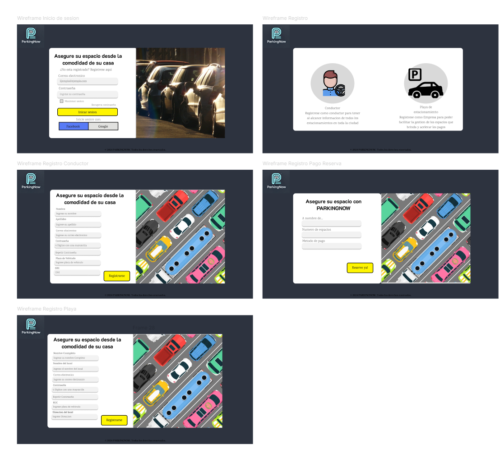
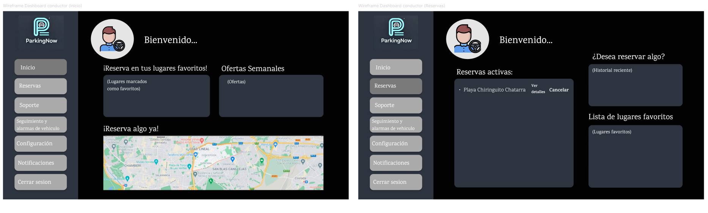
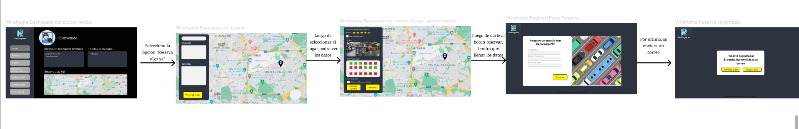
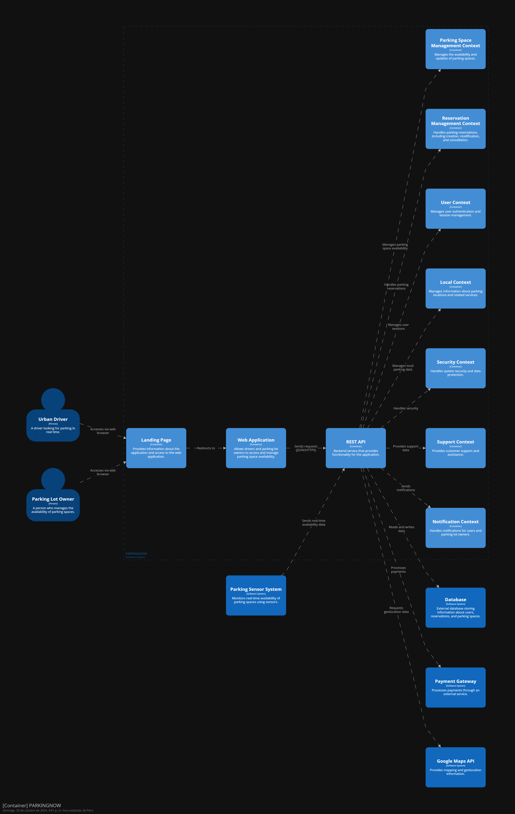

## Capítulo IV: Product Design

### 4.1. Style Guidelines

En este apartado, se mostrará de manera organizada los estilos y herramientas que se usarán para diseñar nuestra solución.

#### 4.1.1. General Style Guidelines

**Brand Overview**

En muchas ciudades, encontrar un espacio de estacionamiento adecuado es una tarea complicada, agravada por la falta de información actualizada y la ausencia de herramientas para reservar espacios con antelación. Esto da lugar a estacionamientos indebidos, congestión vehicular y una experiencia frustrante para los conductores. PARKINGNOW se ha diseñado para abordar estos problemas, ofreciendo una solución que conecta a los conductores con espacios de estacionamiento disponibles en tiempo real. Utilizando tecnología avanzada, como la localización geográfica y sensores infrarrojos, nuestra plataforma no solo facilita la búsqueda y reserva de espacios, sino que también mejora la eficiencia del tráfico urbano, beneficiando tanto a conductores como a propietarios de estacionamientos..

**Brand name**

El nombre de nuestra solución, PARKINGNOW, refleja su propósito central: ofrecer una herramienta inmediata y eficiente para encontrar y gestionar espacios de estacionamiento. El término "Parking" (estacionamiento) se combina con "Now" (ahora) para subrayar la inmediatez y la facilidad de uso que nuestra plataforma proporciona. Elegimos un nombre en inglés, dado su carácter universal y su capacidad para resonar en un mercado global.

A continuación, se presenta el Logo:

**Typography**

La tipografía en PARKINGNOW juega un papel crucial en la claridad y navegabilidad de nuestra interfaz. Hemos optado por una fuente moderna y legible que garantice que la información importante sea fácilmente accesible para los usuarios. La tipografía se organiza en cuatro niveles: headings (encabezados), body (cuerpo del texto), buttons (botones) y links (enlaces), asegurando una jerarquía visual clara y una experiencia de usuario coherente.

Hemos usado 2 fuentes de tipografia, la primera "Kalam" y la segunda "Tinos" para 
el desarrollo de este proyecto. 

**Colors**

La elección de colores es una parte importante del diseño. Una buena elección de colores transmite al usuario lo que nosotros realmente ofrecemos. Por eso tenemos como color primario el azul y el color secundario el verde azulado. Además, se muestran los colores estado los cuales usaremos para que el usuario sepa qué sucede mientras interactúa con nuestra aplicación.
Los colores seleccionados para **PARKINGNOW** no solo definen la estética de la marca, sino que también comunican su propósito y valores.

- **Color Primario (Azul Noche):** El azul noche es sinónimo de tecnología y seguridad, elementos clave en la experiencia de estacionamiento que queremos ofrecer. Este color genera una sensación de tranquilidad y confianza, aspectos esenciales para los usuarios de nuestra plataforma.

- **Color Secundario (Amarillo):** Este tono aporta una energía vibrante y resalta la eficiencia y visibilidad de nuestro servicio. El amarillo es ideal para captar la atención del usuario y enfatizar elementos importantes dentro de la plataforma como los botones o items resaltantes.

- **Color Secundario (Gris):** El gris transmite neutralidad y profesionalismo, aportando un equilibrio visual en la interfaz. Este color se utiliza para áreas menos destacadas, brindando un contraste sutil y elegante.

- **Color Secundario (Blanco):** El blanco representa pureza y simplicidad, ofreciendo un fondo limpio y claro que mejora la legibilidad y la experiencia de usuario en nuestra plataforma. Es fundamental para destacar el contenido principal y proporcionar una apariencia ordenada.

- **Color Secundario (Negro):** El negro evoca sofisticación y seriedad, utilizado en detalles y tipografía para proporcionar un fuerte contraste con los demás colores. Este tono refuerza la solidez y fiabilidad del servicio que ofrecemos.

#### 4.1.2. Web Style Guidelines

Desarrollaremos un sitio web adaptable a dispositivos móviles, lo que significa que se ajustará a cualquier tamaño de pantalla sin comprometer la experiencia del usuario, manteniéndolo siempre intuitivo y visualmente atractivo. Considerando lo anterior, nuestra aplicación web deberá adaptarse a las diferentes resoluciones utilizadas en los dispositivos actuales.

Utilizaremos el patrón Z en el diseño, asegurándonos de que el usuario comience su navegación en la página de inicio y en la aplicación web visualizando el logo. Luego, naturalmente, se desplazará hacia la derecha donde encontrará las diferentes opciones disponibles. Después, el usuario bajará verticalmente para explorar el contenido general de la página de inicio y la aplicación web. Finalmente, se moverá horizontalmente hacia la derecha para acceder a la información sobre nuestra startup y los medios para contactarnos.

Es importante destacar que el diseño incorpora colores que captarán la atención del usuario, evocando sensaciones de tranquilidad, confianza y deseo de utilizar nuestra aplicación. Además, los espacios y efectos implementados guiarán al usuario para comprender fácilmente el propósito de nuestra página de inicio y la aplicación web.

### 4.2. Information Architecture

En esta sección, el equipo detalla las decisiones y fundamentos que guían la organización del contenido en las experiencias web y móvil de PARKINGNOW, incluyendo tanto la Landing Page como las Aplicaciones Web. Estas propuestas están diseñadas para asegurar que los visitantes y usuarios se adapten fácilmente a la funcionalidad de cada producto y puedan encontrar lo que necesitan sin esfuerzo. Las decisiones incluyen los sistemas de organización, etiquetado, navegación y búsqueda.

#### 4.2.1. Organization Systems

Para estructurar la arquitectura de la información de **PARKINGNOW**, se ha adoptado un sistema de organización jerárquico tanto en la **Landing Page** como en la **Aplicación Web**. Este sistema facilita la navegación intuitiva y garantiza que los usuarios puedan encontrar fácilmente la información y las funciones que necesitan.

#### **Landing Page** 

La **Landing Page** de **PARKINGNOW** se organiza de manera jerárquica para que los usuarios puedan acceder rápidamente a la información más relevante y a las acciones necesarias para interactuar con la plataforma:

1. **Barra de Navegación Principal**: Situada en la parte superior de la página, proporciona accesos rápidos a las secciones clave:
   - **Inicio (Home)**: La página de inicio que da la bienvenida a los usuarios y proporciona una visión general de los servicios de **PARKINGNOW**. Incluye un banner destacado con un mensaje central y botones de llamada a la acción para el registro e inicio de sesión.
   - **Servicios (Services)**: Desglosa los servicios ofrecidos tanto a conductores urbanos como a dueños de playas de estacionamiento. Esta sección está organizada para que cada tipo de usuario pueda rápidamente identificar cómo **PARKINGNOW** les beneficiará.
   - **Transacción (Plans):** Explica las diferentes opciones de transacción disponibles para los usuarios, incluyendo características y beneficios de cada una. Esta sección está diseñada para facilitar la comprensión y comparación de opciones.
   - **Contáctanos (Contact Us)**: Proporciona información de contacto, un formulario de consulta y enlaces a redes sociales, facilitando la comunicación entre los usuarios y el equipo de soporte de **PARKINGNOW**.
   - **Nosotros (About Us)**: Describe la misión, visión, y el equipo detrás de **PARKINGNOW**, generando confianza y transparencia con los usuarios.

2. **Estructura de Contenido Jerárquica**:
   - **Encabezados y Subencabezados**: Organizan el contenido dentro de cada sección, permitiendo a los usuarios explorar más a fondo según sus intereses.
   - **Botones de Llamada a la Acción (CTAs)**: Colocados estratégicamente para guiar a los usuarios hacia acciones deseadas, como registrarse, iniciar sesión o contactar con el equipo.

3. **Footer**:
   - Incluye enlaces a secciones importantes como políticas de privacidad, términos de servicio, contacto, y enlaces a redes sociales. El footer proporciona una navegación adicional para usuarios que desean explorar más sobre **PARKINGNOW**.

#### **Aplicación Web**

La **Aplicación Web** de **PARKINGNOW** está diseñada para ofrecer una experiencia personalizada para dos segmentos principales de usuarios: **Conductores Urbanos Frecuentes** y **Dueños de Playas de Estacionamiento**. La organización del contenido está estructurada de manera que cada tipo de usuario pueda navegar eficientemente por la aplicación.

1. **Para Conductores Urbanos Frecuentes**:
   - **Inicio (Home)**: Muestra una vista general de las reservas actuales y accesos rápidos a funcionalidades clave como la búsqueda de estacionamientos y favoritos.
   - **Búsqueda de Estacionamiento (Search Parking)**: Permite a los usuarios buscar y ver la disponibilidad de espacios de estacionamiento en tiempo real, utilizando filtros avanzados para una experiencia de búsqueda más eficiente.
   - **Favoritos (Favorites)**: Contiene una lista de los estacionamientos que el usuario ha marcado como favoritos, permitiendo un acceso rápido para futuras reservas.
   - **Historial (History)**: Proporciona un registro completo de todas las reservas pasadas, ayudando a los usuarios a llevar un control de sus actividades de estacionamiento.

2. **Para Dueños de Playas de Estacionamiento**:
   - **Inicio (Home)**: Proporciona un resumen de la ocupación actual y las notificaciones relevantes.
   - **Monitoreo (Monitoring)**: Herramientas para supervisar en tiempo real la ocupación de los estacionamientos y gestionar las reservas.
   - **Reservas (Reservations)**: Permite la gestión de reservas, incluyendo la capacidad de aprobar o rechazar solicitudes de espacio de estacionamiento.
   - **Estadísticas (Statistics)**: Proporciona análisis detallados del uso de los estacionamientos y métricas de ingresos, ayudando a los propietarios a optimizar su operación.

3. **Interacción y Flujo de Trabajo**:
   - Las interfaces están diseñadas para ser intuitivas y fáciles de usar, permitiendo a los usuarios completar tareas rápidamente con un mínimo de pasos.
   - Cada sección dentro de la aplicación está claramente etiquetada y utiliza una combinación de texto e íconos para mejorar la usabilidad y la comprensión.

#### 4.2.2. Labeling Systems

En este apartado se describen los sistemas de etiquetado utilizados en la **Landing Page** y la **Aplicación Web** de **PARKINGNOW**. El etiquetado está diseñado para facilitar la navegación y mejorar la experiencia del usuario, asegurando que cada sección y funcionalidad sea fácilmente reconocible y accesible.

#### **Etiquetas de Encabezados (Headings)**
Las etiquetas de encabezado en **PARKINGNOW** se utilizan para definir claramente las secciones principales de la página y la aplicación. Esto permite a los usuarios identificar rápidamente el contenido de cada sección:

- **Inicio/Home**: Este encabezado se utiliza en la página principal para dar la bienvenida a los usuarios y proporcionar una introducción general a la plataforma. Aquí se muestra un banner con la misión de la empresa y botones de acceso rápido para registro e inicio de sesión.
  
- **Servicios/Services**: Sección que describe las funciones principales de la plataforma, como búsqueda y reserva de estacionamientos, optimización de rutas y monitoreo en tiempo real de espacios disponibles.

- **Planes y Precios/Transaction Pricing:** Encabezado que detalla las opciones de precios y planes de transacción disponibles para los usuarios, tanto para conductores urbanos como para propietarios de estacionamientos.

- **Contactanos/Contact Us**: Proporciona información de contacto y un formulario para que los usuarios puedan enviar consultas o solicitar soporte.

- **Sobre Nosotros/About Us**: Ofrece información sobre la empresa, su misión, visión y el equipo detrás de **PARKINGNOW**.

#### **Etiquetas Textuales (Text Labels)**
Las etiquetas textuales son utilizadas para identificar categorías específicas o acciones dentro de la plataforma. Estas etiquetas ayudan a los usuarios a navegar de manera efectiva y realizar acciones específicas:

- **Buscar Estacionamiento/Find Parking**: Utilizada en la barra de búsqueda, permite a los usuarios ingresar su ubicación deseada y buscar estacionamientos disponibles en tiempo real.

- **Reservar/Reserve**: Botón que permite a los usuarios seleccionar y confirmar un espacio de estacionamiento disponible.

- **Historial/History**: Etiqueta utilizada para acceder al historial de reservas del usuario, mostrando las reservas pasadas y las futuras.

- **Favoritos/Favorites**: Sección donde los usuarios pueden ver los estacionamientos marcados como favoritos para un acceso rápido en futuras visitas.

- **Configuraciones/Settings**: Permite a los usuarios acceder a sus preferencias de cuenta, notificaciones y ajustes de la aplicación.

#### **Etiquetas Icónicas (Iconic Labels)**
Las etiquetas icónicas se basan en imágenes o iconos que transmiten significado visualmente. Estas etiquetas son intuitivas y ayudan a los usuarios a comprender rápidamente las funcionalidades sin necesidad de texto:

- **Icono de Búsqueda (Lupa)**: Representa la función de búsqueda de estacionamientos, facilitando la identificación rápida de esta acción.

- **Icono de Calendario**: Utilizado para indicar la fecha y hora de las reservas en la sección de reservas y confirmación.

- **Icono de Estrella**: Marca los estacionamientos favoritos del usuario, permitiendo un fácil acceso a estos en el futuro.

- **Icono de Coche**: Representa la función de seguimiento del vehículo en el estacionamiento, asegurando que el usuario pueda ubicar su coche fácilmente.

- **Icono de Notificación**: Utilizado para alertar a los usuarios sobre actualizaciones importantes, como cambios en la disponibilidad de estacionamientos o confirmaciones de reservas.

Estas etiquetas se encuentran distribuidas en la barra de navegación y en las distintas secciones de la página y la aplicación, guiando a los usuarios de manera intuitiva y mejorando la experiencia de uso en **PARKINGNOW**.

#### 4.2.3. SEO Tags and Meta Tags
Los SEO Tag y Meta Tags ayudaran a que la pagina estatica y la aplicacion web sea posible de analizar facilmente y se pueda gestionar de manera eficiente y optima.

**Titulo**
El titulo de nuestra Startup se definira de la siguiente manera:

``<title> PARKINGNOW </title>``

**Description**
Las descriopciones de nuestra Startup se definira de la siguiente manera:

``<meta name="description" content="ParkingNow es una aplicacion que ayudara a los usuarios a reservar lugares de estacionamiento"/>``

**Keywords**
Algunas Keywords como "viewport" se definira de la siguiente manera:

``<meta name="viewport" content="width=device-width, initial-scale=1.0">``

**Author**
Nuestra marca sera registrada en nuestra pagina de la siguiente manera:

``<meta name="copyright" content="© 2024 PARKINGNOW. Todos los derechos reservados"./``

#### 4.2.4. Searching Systems
Estos metodos de busqueda ayudaran a los usuarios a navegar por nuestra aplicacion web con mas facilidad y podran encontrar lo que estan buscando de forma intuitiva. Los metodos de busqueda para nuestra aplicacion web seran las siguientes:

**Busqueda por caracteres:** Los usuarios podran buscar sus establecimientos por medio del nombre o dueño en la barra de busqueda de playa de estacionamiento.

**Busqueda por ubicacion:** Los usuarios podran usar la ubicacion exacta para encontrar el establecimiento en la barra de busqeuda de playa de estacionamiento.

**Busqueda por mapa:** Para hacerlo de forma mas intuitiva, decidimos que los usuarios tambien puedan usar el mapa para buscar locales lejanos o cercanos a su ubicacion.

#### 4.2.5. Navigation Systems

El metodo de navegacion para nuestro usuario por medio de las paginas de la aplicacion web sera intuitivo y sencillo para el usuario, donde tendra todo la vista y los colores llamativos ayudara a que sepa que hacer al momento de realizar alguna accion, como inicar sesion, registrarse, realizar una reserva, ver las estadisticas de sus establecimientos, etc. Asimismo la busqueda de playas de estacionamiento sera rapido y sin interrupciones para los usuarios.

### 4.3. Landing Page UI Design

En el siguiente punto, mostraremos los dieños más tempranos de la pagina estatica y la aplicacion web.

#### 4.3.1. Landing Page Wireframe

#### 4.3.2. Landing Page Mock-up

### 4.4. Web Applications UX/UI Design

En esta seccion, se presentara los resultados del diseño de la Aplicacion Web en Figma.

#### 4.4.1. Web Applications Wireframes

Link: [Figma](https://www.figma.com/design/qb02D1snVoDtoLfT0qdkRV/Parking-now?node-id=0-1&t=dsT3kQGDkndD6UwX-1)

En estas imagenes, podemos ver el wireframde la home page, donde da la bienvenida al suauri y brinda informacion sobre quienes somos y que es lo queremos. En la parte de la derecha podemos ver el Inicio de Sesion, y las formas en que los usuarios se pueden registrar en la aplicacion web, es decir, como conductor o dueño de una playa de estacionamiento

En estas imagenes se puede ver donde el usuario selecciona si es que es un conductor o el dueño de una playa de estacionamiento. Asimismo, se pueden ver las pantallas de confirmarcion de reservas, registro y de opinion enviada.

En estas imagenes se peuden ver la forma en que se vera al momento de buscar un lugar para la reserva, de esta manera el usuario podra ver el nombre del establecimiento, las reseñas, descripcion, fotos del estacionamient, podra dejar una reseña o reservar en el establecimiento.

Además en la segunda imagen podra ver su historial y revisar sus lugares marcados como favoritos.

En las siguientes imagenes lo que se puede ver es el Dashboard del dueño de playas de estacionamiento, donde tendra las siguientes opciones: Inicio, registro de locales, reservas, monitoreo de Automoviles y alarmas de los locales, las configuraciones, notificaciones que llegaran a la aplicacion dependiendo de las preferencias del usuario y por ultimo, cerrar sesion.

En las siguientes imagenes lo que se puede ver es el Dashboard de los condutores, donde tendra las siguientes opciones: Inicio, reservas, soporte a tiempo real,seguimiento y alarmas del automovil que posea el escaner, las configuraciones, notificaciones que llegaran a la aplicacion dependiendo de las preferencias del usuario y por ultimo, cerrar sesion.

#### 4.4.2. Web Applications Wireflow Diagrams

User goal: Registrarse como conductor o dueno de playa de estacionamiento.

User goal: Iniciar sesion como conductor o dueno de playa de estacionamiento.

User goal: Hacer una reserva como conductor en la aplicacion.

User goal: Dejar una opinion a una playa de estacionamiento.

User goal: Recibir soporte en la pestaña de "Soporte" como conductor.

User Goal: Como usuario revisar el estado de mi carro por medio del sensor.

User Goal: Como dueño de la playa de estacionamiento, revisar las reservas programadas para el dia de hoy.

User Goal: Como dueño de la playa de estacionamiento monitorear las alertas y carros que se quedan en el estacionamiento.

#### 4.4.3. Web Applications Mock-ups

Link: [Figma](https://www.figma.com/design/qb02D1snVoDtoLfT0qdkRV/Parking-now?node-id=0-1&t=dsT3kQGDkndD6UwX-1)

Las dos siguientes imagenes son la homepage y la pagina donde se describen las caracteristicas de nuestro producto.

Aqui se pueden ver las pestañas de inicio de sesion, registro y por ultimo para realizar el pago de una reserva.

Aqui se pueden ver las pestañas de confirmacion de pago de reserva, registro y de envio de opinion.

En las siguientes 4 imagenes se puede ver el mapa de busqueda para las playas de estacionamiento, la forma de reservar un espacio y como dejar una opinion en los establecimientos.

A continuacion se puede ver el Dashboard de los usuarios conductores, donde tendran las opciones que se mencionaron en la seccion del Wireframe.

A continuacion se puede ver el Dashboard de los Dueños de playas de estacionamiento, donde tendran las opciones que se mencionaron en la seccion del Wireframe.

#### 4.4.4. Web Applications User Flow Diagrams

User goal: Registrarse como conductor o dueno de playa de estacionamiento.

User goal: Iniciar sesion como conductor o dueno de playa de estacionamiento.

User goal: Dejar una opinion como conductor en la aplicacion.

User goal: Hacer una reserva como conductor en la aplicacion.

User Goal: Como conductor revisar mis reservas actias, poder reservar y ver los lugares marcados como favoritos

User Goal: Como dueño de una playa de estacionamientos revisar los locales y estadisticas.

### 4.5. Web Applications Prototyping
Link: [Figma](https://www.figma.com/design/qb02D1snVoDtoLfT0qdkRV/Parking-now?node-id=0-1&t=dsT3kQGDkndD6UwX-1)

### 4.6. Domain-Driven Software Architecture

Los diagramas de arquitectura de software nos ayudan a plantear el sistema de nuestro software, basándonos en el enfoque de desarrollo de Domain Driven Design.

#### 4.6.1. Software Architecture Context Diagram

Este diagrama de contexto muestra la interacción entre nuestros segmentos objetivo y la aplicación PARKINGNOW, destacando las conexiones con sistemas externos como geolocalización y procesamiento de pagos.

#### 4.6.2. Software Architecture Container Diagrams

Este diagrama de contenedores ilustra los componentes clave de la plataforma PARKINGNOW y cómo interactúan entre sí y con sistemas externos. Se destacan la Aplicación Web, la API Backend, la Base de Datos, y servicios externos como la pasarela de pago y geolocalización. Cada contenedor cumple una función específica para asegurar el funcionamiento integral del sistema.

#### 4.6.3. Software Architecture Components Diagrams
***Parking Component diagram***
Diagrama que refiere a todo el componente que involucra los parkeos (playas de estacionamiento)
 

***Reservation Component diagram***
Diagrama que refiere a todo el componente que involucra a las reservaciones
 

***Location Component diagram***
Diagrama que refiere a todo el componente que involucra a la gestion de ubicación en tiempo real
 

### 4.7. Software Object-Oriented Design

#### 4.7.1. Class Diagrams

#### 4.7.2. Class Dictionary

### 4.8. Database Design

En este punto se mostrara la base de datos utilizada en nuestro projecto en relacion a los contextos definidos anteriormente.
#### 4.8.1. Database Diagram
Link: [Vertabelo](https://my.vertabelo.com/doc/pYDPCowUTtVaVuDmakCr4QlOKjdT1o1o)

